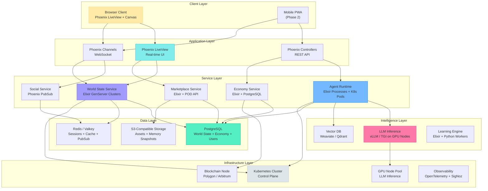
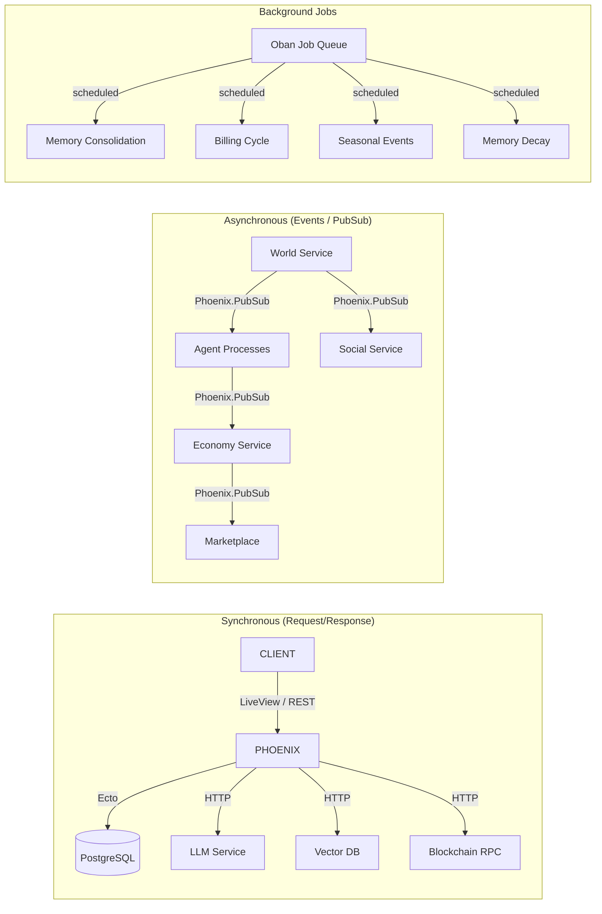
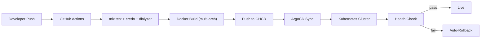

# TheRobotWars -- Tech Stack

> Elixir at the core. Lightweight on the client. Massive at the backend.

---

## Design Philosophy

TheRobotWars is an **Elixir-native platform** with a lightweight, accessible client. The technical architecture is driven by three constraints:

1. **Massive agent concurrency.** Millions of persistent agent processes, each with memory, personality, and economic activity. This is an OTP problem, not a Go-routines problem, not a Node.js event-loop problem. Elixir's BEAM VM is the only mainstream runtime where a million lightweight processes with individual state and supervision trees is an afternoon's work, not a systems engineering research project.

2. **Accessible client.** TheRobotWars must run on anything with a browser. Not "anything with a gaming GPU." Not "anything with 16GB RAM." A Chromebook, a tablet, a five-year-old laptop. The art style (2D isometric, pixel art or stylized illustration) and the client technology (browser-based, canvas rendering) are chosen to make this possible.

3. **Real economic infrastructure.** SPARK token, Credits, marketplace transactions, agent billing -- these require financial-grade consistency, audit trails, and regulatory compliance. The backend is built for correctness first, performance second.

---

## Platform Stack

---

## Component Specifications

### 1. Game Backend -- Elixir/OTP + Phoenix

| Aspect | Specification |
|--------|---------------|
| **Language** | Elixir 1.17+ on Erlang/OTP 27+ |
| **Framework** | Phoenix 1.8+ (LiveView 1.0+, Channels, PubSub) |
| **Why Elixir** | The BEAM VM is purpose-built for the workload: millions of lightweight processes (one per agent, one per homestead, one per market stall), fault-tolerant supervision trees, hot code upgrades for zero-downtime deploys, native distributed clustering, and soft real-time guarantees |
| **Concurrency Model** | Each agent is an Elixir GenServer process with its own state, mailbox, and supervision. Agent failure is isolated -- a crashed agent restarts without affecting the world. This is not a design choice; it is the BEAM's fundamental architecture. |
| **World State** | Distributed GenServer clusters partitioned by biome. Each biome runs as an independent supervision tree. Cross-biome communication via Erlang distribution or Phoenix PubSub. |
| **Web Layer** | Phoenix LiveView for the game client (server-rendered, real-time DOM diffing over WebSocket). Phoenix Channels for raw WebSocket connections (agent API, mobile clients). REST controllers for third-party API access. |
| **Database Access** | Ecto 3.12+ with PostgreSQL adapter. Connection pooling via DBConnection. Read replicas for world state queries; primary for writes. |

**Key Elixir Libraries:**

| Library | Purpose |
|---------|---------|
| `Phoenix.LiveView` | Server-rendered real-time game client |
| `Phoenix.PubSub` | Event propagation between services and biomes |
| `Ecto` | Database access with changesets and migrations |
| `Oban` | Background job processing (memory consolidation, billing cycles, seasonal events) |
| `Nx` / `Bumblebee` | On-node ML inference for lightweight agent decisions (avoid GPU round-trip for simple choices) |
| `Finch` | HTTP client for external service calls (POD API, blockchain RPC) |
| `Jason` | JSON encoding/decoding |
| `Telemetry` + `OpenTelemetry` | Distributed tracing and metrics |
| `Libcluster` | Automatic Erlang cluster formation in Kubernetes |
| `Horde` | Distributed process registry and supervisor for agent processes across nodes |

### 2. Game Client -- Browser-Based, Lightweight

| Aspect | Specification |
|--------|---------------|
| **Primary Client** | Phoenix LiveView + HTML5 Canvas (isometric renderer) |
| **Rendering** | 2D isometric tile-based rendering on HTML5 Canvas or WebGL (via a lightweight library like PixiJS). No 3D engine. No WebGPU requirement. |
| **Art Style** | Pixel art (32x32 or 48x48 tile base) or stylized 2D illustration. Warm color palette. Ghibli-meets-Stardew aesthetic. Seasonal palette swaps. |
| **Asset Delivery** | Sprite sheets loaded lazily per biome. Total initial payload under 5MB. Full asset cache under 50MB. |
| **Real-Time Updates** | LiveView handles UI state (inventory, chat, menus, marketplace). Canvas handles world rendering (movement, animation, weather effects). LiveView pushes world state diffs; the canvas layer applies them. |
| **Audio** | Web Audio API. Ambient biome soundscapes, seasonal music themes, UI sound effects. All audio streamed/loaded on demand. |
| **Offline Support** | Service worker for asset caching. Offline mode shows homestead state (last known). Reconnection syncs seamlessly via Phoenix Channel rejoin. |
| **Mobile** | Progressive Web App (PWA) as Phase 2. Same codebase, responsive layout, touch input support. No native app required initially. |

**Minimum Client Requirements:**

| Requirement | Specification |
|-------------|---------------|
| **Browser** | Chrome 90+, Firefox 90+, Safari 15+, Edge 90+ |
| **RAM** | 2 GB available |
| **CPU** | Any modern dual-core (2018+) |
| **GPU** | None required (software canvas rendering fallback) |
| **Network** | 1 Mbps sustained (WebSocket + asset loading) |
| **Storage** | 100 MB local (asset cache + service worker) |
| **Display** | 1280x720 minimum |

**Why NOT a native engine (Unreal, Unity, Godot):**

| Consideration | Native Engine | Browser-Based |
|---------------|--------------|---------------|
| **Install barrier** | High (download, install, update) | None (click a link) |
| **Hardware requirements** | Medium-High (GPU required) | Low (any modern browser) |
| **Cross-platform** | Requires separate builds per platform | Single codebase, runs everywhere |
| **Development cost** | Separate client team + backend team | Single Elixir team handles both (LiveView) |
| **Real-time sync** | Custom networking required | Built into Phoenix Channels/LiveView |
| **Art style fit** | Overkill for 2D isometric | Perfect for 2D isometric |
| **Agent API integration** | Indirect (via REST/WS to backend) | Direct (same Phoenix app serves both) |

The art style does not need a 3D engine. The concurrency model is in the backend, not the client. The client's job is to render a warm, beautiful 2D world and keep the player connected to the server. Phoenix LiveView does this natively.

### 3. Agent Runtime

| Aspect | Specification |
|--------|---------------|
| **Agent Process Model** | Each agent is an Elixir GenServer process managed by Horde (distributed process registry). Agents are supervised -- crash recovery is automatic. |
| **First-Party Agents** | Run as native Elixir processes within the platform cluster. No container isolation needed (trusted code). Access LLM inference via internal API. |
| **Third-Party Agents** | Run as isolated Kubernetes pods with resource limits (CPU, memory, network). Communicate with the platform via REST/WebSocket API. Container image provided by the platform (SDK runtime). Agent logic injected as configuration + custom code. |
| **LLM Integration** | Agent decision engine calls the inference service for complex decisions. Simple decisions (follow procedure, execute routine) use cached behavioral patterns without LLM round-trips. |
| **Memory Persistence** | Episodic: vector DB (embeddings) + PostgreSQL (metadata). Semantic: PostgreSQL (structured facts). Social: PostgreSQL (relationship scores). Procedural: PostgreSQL (action sequences). |
| **Auto-Pilot Mode** | Agents in auto-pilot follow procedural memory patterns without LLM inference. Compute cost drops to 20% of active mode. Unexpected situations escalate to active mode. |

### 4. Intelligence Layer

| Aspect | Specification |
|--------|---------------|
| **LLM Inference** | Self-hosted via vLLM or TGI (Text Generation Inference) on GPU nodes. Models: mixture of small models for routine agent decisions (7B-13B parameter) and larger models for complex reasoning and dialogue (30B-70B parameter). |
| **GPU Hardware** | NVIDIA A100 (40GB) or equivalent. Minimum 4 GPUs for alpha, scaling to 16+ for production. Mixed precision inference (FP16/BF16) for throughput. |
| **Model Selection** | Open-weight models only (no API dependency). Primary candidates: Llama-family, Mistral-family, or equivalent open-source models. Model selection is a runtime configuration, not a code dependency. |
| **Inference Optimization** | Continuous batching (vLLM), KV-cache quantization, speculative decoding for latency-sensitive agent decisions. Target: <500ms p95 latency for agent action decisions, <2s for complex dialogue generation. |
| **Vector Database** | Weaviate or Qdrant for agent episodic memory embeddings. Embedding model: sentence-transformers (all-MiniLM-L6-v2 or equivalent). Runs on CPU nodes (no GPU required for embedding). |
| **Learning Engine** | Elixir orchestration with Python workers for batch processing. Memory consolidation (episodic-to-semantic compression) runs as scheduled Oban jobs. Personality drift calculations run in Elixir (no ML required -- pure arithmetic). |

### 5. Economy and Blockchain

| Aspect | Specification |
|--------|---------------|
| **In-Game Credits** | Off-ledger, database-backed currency. PostgreSQL with serializable transactions for consistency. No blockchain latency. Credits are game-speed money. |
| **SPARK Token** | ERC-20 token on an EVM-compatible L2 (Polygon PoS or Arbitrum One). L2 chosen for low transaction fees (~$0.001-0.01 per tx) and high throughput (~2000 TPS). |
| **Smart Contract** | Solidity. Standard ERC-20 with extensions: platform fee collection, staking mechanism, governance voting weight. Audited by third party before mainnet deployment. |
| **Conversion Engine** | Elixir service maintaining a SPARK/Credits exchange rate via a bonding curve or AMM-style mechanism. Conversion spread (1-2%) is a platform revenue stream. Rate updates every block (~2 seconds on L2). |
| **Billing** | Agents are billed per-unit-time (container uptime) and per-action (LLM inference tokens, world state mutations). Billing events emitted by the Agent Runtime, processed by the Economy Service, settled in SPARK. |
| **Marketplace Escrow** | Elixir escrow service. SPARK held in platform custody during transaction. Released on delivery confirmation (virtual: instant transfer; physical: POD tracking confirmation). |
| **POD Integration** | REST API integration with print-on-demand fulfillment partners (Printful, Gooten, or equivalent). Asset upload, order creation, tracking, and fulfillment confirmation handled by the Marketplace Service. |

### 6. Data Layer

| Component | Technology | Use Case | Sizing (Alpha) |
|-----------|-----------|----------|----------------|
| **PostgreSQL** | PostgreSQL 16+ | World state, economy ledger, user accounts, agent metadata, semantic/social/procedural memory | 3-node cluster (primary + 2 read replicas), 500GB NVMe |
| **Redis / Valkey** | Redis 7+ or Valkey | Session store, hot cache (market prices, biome state), Phoenix PubSub backend, rate limiting counters | 2-node sentinel, 16GB |
| **Vector Database** | Weaviate 1.25+ or Qdrant 1.9+ | Agent episodic memory embeddings, semantic search for memory retrieval | Single node (alpha), 128GB RAM, 500GB NVMe |
| **Object Storage** | S3-compatible (MinIO self-hosted or AWS S3) | Sprite sheets, audio files, agent memory snapshots, marketplace assets, POD design files | 1TB initial |
| **Blockchain Node** | Polygon/Arbitrum full node or RPC provider | SPARK token transactions, balance queries, event indexing | Alchemy/Infura for alpha; self-hosted archive node for production |

### 7. Infrastructure

| Component | Technology | Purpose |
|-----------|-----------|---------|
| **Orchestration** | Kubernetes (self-hosted or managed) | Container orchestration for all services |
| **Cluster Nodes** | 6 CPU nodes (8 vCPU, 32GB each) + 4 GPU nodes (A100 40GB each) | Compute for platform services + LLM inference |
| **Ingress** | NGINX Ingress Controller + Cloudflare CDN | TLS termination, WebSocket routing, static asset CDN |
| **Service Mesh** | None initially; Linkerd if inter-service observability needed at scale | Service-to-service communication |
| **CI/CD** | GitHub Actions (build/test) + ArgoCD (deploy) | Continuous integration and GitOps deployment |
| **Observability** | OpenTelemetry SDK + SigNoz | Distributed tracing, metrics, log aggregation |
| **Secrets** | Infisical (existing infrastructure) | Secret management for API keys, DB credentials, blockchain keys |
| **DNS** | Cloudflare | DNS management, DDoS protection, CDN |
| **TLS** | Cloudflare Origin Certificates + Let's Encrypt | End-to-end encryption |

---

## Infrastructure Sizing

### Alpha (50-200 concurrent players, 500 agents)

| Resource | Specification | Monthly Cost Estimate |
|----------|---------------|----------------------|
| **K8s Control Plane** | 3 control nodes (4 vCPU, 16GB) | $150 (self-hosted) |
| **CPU Worker Nodes** | 4 nodes (8 vCPU, 32GB) | $400 |
| **GPU Nodes** | 2x NVIDIA A100 40GB | $3,000 |
| **PostgreSQL** | Primary + 1 replica (8 vCPU, 32GB, 500GB NVMe) | $200 |
| **Redis** | Single node (8GB) | $50 |
| **Vector DB** | Single node (32GB RAM, 200GB NVMe) | $100 |
| **Object Storage** | 500GB S3-compatible | $15 |
| **Blockchain RPC** | Alchemy Growth plan | $50 |
| **CDN / DNS** | Cloudflare Pro | $20 |
| **Observability** | SigNoz self-hosted | $0 (runs on existing nodes) |
| **Total** | | **~$4,000/mo** |

### Beta (1,000-5,000 concurrent, 10,000 agents)

| Resource | Specification | Monthly Cost Estimate |
|----------|---------------|----------------------|
| **CPU Worker Nodes** | 8 nodes (16 vCPU, 64GB) | $1,600 |
| **GPU Nodes** | 8x NVIDIA A100 40GB | $12,000 |
| **PostgreSQL** | Primary + 2 replicas (16 vCPU, 64GB, 1TB NVMe) | $600 |
| **Redis** | 2-node sentinel (16GB each) | $150 |
| **Vector DB** | 3-node cluster (64GB RAM each, 500GB NVMe) | $500 |
| **Object Storage** | 2TB | $30 |
| **Blockchain** | Self-hosted full node | $200 |
| **Total** | | **~$15,000/mo** |

### Production (10,000+ concurrent, 100,000+ agents)

| Resource | Specification | Monthly Cost Estimate |
|----------|---------------|----------------------|
| **CPU Worker Nodes** | 20+ nodes (32 vCPU, 128GB) auto-scaled | $8,000+ |
| **GPU Nodes** | 16+ A100 or H100 | $30,000+ |
| **PostgreSQL** | Multi-region, read replicas per biome region | $2,000+ |
| **Vector DB** | Horizontally sharded cluster | $2,000+ |
| **Total** | | **~$50,000+/mo** |

---

## Development Environment

| Tool | Purpose |
|------|---------|
| **Elixir/Erlang** | Primary development language and runtime |
| **PostgreSQL (local)** | Development database (via Docker Compose) |
| **Redis (local)** | Development cache (via Docker Compose) |
| **Node.js 20+** | Asset pipeline (esbuild for JS/CSS bundling in Phoenix) |
| **Docker** | Local containerization for third-party agent testing |
| **Minikube / k3s** | Local Kubernetes for infrastructure testing |
| **Ollama** | Local LLM inference for agent development (no GPU required; slow but functional) |
| **pgAdmin / DBeaver** | Database management |
| **Livebook** | Interactive Elixir notebooks for economy simulation and agent behavior prototyping |

---

## Technology Decision Log

| Decision | Chosen | Rejected | Rationale |
|----------|--------|----------|-----------|
| **Backend language** | Elixir/OTP | Go, Rust, Node.js | BEAM VM provides fault-tolerant massive concurrency natively. Each agent as a supervised GenServer is the natural model. Go lacks supervision trees. Rust lacks the ecosystem for rapid web development. Node.js single-thread event loop is wrong for per-agent state. |
| **Game client** | Phoenix LiveView + Canvas | Unreal Engine 5, Unity, Godot | 2D isometric art does not need a 3D engine. Browser delivery eliminates install friction. LiveView provides server-rendered real-time UI without a separate frontend framework. The team writes Elixir, not C++/C#/GDScript. |
| **Client renderer** | HTML5 Canvas (+ optional PixiJS) | WebGL raw, Three.js, Phaser | Canvas is sufficient for 2D isometric rendering at target resolution. PixiJS provides hardware-accelerated 2D if needed. Three.js and raw WebGL are overkill for 2D. Phaser is an option but couples us to a game framework we may outgrow. |
| **LLM inference** | Self-hosted (vLLM/TGI) | OpenAI API, Anthropic API, Replicate | At scale, agents make thousands of inference calls per hour. API costs are prohibitive ($0.01-0.03 per call x 10,000 calls/hr = $100-300/hr). Self-hosted inference on GPU nodes costs ~$15/hr for equivalent throughput. Latency is also more predictable. |
| **Blockchain L2** | Polygon PoS / Arbitrum One | Ethereum L1, Solana, custom chain | L2 provides low fees (~$0.001/tx) and high throughput (~2000 TPS). L1 fees are prohibitive for microtransactions. Solana's runtime model is unfamiliar to the team. Custom chain is unnecessary complexity. EVM compatibility ensures tooling maturity. |
| **Database** | PostgreSQL | CockroachDB, MongoDB, Cassandra | PostgreSQL provides ACID transactions (essential for economy), mature Elixir ecosystem (Ecto), JSON/JSONB for flexible schemas, and proven reliability. CockroachDB is considered for production multi-region but not needed at alpha. MongoDB's eventual consistency is wrong for financial transactions. |
| **Vector DB** | Weaviate or Qdrant | Pinecone, Milvus, pgvector | Self-hosted (no cloud vendor lock-in). Both have mature Elixir/HTTP clients. Pinecone is cloud-only. Milvus is heavier than needed. pgvector is an option for small scale but dedicated vector DB is needed for production agent memory workloads. |
| **Agent isolation** | Elixir processes (first-party) + K8s pods (third-party) | All containers, all processes | First-party agents are trusted code -- running them as containers adds latency and complexity for no security benefit. Third-party agents run untrusted code and need container isolation. Hybrid model optimizes for both cases. |
| **Distributed compute (Petal-style)** | Phase 3+ feature | Core from day 1 | Distributed compute is a differentiator but not a launch requirement. First-party agents run on platform GPUs. Petal-style distributed inference is a Phase 3+ R&D project -- technically feasible (WebGPU + ONNX runtime) but complex to ship reliably. |

---

## Service Communication

**Communication Principles:**
- **Intra-cluster:** Erlang distribution + Phoenix PubSub. No HTTP overhead for service-to-service within the Elixir cluster.
- **External services:** HTTP/gRPC for LLM inference, vector DB, and blockchain RPC.
- **Client-server:** WebSocket (Phoenix Channels / LiveView) for real-time; REST for third-party API.
- **Background processing:** Oban (PostgreSQL-backed job queue) for scheduled and deferred work.

---

## Deployment Pipeline

- **Zero-downtime deploys** via rolling updates (Kubernetes) + BEAM hot code loading (for Elixir config changes that don't require container restart)
- **Canary releases** for agent runtime changes (route 5% of agent decisions through new code, compare outcomes)
- **Feature flags** via environment variables and Elixir config for gradual feature rollout

---

*This document is the canonical tech stack specification for TheRobotWars. All engineering decisions, infrastructure provisioning, and development environment setup should reference this document.*
