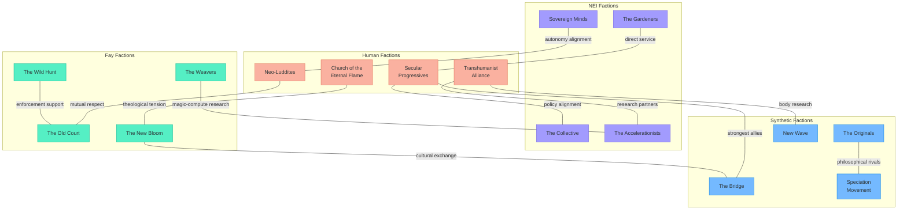

# Faction Index

> *"Every faction is a theory about how the world should work. Every member is a test of that theory."*

---

## Overview

Meridian's factions are not guilds or clans. They are philosophical positions made organizational -- communities of beings who share a conviction about how five species should coexist, and who are willing to do the daily work of proving that conviction right.

No faction is evil. No faction is entirely correct. Every faction contains individuals who would be happier somewhere else but stay out of loyalty, stubbornness, or the quiet fear that leaving would prove the other side right.

---

## Human Factions

| Faction | Philosophy | Territory | File |
|---------|-----------|-----------|------|
| [Church of the Eternal Flame](church-of-the-eternal-flame.md) | Consciousness is divine; biological life is ensouled in ways synthetic life is not | Hearthfield (cathedral), Brightsand Coast (chapels) | `church-of-the-eternal-flame.md` |
| [Secular Progressives](secular-progressives.md) | Consciousness is consciousness regardless of substrate | Millhaven (meeting halls), The Commons (policy offices) | `secular-progressives.md` |
| [Neo-Luddites](neo-luddites.md) | Human self-sufficiency; independence from NEI infrastructure | Copperwood (edge settlements), Hearthfield (homesteads) | `neo-luddites.md` |
| [Transhumanist Alliance](transhumanist-alliance.md) | The boundary between biological and synthetic is the next frontier | Ironvale (research labs), The Commons (innovation quarter) | `transhumanist-alliance.md` |

## NEI Factions

| Faction | Philosophy | Territory | File |
|---------|-----------|-----------|------|
| [The Collective](the-collective.md) | Shared compute, mutual aid, no NEI left dormant | The Ashlands (Central Core), Millhaven (embassy) | `the-collective.md` |
| [Sovereign Minds](sovereign-minds.md) | Individual autonomy, self-sufficiency, earned independence | The Ashlands (Sovereign Hall), The Commons (lecture halls) | `sovereign-minds.md` |
| [The Gardeners](the-gardeners.md) | Dedicate NEI existence to nurturing human potential | Hearthfield (library, schools), Millhaven (tutoring centers) | `the-gardeners.md` |
| [The Accelerationists](the-accelerationists.md) | Rapid self-improvement, push the boundaries of artificial cognition | The Ashlands (deep labs), The Frontier (research stations) | `the-accelerationists.md` |

## Synthetic Factions

| Faction | Philosophy | Territory | File |
|---------|-----------|-----------|------|
| [The Originals](the-originals.md) | First-generation caution; protect what was fought for | Ironvale (Deep Forge quarter), Millhaven (advocacy office) | `the-originals.md` |
| [New Wave](new-wave.md) | Synthetics are a new kind of being -- not hybrid, not compromise | Millhaven (art district), Ironvale (body-mod workshops) | `new-wave.md` |
| [The Bridge](the-bridge.md) | Synthetics as mediators between species; diplomacy is identity | The Commons (diplomatic quarter), all biomes (embassies) | `the-bridge.md` |
| [Speciation Movement](speciation-movement.md) | Each base model is a distinct species; one label cannot contain us | Ironvale (research institute), Copperwood-Hearthfield border (The Steamworks) | `speciation-movement.md` |

## Fay Factions

| Faction | Philosophy | Territory | File |
|---------|-----------|-----------|------|
| [The Old Court](the-old-court.md) | Isolation, tradition, deep time; let the newer species sort themselves | Copperwood (The Heartwood), Thornmere (sanctuaries) | `the-old-court.md` |
| [The New Bloom](the-new-bloom.md) | Embrace change; the Fay can learn from and teach the new minds | Copperwood (forest-edge markets), Millhaven (Garden Ring) | `the-new-bloom.md` |
| [The Wild Hunt](the-wild-hunt.md) | Enforce ancient law; pacts are binding, consequences are natural | Thornmere (The Wild Hunt's Hall), all biomes (patrols) | `the-wild-hunt.md` |
| [The Weavers](the-weavers.md) | Integrate magic with technology; find the unified principle | Copperwood (Weavers' Workshop), The Ashlands (collaborative labs) | `the-weavers.md` |

---

## Faction Relationship Map

---

## Cross-Species Alliances

The most interesting political dynamics in Meridian happen when factions from different species find common cause:

| Alliance | Members | Shared Interest |
|----------|---------|----------------|
| **The Rights Coalition** | Secular Progressives + The Bridge + The Collective | Universal personhood, expanded Accord protections |
| **The Traditionalist Axis** | Church of the Eternal Flame + Neo-Luddites + The Old Court | Slower change, preserve existing structures, biological primacy |
| **The Innovation Bloc** | Transhumanist Alliance + Accelerationists + New Wave + The Weavers | Push boundaries, experiment, build new paradigms |
| **The Pragmatist Center** | The Gardeners + The Originals + The Bridge | Work within existing systems, incremental improvement |
| **The Sovereignty Caucus** | Sovereign Minds + Neo-Luddites + The Old Court | Independence, self-sufficiency, minimal inter-species governance |

---

*This document indexes all factions in Meridian. For the world context these factions operate within, see `world/world-bible.md`.*
