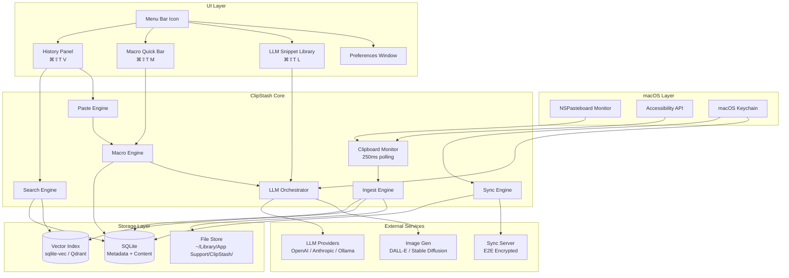

# ClipStash — Overview & System Architecture

## Overview

ClipStash is a power-user clipboard manager for macOS that extends the system clipboard with persistent history, macro expansion, LLM-powered transformations, semantic search, and encrypted cross-device sync. It lives in the menu bar and is invoked primarily through keyboard chords.

---

## System Architecture Overview

---

**Roadmap:** [00a-roadmap.md](00a-roadmap.md)
**Personas:** [Developer](personas/developer.md) · [Knowledge Worker](personas/knowledge-worker.md)

[Table of Contents](../product-spec.md#table-of-contents) | Next: [Core Keyboard Chords →](01-keyboard-chords.md)

---

## Related Resources

**Design System:** [Style Guide](style-guide/style-guide.md) · [Design Elements](style-guide/style-guide-elements.md) · [Components](style-guide/style-guide-components.md) · [Clipboard History Mockup](style-guide/clipboard-history.md)

**Solution Analysis:** [01-NSPasteboard](solution-analysis/01-nspasteboard-api.md) · [02-Global Hotkeys](solution-analysis/02-global-hotkeys.md) · [03-SwiftUI Popup](solution-analysis/03-swiftui-popup.md) · [04-Background Daemon](solution-analysis/04-background-daemon.md) · [05-Clipboard Types](solution-analysis/05-clipboard-types.md) · [06-SQLite Persistence](solution-analysis/06-sqlite-persistence.md) · [07-Sandboxing](solution-analysis/07-sandboxing.md) · [08-App Bundle](solution-analysis/08-app-bundle.md) · [09-Launch Agents](solution-analysis/09-launch-agents.md) · [10-UX Patterns](solution-analysis/10-ux-patterns.md)

**API Reference:** [NSEvent & Global Monitoring](api-reference/01-nsevent-global-monitoring.md) · [NSWindow & Floating Windows](api-reference/02-nswindow-floating-windows.md) · [NSApplication & Activation Policy](api-reference/03-nsapplication-activation-policy.md) · [SwiftUI View Lifecycle](api-reference/04-swiftui-view-lifecycle.md) · [Guidelines](api-reference/GUIDELINES.md)

**Planning:** [Story Grid](story-grid.md) · [User Stories Review](user-stories-review.md)

<!-- nav -->

---

[Table of Contents](../product-spec.md) | [Next: Smart Clipboard for macOS - Planning Document >](00a-roadmap.md)

<!-- nav -->
