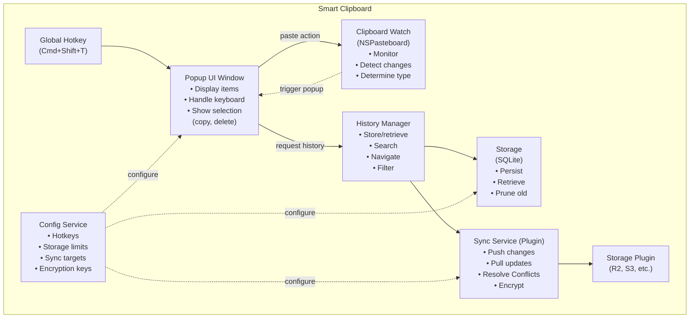
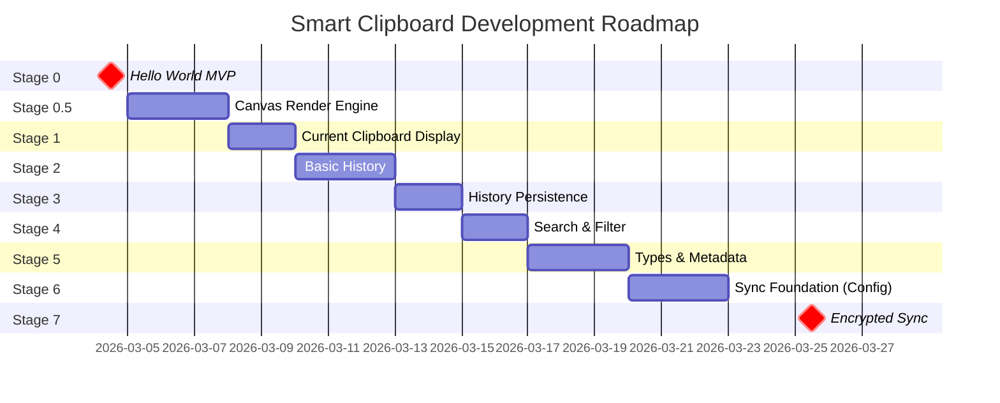

# Smart Clipboard for macOS - Planning Document

## 1. User Personas

### Primary Developer/Power User (You)
- **Context**: Developer who values efficient workflows
- **Goals**: Quick clipboard access, history search, eventual sync across devices
- **Pain Points**: Lost clipboard content, multiple device sync challenges

### Knowledge Worker (Secondary Target)
- **Context**: Professional managing lots of text/code/links
- **Goals**: Never lose clipboard, quick paste from history
- **Pain Points**: Copy-paste fatigue, looking for that thing copied 5 minutes ago

---

## 2. User Stories

### Stage 0: MVP (Hello World)
- As a user, I want a background process running on macOS
- When I press Cmd+Shift+T, I want a simple popup to appear
- The popup displays "Hello World" to verify the hotkey works

### Stage 0.5: Canvas Render Engine
- As a developer, I want the rendering foundation in place so all subsequent UI work inherits the oil-on-canvas aesthetic
- The popup window should composite a tileable canvas-weave texture as its base layer
- Stroke cards (clipboard items) should render with painterly edge treatment, not sharp rectangles
- A lightweight Metal shader pipeline should be available for real-time brush-stroke distortion effects
- The render engine must add <3ms to popup latency (preserving the 50ms total target)

### Stage 1: Clipboard Display
- As a user, when I press Cmd+Shift+T, I want to see the current clipboard contents
- The popup should show text, images, or file paths
- Pressing Escape should dismiss the popup

### Stage 2: History
- As a user, I want to see the last N clipboard entries in the popup
- I want to use arrow keys to navigate between history items
- Pressing Enter should paste the selected item
- I want to press a number key (1-9) to quickly select from history

### Stage 3: History Persistence
- As a user, I want my clipboard history to survive app restarts
- I want to configure how many history items to keep
- I want to clear history manually

### Stage 4: Search
- As a user, I want to type to filter my clipboard history
- I want search to work across text content
- I want case-insensitive search

### Stage 5: Types & Metadata
- As a user, I want to see what type of clipboard item each entry is (text, image, URL, file)
- I want to see timestamps for when items were copied
- I want to filter history by type

### Stage 6: Sync Setup (Foundation)
- As a user, I want to configure sync targets (Cloudflare R2, S3, self-hosted, etc.)
- I want to set up encryption keys
- I want to see sync status

### Stage 7: Encrypted Sync
- As a user, I want my clipboard history to sync across my devices
- I want end-to-end encryption (client-side encryption)
- I want conflict resolution strategies

---

## 3. Product Requirements Document (PRD)

### Summary
A macOS smart clipboard manager with command-line driven popup interface, history, search, type detection, and encrypted cross-device sync.

### Core Features

| Priority | Feature | Target Stage |
|----------|---------|--------------|
| P0 | Global hotkey (Cmd+Shift+T) | Stage 0 |
| P0 | Canvas render engine (texture + Metal shaders) | Stage 0.5 |
| P0 | Display current clipboard | Stage 1 |
| P1 | History with keyboard navigation | Stage 2 |
| P1 | History persistence | Stage 3 |
| P1 | Search/filter | Stage 4 |
| P2 | Type display & metadata | Stage 5 |
| P2 | Configurable storage backend | Stage 6 |
| P2 | Encrypted sync across devices | Stage 7 |

### Non-Functional Requirements
- **Latency**: Popup must appear in <50ms
- **Resource usage**: Minimal background daemon footprint
- **Security**: End-to-end encryption for sync data
- **Privacy**: Local-first, no telemetry by default

### Technical Stack (Draft Consideration)
- **Language**: Swift (native macOS) OR Rust (cross-platform potential)
- **Persistence**: SQLite for history
- **Sync**: Encrypted blobs to object storage
- **Encryption**: libsodium / ChaCha20-Poly1305

---

## 4. Component Architecture



---

## 5. Roadmap: Stages



| Stage | Description | Deliverables |
|-------|-------------|--------------|
| **Stage 0** | Hello World | Background process, global hotkey, simple popup with text |
| **Stage 0.5** | Canvas Render Engine | Texture assets, Metal shader pipeline, stroke card primitives |
| **Stage 1** | Current Clipboard | Read from NSPasteboard, display content (rendered on canvas) |
| **Stage 2** | Basic History | Track last entries, arrow key navigation, select |
| **Stage 3** | Persistence | SQLite store, survive restarts, configurable max |
| **Stage 4** | Search | Type-to-filter, case-insensitive |
| **Stage 5** | Types & Metadata | Type detection (text/image/url/file), timestamps |
| **Stage 6** | Sync Foundation | Config system, storage plugins architecture |
| **Stage 7** | Encrypted Sync | E2E encryption, push/pull, conflict resolution |

---

## 6. File Organization / Project Structure

```
paste-bin/
├── CLAUDE.md                 # Project-specific instructions for Claude
├── DESIGN.md                 # Design docs, architecture decisions
├── ROADMAP.md                # This file
├── personas/
│   ├── developer.md          # Primary persona details
│   └── knowledge-worker.md   # Secondary persona
├── stages/
│   ├── 0-hello-world/        # Stage 0 tasks & code
│   ├── 1-clipboard-display/  # Stage 1 tasks & code
│   └── ...
├── src/                      # Main source code
│   ├── hotkey/
│   ├── ui/
│   ├── clipboard/
│   ├── history/
│   ├── storage/
│   ├── sync/
│   └── config/
└── tests/
```

---

## 7. Sub-Agent Considerations

Potential sub-agent roles for prep work:

| Sub-Agent | Purpose |
|-----------|---------|
| **Setup Agent** | Project scaffold, build system config (Xcode/Cargo) |
| **Research Agent** | NSPasteboard API patterns, best practices for macOS daemons |
| **Docs Agent** | Generate user persona files, format PRD/roadmap docs |
| **Test Agent** | Write tests for each stage as features are implemented |

---

## 8. Kopigajj Canvas — Oil-on-Canvas UI/UX

### Design Philosophy

Kopigajj rejects the clipboard-as-ledger metaphor. Instead of a list of entries, the interface presents a **canvas** — a painterly surface where clipboard items exist as **strokes**, grouped into **clusters**, layered by time, and illuminated by search. The aesthetic is oil-on-canvas: warm linen textures, soft bristle edges, temporal depth through desaturation, and glow as a semantic signal.

This isn't decoration. It's a structural choice: spatial memory beats linear recall. Users navigate by position and proximity ("the kubectl command near the upper left") rather than scanning numbered rows.

See `spec/style-guide/style-guide-canvas.html` for the full interactive design system spec.

### Visual Primitives

| Primitive | Metaphor | Behavior |
|-----------|----------|----------|
| **Stroke** | A brushstroke on canvas | Each clipboard item. Rounded bristle edges (18-22px radius). Recent = vivid, old = dry/faded. |
| **Cluster Halo** | Color family on a palette | Groups related strokes with a soft glow boundary. Items can sit partially outside. |
| **Layer** | Paint strata / tracing paper | Time dimension. Scrubber reveals older layers with desaturation and thinning. |
| **Search Glow** | Light source illuminating canvas | Relevant strokes glow and drift nearer (4-8px, 120-180ms ease-out). |
| **Lasso** | Selection tool | Multi-select by drawing around strokes. |

### Render Engine Architecture

The canvas effect is achieved through a **layered compositing approach** — not UI component styling alone, but actual rendered graphics:

```
┌─────────────────────────────────────────────────┐
│              SwiftUI View Stack                  │
│                                                 │
│  ┌───────────────────────────────────────────┐  │
│  │  Layer 1: Canvas texture                  │  │  ← Pre-rendered tileable asset
│  │  (Image + .blendMode(.multiply))          │  │    Zero runtime cost
│  ├───────────────────────────────────────────┤  │
│  │  Layer 2: UI content (strokes, clusters)  │  │  ← SwiftUI views with painterly
│  │                                           │  │    edge masks and glow effects
│  ├───────────────────────────────────────────┤  │
│  │  Layer 3: Metal shader overlay            │  │  ← .layerEffect() modifier
│  │  (Kuwahara brush-stroke distortion,       │  │    ~1-3ms GPU cost
│  │   radius 2-3, subtle)                     │  │
│  └───────────────────────────────────────────┘  │
│                                                 │
│  Total added latency: ~1-3ms (GPU)              │
│  Well within 50ms popup target                  │
└─────────────────────────────────────────────────┘
```

### Technical Approach — Research Findings

Eight rendering approaches were evaluated. The recommended strategy combines two:

#### Primary: Pre-Rendered Texture Assets (Layer 1)

AI-generated or procedurally created tileable canvas textures composited as `Image` backgrounds with SwiftUI blend modes. This is the base "canvas weave" that sells the painted feel.

- **Performance**: Zero runtime cost — just an image blit (~200KB-1MB in bundle)
- **Implementation**: `Image("canvas-texture").resizable().blendMode(.overlay)` in a `ZStack`
- **Asset pipeline**: Stable Diffusion with tiling mode for seamless repeats, or hand-painted textures
- **Variants needed**: light canvas, dark canvas, warm-toned, cool-toned, transparent brush-stroke overlays

#### Secondary: Metal Shaders via SwiftUI Modifiers (Layer 3)

Since macOS 14 Sonoma, SwiftUI exposes `.colorEffect()`, `.distortionEffect()`, and `.layerEffect()` modifiers that run Metal fragment shaders directly on any view via `[[ stitchable ]]` functions.

- **Performance**: Sub-1ms for simple shaders; Kuwahara radius 3-4 is feasible real-time
- **Visual effect**: Brush-stroke abstraction via anisotropic Kuwahara filter + Voronoi noise for brush direction
- **SwiftUI integration**: Native first-class view modifiers — apply to any view
- **Minimum macOS**: 14.0 Sonoma (acceptable for a new app)
- **Reference implementations**: [Inferno](https://github.com/twostraws/Inferno) (MIT), [GPUImage3](https://github.com/BradLarson/GPUImage3) Kuwahara filter, [LYGIA](https://lygia.xyz/) shader library

#### Approaches Evaluated but Not Recommended

| Approach | Why Not |
|----------|---------|
| **Core Image filters** | Built-in filters look digital/posterized, not painterly. Custom CIKernels work but SwiftUI Metal modifiers are more direct. |
| **SpriteKit/SceneKit** | Game framework overhead (30-50MB) unjustified for a clipboard manager. |
| **Core Graphics/Quartz** | CPU-rendered — too slow for real-time (50-200ms per complex panel). Viable only as build-time asset generator. |
| **CALayer** | Functionally equivalent to SwiftUI Image overlay but with more boilerplate. |
| **Third-party libs** | GPUImage3/LYGIA are valuable as **reference code** to port, but taking a runtime dependency is unnecessary. |

### Phased Render Rollout

| Phase | What | Risk to Latency |
|-------|------|-----------------|
| **Stage 0.5a** | Pre-rendered canvas textures only (approaches 4 + 8). Stroke cards with rounded bristle-edge masks. | None |
| **Stage 0.5b** | Add lightweight Metal `.layerEffect` for subtle brush-stroke distortion on panel backgrounds. Port Kuwahara radius-3 from GPUImage3. | ~1-3ms |
| **Stage 0.5c** (deferred) | Anisotropic Kuwahara with Voronoi brush direction for image preview thumbnails. Heavier — apply only to previews. | ~5-8ms on previews only |

### Asset Generation Pipeline

Canvas textures should be generated as part of the build asset pipeline:

1. **Stable Diffusion** with tiling VAE → seamless 1024x1024 base textures at 2x for Retina
2. **Transparent brush-stroke overlays** for compositing over stroke cards
3. **Painted gradient backgrounds** for cluster halos
4. **Edge masks** with irregular bristle profiles for stroke card borders

Key prompts: `"seamless tileable oil canvas texture"`, `"painted linen surface texture warm tones"`, `"impasto brush stroke overlay transparent background"`

### Key References

- [Maxime Heckel — On Crafting Painterly Shaders](https://blog.maximeheckel.com/posts/on-crafting-painterly-shaders/) — Anisotropic Kuwahara + Voronoi noise (translates to Metal)
- [WWDC24 — Create custom visual effects with SwiftUI](https://developer.apple.com/videos/play/wwdc2024/10151/) — Official SwiftUI shader guide
- [Inferno](https://github.com/twostraws/Inferno) — MIT-licensed Metal shaders for SwiftUI
- [GPUImage3](https://github.com/BradLarson/GPUImage3) — Production-tested Kuwahara on Metal
- [LYGIA Shader Library](https://lygia.xyz/filter/kuwahara) — Cross-platform Kuwahara implementations

---

## 9. Next Steps - Decision Points

1. **Technology Choice**: Swift (native, macOS only) or Rust (cross-platform potential)?
2. **UI Library**: SwiftUI, AppKit, or TUI-style popup?
3. **Sync Storage**: Preference for backend? R2, S3, self-hosted, iCloud?
4. **Build System**: Xcode project, SwiftPM, or Cargo + xcode-rs?

---

## 10. Open Questions

- Do you want the UI to be a graphical popup or a terminal-based overlay (TUI)?
- Should the app have a preferences window or config file?
- What's the default history limit you want?
- Do you have a preferred sync backend in mind?

<!-- nav -->

---

[< Previous: ClipStash — Overview & System Architecture](00-overview-architecture.md) | [Table of Contents](../product-spec.md) | [Next: Developer Persona >](personas/developer.md)

<!-- nav -->
