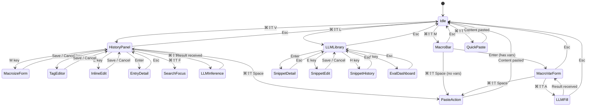

# 1. Core Keyboard Chords

| Chord | Action |
|---|---|
| `⌘⇧T V` | Open full clipboard history panel |
| `⌘⇧T M` | Open macro quick-insert bar |
| `⌘⇧T Space` | Paste selected/highlighted entry |
| `⌘⇧T A` | Open LLM inference input (context-sensitive — works inside macro bar or history panel) |
| `⌘⇧T L` | Open LLM Snippet Library |
| `⌘⇧T P` | Push generated output to clipboard history |
| `⌘⇧T F` | Focus search bar within open panel |
| `⌘⇧T 1-9` | Quick-paste from suggested shortlist |
| `Esc` | Close any open panel |

## Chord Navigation State Machine

---

[← Overview & Architecture](00-overview-architecture.md) | [Table of Contents](../product-spec.md#table-of-contents) | [Clipboard History Panel →](02-clipboard-history-panel.md)

**Solution Analysis:** [Global Hotkeys](solution-analysis/02-global-hotkeys.md)
**API Reference:** [NSEvent & Global Monitoring](api-reference/01-nsevent-global-monitoring.md)
**User Stories:** [US-001](user-stories/US-001.md)

<!-- nav -->

---

[< Previous: Clipboard History Mockup](style-guide/clipboard-history.md) | [Table of Contents](../product-spec.md) | [Next: 2. Clipboard History Panel (`⌘⇧T V`) >](02-clipboard-history-panel.md)

<!-- nav -->
