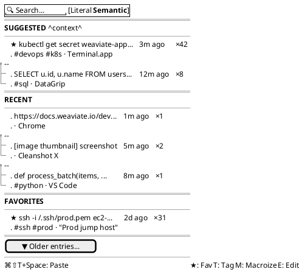
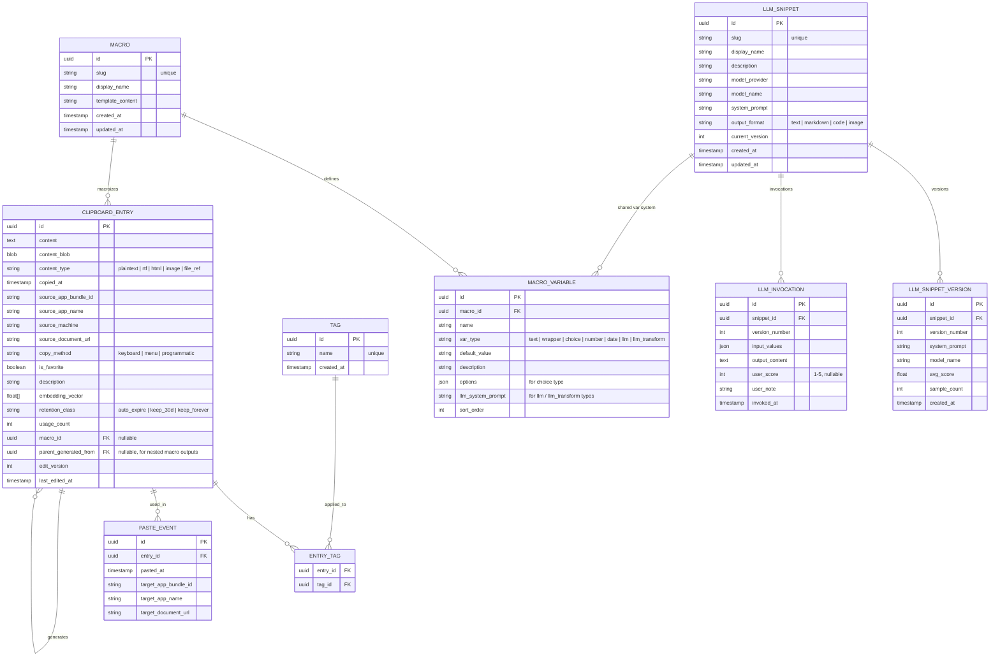
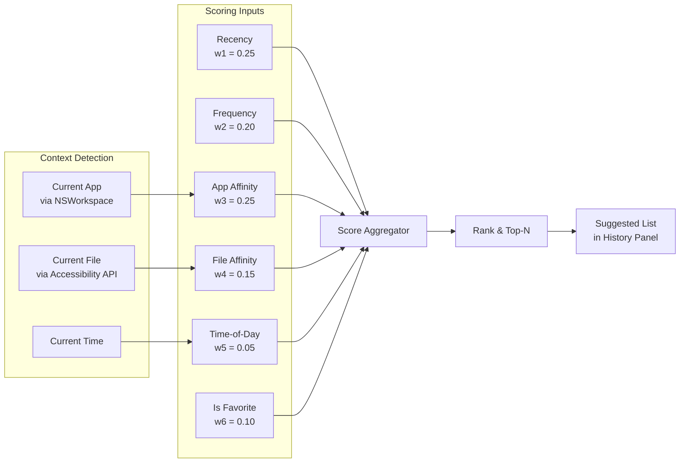

# 2. Clipboard History Panel (`⌘⇧T V`)

## Layout



#### Asset: History Panel Layout


## Entry Data Model



## Suggested Entries Algorithm

When `⌘⇧T V` is invoked, the top "Suggested" section is populated by a scoring model:

```
score = w1 * recency
      + w2 * frequency
      + w3 * app_affinity(current_app, entry.usage_contexts)
      + w4 * file_affinity(current_file, entry.usage_contexts)
      + w5 * time_of_day_affinity
      + w6 * is_favorite
```



---

[← Core Keyboard Chords](01-keyboard-chords.md) | [Table of Contents](../product-spec.md#table-of-contents) | [Favorites & Tagging →](03-favorites-tagging.md)

**Mockups:** [Clipboard History](style-guide/clipboard-history.md) · [Canvas Component Guide](style-guide/style-guide-components.md)
**Solution Analysis:** [NSPasteboard API](solution-analysis/01-nspasteboard-api.md) · [Clipboard Types](solution-analysis/05-clipboard-types.md) · [UX Patterns](solution-analysis/10-ux-patterns.md)
**Planning:** [Story Grid](story-grid.md) · [User Stories Review](user-stories-review.md)
**User Stories:** [US-002](user-stories/US-002.md) · [US-003](user-stories/US-003.md) · [US-004](user-stories/US-004.md) · [US-005](user-stories/US-005.md) · [US-006](user-stories/US-006.md)

<!-- nav -->

---

[< Previous: 1. Core Keyboard Chords](01-keyboard-chords.md) | [Table of Contents](../product-spec.md) | [Next: 11. Menu Bar Interface >](11-menu-bar-interface.md)

<!-- nav -->
