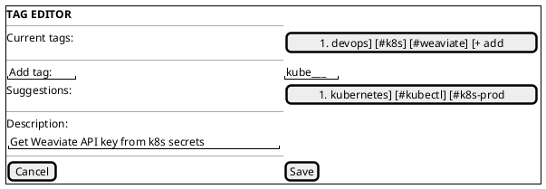

# 3. Favorites & Tagging

## Favorites

- Toggle with `★` key when an entry is highlighted in the history panel.
- Favorites persist indefinitely (exempt from auto-cleanup).
- Dedicated "Favorites" section in the history panel, collapsible.
- Favorites sync across devices (if sync enabled).

## Tags

- Press `T` on a highlighted entry to open the tag editor.
- Tags are freeform strings prefixed with `#` in the UI.
- Autocomplete from previously used tags.
- Filter by tag: type `#tagname` in the search bar.
- Bulk tagging: select multiple entries (hold `⇧` + arrow keys), press `T`.

## Description / Snippet Annotation

- Press `D` on a highlighted entry to add/edit a description.
- Description appears as a subtitle under the entry preview.
- Descriptions are indexed for both literal and semantic search.
- Useful for turning clipboard entries into a personal snippet library.

## Tag Editor UI

#### Asset: Tag Editor

---

[← Clipboard History Panel](02-clipboard-history-panel.md) | [Table of Contents](../product-spec.md#table-of-contents) | [Macroization System →](04-macroization-system.md)

**User Stories:** [US-007](user-stories/US-007.md) · [US-034](user-stories/US-034.md) · [US-035](user-stories/US-035.md)

<!-- nav -->

---

[< Previous: 9. Smart Formatting & Paste Modes](09-smart-formatting-paste-modes.md) | [Table of Contents](../product-spec.md) | [Next: 4. Macroization System >](04-macroization-system.md)

<!-- nav -->
