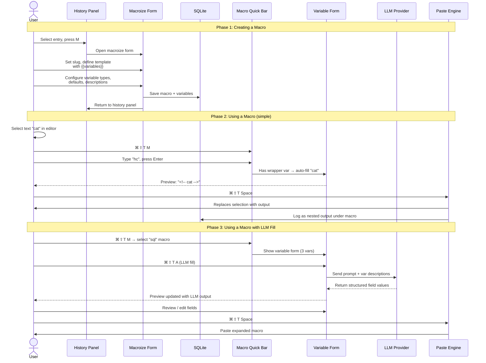
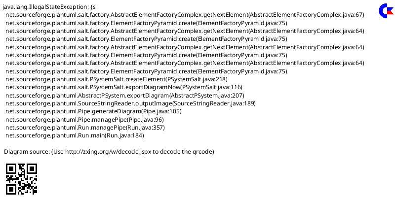
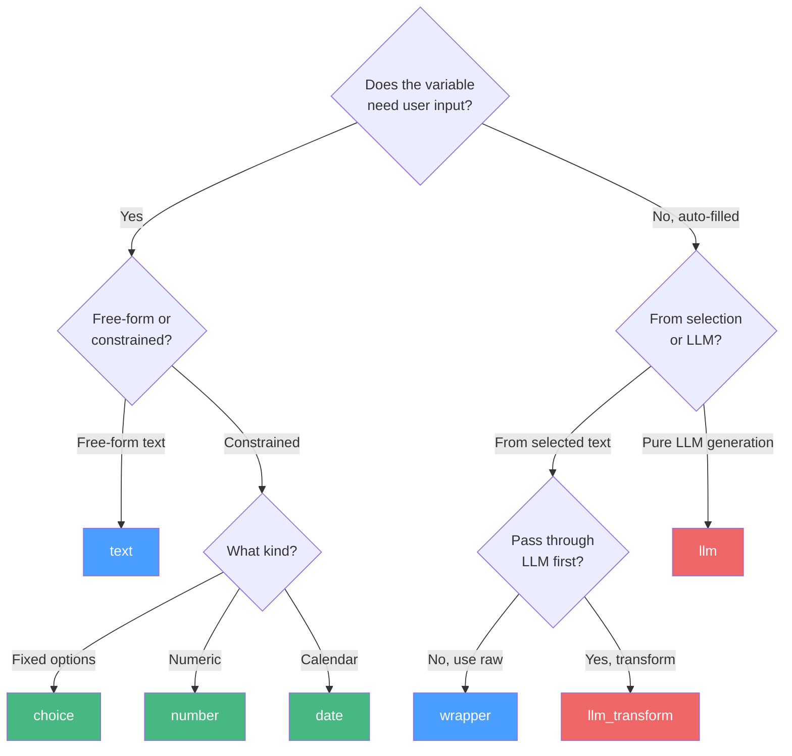
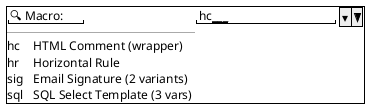
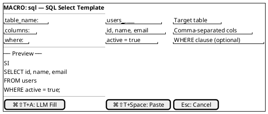
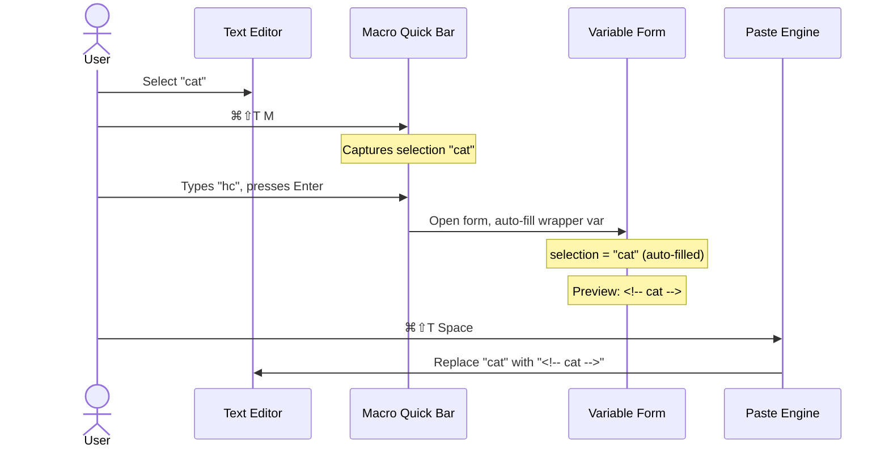
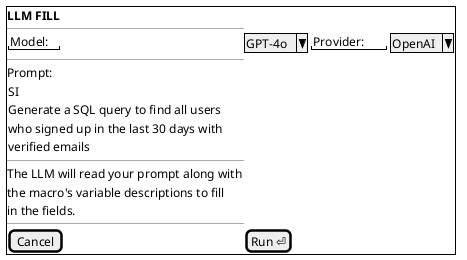
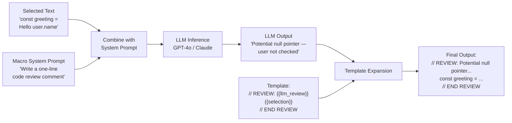
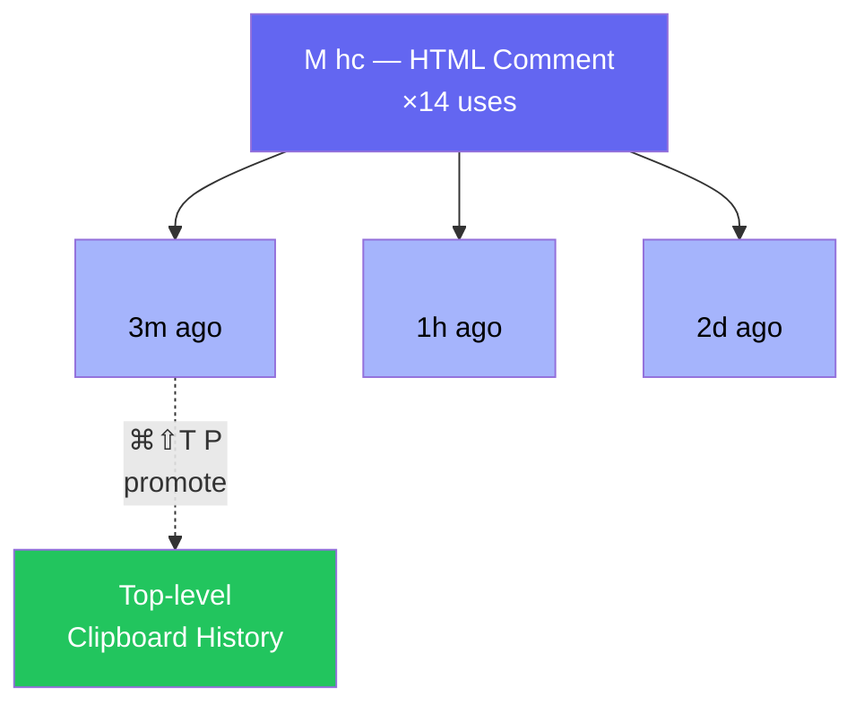

# 4. Macroization System

## Concept

Any clipboard entry can be "macroized" — assigned a short slug (e.g., `hc`, `dbconn`, `sig`) and optionally parameterized with variable parts. Macros turn the clipboard manager into an expandable snippet engine.

## Macro Lifecycle



## Creating a Macro



#### Asset: Create Macro Form


## Variable Types

| Type | Behavior |
|---|---|
| `text` | Free-form text input, user fills in at paste time |
| `wrapper` | Auto-filled with currently selected text when macro is invoked. If nothing is selected, shows as a text input. |
| `choice` | Dropdown from predefined options |
| `number` | Numeric input with optional min/max |
| `date` | Date picker, supports format strings |
| `llm` | Field value is generated by LLM inference (see §4.3) |
| `llm_transform` | Like wrapper, but selected text is passed through an LLM with a prompt before insertion |

## Variable Type Decision Tree



## Macro Quick-Insert Bar (`⌘⇧T M`)



#### Asset: Macro Quick-Insert Bar


- Combobox with fuzzy search over slug names, descriptions, and tags.
- Arrow keys to navigate, `Enter` to select.
- After selection, if the macro has **no variables** (or only a `wrapper` variable with text selected): `⌘⇧T Space` pastes immediately.
- If it has **variables that need input**, the variable form opens:

## Macro Variable Form (with live preview)



#### Asset: Macro Variable Form


**Key interaction**: the preview updates live as the user types into variable fields, so they always see exactly what will be pasted.

## Wrapper Variable Example Flow

User selects the word `cat` in their editor, then presses `⌘⇧T M`, types `hc`, hits `Enter`:



## LLM-Assisted Variable Fill (`⌘⇧T A`)



#### Asset: LLM Variable Fill


The LLM receives: the user's prompt, the macro template, and each variable's name/type/description. It returns structured output that populates the variable fields. The preview updates, and the user can review/edit before pasting.

## LLM Transform Pipeline

For `llm_transform` type variables, the macro definition includes a system prompt:



**Example**: A macro `cr` (code review) with template:
```
// REVIEW: {{llm_review}}
{{selection}}
// END REVIEW
```

Where `llm_review` is an `llm_transform` variable with prompt: *"Write a one-line code review comment for this code. Be specific about any bugs or improvements."*

Selecting a code block and invoking `cr` would produce:
```
// REVIEW: Potential null pointer — `user` is not checked before accessing `.name`
const greeting = `Hello ${user.name}`;
// END REVIEW
```

## Generated Output Nesting



- Press `⌘⇧T P` on a nested generated output to "promote" it — copy it to the top-level clipboard history as its own entry.
- Nested outputs inherit the parent macro's tags by default.

---

[← Favorites & Tagging](03-favorites-tagging.md) | [Table of Contents](../product-spec.md#table-of-contents) | [Search →](05-search.md)

**User Stories:** [US-031](user-stories/US-031.md) · [US-032](user-stories/US-032.md) · [US-033](user-stories/US-033.md)

<!-- nav -->

---

[< Previous: 3. Favorites & Tagging](03-favorites-tagging.md) | [Table of Contents](../product-spec.md) | [Next: 5. Search >](05-search.md)

<!-- nav -->
