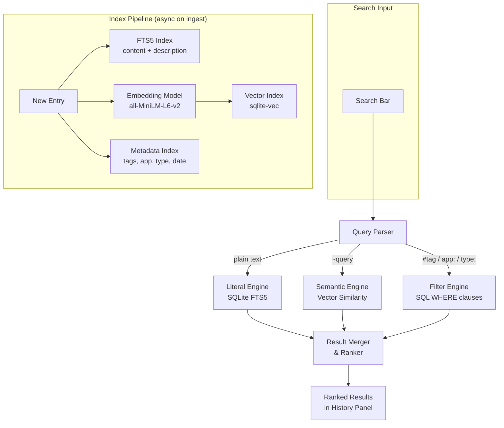

# 5. Search

## Search Architecture



## Search Query Syntax

```
literal text              — substring match
"exact phrase"            — exact match
#tagname                  — filter by tag
app:AppName               — filter by source app
type:text|image|rtf|html  — filter by content type
before:YYYY-MM-DD         — date filter
after:YYYY-MM-DD          — date filter
used:>5                   — usage count filter
~semantic query           — vector similarity search
machine:hostname          — filter by source machine
is:favorite               — favorites only
is:macro                  — macroized entries only
```

---

[← Macroization System](04-macroization-system.md) | [Table of Contents](../product-spec.md#table-of-contents) | [Provenance & Usage Tracking →](06-provenance-usage-tracking.md)

**User Stories:** [US-011](user-stories/US-011.md) · [US-012](user-stories/US-012.md) · [US-013](user-stories/US-013.md)

<!-- nav -->

---

[< Previous: 4. Macroization System](04-macroization-system.md) | [Table of Contents](../product-spec.md) | [Next: 6. Entry Provenance & Usage Tracking >](06-provenance-usage-tracking.md)

<!-- nav -->
