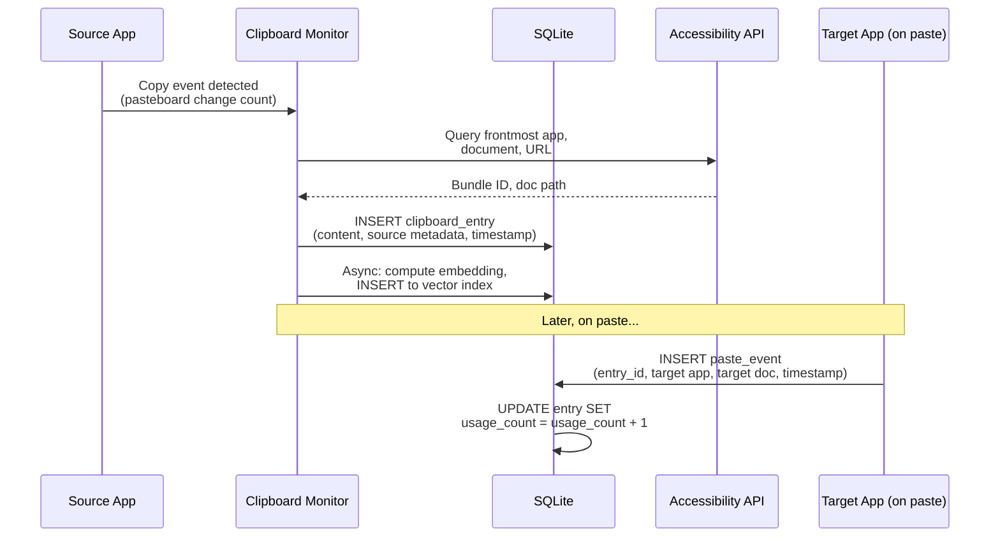
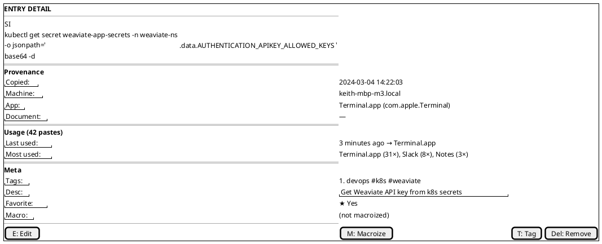
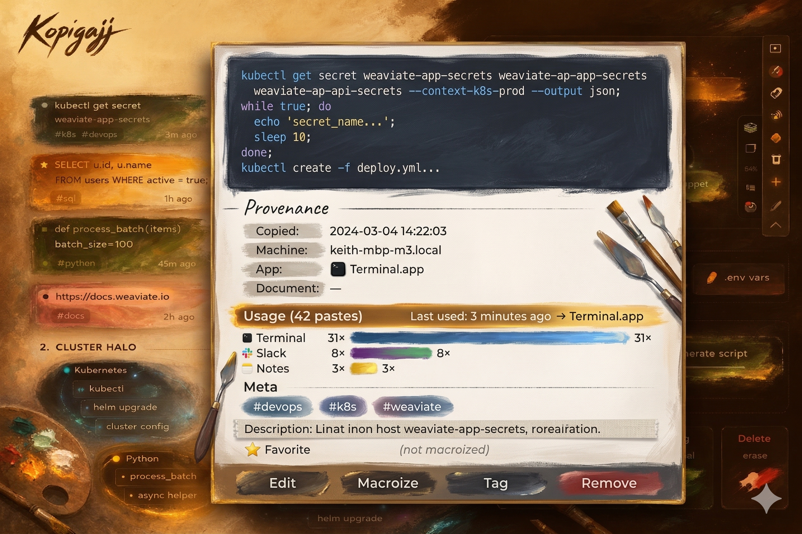

# 6. Entry Provenance & Usage Tracking

## Origin Tracking

Every entry records: timestamp of copy event (millisecond precision), source machine hostname, source application (bundle ID + display name), source document/URL (best-effort detection via Accessibility API), and copy method (keyboard shortcut, menu, programmatic).

## Usage Analytics

Every paste event records: timestamp of paste, target application, and target document/URL (best-effort).

This data powers the "×42" usage count badge on entries, the suggested entries algorithm (§2), a per-entry usage timeline accessible via the entry detail view, and menu bar analytics like "You've pasted 847 items this week, saving ~2.1 hours."

## Provenance & Usage Flow

## Entry Detail View

#### Asset: Entry Detail View

---

[← Search](05-search.md) | [Table of Contents](../product-spec.md#table-of-contents) | [LLM Snippet Library →](07-llm-snippet-library.md)

**User Stories:** [US-008](user-stories/US-008.md) · [US-009](user-stories/US-009.md) · [US-010](user-stories/US-010.md)

<!-- nav -->

---

[< Previous: 5. Search](05-search.md) | [Table of Contents](../product-spec.md) | [Next: 7. LLM Snippet Library (`⌘⇧T L`) >](07-llm-snippet-library.md)

<!-- nav -->
