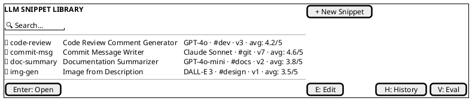
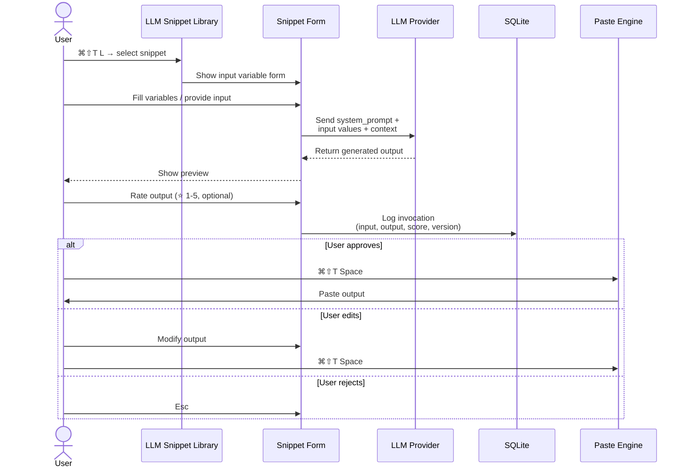
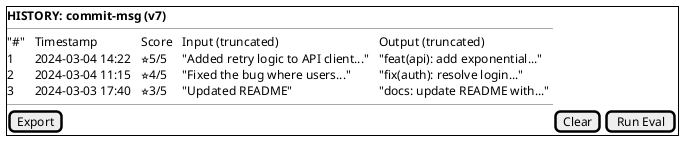
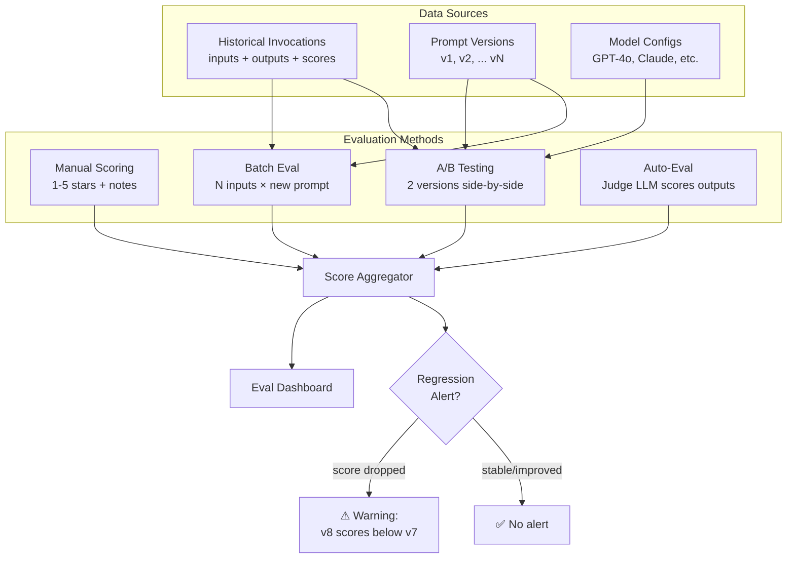
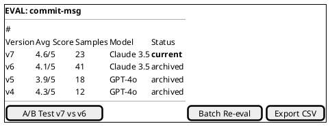

# 7. LLM Snippet Library (`⌘⇧T L`)

A dedicated mode for LLM-powered snippets — these are like macros but with first-class LLM integration, versioning, and evaluation.

## LLM Snippet Library Panel

#### Asset: Snippet Library Panel

## LLM Snippet Properties

Each LLM snippet has: slug (short identifier), display name & description, model & provider (configurable per-snippet), system prompt (the instruction prompt), input variables (same variable type system as macros), output format (text, markdown, code, image), version history (every edit to the prompt creates a new version), tags, and evaluation scores from the eval framework.

## LLM Snippet Invocation Flow

## Snippet Version & Eval History

#### Asset: Version & Eval History

## Eval Framework

#### Asset: Eval Dashboard

---

[← Provenance & Usage Tracking](06-provenance-usage-tracking.md) | [Table of Contents](../product-spec.md#table-of-contents) | [Editing →](08-editing.md)

**User Stories:** [US-066](user-stories/US-066.md) · [US-067](user-stories/US-067.md) · [US-068](user-stories/US-068.md) · [US-069](user-stories/US-069.md)

<!-- nav -->

---

[< Previous: 6. Entry Provenance & Usage Tracking](06-provenance-usage-tracking.md) | [Table of Contents](../product-spec.md) | [Next: 10. Image Support >](10-image-support.md)

<!-- nav -->
