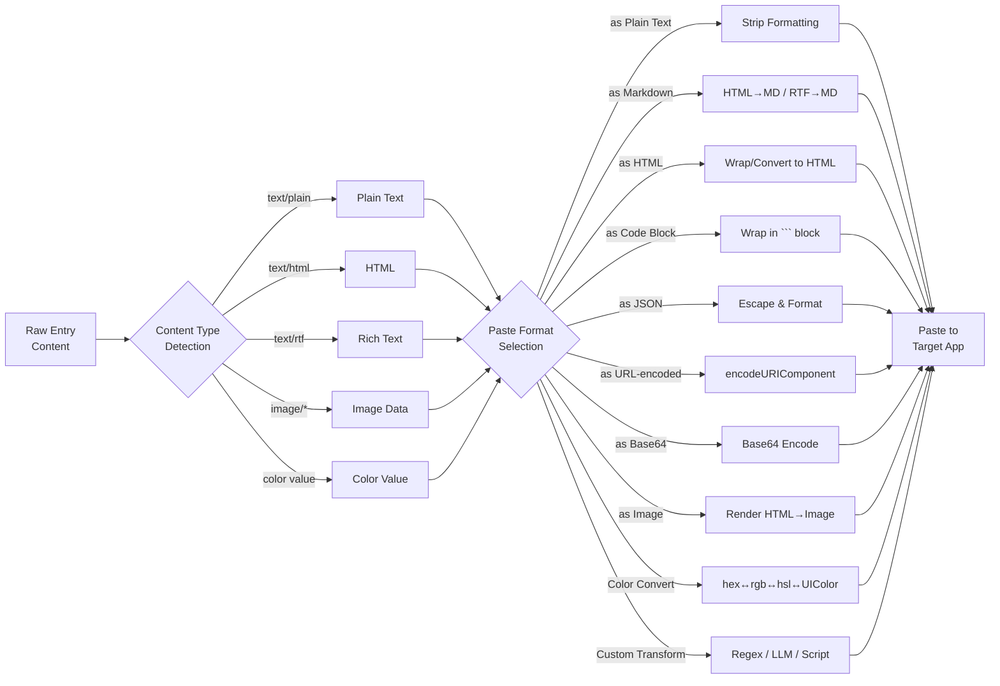
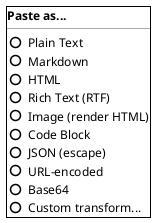

# 9. Smart Formatting & Paste Modes

When pasting, hold modifier keys or use a submenu to control formatting:

| Action | Result |
|---|---|
| `⌘⇧T Space` | Paste as-is (default) |
| `⌘⇧T Space` + `⌥` | Paste as plain text (strip formatting) |
| Hold `⌘⇧T Space` (long press) | Open paste format picker |

## Paste Format Transformation Pipeline

## Paste Format Picker

#### Asset: Paste Format Picker

## Color Support

- Color values detected in clipboard content (hex, RGB, HSL) show a color swatch preview.
- Paste-as options for colors: convert between hex, RGB, HSL, Swift UIColor, CSS variable.
- Color palette entries can be favorited and tagged for design system use.

---

[← Editing](08-editing.md) | [Table of Contents](../product-spec.md#table-of-contents) | [Image Support →](10-image-support.md)

**Mockups:** [Design Elements](style-guide/style-guide-elements.md)
**Solution Analysis:** [Clipboard Types](solution-analysis/05-clipboard-types.md)
**User Stories:** [US-014](user-stories/US-014.md) · [US-015](user-stories/US-015.md) · [US-016](user-stories/US-016.md) · [US-017](user-stories/US-017.md)

<!-- nav -->

---

[< Previous: 8. Editing](08-editing.md) | [Table of Contents](../product-spec.md) | [Next: 3. Favorites & Tagging >](03-favorites-tagging.md)

<!-- nav -->
