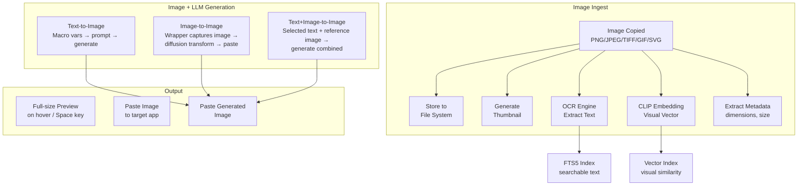
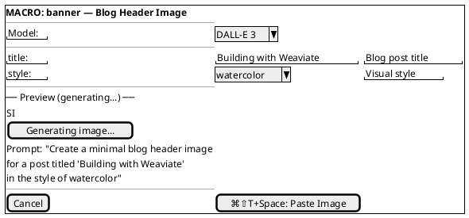

# 10. Image Support

## Image Processing Pipeline

## Capabilities

- Copy/paste images (PNG, JPEG, TIFF, GIF, SVG) — full first-class support.
- Thumbnail previews in the history panel.
- Full-size preview on hover or `Space` key.
- Image metadata stored: dimensions, file size, source app.
- OCR on image content for searchability (text extracted and indexed).
- Semantic embedding of images for visual similarity search.

## Image Generation Macro Example

#### Asset: Image Generation Macro

---

[← Smart Formatting & Paste Modes](09-smart-formatting-paste-modes.md) | [Table of Contents](../product-spec.md#table-of-contents) | [Menu Bar Interface →](11-menu-bar-interface.md)

**Solution Analysis:** [Clipboard Types](solution-analysis/05-clipboard-types.md)
**User Stories:** [US-014](user-stories/US-014.md) · [US-015](user-stories/US-015.md) · [US-016](user-stories/US-016.md)

<!-- nav -->

---

[< Previous: 7. LLM Snippet Library (`⌘⇧T L`)](07-llm-snippet-library.md) | [Table of Contents](../product-spec.md) | [Next: 14. Technical Architecture Notes >](14-technical-architecture.md)

<!-- nav -->
