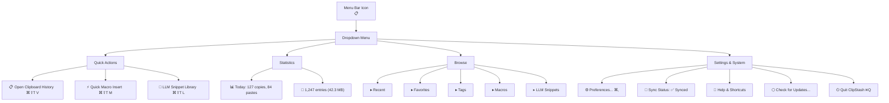
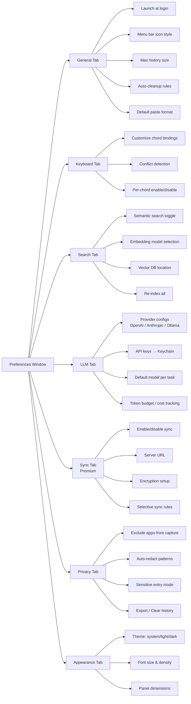

# 11. Menu Bar Interface

## Menu Bar Dropdown Structure

## Preferences Window

---

[← Image Support](10-image-support.md) | [Table of Contents](../product-spec.md#table-of-contents) | [Sync System →](12-sync-system.md)

**Mockups:** [Components](style-guide/style-guide-components.md)
**Solution Analysis:** [SwiftUI Popup](solution-analysis/03-swiftui-popup.md) · [UX Patterns](solution-analysis/10-ux-patterns.md)
**API Reference:** [NSWindow & Floating Windows](api-reference/02-nswindow-floating-windows.md) · [SwiftUI View Lifecycle](api-reference/04-swiftui-view-lifecycle.md)
**User Stories:** [US-018](user-stories/US-018.md) · [US-019](user-stories/US-019.md) · [US-020](user-stories/US-020.md)

<!-- nav -->

---

[< Previous: 2. Clipboard History Panel (`⌘⇧T V`)](02-clipboard-history-panel.md) | [Table of Contents](../product-spec.md) | [Next: 8. Editing >](08-editing.md)

<!-- nav -->
