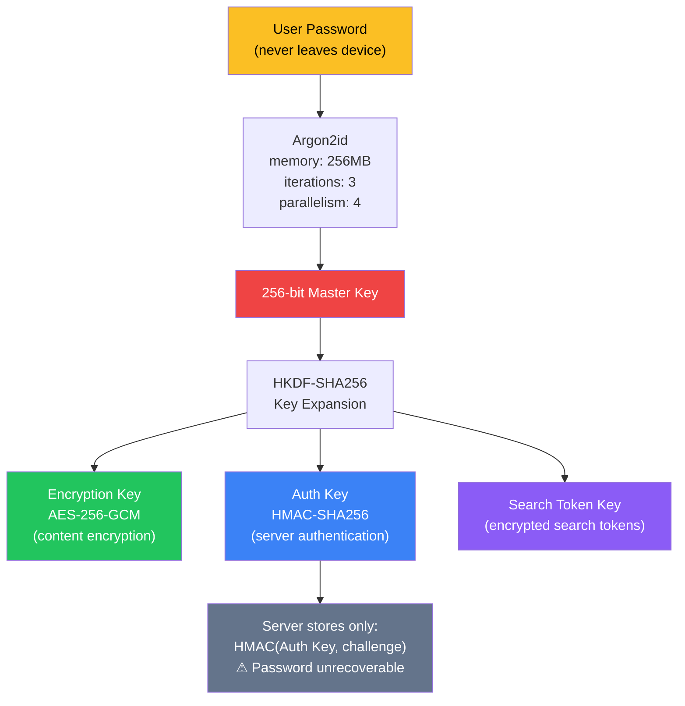
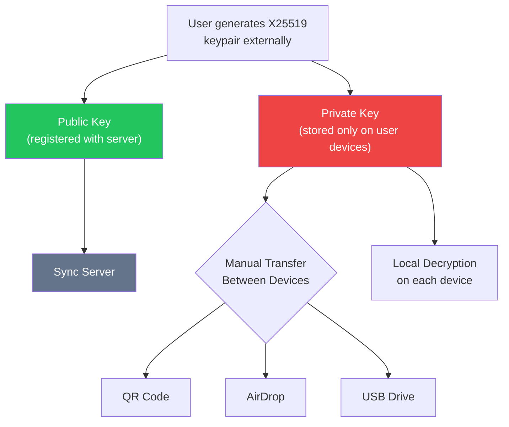
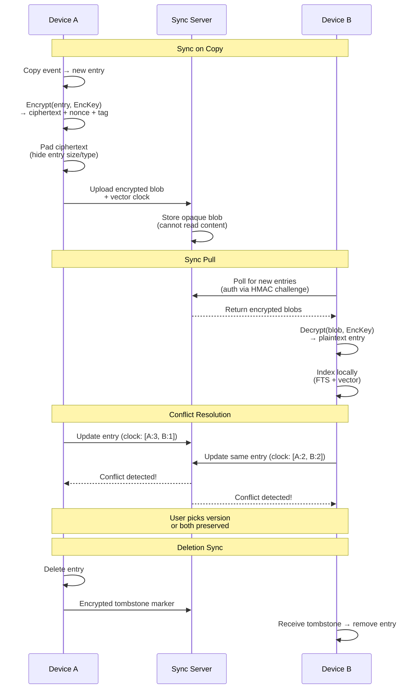

# 12. Sync System (Premium)

## Encryption Architecture

ClipStash sync uses end-to-end encryption. The server never has access to plaintext content.

## Key Derivation — Option A (Password-derived)

## Key Derivation — Option B (Custom Keypair)

## Sync Protocol

## Server-Side Guarantees

- Server stores only opaque ciphertext blobs.
- No server-side search capability (search is client-side only).
- Server cannot determine entry count, sizes, or types (padding applied).
- Audit log of sync events available to the user (encrypted).
- Open-source server component for self-hosting.

---

[← Menu Bar Interface](11-menu-bar-interface.md) | [Table of Contents](../product-spec.md#table-of-contents) | [Additional Features →](13-additional-features.md)

**Solution Analysis:** [Sandboxing](solution-analysis/07-sandboxing.md)
**User Stories:** [US-022](user-stories/US-022.md) · [US-023](user-stories/US-023.md) · [US-024](user-stories/US-024.md) · [US-025](user-stories/US-025.md) · [US-026](user-stories/US-026.md) · [US-027](user-stories/US-027.md) · [US-028](user-stories/US-028.md)

<!-- nav -->

---

[< Previous: 15. Monetization Model](15-monetization.md) | [Table of Contents](../product-spec.md)

<!-- nav -->
