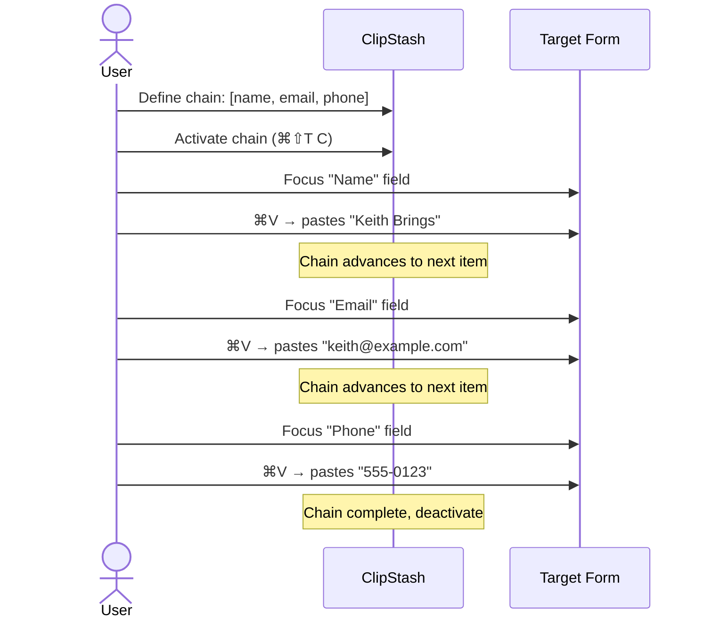
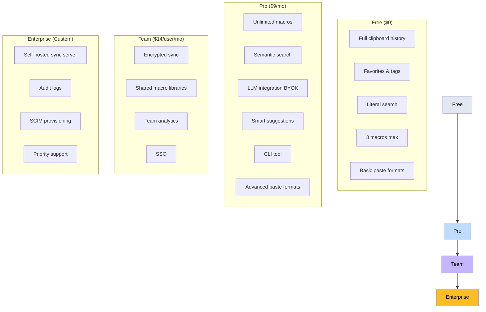

# 13. Additional Features & Suggestions

## Clipboard Chain Flow

## Feature Matrix by Tier

## Additional Feature Ideas

- **Duplicate detection**: flag near-duplicate entries, offer to merge.
- **Expiring entries**: auto-delete sensitive content after N minutes (configurable per-app or globally).
- **Clipboard chains**: define ordered sequences of entries that paste one after another with successive `⌘V` presses (useful for filling forms).
- **Regex transforms on paste**: apply find/replace patterns at paste time.
- **URL preview**: entries detected as URLs show a small preview card (title, favicon, description fetched lazily).
- **Code detection**: auto-detect programming language, apply syntax highlighting, offer "paste as code block" in Markdown/Slack contexts.
- **Multi-select paste**: select multiple entries and paste them concatenated (with configurable separator: newline, comma, etc.).

## Accessibility

- Full VoiceOver support.
- High-contrast mode.
- Adjustable animation speed / reduce motion support.
- Keyboard-only navigation (no mouse required for any operation).

## Developer Features

- **CLI tool** (`clipstash`): query history, add entries, invoke macros from terminal scripts.
- **Alfred/Raycast integration**: plugin for quick access from other launchers.
- **Shortcuts.app actions**: expose ClipStash operations as Shortcuts actions for automation.
- **AppleScript / JXA dictionary**: scriptable interface for power users.
- **Webhook support**: trigger HTTP calls on copy/paste events (for integration with external tools).

## Data Management

- **Export**: JSON, CSV, or ClipStash archive format (.csa).
- **Import**: from popular clipboard managers (Paste, CopyClip, Maccy, Alfred clipboard history).
- **Backup**: scheduled local backups with configurable retention.

---

[← Sync System](12-sync-system.md) | [Table of Contents](../product-spec.md#table-of-contents) | [Technical Architecture →](14-technical-architecture.md)

<!-- nav -->

---

[< Previous: 14. Technical Architecture Notes](14-technical-architecture.md) | [Table of Contents](../product-spec.md) | [Next: 15. Monetization Model >](15-monetization.md)

<!-- nav -->
