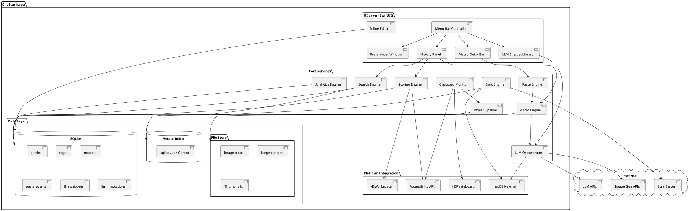
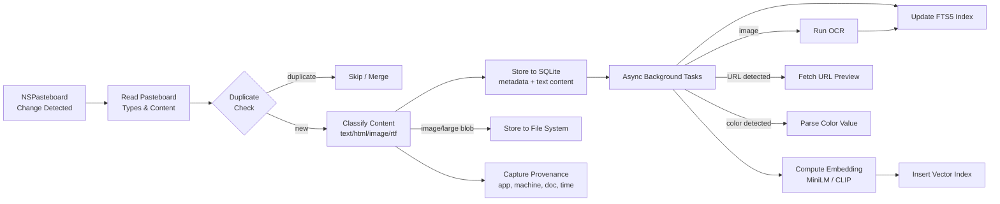

# 14. Technical Architecture Notes

## Component Architecture

#### Asset: Component Architecture Diagram

## Storage

- **Local DB**: SQLite for metadata + content (text entries stored inline, images/large blobs as files).
- **Vector index**: sqlite-vec extension or embedded Qdrant for semantic search embeddings.
- **Keychain**: API keys and encryption keys stored in macOS Keychain.
- **File store**: `~/Library/Application Support/ClipStash/` for blobs, cache, and DB.

## Clipboard Monitoring

- `NSPasteboard` general pasteboard polling (configurable interval, default 250ms).
- `NSPasteboard` change count tracking for efficient detection.
- Support for multiple pasteboard types: general, find, drag.

## Performance Targets

| Metric | Target |
|---|---|
| Panel open latency | < 100ms |
| Literal search results | < 50ms |
| Semantic search results | < 200ms |
| Macro expansion (no LLM) | < 30ms |
| Memory baseline | < 80MB |
| Embedding computation | Async, background thread, non-blocking |

## Ingest Pipeline Detail

---

[← Additional Features](13-additional-features.md) | [Table of Contents](../product-spec.md#table-of-contents) | [Monetization Model →](15-monetization.md)

**Solution Analysis:** [SQLite Persistence](solution-analysis/06-sqlite-persistence.md) · [Background Daemon](solution-analysis/04-background-daemon.md) · [App Bundle](solution-analysis/08-app-bundle.md) · [Launch Agents](solution-analysis/09-launch-agents.md) · [Sandboxing](solution-analysis/07-sandboxing.md)
**API Reference:** [Guidelines](api-reference/GUIDELINES.md) · [NSApplication & Activation Policy](api-reference/03-nsapplication-activation-policy.md)
**User Stories:** [US-061](user-stories/US-061.md) · [US-062](user-stories/US-062.md) · [US-063](user-stories/US-063.md) · [US-064](user-stories/US-064.md) · [US-065](user-stories/US-065.md)

<!-- nav -->

---

[< Previous: 10. Image Support](10-image-support.md) | [Table of Contents](../product-spec.md) | [Next: 13. Additional Features & Suggestions >](13-additional-features.md)

<!-- nav -->
