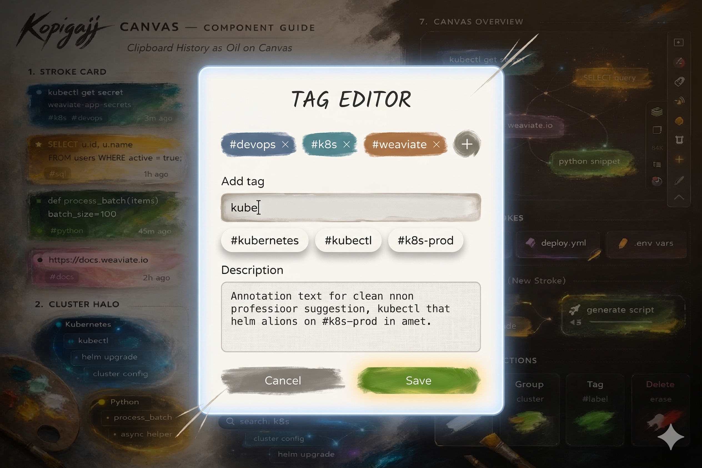
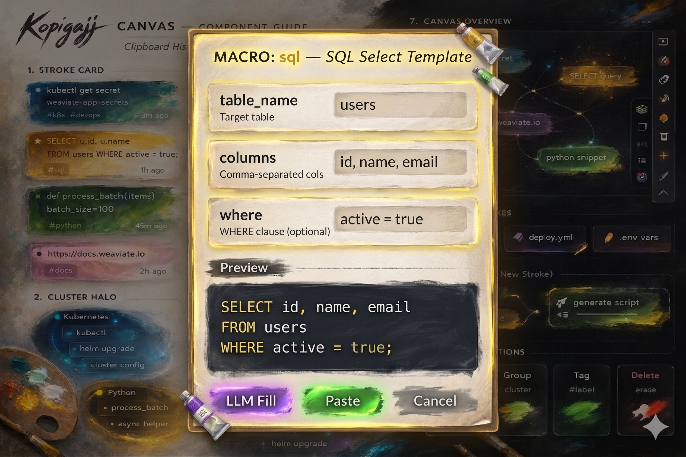
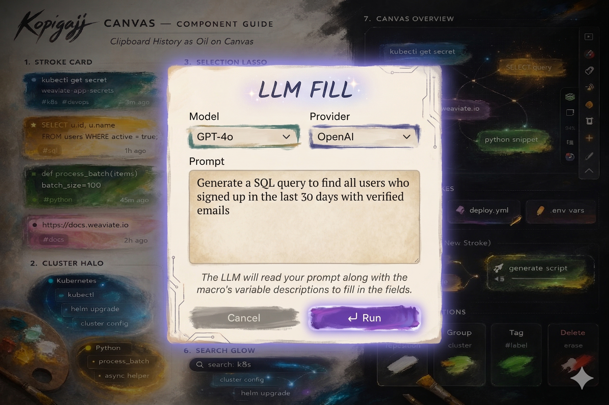
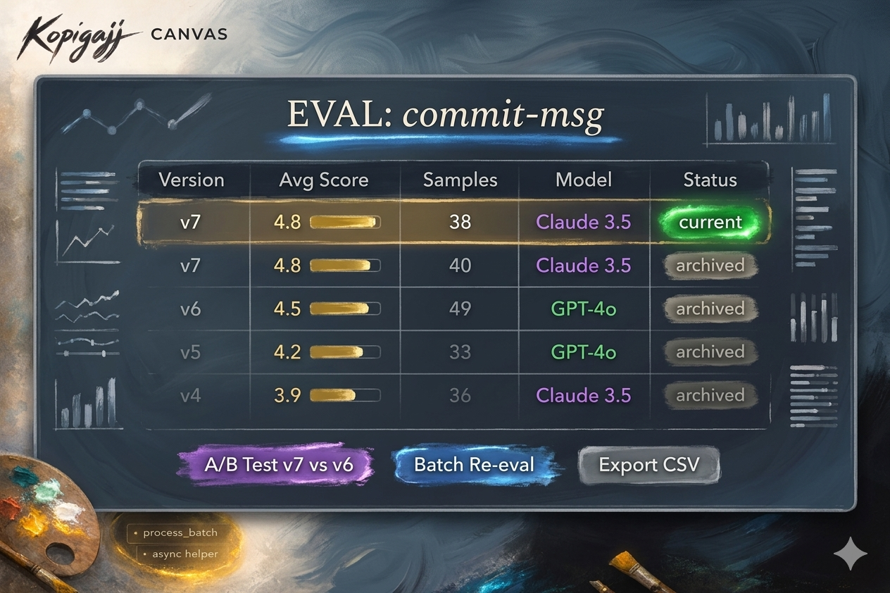
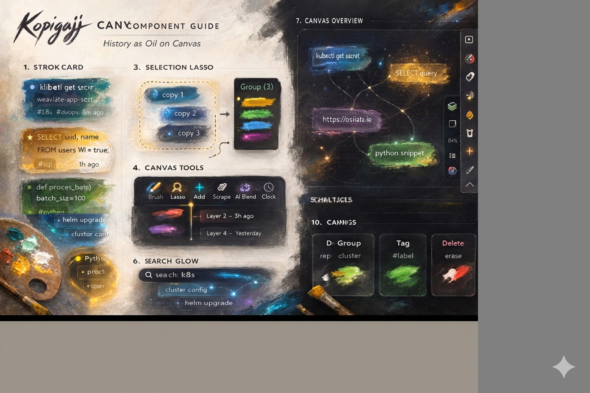

# ClipStash — Asset Manifest

All visual assets required for the product spec, described in the Kopigajj Canvas design language.

---

## 1. History Panel Layout

**Source:** [02-clipboard-history-panel.md](02-clipboard-history-panel.md)

---

## 2. Tag Editor

**Source:** [03-favorites-tagging.md](03-favorites-tagging.md)

---

## 3. Create Macro Form

**Source:** [04-macroization-system.md](04-macroization-system.md)

---

## 4. Macro Quick-Insert Bar

**Source:** [04-macroization-system.md](04-macroization-system.md)

---

## 5. Macro Variable Form

**Source:** [04-macroization-system.md](04-macroization-system.md)

---

## 6. LLM Variable Fill

**Source:** [04-macroization-system.md](04-macroization-system.md)

---

## 7. Entry Detail View

**Source:** [06-provenance-usage-tracking.md](06-provenance-usage-tracking.md)

---

## 8. Snippet Library Panel

**Source:** [07-llm-snippet-library.md](07-llm-snippet-library.md)

---

## 9. Version & Eval History

**Source:** [07-llm-snippet-library.md](07-llm-snippet-library.md)

---

## 10. Eval Dashboard

**Source:** [07-llm-snippet-library.md](07-llm-snippet-library.md)

---

## 11. Paste Format Picker

**Source:** [09-smart-formatting-paste-modes.md](09-smart-formatting-paste-modes.md)

---

## 12. Image Generation Macro

**Source:** [10-image-support.md](10-image-support.md)

---

## 13. Component Architecture Diagram

**Source:** [14-technical-architecture.md](14-technical-architecture.md)

