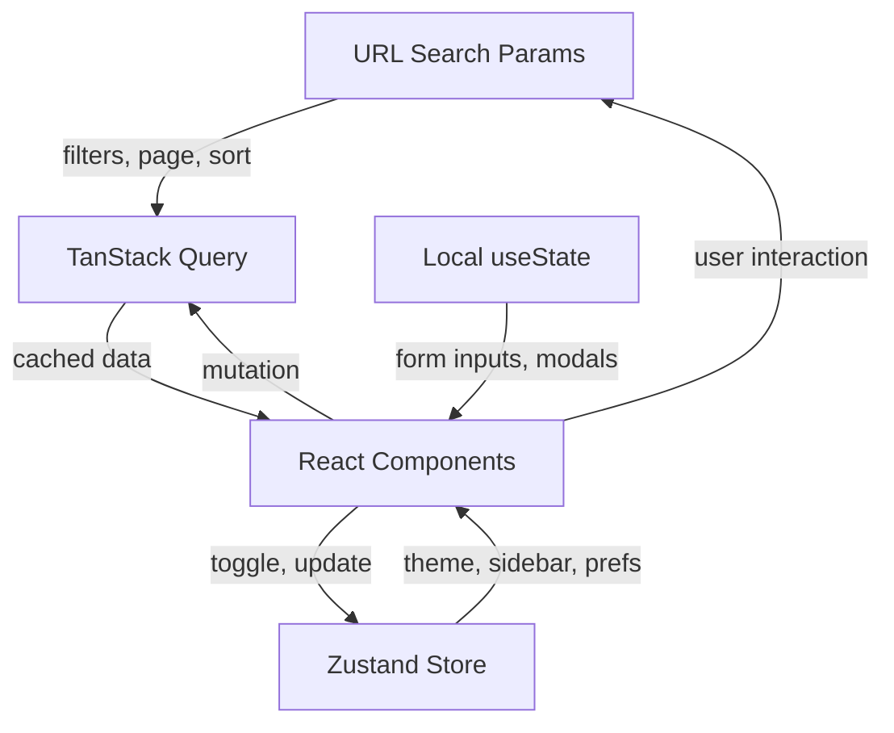

# React State Management: Decision Matrix and Patterns

## Decision Matrix: Which State Where?

| State Type | Location | Tool | Example |
|:-----------|:---------|:-----|:--------|
| Navigation state (filters, page, tab) | URL search params | Next.js `useSearchParams` or React Router | `?page=2&sort=newest` |
| Server data (API responses, DB records) | Server cache | TanStack Query / SWR | Product list, user profile |
| Global UI state (theme, locale, sidebar) | Client global | Zustand / Context | Dark mode toggle, language |
| Complex derived + cross-component state | Client store | Redux Toolkit | Shopping cart with rules engine |
| Form state (input values, validation) | Local component | `useState` / `useReducer` | Search input, checkout form |
| Shared atomic state | Atoms | Jotai / Recoil | Feature flags, selected item |
| Temporary transient state (toasts, modals) | Local or global | Zustand slice or local state | Notification queue |

### Decision Flowchart

```
Does the state affect what URL should be?
  YES -> URL search params
  NO -> Does it come from an API/server?
    YES -> TanStack Query (server cache)
    NO -> Is it needed by many distant components?
      YES -> Is the state complex with many interactions?
        YES -> Redux Toolkit
        NO -> Zustand or Jotai
      NO -> Local useState / useReducer
```

---

## Redux Toolkit 2.x / RTK Query

### When Redux Is the Right Choice

- Complex derived state that multiple components need simultaneously
- Cross-component interactions (e.g., action in component A affects state consumed by B, C, D)
- Time-travel debugging is valuable during development
- Team already familiar with Redux patterns
- State update logic is complex enough to benefit from centralized reducers

### Store Setup

```tsx
// store/index.ts
import { configureStore } from '@reduxjs/toolkit';
import { apiSlice } from './apiSlice';
import cartReducer from './cartSlice';
import uiReducer from './uiSlice';

export const store = configureStore({
  reducer: {
    [apiSlice.reducerPath]: apiSlice.reducer,
    cart: cartReducer,
    ui: uiReducer,
  },
  middleware: (getDefaultMiddleware) =>
    getDefaultMiddleware().concat(apiSlice.middleware),
});

export type RootState = ReturnType<typeof store.getState>;
export type AppDispatch = typeof store.dispatch;
```

### Typed Hooks

```tsx
// store/hooks.ts
import { useDispatch, useSelector } from 'react-redux';
import type { RootState, AppDispatch } from './index';

export const useAppDispatch = useDispatch.withTypes<AppDispatch>();
export const useAppSelector = useSelector.withTypes<RootState>();
```

### Slice with `createSlice`

```tsx
// store/cartSlice.ts
import { createSlice, PayloadAction } from '@reduxjs/toolkit';
import type { RootState } from './index';

interface CartItem {
  id: string;
  name: string;
  price: number;
  quantity: number;
}

interface CartState {
  items: CartItem[];
  discountCode: string | null;
}

const initialState: CartState = {
  items: [],
  discountCode: null,
};

const cartSlice = createSlice({
  name: 'cart',
  initialState,
  reducers: {
    addItem(state, action: PayloadAction<Omit<CartItem, 'quantity'>>) {
      const existing = state.items.find((item) => item.id === action.payload.id);
      if (existing) {
        existing.quantity += 1;
      } else {
        state.items.push({ ...action.payload, quantity: 1 });
      }
    },
    removeItem(state, action: PayloadAction<string>) {
      state.items = state.items.filter((item) => item.id !== action.payload);
    },
    updateQuantity(state, action: PayloadAction<{ id: string; quantity: number }>) {
      const item = state.items.find((item) => item.id === action.payload.id);
      if (item) {
        item.quantity = Math.max(0, action.payload.quantity);
        if (item.quantity === 0) {
          state.items = state.items.filter((i) => i.id !== action.payload.id);
        }
      }
    },
    applyDiscount(state, action: PayloadAction<string>) {
      state.discountCode = action.payload;
    },
    clearCart(state) {
      state.items = [];
      state.discountCode = null;
    },
  },
});

export const { addItem, removeItem, updateQuantity, applyDiscount, clearCart } =
  cartSlice.actions;

// Selectors
export const selectCartItems = (state: RootState) => state.cart.items;
export const selectCartTotal = (state: RootState) =>
  state.cart.items.reduce((sum, item) => sum + item.price * item.quantity, 0);
export const selectCartCount = (state: RootState) =>
  state.cart.items.reduce((sum, item) => sum + item.quantity, 0);

export default cartSlice.reducer;
```

### Async Thunks with `createAsyncThunk`

```tsx
// store/checkoutSlice.ts
import { createAsyncThunk, createSlice } from '@reduxjs/toolkit';

interface CheckoutState {
  status: 'idle' | 'loading' | 'succeeded' | 'failed';
  orderId: string | null;
  error: string | null;
}

export const submitOrder = createAsyncThunk(
  'checkout/submitOrder',
  async (orderData: OrderPayload, { rejectWithValue }) => {
    try {
      const response = await fetch('/api/orders', {
        method: 'POST',
        headers: { 'Content-Type': 'application/json' },
        body: JSON.stringify(orderData),
      });
      if (!response.ok) {
        const error = await response.json();
        return rejectWithValue(error.message);
      }
      return response.json();
    } catch (err) {
      return rejectWithValue('Network error');
    }
  }
);

const checkoutSlice = createSlice({
  name: 'checkout',
  initialState: { status: 'idle', orderId: null, error: null } as CheckoutState,
  reducers: {
    resetCheckout(state) {
      state.status = 'idle';
      state.orderId = null;
      state.error = null;
    },
  },
  extraReducers: (builder) => {
    builder
      .addCase(submitOrder.pending, (state) => {
        state.status = 'loading';
        state.error = null;
      })
      .addCase(submitOrder.fulfilled, (state, action) => {
        state.status = 'succeeded';
        state.orderId = action.payload.id;
      })
      .addCase(submitOrder.rejected, (state, action) => {
        state.status = 'failed';
        state.error = action.payload as string;
      });
  },
});
```

### RTK Query: Data Fetching and Caching

```tsx
// store/apiSlice.ts
import { createApi, fetchBaseQuery } from '@reduxjs/toolkit/query/react';

export interface Product {
  id: string;
  name: string;
  price: number;
  category: string;
  image: string;
}

export interface ProductsResponse {
  products: Product[];
  total: number;
  page: number;
  totalPages: number;
}

export const apiSlice = createApi({
  reducerPath: 'api',
  baseQuery: fetchBaseQuery({ baseUrl: '/api' }),
  tagTypes: ['Product', 'Cart'],
  endpoints: (builder) => ({
    getProducts: builder.query<ProductsResponse, ProductFilters>({
      query: (filters) => ({
        url: '/products',
        params: filters,
      }),
      providesTags: (result) =>
        result
          ? [
              ...result.products.map(({ id }) => ({ type: 'Product' as const, id })),
              { type: 'Product', id: 'LIST' },
            ]
          : [{ type: 'Product', id: 'LIST' }],
      // Keep data for 5 minutes
      keepUnusedDataFor: 300,
    }),
    getProduct: builder.query<Product, string>({
      query: (id) => `/products/${id}`,
      providesTags: (_result, _error, id) => [{ type: 'Product', id }],
    }),
    addToCart: builder.mutation<CartItem, { productId: string; quantity: number }>({
      query: (body) => ({
        url: '/cart/items',
        method: 'POST',
        body,
      }),
      invalidatesTags: ['Cart'],
      // Optimistic update
      async onQueryStarted({ productId, quantity }, { dispatch, queryFulfilled }) {
        const patchResult = dispatch(
          apiSlice.util.updateQueryData('getCart', undefined, (draft) => {
            const existing = draft.items.find((item) => item.productId === productId);
            if (existing) {
              existing.quantity += quantity;
            }
          })
        );
        try {
          await queryFulfilled;
        } catch {
          patchResult.undo();
        }
      },
    }),
  }),
});

export const { useGetProductsQuery, useGetProductQuery, useAddToCartMutation } = apiSlice;
```

---

## Zustand

### When Zustand Is the Right Choice

- Simpler global state that doesn't need Redux's ceremony
- Smaller bundle size matters (1KB vs 11KB for Redux)
- Quick to set up, minimal boilerplate
- Good for UI state, feature flags, theme, notifications

### Basic Store

```tsx
// stores/ui-store.ts
import { create } from 'zustand';

interface UIState {
  theme: 'light' | 'dark';
  sidebarOpen: boolean;
  locale: string;
  setTheme: (theme: 'light' | 'dark') => void;
  toggleSidebar: () => void;
  setLocale: (locale: string) => void;
}

export const useUIStore = create<UIState>((set) => ({
  theme: 'light',
  sidebarOpen: false,
  locale: 'en-US',
  setTheme: (theme) => set({ theme }),
  toggleSidebar: () => set((state) => ({ sidebarOpen: !state.sidebarOpen })),
  setLocale: (locale) => set({ locale }),
}));
```

### With Middleware

```tsx
// stores/cart-store.ts
import { create } from 'zustand';
import { persist, devtools } from 'zustand/middleware';
import { immer } from 'zustand/middleware/immer';

interface CartItem {
  id: string;
  name: string;
  price: number;
  quantity: number;
}

interface CartState {
  items: CartItem[];
  addItem: (item: Omit<CartItem, 'quantity'>) => void;
  removeItem: (id: string) => void;
  updateQuantity: (id: string, quantity: number) => void;
  clearCart: () => void;
  total: () => number;
}

export const useCartStore = create<CartState>()(
  devtools(
    persist(
      immer((set, get) => ({
        items: [],
        addItem: (item) =>
          set((state) => {
            const existing = state.items.find((i) => i.id === item.id);
            if (existing) {
              existing.quantity += 1;
            } else {
              state.items.push({ ...item, quantity: 1 });
            }
          }),
        removeItem: (id) =>
          set((state) => {
            state.items = state.items.filter((i) => i.id !== id);
          }),
        updateQuantity: (id, quantity) =>
          set((state) => {
            const item = state.items.find((i) => i.id === id);
            if (item) {
              if (quantity <= 0) {
                state.items = state.items.filter((i) => i.id !== id);
              } else {
                item.quantity = quantity;
              }
            }
          }),
        clearCart: () => set({ items: [] }),
        total: () =>
          get().items.reduce((sum, item) => sum + item.price * item.quantity, 0),
      })),
      {
        name: 'cart-storage', // localStorage key
        partialize: (state) => ({ items: state.items }), // only persist items
      }
    ),
    { name: 'CartStore' } // DevTools name
  )
);
```

### Selectors for Performance

```tsx
// BAD: subscribes to entire store, re-renders on any change
function CartCount() {
  const store = useCartStore();
  return <span>{store.items.length}</span>;
}

// GOOD: subscribes only to the derived value
function CartCount() {
  const count = useCartStore((state) => state.items.reduce((sum, i) => sum + i.quantity, 0));
  return <span>{count}</span>;
}

// GOOD: use shallow comparison for object selectors
import { shallow } from 'zustand/shallow';

function CartSummary() {
  const { total, itemCount } = useCartStore(
    (state) => ({
      total: state.items.reduce((sum, i) => sum + i.price * i.quantity, 0),
      itemCount: state.items.reduce((sum, i) => sum + i.quantity, 0),
    }),
    shallow
  );

  return (
    <div>
      <span>{itemCount} items</span>
      <span>${total.toFixed(2)}</span>
    </div>
  );
}
```

---

## TanStack Query (React Query)

### When TanStack Query Is the Right Choice

- Primary concern is server state (API data)
- You need caching, background refetching, and stale-while-revalidate
- Pagination and infinite scrolling
- Optimistic updates and cache invalidation

### Query Client Setup

```tsx
// app/providers.tsx
import { QueryClient, QueryClientProvider } from '@tanstack/react-query';
import { ReactQueryDevtools } from '@tanstack/react-query-devtools';

const queryClient = new QueryClient({
  defaultOptions: {
    queries: {
      staleTime: 60 * 1000, // 1 minute
      gcTime: 5 * 60 * 1000, // 5 minutes (formerly cacheTime)
      retry: 2,
      refetchOnWindowFocus: false,
    },
  },
});

export function Providers({ children }: { children: React.ReactNode }) {
  return (
    <QueryClientProvider client={queryClient}>
      {children}
      <ReactQueryDevtools initialIsOpen={false} />
    </QueryClientProvider>
  );
}
```

### Basic Query

```tsx
// hooks/use-products.ts
import { useQuery } from '@tanstack/react-query';

interface ProductFilters {
  category?: string;
  sort?: string;
  page?: number;
  q?: string;
}

async function fetchProducts(filters: ProductFilters): Promise<ProductsResponse> {
  const params = new URLSearchParams();
  if (filters.category) params.set('category', filters.category);
  if (filters.sort) params.set('sort', filters.sort);
  if (filters.page) params.set('page', String(filters.page));
  if (filters.q) params.set('q', filters.q);

  const res = await fetch(`/api/products?${params}`);
  if (!res.ok) throw new Error('Failed to fetch products');
  return res.json();
}

export function useProducts(filters: ProductFilters) {
  return useQuery({
    queryKey: ['products', filters],
    queryFn: () => fetchProducts(filters),
    placeholderData: (previousData) => previousData, // keep previous while loading
  });
}
```

### Mutation with Cache Invalidation

```tsx
// hooks/use-update-product.ts
import { useMutation, useQueryClient } from '@tanstack/react-query';

export function useUpdateProduct() {
  const queryClient = useQueryClient();

  return useMutation({
    mutationFn: async (product: Partial<Product> & { id: string }) => {
      const res = await fetch(`/api/products/${product.id}`, {
        method: 'PATCH',
        headers: { 'Content-Type': 'application/json' },
        body: JSON.stringify(product),
      });
      if (!res.ok) throw new Error('Failed to update product');
      return res.json();
    },
    onSuccess: (data) => {
      // Invalidate the specific product and the list
      queryClient.invalidateQueries({ queryKey: ['products'] });
      queryClient.setQueryData(['products', data.id], data);
    },
  });
}
```

### Optimistic Update

```tsx
export function useToggleFavorite() {
  const queryClient = useQueryClient();

  return useMutation({
    mutationFn: async (productId: string) => {
      const res = await fetch(`/api/products/${productId}/favorite`, {
        method: 'POST',
      });
      if (!res.ok) throw new Error('Failed to toggle favorite');
      return res.json();
    },
    onMutate: async (productId) => {
      // Cancel any outgoing refetches
      await queryClient.cancelQueries({ queryKey: ['products'] });

      // Snapshot the previous value
      const previousProducts = queryClient.getQueryData(['products']);

      // Optimistically update
      queryClient.setQueryData(['products'], (old: ProductsResponse) => ({
        ...old,
        products: old.products.map((p) =>
          p.id === productId ? { ...p, isFavorite: !p.isFavorite } : p
        ),
      }));

      return { previousProducts };
    },
    onError: (_err, _productId, context) => {
      // Rollback on error
      if (context?.previousProducts) {
        queryClient.setQueryData(['products'], context.previousProducts);
      }
    },
    onSettled: () => {
      queryClient.invalidateQueries({ queryKey: ['products'] });
    },
  });
}
```

### Infinite Query for Pagination

```tsx
export function useInfiniteProducts(filters: Omit<ProductFilters, 'page'>) {
  return useInfiniteQuery({
    queryKey: ['products', 'infinite', filters],
    queryFn: ({ pageParam = 1 }) => fetchProducts({ ...filters, page: pageParam }),
    initialPageParam: 1,
    getNextPageParam: (lastPage) =>
      lastPage.page < lastPage.totalPages ? lastPage.page + 1 : undefined,
  });
}

// Usage with intersection observer
function ProductInfiniteList() {
  const { data, fetchNextPage, hasNextPage, isFetchingNextPage } = useInfiniteProducts({
    category: 'electronics',
  });

  const loadMoreRef = useRef<HTMLDivElement>(null);

  useEffect(() => {
    const observer = new IntersectionObserver(
      (entries) => {
        if (entries[0].isIntersecting && hasNextPage) {
          fetchNextPage();
        }
      },
      { threshold: 0.1 }
    );

    if (loadMoreRef.current) observer.observe(loadMoreRef.current);
    return () => observer.disconnect();
  }, [hasNextPage, fetchNextPage]);

  return (
    <div>
      {data?.pages.map((page) =>
        page.products.map((product) => <ProductCard key={product.id} product={product} />)
      )}
      <div ref={loadMoreRef}>
        {isFetchingNextPage && <Spinner />}
      </div>
    </div>
  );
}
```

---

## Jotai (Atomic State Management)

### When Jotai Is the Right Choice

- Bottom-up approach: build state from atoms rather than a single store
- State is needed by specific components but not globally
- You want fine-grained reactivity without selectors
- Features like derived state, async atoms, persistence

```tsx
// atoms/cart.ts
import { atom, useAtom } from 'jotai';
import { atomWithStorage } from 'jotai/utils';

// Base atoms
const cartItemsAtom = atomWithStorage<CartItem[]>('cart-items', []);

// Derived atoms (computed state)
const cartTotalAtom = atom((get) =>
  get(cartItemsAtom).reduce((sum, item) => sum + item.price * item.quantity, 0)
);

const cartCountAtom = atom((get) =>
  get(cartItemsAtom).reduce((sum, item) => sum + item.quantity, 0)
);

// Action atoms (write-only)
const addToCartAtom = atom(null, (get, set, item: Omit<CartItem, 'quantity'>) => {
  const items = get(cartItemsAtom);
  const existing = items.find((i) => i.id === item.id);
  if (existing) {
    set(
      cartItemsAtom,
      items.map((i) => (i.id === item.id ? { ...i, quantity: i.quantity + 1 } : i))
    );
  } else {
    set(cartItemsAtom, [...items, { ...item, quantity: 1 }]);
  }
});

// Usage
function AddToCartButton({ product }: { product: Product }) {
  const [, addToCart] = useAtom(addToCartAtom);
  return (
    <button onClick={() => addToCart({ id: product.id, name: product.name, price: product.price })}>
      Add to Cart
    </button>
  );
}

function CartBadge() {
  const count = useAtomValue(cartCountAtom);
  return count > 0 ? <span className="badge">{count}</span> : null;
}
```

---

## Combining Approaches

The recommended architecture for most production apps:

```tsx
// 1. URL State: navigation, filters, pagination
//    Drives what data to fetch and which view to show
const searchParams = useSearchParams();
const category = searchParams.get('category') ?? 'all';
const page = Number(searchParams.get('page') ?? '1');

// 2. TanStack Query: server state
//    Cached API data, keyed by URL params
const { data } = useProducts({ category, page });

// 3. Zustand: client UI state
//    Theme, sidebar, preferences (persisted)
const theme = useUIStore((s) => s.theme);

// 4. Local state: form inputs, ephemeral UI
const [searchInput, setSearchInput] = useState('');
```

### Architecture Diagram



---

## Server Components Impact

React Server Components change the state management landscape significantly:

### State That Moves to the Server

```tsx
// Before: Client fetches and manages state
'use client';
function ProductList() {
  const [products, setProducts] = useState([]);
  useEffect(() => { fetch('/api/products').then(r => r.json()).then(setProducts); }, []);
  return <div>{products.map(p => <Card key={p.id} />)}</div>;
}

// After: Server Component fetches directly
async function ProductList() {
  const products = await db.product.findMany();
  return <div>{products.map(p => <Card key={p.id} />)}</div>;
}
```

### Reduced Client State

```tsx
// Server Component handles data fetching
// Only interactive parts become client components
async function ProductPage({ searchParams }: PageProps) {
  const params = await searchParams;
  const products = await getProducts(params);

  return (
    <div>
      <ProductFilters /> {/* Client component for interactivity */}
      <ProductGrid products={products} /> {/* Server component, no state */}
      <Pagination currentPage={Number(params.page ?? '1')} /> {/* Client for clicks */}
    </div>
  );
}
```

### Client Boundary Strategy

```tsx
// Push client boundary down as far as possible
// Only interactive leaf components need 'use client'

// Server Component (no state needed)
async function ProductGrid({ products }: { products: Product[] }) {
  return (
    <div className="grid grid-cols-4 gap-4">
      {products.map((product) => (
        <ProductCard key={product.id} product={product} />
      ))}
    </div>
  );
}

// Client Component (needs interactivity)
'use client';
function ProductCard({ product }: { product: Product }) {
  const [isHovered, setIsHovered] = useState(false);
  const addToCart = useCartStore((s) => s.addItem);
  return (
    <div
      onMouseEnter={() => setIsHovered(true)}
      onMouseLeave={() => setIsHovered(false)}
    >
      
      <h3>{product.name}</h3>
      {isHovered && <button onClick={() => addToCart(product)}>Add to Cart</button>}
    </div>
  );
}
```

---

## Anti-Patterns

### Prop Drilling

```tsx
// BAD: Passing props through 4 intermediate components
<App>
  <Layout user={user}>
    <Sidebar user={user}>
      <Nav user={user}>
        <UserMenu user={user} /> {/* Only this needs user */}
      </Nav>
    </Sidebar>
  </Layout>
</App>

// GOOD: Use context or Zustand for deeply shared state
const useUser = create((set) => ({ user: null, setUser: (user) => set({ user }) }));

function UserMenu() {
  const user = useUser((s) => s.user);
  return <div>{user.name}</div>;
}
```

### Context Explosion

```tsx
// BAD: A new context for every piece of state
<ThemeContext.Provider value={theme}>
  <LocaleContext.Provider value={locale}>
    <SidebarContext.Provider value={sidebarOpen}>
      <NotificationContext.Provider value={notifications}>
        <App />
      </NotificationContext.Provider>
    </SidebarContext.Provider>
  </LocaleContext.Provider>
</ThemeContext.Provider>

// GOOD: Single Zustand store or grouped contexts
const useAppStore = create((set) => ({
  theme: 'light',
  locale: 'en-US',
  sidebarOpen: false,
  notifications: [],
  // ... actions
}));
```

### Global State for Local Concerns

```tsx
// BAD: Modal open/close in global state
const useModalStore = create((set) => ({
  isDeleteConfirmOpen: false,
  isEditFormOpen: false,
  // ... dozens of modal booleans
}));

// GOOD: Local state for local concerns
function DeleteButton({ itemId }: { itemId: string }) {
  const [showConfirm, setShowConfirm] = useState(false);
  return (
    <>
      <button onClick={() => setShowConfirm(true)}>Delete</button>
      {showConfirm && <ConfirmDialog onConfirm={() => deleteItem(itemId)} onCancel={() => setShowConfirm(false)} />}
    </>
  );
}
```

### Duplicate Server/Client State

```tsx
// BAD: Fetching in server component, then re-fetching in client
// Server Component
async function Page() {
  const products = await getProducts(); // Server fetch
  return <ClientProductList initialProducts={products} />;
}

// Client Component
'use client';
function ClientProductList({ initialProducts }: { initialProducts: Product[] }) {
  const [products, setProducts] = useState(initialProducts);
  useEffect(() => {
    fetch('/api/products').then(r => r.json()).then(setProducts); // Duplicate fetch!
  }, []);
}

// GOOD: Use TanStack Query with initial data from server
'use client';
function ClientProductList({ initialProducts }: { initialProducts: Product[] }) {
  const { data: products } = useQuery({
    queryKey: ['products'],
    queryFn: fetchProducts,
    initialData: initialProducts,
  });
  // No duplicate fetch, TanStack Query manages freshness
}
```
