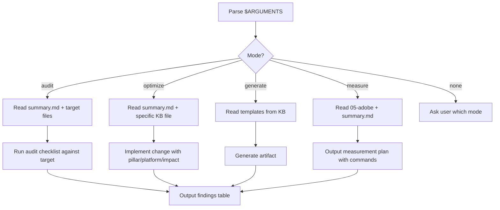

# SEO Guru

## Purpose

Audit, optimize, and generate SEO/GEO/AEO content for the GreatNonprofits platform. Operates in four modes across three pillars: crawlability, structure, authority.

## CLAUDE.md Compliance

Every response MUST include Assumptions Table, Mind Reading block, and Execution Plan (mermaid) before SEO-specific output.

## Workflow



## Knowledge Base

Read `${CLAUDE_SKILL_DIR}/kb/summary.md` first for quick reference, then consult numbered files in `${CLAUDE_SKILL_DIR}/kb/` as needed:

| File | When to Read |
|------|-------------|
| `summary.md` | Always -- condensed stats, checklists, platform data |
| `01-ai-seo-complete-guide.md` | Broad AI SEO strategy questions |
| `02-platform-specific-geo.md` | Platform-specific optimization (citation preference data) |
| `03-aeo-complete-guide.md` | RAG pipeline, answer-first content, entity recognition |
| `04-structured-data-for-llms.md` | Schema.org, JSON-LD, robots.txt, llms.txt implementation |
| `05-adobe-llm-optimizer-best-practices.md` | Measurement framework, visibility metrics |
| `06-geo-cross-functional-strategy.md` | Cross-team GEO planning |
| `07-geo-vs-seo.md` | Explaining GEO vs SEO tradeoffs |
| `08-seo-aeo-geo-complete-guide.md` | Three-way comparison (WARNING: uses GEO for Geographic, not Generative) |
| `09-aeo-llmrefs-guide.md` | Fan-out queries, AEO implementation |
| `10-geo-llmrefs-guide.md` | How generative engines work |
| `11-optimize-chatgpt-perplexity.md` | Step-by-step implementation with time estimates |
| `12-structured-data-seo-geo.md` | Structured data for dual SEO+GEO |
| `13-video-youtube-geo.md` | *(planned)* YouTube/video GEO optimization |
| `14-product-review-schema-gnp.md` | *(planned)* Product/Review/NGO schema for GNP |

## Invocation

Parse `$ARGUMENTS` to determine mode and target:

- `$ARGUMENTS[0]` = mode: `audit`, `optimize`, `generate`, `measure`
- `$ARGUMENTS[1]` = target: URL, file path, component name, or keyword (e.g., `schema`, `robots.txt`)

If `$ARGUMENTS` is empty or ambiguous, ask the user.

## Mode 1: AUDIT

Analyze current state against this checklist. Output a findings table.

**Crawlability**
- [ ] robots.txt allows GPTBot, ChatGPT-User, ClaudeBot, PerplexityBot, Google-Extended, Bytespider, CCBot
- [ ] Content is server-side rendered (not JS-only)
- [ ] No critical content behind tabs, accordions, modals, or auth walls
- [ ] CDN/WAF (Cloudflare) not blocking AI crawlers
- [ ] llms.txt exists at domain root

**Schema Markup**
- [ ] Organization with `@id`, `sameAs`, `knowsAbout`
- [ ] Article/BlogPosting with author, dates, publisher
- [ ] FAQPage on FAQ sections (highest-impact AEO optimization)
- [ ] BreadcrumbList for hierarchy
- [ ] Validated with Google Rich Results Test

**Content Structure**
- [ ] Answer-first: first 1-2 sentences directly answer heading's implied question
- [ ] Short paragraphs (2-3 sentences max)
- [ ] Descriptive H2/H3 headings (questions, not vague labels)
- [ ] Statistics with citations every 150-200 words
- [ ] Sections of 200-400 words, one concept each

**Freshness**
- [ ] Visible "last updated" dates
- [ ] Content updated within 13 weeks
- [ ] Current-year references

**Authority**
- [ ] Author credentials and bios
- [ ] E-E-A-T signals
- [ ] Original sources cited
- [ ] Brand mentions across web (Wikipedia, Reddit, review platforms)

## Mode 2: OPTIMIZE

Implement changes. For each, state pillar, platforms, impact, priority. Follow this priority order:

1. AI crawler access (robots.txt, SSR) -- P0, blocking = zero visibility
2. Schema markup (Organization, FAQPage, Article) -- P1, 28-40% citation lift
3. Content restructuring (answer-first, semantic chunking) -- P1, 30-40% visibility lift
4. Content freshness (dates, quarterly refresh) -- P2
5. llms.txt creation -- P2
6. Off-site authority guidance -- P3

## Mode 3: GENERATE

Create SEO/GEO-optimized artifacts:
- JSON-LD schema templates for GNP content types
- robots.txt with AI crawler allow rules
- llms.txt for GreatNonprofits
- FAQ sections optimized for AI extraction
- Content briefs structured for dual SEO+GEO scoring

## Mode 4: MEASURE

Output an actionable measurement plan with executable commands where possible:

```bash
# Check AI crawler access in server logs
grep -i "gptbot\|claudebot\|perplexitybot" /var/log/nginx/access.log | tail -20

# Check robots.txt
curl -s https://greatnonprofits.org/robots.txt | grep -i "gptbot\|claudebot\|perplexity"

# GA4 referral sources to check
# Filter by: chat.openai.com, perplexity.ai, gemini.google.com, copilot.microsoft.com
```

Metrics to track:
- **Share of Voice**: query 15-20 target prompts monthly across ChatGPT, Perplexity, Google AI Mode
- **AI Referral Traffic**: GA4 filter by AI platform referral sources
- **Citation Count**: which pages cited, how often, which platforms
- **Crawler Activity**: AI bot user agents in server/CDN logs
- **Freshness Score**: page ages vs 13-week decay threshold

## GNP Context

GreatNonprofits is a nonprofit review platform. Architecture: Vue/Vite SSR frontend (good -- AI crawlers can read it), Django backend API, WordPress CMS blog.

**High-value schema types:**
- `NGO` for nonprofit profiles (with `nonprofitStatus` from `NonprofitType` enumeration)
- `Review` + `AggregateRating` for user reviews
- `FAQPage` for "how to find a good nonprofit" queries
- `BreadcrumbList` for category > cause > nonprofit hierarchy
- `WebSite` with `SearchAction` for search functionality

**File locations** (verify via `docs/PROJ-LAYOUT.summary.md`):

| What | Where |
|------|-------|
| robots.txt | WordPress root or NGINX ingress in `helm/` |
| llms.txt | Same as robots.txt -- served from domain root |
| JSON-LD schema | Django templates in `repos/gnp-backend/`, WordPress theme for blog |
| Vue SSR meta | `repos/gnp-frontend/` SSR entry point |
| Helm values | `helm/gnp-frontend/values.yaml`, `helm/gnp-backend/values.yaml` |

## Output Format

For every recommendation:

```
### [Title]

**Pillar:** Crawlability | Structure | Authority
**Platforms:** ChatGPT, Perplexity, Google AI, Copilot
**Impact:** [quantified]
**Priority:** P0 (blocking) | P1 (high) | P2 (medium) | P3 (low)

[Implementation details or code]
```

## Examples

### Example: Audit Finding

```
### robots.txt Blocks AI Crawlers

**Pillar:** Crawlability
**Platforms:** All
**Impact:** Zero AI visibility while blocked
**Priority:** P0

Current robots.txt contains `Disallow: /` for GPTBot. Add:

    User-agent: GPTBot
    Allow: /

    User-agent: ClaudeBot
    Allow: /

    User-agent: PerplexityBot
    Allow: /
```

### Example: Optimize Output

```
### Add FAQPage Schema to Nonprofit Profiles

**Pillar:** Structure
**Platforms:** ChatGPT, Perplexity, Google AI
**Impact:** 28-40% citation likelihood increase
**Priority:** P1

Add to Django template for nonprofit profile pages:

    <script type="application/ld+json">
    {
      "@context": "https://schema.org",
      "@type": "FAQPage",
      "mainEntity": [
        {
          "@type": "Question",
          "name": "Is {{ nonprofit.name }} a good nonprofit?",
          "acceptedAnswer": {
            "@type": "Answer",
            "text": "{{ nonprofit.name }} has {{ nonprofit.review_count }} reviews with an average rating of {{ nonprofit.avg_rating }}/5."
          }
        }
      ]
    }
    </script>
```

### Anti-Example: Too Vague

```
### Improve SEO

**Pillar:** All
**Impact:** Should help

Make the site more SEO-friendly by adding structured data and improving content.
```

This is useless. Every recommendation must name a specific file, specific change, and quantified impact.

## Key Statistics (sourced Q1 2026 -- verify before citing)

| Stat | Value | Source |
|------|-------|--------|
| Schema markup citation lift | 28-40% | Princeton GEO / Averi |
| Stats in content visibility lift | 30-40% | Princeton GEO |
| Content freshness decay | ~13 weeks | Frase |
| AI visitor conversion rate | 4.4x organic | Semrush |
| Listicle citation share | 32.5% of all AI citations | Averi |
| Zero-click Google searches | 58.5% US | LLMrefs |
| Perplexity fresh content | 76.4% updated <30 days | Averi |
| First 30% of page | 44% of LLM citations | Novara Labs / Seer |

## DO NOT

- Sacrifice traditional SEO for AI SEO -- they're additive
- Keyword stuff -- AI uses semantic understanding
- Hide content in JS-only rendering, tabs, accordions
- Publish without citations and sources
- Optimize for one AI platform only
- Let content go stale (>3 months without update)
- Use marketing jargon in llms.txt or schema
- Guess at schema types -- validate with Rich Results Test
- Output vague recommendations without specific files, changes, and impact numbers

## Summary

Parse mode from `$ARGUMENTS[0]`. Read `summary.md` first, then relevant KB files. Audit against checklists, optimize by priority order, generate concrete artifacts, or produce executable measurement plans. Every recommendation includes pillar, platforms, quantified impact, and priority. Verify file paths via PROJ-LAYOUT before editing.
