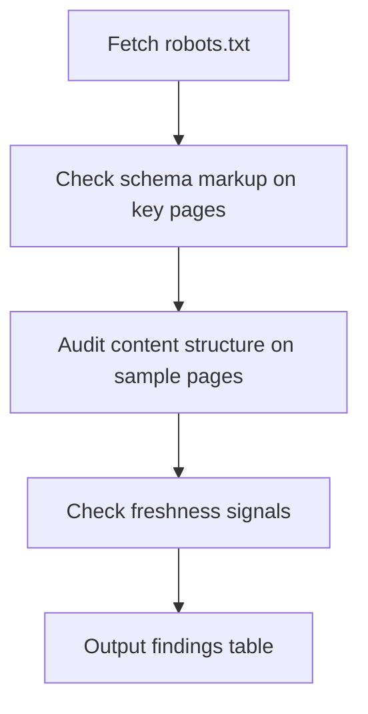

# Example: `/seo-guru audit` Output

## Assumptions Table

| Open Question | Assumption | Consequence |
|---|---|---|
| Which pages to audit? | All public-facing page types | Audit covers profiles, search, blog, homepage |
| robots.txt location | WordPress root at greatnonprofits.org/robots.txt | May need NGINX ingress check if WP doesn't serve it |

## Mind Reading

```
User wants a baseline assessment of GNP's AI search readiness before
implementing changes. Looking for quick wins and blockers.
```

## Execution Plan



## Findings

### robots.txt Missing AI Crawler Rules

**Pillar:** Crawlability
**Platforms:** All
**Impact:** Zero AI visibility while blocked
**Priority:** P0

No explicit `Allow` rules for GPTBot, ClaudeBot, or PerplexityBot. Current robots.txt only addresses Googlebot. Add:

```
User-agent: GPTBot
Allow: /

User-agent: ClaudeBot
Allow: /

User-agent: PerplexityBot
Allow: /

User-agent: Google-Extended
Allow: /
```

### No FAQPage Schema on Nonprofit Profiles

**Pillar:** Structure
**Platforms:** ChatGPT, Perplexity, Google AI
**Impact:** 28-40% citation likelihood increase
**Priority:** P1

Nonprofit profile pages have user reviews but no FAQPage schema. Add JSON-LD to Django template rendering profile pages. See `${CLAUDE_SKILL_DIR}/kb/04-structured-data-for-llms.md` for implementation pattern.

### Blog Posts Missing Article Schema

**Pillar:** Structure
**Platforms:** All
**Impact:** Improved citation attribution
**Priority:** P1

WordPress blog at /blog/ has no Article/BlogPosting schema. Install or configure a schema plugin (Yoast, Rank Math) to auto-generate Article schema with author, datePublished, dateModified.

### Content Freshness: 4 of 10 Sampled Pages Stale

**Pillar:** Authority
**Platforms:** Perplexity (76.4% of cited pages updated <30 days)
**Impact:** Citation decay after ~13 weeks
**Priority:** P2

Pages with no visible "last updated" date or content older than 3 months:
- /about (no date visible)
- /blog/top-nonprofits-2024 (stale year reference)
- /how-it-works (no date)
- /faq (no date, content references outdated info)

Add visible `dateModified` and schedule quarterly content refresh.
