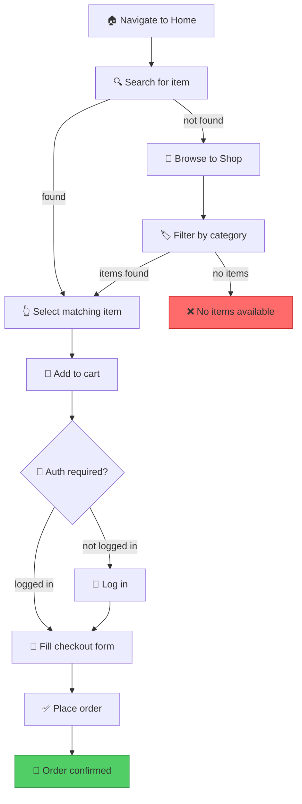
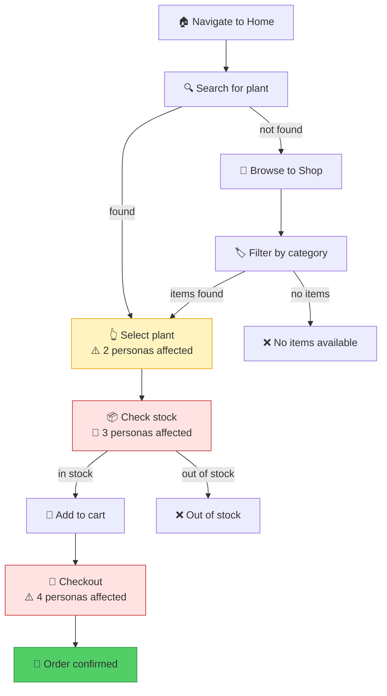
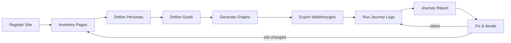

# Site Walkthrough

Model websites as structured YAML inventories and generate directed task-flow graphs that validate whether users can accomplish goals — with conditional branching, fallback paths, and completion criteria.

## Overview

Combines site inventory management with goal-directed task analysis. It provides:

- **Site registry** — YAML-based site inventories under `.npl/sites/{domain}/` capturing pages, elements, navigation, and affordances
- **Task-flow graphs** — Directed graphs modeling user goals as sequences of actions with success/failure/conditional edges
- **Walkthrough generation** — Executable Mermaid/script output for each task flow, suitable for manual QA or automated testing
- **Conditional branching** — "If X not found, do Y" fallback logic built into every graph
- **Completion validation** — Each flow defines what "done" looks like and how to verify it
- **Journey logs** — Persona-driven observation journals that capture how different users *experience* each step — performance, accessibility, cognitive load, emotional friction

## Core Philosophy

**Four Principles:**

1. **Sites are data, not prose** — Capture site structure as machine-readable YAML, not descriptions; this enables graph generation and diffing across versions
2. **Goals drive graphs** — Every task flow starts from a user goal ("buy a ticket," "find the FAQ"), not from a page inventory; the graph is goal-directed, not sitemap-directed
3. **Failure paths are first-class** — A walkthrough that only models the happy path is incomplete; every decision node must have a fallback edge
4. **Executable over decorative** — Graphs should be runnable (as manual checklists, Playwright scripts, or Cypress flows), not just pretty diagrams
5. **Many eyes, many truths** — A sighted power-user and a screen-reader user experience the same page differently; journey logs capture these divergent realities through persona lenses

## When to Use This Skill

- **Inventorying a new site** — Register a site's pages, elements, and navigation in structured YAML
- **Defining user goals** — Break a goal ("donate to the org") into a directed task-flow graph
- **Generating QA walkthroughs** — Produce step-by-step scripts a tester can follow
- **Auditing task completability** — Check whether all critical user goals have viable paths through the site
- **Comparing site versions** — Diff two YAML snapshots to find broken paths after a redesign
- **Onboarding QA testers** — Generate visual Mermaid graphs that show exactly what to test
- **Running persona-driven journey logs** — Simulate how different users (low-vision, non-technical, slow connection, screen reader, etc.) experience a walkthrough and capture observations
- **Accessibility & usability auditing** — Surface issues that only appear through specific user lenses

> For automated browser testing implementation, see **verify** skill.
> For site SEO and discoverability audits, see **seo-guru** skill.
> For UX design and interface evaluation, see **user-experience-engineer** skill.

## Site Registry Format

Sites are stored under `.npl/sites/{domain}/`:

```
.npl/sites/
├── example.com/
│   ├── site.yaml          # Site metadata + global nav
│   ├── personas.yaml      # Persona lenses for journey logs
│   ├── pages/
│   │   ├── home.yaml      # Page inventory: elements, actions, links
│   │   ├── shop.yaml
│   │   └── checkout.yaml
│   ├── goals/
│   │   ├── purchase-item.yaml    # Task-flow graph definition
│   │   └── find-support.yaml
│   ├── walkthroughs/
│   │   ├── purchase-item.md      # Generated walkthrough script
│   │   └── find-support.md
│   ├── issues.yaml           # Issue tracker across all goals
│   └── journeys/
│       ├── _cross-persona/
│       │   └── {run-id}/           # Fingerprinted run
│       │       ├── summary.md      # Cross-persona matrix + heatmap
│       │       ├── manifest.yaml   # Run metadata
│       │       └── assets/         # Screenshots, captured HTML
│       ├── maria-low-vision/
│       │   └── {run-id}/
│       │       ├── user-journey.md # Media-rich step-by-step
│       │       ├── manifest.yaml
│       │       └── assets/         # Screenshots, diagrams
│       └── dave-senior/
│           └── {run-id}/
│               ├── user-journey.md
│               ├── manifest.yaml
│               └── assets/
└── another-site.org/
    └── ...
```

### Run Fingerprinting

Every journey run gets a unique fingerprint: `{YYYYMMDD}-{HHmmss}-{4-char-hash}`

The hash is the first 4 characters of a SHA-256 of `goal + persona + timestamp`, ensuring uniqueness even for same-day re-runs.

Example: `20260528-143022-a7b3`

This enables:
- **Before/after comparison** — diff two run folders by ID
- **Trend analysis** — list runs chronologically per persona
- **Regression detection** — compare manifest severity_counts across runs

### site.yaml

```yaml
domain: example.com
name: Example Store
base_url: https://example.com
last_audited: 2026-05-28
tags: [ecommerce, b2c]

global_nav:
  - label: Home
    page: home
  - label: Shop
    page: shop
  - label: Cart
    page: cart
  - label: Support
    page: support

auth:
  login_page: login
  requires_auth_pages: [checkout, account]
```

### Page YAML (pages/*.yaml)

```yaml
page: shop
url_pattern: /shop
title: Shop — Browse Products
requires_auth: false

elements:
  - id: search-bar
    type: input
    selector: "#product-search"
    description: Product search field
    actions: [type, submit]

  - id: product-grid
    type: container
    selector: ".product-grid"
    description: Grid of product cards
    children:
      - id: product-card
        type: repeating
        selector: ".product-card"
        actions: [click]
        leads_to: product-detail

  - id: filter-sidebar
    type: container
    selector: ".filters"
    actions: [click, select]
    description: Category and price filters

  - id: pagination
    type: navigation
    selector: ".pagination"
    actions: [click]
    leads_to: shop  # self-referential

affordances:
  - search products by keyword
  - filter by category
  - filter by price range
  - browse paginated results
  - click product to view details

exit_points:
  - page: product-detail
    via: product-card click
  - page: cart
    via: global nav
  - page: home
    via: global nav
```

### Goal YAML (goals/*.yaml)

```yaml
goal: purchase-item
description: User wants to find and purchase a specific item
preconditions:
  - site is accessible
  - user has payment method
success_criteria:
  - order confirmation page displayed
  - confirmation email reference shown
estimated_steps: 6-10

flow:
  - id: start
    action: navigate
    target: home
    next: find-item

  - id: find-item
    action: search
    target: search-bar
    input: "{search_term}"
    on_success: select-item
    on_failure: browse-fallback
    note: "If search returns no results, fall back to browsing"

  - id: browse-fallback
    action: navigate
    target: shop
    next: browse-categories

  - id: browse-categories
    action: interact
    target: filter-sidebar
    input: "select category: {category}"
    next: select-item
    on_failure: escalate-no-items
    note: "Filter to relevant category and scan results"

  - id: escalate-no-items
    action: terminal
    result: failure
    reason: "No items found via search or browse"

  - id: select-item
    action: click
    target: product-card
    criteria: "matches {search_term}"
    next: add-to-cart

  - id: add-to-cart
    action: click
    target: add-to-cart-button
    next: go-to-checkout

  - id: go-to-checkout
    action: navigate
    target: checkout
    requires_auth: true
    auth_redirect: login
    next: complete-purchase

  - id: complete-purchase
    action: form-fill
    target: checkout-form
    fields:
      - payment_method
      - shipping_address
    next: confirm

  - id: confirm
    action: click
    target: place-order-button
    next: done

  - id: done
    action: terminal
    result: success
    verify: "Order confirmation visible"

variables:
  search_term:
    description: "What the user is looking for"
    example: "red running shoes"
  category:
    description: "Fallback browse category"
    example: "Footwear"
```

## Task-Flow Graph Generation

### Mermaid Output

From the goal YAML above, the skill generates:



### Walkthrough Script Output

Generated into `walkthroughs/` as Markdown checklists:

```markdown
# Walkthrough: Purchase Item

**Goal:** Find and purchase a specific item
**Estimated steps:** 6-10
**Variables:** search_term = "red running shoes", category = "Footwear"

## Preconditions
- [ ] Site is accessible at https://example.com
- [ ] User has a payment method available

## Steps

### 1. Navigate to Home
- [ ] Go to https://example.com
- [ ] Verify home page loads

### 2. Search for Item
- [ ] Locate search bar (#product-search)
- [ ] Type "red running shoes"
- [ ] Submit search
- **If results found:** → Step 4 (Select Item)
- **If no results:** → Step 3 (Browse Fallback)

### 3. Browse Fallback
- [ ] Navigate to /shop
- [ ] Open filter sidebar
- [ ] Select category: "Footwear"
- **If items found:** → Step 4
- **If no items:** → ❌ FAIL — No items available

### 4. Select Item
- [ ] Find product card matching "red running shoes"
- [ ] Click to view details

### 5. Add to Cart
- [ ] Click "Add to Cart" button
- [ ] Verify cart updated

### 6. Checkout
- [ ] Navigate to checkout
- [ ] If not logged in: complete login flow
- [ ] Fill payment method
- [ ] Fill shipping address

### 7. Place Order
- [ ] Click "Place Order"
- [ ] Verify order confirmation page
- [ ] Verify confirmation reference number visible

## Success Criteria
- [ ] Order confirmation page displayed
- [ ] Confirmation email reference shown
```

## Journey Logs (Persona-Driven Observations)

Journey logs capture *what it feels like* to complete a task from different user perspectives. Where walkthroughs verify that a path **exists**, journey logs reveal whether that path **works for real humans**.

### Persona Lenses

Each site defines persona lenses in `personas.yaml`. A lens is NOT a full user persona — it's a **constraint filter** that colors how every step is experienced.

#### personas.yaml

```yaml
personas:
  - id: maria-low-vision
    name: Maria
    label: Low Vision User
    lens: visual-accessibility
    constraints:
      - color blind (deuteranopia — red/green)
      - relies on high contrast and large text
      - uses browser zoom at 150%
    watches_for:
      - color-only indicators (red/green without icons or text)
      - small click targets (< 44px)
      - low contrast text (< 4.5:1 ratio)
      - text in images without alt text
      - hover-only tooltips
    frustration_triggers:
      - "I can't tell if this is an error or success — both look the same"
      - "The button is too small to click accurately at my zoom level"

  - id: dave-senior
    name: Dave
    label: Non-Technical Senior
    lens: cognitive-simplicity
    constraints:
      - not comfortable with technology
      - reads slowly, easily overwhelmed by options
      - doesn't understand jargon (cart, checkout, SKU)
    watches_for:
      - jargon or unexplained acronyms
      - too many choices on one page (> 5 options)
      - unclear next steps ("what do I do now?")
      - small or faint text
      - multi-step processes without progress indicators
    frustration_triggers:
      - "There are too many buttons, I don't know which one to press"
      - "What does 'proceed to checkout' mean? I just want to buy this"

  - id: alex-screen-reader
    name: Alex
    label: Screen Reader User
    lens: assistive-technology
    constraints:
      - blind, uses NVDA/VoiceOver
      - navigates by headings, landmarks, and tab order
      - cannot see layout, images, or visual hierarchy
    watches_for:
      - missing ARIA labels on interactive elements
      - images without alt text
      - focus traps (modals that can't be escaped)
      - dynamic content that doesn't announce itself
      - forms without associated labels
    frustration_triggers:
      - "Button says 'click here' — click where? For what?"
      - "Something changed on the page but I have no idea what"

  - id: priya-slow-connection
    name: Priya
    label: Slow Connection User
    lens: performance
    constraints:
      - 3G connection (~1.5 Mbps)
      - older Android phone
      - limited data plan
    watches_for:
      - large images without lazy loading
      - JavaScript-heavy interactions
      - pages > 2MB total weight
      - spinners without timeout/fallback
      - actions that require multiple round trips
    frustration_triggers:
      - "The page has been loading for 15 seconds and I see nothing"
      - "I tapped the button but nothing happened — did it work?"

  - id: kai-power-user
    name: Kai
    label: Power User
    lens: efficiency
    constraints:
      - uses keyboard shortcuts exclusively
      - expects instant responses
      - has used the site many times before
    watches_for:
      - lack of keyboard navigation
      - no skip-to-content links
      - forced mouse interactions
      - unnecessary confirmation dialogs
      - no way to bookmark or deep-link to mid-flow states
    frustration_triggers:
      - "I have to click through 5 pages when I could type the URL directly"
      - "Tab order makes no sense — I'm jumping all over the page"
```

### Journey Log Format

Each journey run produces a **fingerprinted report folder** with media-rich content. Reports are visual documents — not just text checklists. Every report MUST include embedded mermaid diagrams for flow visualization, heatmaps, severity charts, and comparative diagrams.

#### Report folder: `journeys/{persona-id}/{run-id}/`

Each run folder contains:

| File | Purpose |
|------|---------|
| `user-journey.md` | Media-rich step-by-step observations with embedded mermaid diagrams and screenshots |
| `manifest.yaml` | Machine-readable run metadata for programmatic diffing |
| `assets/` | Screenshots, captured HTML snippets, annotated images, exported diagrams |

#### manifest.yaml

```yaml
run_id: "20260528-143022-a7b3"
date: 2026-05-28
goal: purchase-plant
site: greenthumb.shop
persona:
  id: maria-low-vision
  name: Maria
  label: Low Vision User
  lens: visual-accessibility
verdict: completable-with-difficulty
severity_counts:
  critical: 1
  high: 1
  medium: 2
  low: 0
issues_found:
  - ISS-001
  - ISS-002
files:
  - user-journey.md
  - manifest.yaml
  - assets/step1-home-loaded.png
  - assets/step2-search-results.png
  - assets/step3-sale-badge.png
  - assets/step4-stock-status.png
  - assets/step5-cart-added.png
  - assets/step6-checkout-form.png
```

#### user-journey.md — Media-Rich Format

Journey logs MUST be **media-rich visual reports**, not plain text checklists. Every log must include:

1. **Metadata table** at the top (Run ID, date, goal, persona, verdict)
2. **Flow visualization** — mermaid graph showing step outcomes color-coded by severity
3. **Per-step diagrams** — mermaid showing what the persona sees/experiences at key steps
4. **Issue tables** per step (not just bullet points)
5. **Severity pie chart** — mermaid pie showing issue distribution
6. **Screenshots on EVERY page change or major event** (see screenshot rules below)
7. **Timestamps on every step** — wall-clock time when each step was observed

```markdown
# User Journey: Purchase Plant

| Field | Value |
|-------|-------|
| **Run ID** | `20260528-143022-a7b3` |
| **Date** | 2026-05-28 |
| **Goal** | `purchase-plant` |
| **Persona** | Maria — Low Vision (Deuteranopia) |
| **Overall Verdict** | :warning: Completable with difficulty |

---

## Flow Visualization

​```mermaid
graph TD
    S1["Step 1: Navigate<br/>✅ OK"] --> S2["Step 2: Search<br/>✅ OK"]
    S2 --> S3["Step 3: Select<br/>⚠️ Friction"]
    S3 --> S4["Step 4: Stock<br/>🔴 Blocked"]
    S4 --> S5["Step 5: Add to Cart<br/>✅ OK"]
    S5 --> S6["Step 6: Checkout<br/>⚠️ Friction"]

    style S3 fill:#fff3bf,stroke:#f59f00
    style S4 fill:#ffe3e3,stroke:#c92a2a
    style S6 fill:#fff3bf,stroke:#f59f00
​```

## Step 3: Select plant :arrow_right: ⚠️ Friction
**`[14:32:18 UTC]`**

**What Maria sees:**

​```mermaid
graph LR
    subgraph "Product Cards — Color Problem"
        CARD1["Product A<br/>🟢 green badge"]
        CARD2["Product B<br/>🔴 red SALE badge"]
        PROBLEM["Maria cannot<br/>distinguish these"]
    end
    CARD1 -.->|"same to Maria"| PROBLEM
    CARD2 -.->|"same to Maria"| PROBLEM
​```


<!-- If screenshot not captured: [Screenshot pending — assets/step3-sale-badge.png] -->

**Issues:**

| ID | Severity | Issue | Recommendation |
|----|----------|-------|----------------|
| ISS-002 | :red_circle: High | Sale badge red-on-green, invisible to deuteranopia | Add text "SALE" alongside color |

## Severity Summary

​```mermaid
pie title Issue Severity — Maria
    "Critical" : 1
    "High" : 1
    "Medium" : 2
​```
```

#### Screenshot Rules — MANDATORY

A screenshot **MUST** be captured and saved to `assets/` for every:

- **Page navigation** — landing on a new page (home, search results, profile, checkout, etc.)
- **Modal or popup** — any overlay, dialog, dropdown, or toast that appears
- **Form submission** — before and after submitting a form
- **State change** — adding to cart, completing a step, error appearing
- **Error state** — any validation error, payment failure, or broken layout
- **Issue evidence** — every issue flagged (ISS-NNN) must have a corresponding screenshot

Screenshots are saved as: `assets/step{N}-{description}.png`

In the `user-journey.md`, every screenshot MUST be referenced in one of two ways:

- **Inline (full display):** `` — use for primary evidence
- **Link (click to view):** `[Step 3 screenshot → assets/step3-sale-badge.png](assets/step3-sale-badge.png)` — use when inline would bloat the report

If a screenshot cannot be captured (e.g., simulating without browser access), leave a placeholder:
`<!-- Screenshot pending — assets/step{N}-{description}.png -->`

#### Timestamp Rules — MANDATORY

Every step in the `user-journey.md` MUST include a wall-clock timestamp showing when that step was observed:

- Format: **`[HH:MM:SS UTC]`** immediately after the step heading
- Captured at the moment the step is executed/observed during the walkthrough
- Enables timing analysis (which steps are slow, where users get stuck)

Example:
```markdown
### Step 5: Add to Cart :arrow_right: ✅ OK
**`[14:35:42 UTC]`**
```

#### assets/ Subfolder

The `assets/` folder in each run stores:

| Asset Type | Naming Convention | Purpose |
|------------|-------------------|---------|
| Screenshots | `step{N}-{description}.png` | Visual evidence — **required** for every page change and major event |
| HTML snippets | `step{N}-{element}.html` | Captured DOM for reference |
| Annotated images | `step{N}-{description}-annotated.png` | Screenshots with callouts/arrows highlighting issues |
| Exported diagrams | `{diagram-name}.svg` | Standalone diagram exports |
| Accessibility audits | `axe-report.json` | Automated a11y scan results |

Screenshots MUST be captured via the **verify** skill (browser automation) or manually. Reports without screenshots for page transitions are considered **incomplete**.

### Severity Scale

| Level | Icon | Meaning | Action |
|-------|------|---------|--------|
| Critical | 🔴 | Blocks task completion for this persona | Must fix |
| High | 🔴 | Causes wrong decisions or major confusion | Should fix |
| Medium | 🟡 | Causes friction or slows the user down | Plan fix |
| Low | 🟢 | Minor annoyance, cosmetic | Nice to fix |
| OK | ✅ | No issues from this persona's lens | — |

### Running a Journey

```
/site-walkthrough journey greenthumb.shop purchase-plant
```

Generates a **fingerprinted run** for each persona defined in `personas.yaml`. Each run creates a versioned report folder:

```
journeys/
├── maria-low-vision/20260528-143022-a7b3/
│   ├── user-journey.md      # Media-rich observations
│   ├── manifest.yaml       # Machine-readable metadata
│   └── assets/             # Screenshots, HTML captures
├── dave-senior/20260528-143022-a7b3/
│   └── ...
└── _cross-persona/20260528-143022-a7b3/
    ├── summary.md           # Cross-persona matrix + heatmaps
    ├── manifest.yaml
    └── assets/
```

To run for a specific persona only:
```
/site-walkthrough journey greenthumb.shop purchase-plant --persona maria-low-vision
```

All runs share the same fingerprint when triggered together. The cross-persona summary is auto-generated in `_cross-persona/`.

### Journey Summary Report

The cross-persona summary at `_cross-persona/{run-id}/summary.md` is a **media-rich visual report** containing:

1. **Verdict dashboard** — mermaid graph showing all persona outcomes at a glance
2. **Cross-persona issue matrix** — table of steps × personas with severity icons
3. **Heatmap** — mermaid graph overlaying issue counts on the task-flow
4. **Severity pie chart** — total issues across all personas
5. **Issue ownership diagram** — which personas found what
6. **Top 5 fixes** — each with a mermaid flowchart showing impact + effort
7. **WCAG compliance summary** — if accessibility personas were included
8. **Deferred fixes table** — medium-priority items for backlog
9. **Run metadata** — links to each persona's individual report

To regenerate from existing persona reports:
```
/site-walkthrough journey-report greenthumb.shop purchase-plant
```

## Issue Tracker

Issues found across journey logs are tracked in `issues.yaml` at the site root. This prevents issues from getting lost between runs and enables before/after comparison.

### issues.yaml

```yaml
issues:
  - id: ISS-001
    found: 2026-05-28
    goal: purchase-plant
    step: check-stock
    severity: critical
    summary: "Stock status uses color-only indicators (green/red dots)"
    personas_affected: [maria-low-vision, alex-screen-reader]
    recommendation: "Add text labels alongside color dots"
    status: open  # open | fixed | wontfix | deferred
    fixed_in: null  # date when fix was deployed
    verified: null  # date when retest confirmed fix

  - id: ISS-002
    found: 2026-05-28
    goal: purchase-plant
    step: select-plant
    severity: high
    summary: "Sale badge is red-on-green, invisible to deuteranopia users"
    personas_affected: [maria-low-vision]
    recommendation: "Add text label 'SALE' or icon alongside color badge"
    status: fixed
    fixed_in: 2026-06-01
    verified: null  # needs retest
```

### Retest & Diff

After fixing issues, re-run journeys. The versioned fingerprint system means old runs are preserved — no archiving needed.

```
/site-walkthrough retest greenthumb.shop purchase-plant
```

This:
1. Creates a **new fingerprinted run** (e.g., `20260605-091500-c4d2`) alongside the original
2. Re-runs all personas through the goal
3. Compares new `manifest.yaml` severity_counts against the previous run
4. Updates `issues.yaml`: marks verified fixes, flags regressions
5. Produces a diff report in the new run's `_cross-persona/{new-run-id}/`:

```markdown
# Retest Report: Purchase Plant
**Previous run:** `20260528-143022-a7b3`
**Current run:** `20260605-091500-c4d2`

## Resolved
- ✅ ISS-002: Sale badge now has text label (Maria: Step 3 ⚠️→✅)

## Still Open
- 🔴 ISS-001: Stock status still color-only (Maria: Step 4 still 🔴)

## Regressions
- ⚠️ NEW: Checkout form added CAPTCHA with no audio alternative
  (Alex: Step 6 ✅→🔴, new issue)

## Score Change
- Before: 4 critical, 6 medium, 2 low
- After:  3 critical (+1 new), 5 medium, 2 low
- Net: -1 critical (1 fixed, 1 new regression)
```

To compare specific runs:
```
/site-walkthrough diff greenthumb.shop purchase-plant 20260528-143022-a7b3 20260605-091500-c4d2
```

## Heatmap Annotation

The generated Mermaid graph can be annotated with journey data to show issue hotspots:

```
/site-walkthrough heatmap greenthumb.shop purchase-plant
```

Overlays persona failure counts onto the task-flow graph:



Nodes colored by worst severity across all personas: red = critical, yellow = medium, green = clean.

## Workflow



| Phase | Action | Input | Output |
|-------|--------|-------|--------|
| 1. Register | Create `site.yaml` | Domain, name, base URL | `.npl/sites/{domain}/site.yaml` |
| 2. Inventory | Create page YAMLs | Site exploration / sitemap | `pages/*.yaml` |
| 3. Personas | Define persona lenses | Audience knowledge | `personas.yaml` |
| 4. Define Goals | Write goal flows | User stories / requirements | `goals/*.yaml` |
| 5. Generate | Produce graphs + scripts | Goal YAMLs + page YAMLs | Mermaid diagrams + walkthrough `.md` |
| 6. Journey | Run persona walkthroughs | Walkthroughs + personas | `journeys/{persona}/{run-id}/` |
| 7. Report | Cross-persona summary | All persona reports for a run | `journeys/_cross-persona/{run-id}/` |
| 8. Iterate | Fix issues, retest | Journey report | New fingerprinted run → compare with previous |

## Commands

### Register a Site
```
/site-walkthrough register example.com
```
Creates the directory structure and starter `site.yaml`.

### Inventory a Page
```
/site-walkthrough inventory example.com /shop
```
Fetches the page (if accessible) and generates a `pages/shop.yaml` with detected elements.

### Define a Goal
```
/site-walkthrough goal example.com "purchase an item"
```
Interactive: walks through defining the flow steps, branching, and success criteria.

### Generate Walkthroughs
```
/site-walkthrough generate example.com
```
Reads all goals, cross-references page inventories, produces Mermaid graphs and walkthrough scripts.

### Audit Coverage
```
/site-walkthrough audit example.com
```
Reports which pages are reachable, which have no goals touching them, and which goals reference missing elements.

### Run Journey Logs
```
/site-walkthrough journey example.com purchase-item
```
Creates a fingerprinted run under `journeys/{persona}/{run-id}/` for each persona, plus a cross-persona summary. Reports are **media-rich** with mermaid diagrams, heatmaps, severity charts, and an `assets/` folder for screenshots.

```
/site-walkthrough journey example.com purchase-item --persona maria-low-vision
```
Single-persona run.

### Journey Report
```
/site-walkthrough journey-report example.com purchase-item
```
Cross-persona issue matrix with prioritized fix recommendations. Output: `journeys/_cross-persona/{run-id}/summary.md`.

### Retest After Fixes
```
/site-walkthrough retest example.com purchase-item
```
Creates a new fingerprinted run, diffs against the most recent previous run, updates `issues.yaml`.

### Diff Runs
```
/site-walkthrough diff example.com purchase-item {run-id-1} {run-id-2}
```
Compare two specific fingerprinted runs by their manifest severity_counts and issue lists.

### Heatmap
```
/site-walkthrough heatmap example.com purchase-item
```
Annotates the task-flow Mermaid graph with per-step persona failure counts from the latest run.

### Issue Trend
```
/site-walkthrough trend example.com purchase-item
```
Shows issue count over time by reading `manifest.yaml` files across all fingerprinted runs — charts improvement or regression.

## Quick Start Guides

### New Site from Scratch
1. `/site-walkthrough register mysite.com` — creates directory structure
2. Explore the site manually or provide a sitemap
3. `/site-walkthrough inventory mysite.com /` — inventory the home page
4. Repeat for key pages
5. `/site-walkthrough goal mysite.com "sign up for newsletter"` — define first goal
6. `/site-walkthrough generate mysite.com` — produce graphs and walkthroughs

### Import from User Stories
1. If you have user stories in `project-management/user-stories/`, provide them
2. The skill maps each story to one or more goal YAMLs
3. Page inventories are inferred from goal steps (with TODOs for manual verification)
4. Generate walkthroughs in batch

### Run Journey Logs for a Site
1. Define personas in `.npl/sites/mysite.com/personas.yaml` (or use the template)
2. `/site-walkthrough journey mysite.com sign-up-flow` — creates fingerprinted run for all personas
3. Review media-rich reports in `journeys/{persona}/{run-id}/user-journey.md`
4. Review cross-persona summary in `journeys/_cross-persona/{run-id}/summary.md`
5. Fix the top-priority issues
6. `/site-walkthrough retest mysite.com sign-up-flow` — new fingerprinted run, auto-diff against previous

### Audit an Existing Site Registry
1. `/site-walkthrough audit mysite.com`
2. Review coverage gaps: unreachable pages, goalless pages, broken element references
3. Update page YAMLs and goal flows
4. Regenerate

## Reference Guide

### When to Read Each Reference

| Task | Read These |
|------|-----------|
| **Understanding the approach** | `task-flow-theory.md` |
| **Writing good page inventories** | `page-inventory-guide.md` |
| **Designing goal flows** | `goal-flow-patterns.md` |
| **Agent execution workflows** | `agent-playbook.claude-code.md` |
| **Defining persona lenses** | `persona-lenses.md` |
| **Retesting and diffing** | `retest-workflow.md` |
| **Full worked example** | `worked-example-ecommerce.md` |

All reference paths are relative to `references/`.

## Related Skills

- **verify** — Execute walkthroughs in a real browser to validate changes work
- **seo-guru** — Audit site discoverability and search engine optimization
- **user-experience-engineer** — Design and evaluate user interfaces and interaction patterns
- **kubernetes-engineer** — Deploy and manage the infrastructure hosting these sites

## Bundled Resources

### References
- [agent-playbook.claude-code.md](references/agent-playbook.claude-code.md) — Agent role definition and execution workflows
- [task-flow-theory.md](references/task-flow-theory.md) — Background on GDTA, cognitive walkthroughs, and task analysis methods
- [page-inventory-guide.md](references/page-inventory-guide.md) — How to write thorough page inventories with element types and selectors
- [goal-flow-patterns.md](references/goal-flow-patterns.md) — Common patterns for branching, loops, auth gates, and error recovery in goal flows
- [persona-lenses.md](references/persona-lenses.md) — How to define persona lenses, built-in lens catalog, writing good observations
- [retest-workflow.md](references/retest-workflow.md) — Before/after comparison, issue lifecycle, regression detection
- [worked-example-ecommerce.md](references/worked-example-ecommerce.md) — Full end-to-end example: registering an ecommerce site, inventorying pages, defining 3 goals, generating walkthroughs

### Assets
- [project-tracker.md](assets/project-tracker.md) — Progress tracking for site walkthrough projects
- [site-yaml-template.yaml](assets/site-yaml-template.yaml) — Starter template for site.yaml
- [page-yaml-template.yaml](assets/page-yaml-template.yaml) — Starter template for page inventories
- [goal-yaml-template.yaml](assets/goal-yaml-template.yaml) — Starter template for goal flows
- [personas-yaml-template.yaml](assets/personas-yaml-template.yaml) — Starter template for persona lenses
- [user-journey-template.md](assets/user-journey-template.md) — Template for media-rich user journey reports (versioned format with screenshots and timestamps)
- [manifest-template.yaml](assets/manifest-template.yaml) — Template for run manifest metadata
- [issues-yaml-template.yaml](assets/issues-yaml-template.yaml) — Starter template for issue tracker
