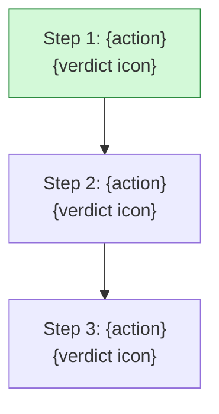
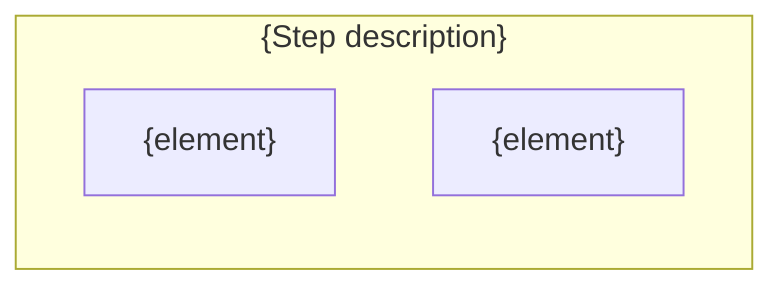
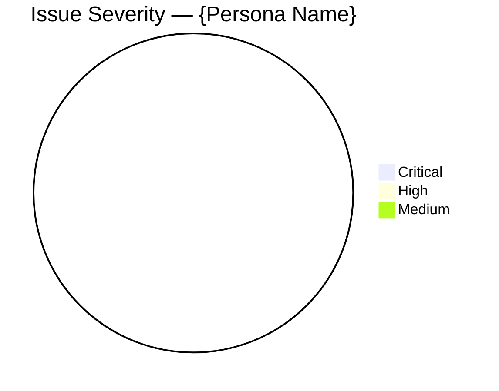

# Journey Log: {Goal Name}

| Field | Value |
|-------|-------|
| **Run ID** | `{run-id}` |
| **Date** | {YYYY-MM-DD} |
| **Goal** | `{goal-slug}` |
| **Site** | {domain} |
| **Persona** | {Name} — {Label} |
| **Lens** | {lens-type} |
| **Overall Verdict** | {verdict with icon} |

---

## Persona Constraints

- {constraint 1}
- {constraint 2}
- Watches for: {watch items}

---

## Flow Visualization

---

## Step-by-Step Observations

### Step 1: {Action} :arrow_right: {verdict icon} {verdict}

**What {persona name} sees:**

**Observation:** {what the persona experiences through their lens}

**Issues:**

| ID | Severity | Issue | Recommendation |
|----|----------|-------|----------------|
| ISS-{N} | {icon} {level} | {description} | {fix} |

---

<!-- Repeat for each step -->

---

## Severity Summary

| Severity | Count | Steps Affected |
|----------|-------|---------------|
| :red_circle: Critical | 0 | — |
| :red_circle: High | 0 | — |
| :yellow_circle: Medium | 0 | — |
| :green_circle: Low | 0 | — |

---

## Verdict

**Completion:** {can/cannot complete, with what difficulty}

**Top fix:** {single most impactful recommendation}
