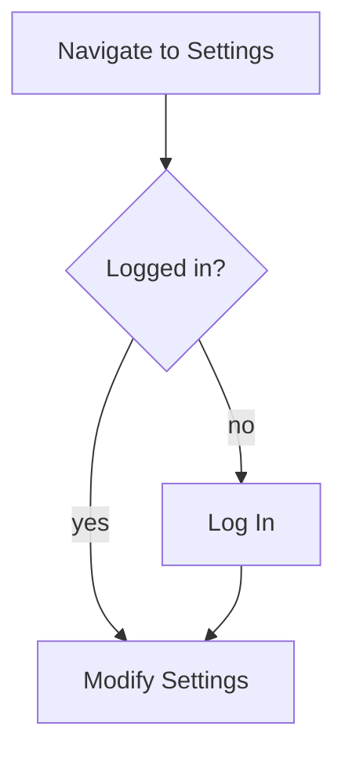
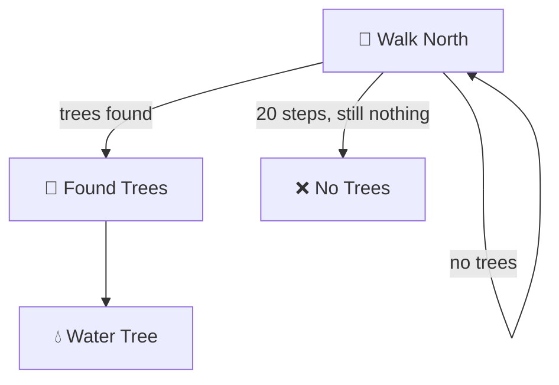

# Goal Flow Patterns

Common patterns for building robust task-flow graphs.

## Pattern 1: Search-with-Fallback

The most common pattern: try the fast path first, fall back to browsing.

```yaml
- id: search
  action: search
  target: search-bar
  input: "{query}"
  on_success: use-result
  on_failure: browse-fallback

- id: browse-fallback
  action: navigate
  target: category-page
  next: scan-listings
```

**When to use:** Any goal where the user is looking for something specific but might not find it via search.

## Pattern 2: Auth Gate

Insert authentication when a page requires login.

```yaml
- id: go-to-protected
  action: navigate
  target: account-settings
  requires_auth: true
  auth_redirect: login
  next: modify-settings
```

The generator expands this into a decision diamond:



**When to use:** Any step that targets a page with `requires_auth: true`.

## Pattern 3: Retry Loop

For actions that may fail transiently (network, CAPTCHAs, etc.).

```yaml
- id: submit-form
  action: submit
  target: payment-form
  on_success: confirmation
  on_failure: retry-submit
  max_retries: 3
  on_max_retries: report-error

- id: retry-submit
  action: verify
  target: error-message
  note: "Check error, correct fields, resubmit"
  next: submit-form
```

**When to use:** Form submissions, API-dependent actions, payment processing.

## Pattern 4: Conditional Branch (State-Dependent)

Different paths based on site state the user can observe.

```yaml
- id: check-stock
  action: observe
  target: stock-indicator
  conditions:
    - value: "In Stock"
      next: add-to-cart
    - value: "Out of Stock"
      next: notify-me
    - value: "Pre-order"
      next: pre-order-flow
```

**When to use:** When the same page leads to different flows depending on displayed state.

## Pattern 5: Walk-Until (Exploration Loop)

The user repeats an action until a condition is met. Your "find a tree" pattern.

```yaml
- id: walk-north
  action: navigate
  target: north
  repeat_until: "trees visible in viewport"
  on_success: found-trees
  on_failure: walk-north
  max_iterations: 20
  on_max: no-trees-found

- id: found-trees
  action: interact
  target: tree
  next: water-tree

- id: no-trees-found
  action: terminal
  result: failure
  reason: "Walked 20 steps north, no trees found"
```

The Mermaid output shows this as a self-referencing loop with a break condition:



**When to use:** Exploration-based goals, pagination scanning, scrolling to find content.

## Pattern 6: Multi-Step Form (Wizard)

Sequential form pages where you can't skip ahead.

```yaml
- id: step-1-personal
  action: form-fill
  target: personal-info-form
  fields: [name, email, phone]
  next: step-2-address

- id: step-2-address
  action: form-fill
  target: address-form
  fields: [street, city, state, zip]
  next: step-3-payment

- id: step-3-payment
  action: form-fill
  target: payment-form
  fields: [card_number, expiry, cvv]
  next: review
```

**When to use:** Checkout flows, registration wizards, multi-page applications.

## Pattern 7: Fork-and-Merge

User takes one of multiple paths that all converge at the same point.

```yaml
- id: choose-method
  action: observe
  target: payment-options
  conditions:
    - value: "credit card"
      next: cc-flow
    - value: "paypal"
      next: paypal-flow
    - value: "apple pay"
      next: applepay-flow

- id: cc-flow
  action: form-fill
  target: cc-form
  next: order-review

- id: paypal-flow
  action: redirect
  target: paypal-external
  next: order-review

- id: applepay-flow
  action: click
  target: applepay-button
  next: order-review

- id: order-review
  action: verify
  target: order-summary
  next: place-order
```

**When to use:** Payment selection, shipping method, any "choose your adventure" point.

## Pattern 8: Error Recovery

Handle error states gracefully.

```yaml
- id: submit
  action: click
  target: submit-button
  on_success: success-page
  on_failure: check-error

- id: check-error
  action: observe
  target: error-banner
  conditions:
    - value: "validation error"
      next: fix-validation
    - value: "server error"
      next: retry-later
    - value: "session expired"
      next: re-login

- id: fix-validation
  action: form-fill
  target: highlighted-fields
  note: "Correct the fields marked in red"
  next: submit

- id: retry-later
  action: terminal
  result: blocked
  reason: "Server error — retry after delay"

- id: re-login
  action: navigate
  target: login
  next: submit
```

**When to use:** Any form submission or action that can fail in multiple distinct ways.

## Composing Patterns

Patterns compose naturally. A real goal flow typically combines 3-5 patterns:

1. **Search-with-fallback** to find the item
2. **Conditional branch** to check availability
3. **Auth gate** at checkout
4. **Multi-step form** for payment
5. **Error recovery** for submission failures

The goal YAML just chains these together — the generator handles the Mermaid and walkthrough output.

## Anti-Patterns

| Anti-Pattern | Problem | Fix |
|-------------|---------|-----|
| **Happy-path only** | No failure edges | Add `on_failure` to every decision |
| **Missing terminal** | Flow has dead ends | Every path must reach `result: success` or `result: failure` |
| **Phantom elements** | References elements not in page YAML | Run `/site-walkthrough audit` to find broken refs |
| **Infinite loops** | Self-edges without `max_iterations` | Always set `max_iterations` + `on_max` |
| **Vague actions** | "Do the thing" | Use specific action types: click, type, navigate, observe |
