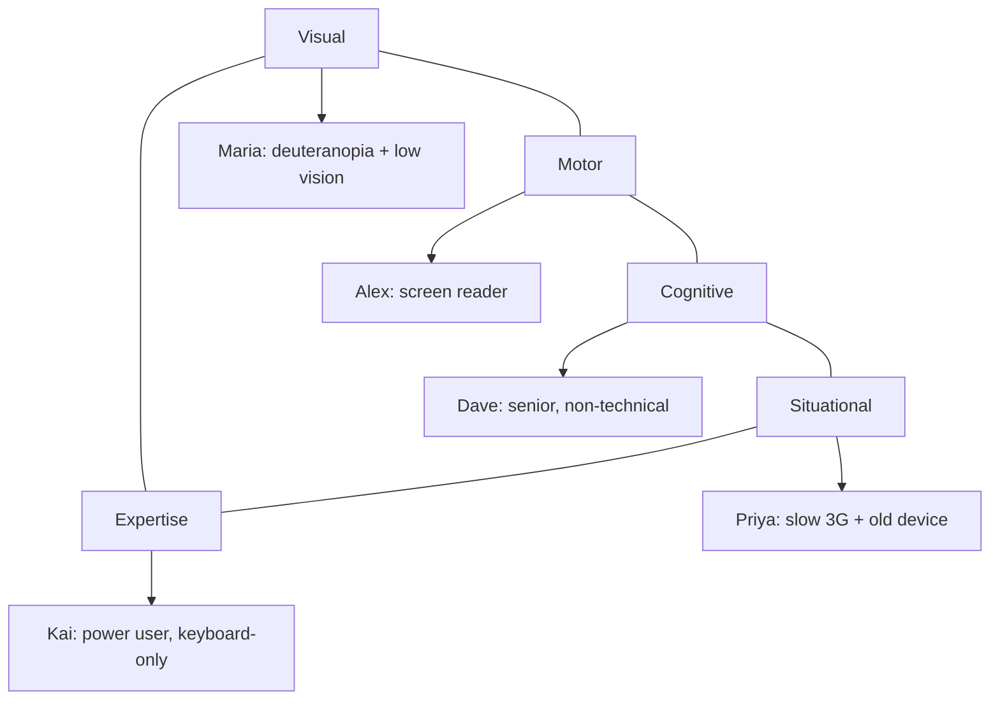

# Persona Lenses

How to define persona lenses for journey logs and write observations that produce actionable findings.

## What is a Persona Lens?

A persona lens is NOT a marketing persona ("Sarah, 34, lives in Portland, loves yoga"). It's a **constraint filter** — a set of specific limitations, needs, or behaviors that change how a user experiences each step of a walkthrough.

The lens determines:
- **What the persona watches for** at each step
- **What triggers frustration** vs. what's fine
- **What severity to assign** when something fails their lens

## Built-In Lens Categories

### Visual Accessibility Lenses

| Lens ID | Condition | Key Watches |
|---------|-----------|-------------|
| `deuteranopia` | Red-green color blindness | Color-only indicators, red/green UI states |
| `protanopia` | Red color blindness | Red warnings, red buttons, red text |
| `tritanopia` | Blue-yellow color blindness | Blue links, yellow warnings |
| `low-vision` | Acuity < 20/70, uses magnification | Small text, small targets, fixed layouts |
| `photosensitive` | Sensitive to flashing/motion | Animations, auto-playing video, parallax |

### Motor / Input Lenses

| Lens ID | Condition | Key Watches |
|---------|-----------|-------------|
| `keyboard-only` | Cannot use mouse/trackpad | Focus indicators, tab order, mouse-only interactions |
| `switch-access` | Uses switch device (1-2 buttons) | Number of interactions per step, scanning order |
| `tremor` | Limited fine motor control | Small click targets, drag-and-drop, hover timing |
| `one-handed` | Uses one hand only | Two-handed shortcuts, wide reach targets |

### Cognitive Lenses

| Lens ID | Condition | Key Watches |
|---------|-----------|-------------|
| `low-literacy` | Reading level below 8th grade | Jargon, complex sentences, text-heavy pages |
| `non-technical` | No tech background | Technical terms, assumed knowledge, unclear icons |
| `adhd` | Attention regulation challenges | Long forms, distractions, unclear progress, walls of text |
| `esl` | English as second language | Idioms, cultural references, ambiguous phrasing |
| `senior` | Older adult, less tech-familiar | Small text, complex flows, jargon, too many options |

### Situational / Environmental Lenses

| Lens ID | Condition | Key Watches |
|---------|-----------|-------------|
| `slow-3g` | ~1.5 Mbps connection | Page weight, JS dependency, round trips, lazy loading |
| `offline-intermittent` | Connection drops periodically | Form state preservation, offline fallbacks, retry logic |
| `old-device` | Older phone/computer | JS execution time, memory usage, CSS compatibility |
| `bright-sunlight` | Outdoor use, low contrast screen | Contrast ratios, light themes only, text readability |
| `noisy-environment` | Can't hear audio | Audio-only content without captions, sound alerts |
| `mobile-small-screen` | Phone < 375px width | Responsive layout, touch targets, horizontal scroll |

### Expertise Lenses

| Lens ID | Condition | Key Watches |
|---------|-----------|-------------|
| `first-time` | Never used this site before | Discoverability, onboarding, clear labeling |
| `power-user` | Expert, wants efficiency | Keyboard shortcuts, deep links, bulk actions, speed |
| `infrequent` | Uses site 1-2 times per year | Recall vs. recognition, memorable layout, help availability |

## Writing a Custom Persona

Combine a name, a lens category, specific constraints, and what to watch for:

```yaml
- id: elena-arthritis
  name: Elena
  label: Arthritis — Limited Grip
  lens: motor-accessibility
  constraints:
    - limited grip strength, can't hold phone and tap simultaneously
    - uses stylus for precision
    - avoids drag-and-drop entirely
    - needs rest breaks during long forms
  watches_for:
    - drag-and-drop without alternative
    - rapid successive taps required
    - small touch targets (< 48px on mobile)
    - long forms without save-and-return
    - swipe gestures as only interaction method
  frustration_triggers:
    - "I dropped my stylus trying to drag this slider"
    - "The form lost all my data when I took a break"
```

### Good Persona Lens Checklist

- [ ] **Specific constraints** — not "has accessibility needs" but "deuteranopia, uses 150% zoom"
- [ ] **Watches_for list** — concrete, testable things to check at each step
- [ ] **Frustration triggers** — first-person quotes that capture the *emotional* experience
- [ ] **Non-overlapping** — each persona adds a unique perspective, not redundancy
- [ ] **Actionable** — issues found through this lens can be fixed (not "user doesn't like the brand")

## Writing Good Observations

### At Each Step, Answer:

1. **What does this persona perceive?** (not what the page shows — what THEY see/hear/experience)
2. **Is there friction?** (confusion, slowness, inaccessibility, cognitive overload)
3. **What's the severity?** (blocks task? causes wrong decision? just annoying?)
4. **What would fix it?** (specific, actionable recommendation)

### Observation Quality Guide

**Bad:**
> "This page might be hard for some users."

**Good:**
> "The 'In Stock' indicator is a green dot (no text). For deuteranopia users, this is 
> indistinguishable from the red 'Out of Stock' dot. **Severity: Critical** — user 
> cannot determine stock status. **Fix:** Add text labels alongside color indicators."

### Severity Assignment Rules

| If this persona... | Severity |
|--------------------|----------|
| Cannot complete the step at all | 🔴 Critical |
| Might make a wrong decision | 🔴 High |
| Can proceed but with notable difficulty | 🟡 Medium |
| Notices something slightly off | 🟢 Low |
| Has no issues | ✅ OK |

## Combining Lenses for Maximum Coverage

A good persona set covers these axes:



5 personas covers most issue categories. More than 8 personas per site usually produces diminishing returns — overlap increases and reports become unwieldy.

## Integrating with NPL Personas

If the project uses `.npl/persona/` definitions (the team roster), journey log personas are a DIFFERENT concept. Team personas are AI collaborators; journey personas are simulated end-users.

However, you can spawn an `@npl-persona` agent to roleplay a journey persona if you want deeper, more creative observations. The journey log YAML provides the constraints; the persona agent provides the voice.
