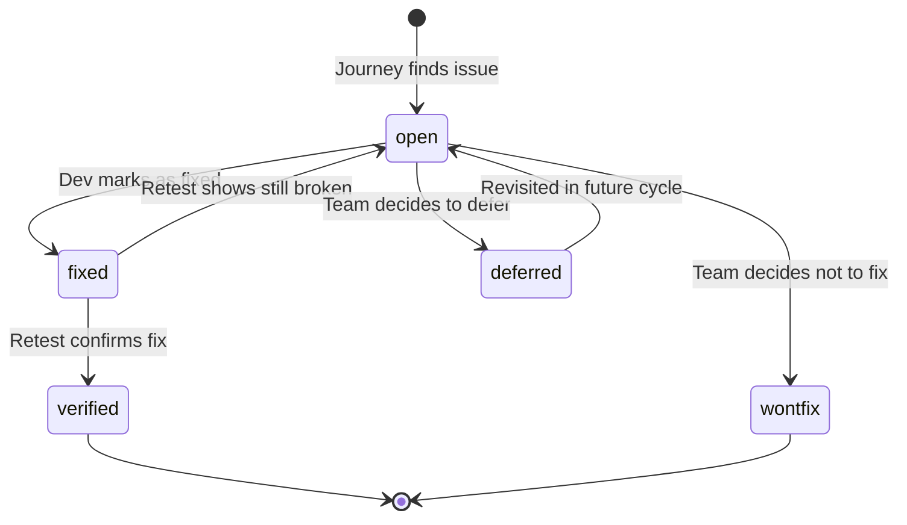

# Retest Workflow

How to re-run journey logs after fixes, compare results, and track issue lifecycle.

## Issue Lifecycle



## Retest Process

### 1. Archive Current State

Before re-running, the previous journals are archived:

```
journals/
├── archive/
│   └── 2026-05-28/
│       ├── purchase-plant--maria-low-vision.md
│       ├── purchase-plant--dave-senior.md
│       └── ...
├── purchase-plant--maria-low-vision.md   ← will be overwritten
└── ...
```

Archives are timestamped by the date of the ORIGINAL run, not the retest date. This preserves the full history.

### 2. Re-Run Journeys

Same as a normal journey run, but with awareness of `issues.yaml`:
- For each step, the persona still evaluates independently (no anchoring bias)
- After generation, the system compares new findings against known issues

### 3. Diff Generation

For each issue in `issues.yaml`:

| Old Status | New Finding | Result |
|-----------|-------------|--------|
| `open` | Still present | Stays `open` |
| `open` | Not found | ⚠️ Flag for review (may be fixed but not marked) |
| `fixed` | Not found | → `verified`, set `verified` date |
| `fixed` | Still present | → `open` (fix didn't work) |
| `verified` | Still present | 🔴 Regression — create new issue |
| `wontfix` | Still present | Expected — no action |

New issues found that don't match any existing `issues.yaml` entry are flagged as regressions if they affect steps that were previously clean.

### 4. Diff Report Format

```markdown
# Retest Report: {goal} — {date}

## Summary
- **Previous run:** {archive_date}
- **Issues tracked:** {N}
- **Resolved this cycle:** {N}
- **New regressions:** {N}

## Resolved ✅
| Issue | Summary | Persona | Step | Before → After |
|-------|---------|---------|------|----------------|
| ISS-002 | Sale badge color-only | Maria | 3 | 🔴→✅ |

## Still Open 🔴
| Issue | Summary | Persona | Step | Notes |
|-------|---------|---------|------|-------|
| ISS-001 | Stock status color-only | Maria, Alex | 4 | No change detected |

## Regressions ⚠️
| Issue | Summary | Persona | Step | Notes |
|-------|---------|---------|------|-------|
| NEW | CAPTCHA no audio alt | Alex | 6 | Previously clean step |

## Score Change
| Severity | Before | After | Delta |
|----------|--------|-------|-------|
| 🔴 Critical | 4 | 3 (+1 new) | -1 net |
| 🟡 Medium | 6 | 5 | -1 |
| 🟢 Low | 2 | 2 | 0 |
```

## Tracking Over Time

For long-running projects, the archive accumulates historical snapshots:

```
journals/archive/
├── 2026-05-28/    ← initial assessment
├── 2026-06-05/    ← after first fix batch
├── 2026-06-15/    ← after second fix batch
└── 2026-07-01/    ← quarterly recheck
```

This enables trend analysis:

```
/site-walkthrough trend greenthumb.shop purchase-plant
```

```markdown
# Trend: Purchase Plant Issues Over Time

| Date | Critical | High | Medium | Low | Total | Personas Blocked |
|------|----------|------|--------|-----|-------|-----------------|
| 2026-05-28 | 4 | 2 | 6 | 2 | 14 | 2/5 |
| 2026-06-05 | 3 | 1 | 5 | 2 | 11 | 1/5 |
| 2026-06-15 | 1 | 0 | 3 | 2 | 6 | 0/5 |
| 2026-07-01 | 0 | 0 | 2 | 1 | 3 | 0/5 |
```

## Best Practices

1. **Retest after every deploy** — issues can reappear after unrelated changes
2. **Don't delete archives** — historical data enables trend tracking
3. **Separate fix batches** — test one batch of fixes at a time so you know what worked
4. **Mark wontfix explicitly** — a known-ignored issue is better than a forgotten one
5. **Review regressions immediately** — a regression means something broke that was working
