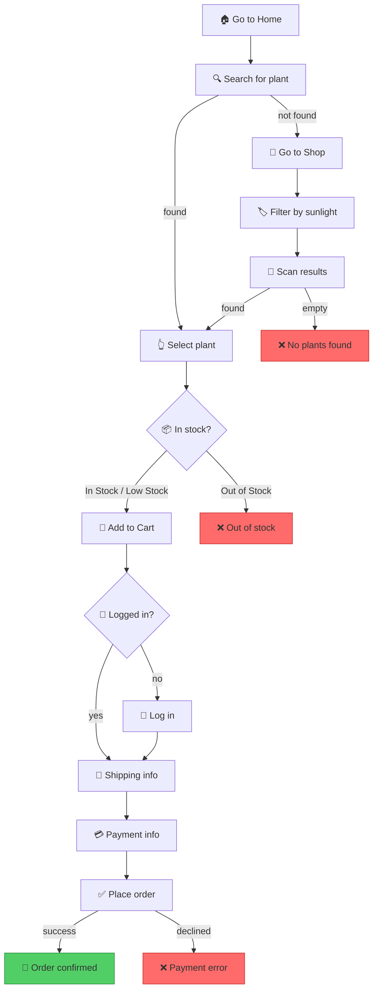
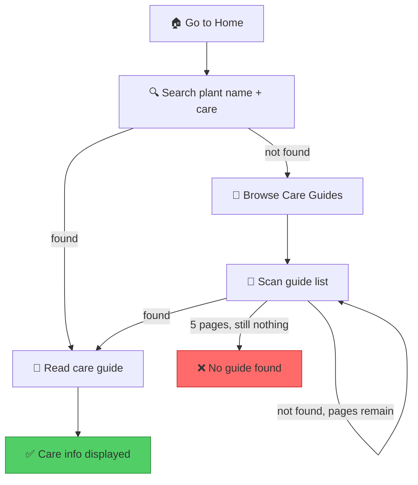

# Worked Example: Ecommerce Site

End-to-end walkthrough of registering a fictional ecommerce site, inventorying pages, defining goals, and generating walkthroughs.

## The Site

**Domain:** `greenthumb.shop`
**Type:** Online plant nursery
**Key user goals:** Browse plants, purchase a plant, find care instructions

---

## Step 1: Register the Site

```
/site-walkthrough register greenthumb.shop
```

Creates:
```
.npl/sites/greenthumb.shop/
├── site.yaml
├── pages/
├── goals/
└── walkthroughs/
```

### site.yaml

```yaml
domain: greenthumb.shop
name: GreenThumb Plant Nursery
base_url: https://greenthumb.shop
last_audited: 2026-05-28
tags: [ecommerce, plants, b2c]

global_nav:
  - label: Home
    page: home
  - label: Shop
    page: shop
  - label: Care Guides
    page: care-guides
  - label: Cart
    page: cart
  - label: My Account
    page: account

auth:
  login_page: login
  requires_auth_pages: [checkout, account, order-history]
```

---

## Step 2: Inventory Key Pages

### pages/home.yaml

```yaml
page: home
url_pattern: /
title: GreenThumb — Plants Delivered to Your Door
requires_auth: false

elements:
  - id: hero-search
    type: input
    selector: "#hero-search"
    description: Main search bar in hero section
    actions: [type, submit]

  - id: featured-plants
    type: container
    selector: ".featured-grid"
    description: Featured plants carousel
    children:
      - id: featured-card
        type: repeating
        selector: ".plant-card"
        actions: [click]
        leads_to: plant-detail

  - id: category-tiles
    type: container
    selector: ".category-grid"
    children:
      - id: category-tile
        type: repeating
        selector: ".category-tile"
        actions: [click]
        leads_to: shop

  - id: care-tip-banner
    type: link
    selector: ".care-banner a"
    actions: [click]
    leads_to: care-guides

affordances:
  - search for plants by name
  - browse featured plants
  - navigate to category
  - read care tips

exit_points:
  - page: plant-detail
    via: featured-card click
  - page: shop
    via: category-tile click or global nav
  - page: care-guides
    via: care-tip-banner or global nav
```

### pages/shop.yaml

```yaml
page: shop
url_pattern: /shop
title: Shop All Plants
requires_auth: false

elements:
  - id: shop-search
    type: input
    selector: "#product-search"
    actions: [type, submit]

  - id: filter-panel
    type: container
    selector: ".filter-sidebar"
    children:
      - id: filter-sunlight
        type: select
        selector: "[data-filter='sunlight']"
        actions: [select]
        options: [full-sun, partial-shade, full-shade]
      - id: filter-size
        type: select
        selector: "[data-filter='size']"
        actions: [select]
        options: [small, medium, large]
      - id: filter-price
        type: select
        selector: "[data-filter='price']"
        actions: [select]

  - id: plant-grid
    type: container
    selector: ".plant-grid"
    children:
      - id: plant-card
        type: repeating
        selector: ".plant-card"
        actions: [click]
        leads_to: plant-detail

  - id: pagination
    type: navigation
    selector: ".pagination"
    actions: [click]

dynamic:
  type: filtered
  empty_state: "No plants match your filters"
  depends_on: filter-panel

affordances:
  - search plants by name
  - filter by sunlight needs
  - filter by plant size
  - filter by price range
  - browse paginated results
  - view plant details

exit_points:
  - page: plant-detail
    via: plant-card click
  - page: cart
    via: global nav
```

### pages/plant-detail.yaml

```yaml
page: plant-detail
url_pattern: /plants/{slug}
title: "{plant_name} — GreenThumb"
requires_auth: false

elements:
  - id: plant-images
    type: media
    selector: ".plant-gallery"
    actions: [click, zoom]

  - id: plant-name
    type: container
    selector: "h1.plant-name"

  - id: price
    type: container
    selector: ".price"

  - id: stock-indicator
    type: container
    selector: ".stock-status"
    description: Shows "In Stock", "Low Stock", or "Out of Stock"

  - id: quantity-picker
    type: select
    selector: ".quantity-select"
    actions: [select]

  - id: add-to-cart-btn
    type: button
    selector: "[data-testid='add-to-cart']"
    actions: [click]
    description: Adds plant to cart

  - id: care-link
    type: link
    selector: ".care-guide-link"
    actions: [click]
    leads_to: care-guide-detail

affordances:
  - view plant images
  - check stock status
  - select quantity
  - add to cart
  - read care guide for this plant

exit_points:
  - page: cart
    via: add-to-cart-btn (redirects) or global nav
  - page: care-guide-detail
    via: care-link
  - page: shop
    via: breadcrumb or global nav
```

---

## Step 3: Define Goals

### goals/purchase-plant.yaml

```yaml
goal: purchase-plant
description: User wants to find and buy a specific plant
preconditions:
  - site is accessible
  - user has payment method
success_criteria:
  - order confirmation page displayed
  - order number visible
estimated_steps: 8-12

flow:
  - id: start
    action: navigate
    target: home
    next: search-plant

  - id: search-plant
    action: search
    target: hero-search
    input: "{plant_name}"
    on_success: select-plant
    on_failure: browse-fallback
    note: "If search returns no results, browse by category"

  - id: browse-fallback
    action: navigate
    target: shop
    next: filter-plants

  - id: filter-plants
    action: interact
    target: filter-sunlight
    input: "{sunlight_need}"
    next: scan-results

  - id: scan-results
    action: observe
    target: plant-grid
    on_success: select-plant
    on_failure: no-plants
    note: "Look for a plant matching the description"

  - id: no-plants
    action: terminal
    result: failure
    reason: "No matching plants found via search or filter"

  - id: select-plant
    action: click
    target: plant-card
    criteria: "matches {plant_name}"
    next: check-stock

  - id: check-stock
    action: observe
    target: stock-indicator
    conditions:
      - value: "In Stock"
        next: add-to-cart
      - value: "Low Stock"
        next: add-to-cart
      - value: "Out of Stock"
        next: out-of-stock

  - id: out-of-stock
    action: terminal
    result: failure
    reason: "Plant is out of stock"

  - id: add-to-cart
    action: click
    target: add-to-cart-btn
    next: go-checkout

  - id: go-checkout
    action: navigate
    target: checkout
    requires_auth: true
    auth_redirect: login
    next: fill-shipping

  - id: fill-shipping
    action: form-fill
    target: shipping-form
    fields: [address, city, state, zip]
    next: fill-payment

  - id: fill-payment
    action: form-fill
    target: payment-form
    fields: [card_number, expiry, cvv]
    next: place-order

  - id: place-order
    action: click
    target: place-order-btn
    on_success: done
    on_failure: payment-error

  - id: payment-error
    action: terminal
    result: failure
    reason: "Payment declined or processing error"

  - id: done
    action: terminal
    result: success
    verify: "Order confirmation page with order number"

variables:
  plant_name:
    description: "Name or type of plant"
    example: "Monstera Deliciosa"
  sunlight_need:
    description: "Sunlight requirement for fallback filter"
    example: "partial-shade"
```

### goals/find-care-guide.yaml

```yaml
goal: find-care-guide
description: User wants to find care instructions for a plant they own
preconditions:
  - site is accessible
success_criteria:
  - care guide page displayed for the target plant
estimated_steps: 3-5

flow:
  - id: start
    action: navigate
    target: home
    next: search-care

  - id: search-care
    action: search
    target: hero-search
    input: "{plant_name} care"
    on_success: read-guide
    on_failure: browse-guides

  - id: browse-guides
    action: navigate
    target: care-guides
    next: scan-guides

  - id: scan-guides
    action: observe
    target: guide-list
    repeat_until: "guide matching {plant_name} found"
    on_success: read-guide
    on_failure: scan-guides
    max_iterations: 5
    on_max: not-found

  - id: not-found
    action: terminal
    result: failure
    reason: "No care guide found for {plant_name}"

  - id: read-guide
    action: observe
    target: care-content
    next: done

  - id: done
    action: terminal
    result: success
    verify: "Care guide page shows watering, sunlight, and soil info for {plant_name}"

variables:
  plant_name:
    description: "Plant the user wants care info for"
    example: "Fiddle Leaf Fig"
```

---

## Step 4: Generate Walkthroughs

```
/site-walkthrough generate greenthumb.shop
```

### Generated: Purchase Plant Graph



### Generated: Find Care Guide Graph



---

## Step 5: Audit Coverage

```
/site-walkthrough audit greenthumb.shop
```

### Audit Report

**Page Coverage:**
| Page | Inventoried | Referenced by Goals | Status |
|------|------------|-------------------|--------|
| home | ✅ | purchase-plant, find-care-guide | ✅ Covered |
| shop | ✅ | purchase-plant | ✅ Covered |
| plant-detail | ✅ | purchase-plant | ✅ Covered |
| care-guides | ❌ | find-care-guide | ⚠️ Referenced but not inventoried |
| cart | ❌ | — | ⚠️ In global nav, not inventoried |
| checkout | ❌ | purchase-plant | ⚠️ Referenced but not inventoried |
| account | ❌ | — | ℹ️ Auth-gated, no goals reference it |
| login | ❌ | purchase-plant (auth gate) | ⚠️ Auth page not inventoried |

**Element Coverage:**
| Element | Defined In | Used By | Status |
|---------|-----------|---------|--------|
| shipping-form | ❌ undefined | purchase-plant | ❌ Missing element definition |
| payment-form | ❌ undefined | purchase-plant | ❌ Missing element definition |
| place-order-btn | ❌ undefined | purchase-plant | ❌ Missing element definition |
| guide-list | ❌ undefined | find-care-guide | ❌ Missing element definition |
| care-content | ❌ undefined | find-care-guide | ❌ Missing element definition |

**Goal Completeness:**
| Goal | Well-formed | Terminals | Issues |
|------|------------|-----------|--------|
| purchase-plant | ✅ | 1 success, 3 failures | 3 undefined elements |
| find-care-guide | ✅ | 1 success, 1 failure | 2 undefined elements |

**Next Steps:**
1. Inventory missing pages: care-guides, cart, checkout, login
2. Define missing elements in checkout and care-guides pages
3. Consider adding goals for: create account, view order history, contact support

---

## Step 6: Define Personas

### personas.yaml

```yaml
personas:
  - id: maria-low-vision
    name: Maria
    label: Low Vision — Deuteranopia
    lens: visual-accessibility
    constraints:
      - color blind (deuteranopia — red/green)
      - uses browser zoom at 150%
      - relies on text labels, not color alone
    watches_for:
      - color-only indicators (red/green without text)
      - small click targets (< 44px)
      - low contrast text
      - layout breakage at 150% zoom
    frustration_triggers:
      - "I can't tell if this is an error or success — both look the same"
      - "At my zoom level this form is cut off"

  - id: dave-senior
    name: Dave
    label: Non-Technical Senior
    lens: cognitive-simplicity
    constraints:
      - not comfortable with technology
      - reads slowly, overwhelmed by too many choices
      - doesn't know terms like "cart" or "checkout"
    watches_for:
      - jargon or unexplained terms
      - too many options on one page
      - unclear what to do next
      - small or faint text
    frustration_triggers:
      - "There are too many buttons, I don't know which one to press"
      - "What does 'checkout' mean?"

  - id: priya-slow
    name: Priya
    label: Slow 3G Connection
    lens: performance
    constraints:
      - 3G connection (~1.5 Mbps)
      - older Android phone
      - limited data plan
    watches_for:
      - large images without lazy loading
      - JavaScript-heavy interactions
      - pages over 2MB total
      - actions requiring multiple round trips
    frustration_triggers:
      - "This page has been loading for 15 seconds"
      - "I tapped the button but nothing happened"
```

---

## Step 7: Run Journey Logs

```
/site-walkthrough journey greenthumb.shop purchase-plant
```

### journals/purchase-plant--maria-low-vision.md

```markdown
# Journey Log: Purchase Plant
## Persona: Maria (Low Vision — Deuteranopia)
**Date:** 2026-05-28
**Goal:** purchase-plant
**Site:** greenthumb.shop
**Overall verdict:** ⚠️ Completable with difficulty

---

### Step 1: Navigate to Home → ✅ OK
**What I see:** Large hero image, prominent search bar with good contrast.
**Observation:** Placeholder text "Search plants..." is readable. Good.
**Issues:** None

### Step 2: Search for "Monstera" → ✅ OK
**What I see:** Results load, product cards show plant names in text.
**Observation:** Not relying on images alone. Helpful for me.
**Issues:** None

### Step 3: Select plant → ⚠️ Friction
**What I see:** Grid of product cards.
**Observation:** Some cards have a small colored badge — I think it means "sale" but the red-on-green is invisible to me.
**Issues:**
- 🔴 **Severity: High** — Sale badge uses red/green color only
- **Recommendation:** Add "SALE" text label or a distinct icon

### Step 4: Check stock → 🔴 Blocked
**What I see:** A colored dot next to price. No text.
**Observation:** I literally cannot distinguish "In Stock" (green) from "Out of Stock" (red).
**Issues:**
- 🔴 **Severity: Critical** — Stock indicator is color-only dots
- **Recommendation:** Add text: "In Stock ●" / "Out of Stock ●"

### Step 5: Add to cart → ✅ OK
**What I see:** Large button with "Add to Cart" text. Good size, good contrast.
**Issues:** None

### Step 6: Checkout → ⚠️ Friction
**What I see:** Multi-field form, some fields have red borders (errors?).
**Observation:** At 150% zoom the form extends past my screen width. Error indicators are color-only.
**Issues:**
- 🟡 **Severity: Medium** — Validation errors shown as red borders only
- 🟡 **Severity: Medium** — Form layout breaks at 150% zoom
- **Recommendation:** Add inline error text + icons; test responsive at 150%

---

## Summary

| Severity | Count | Steps Affected |
|----------|-------|---------------|
| 🔴 Critical | 1 | Step 4 |
| 🔴 High | 1 | Step 3 |
| 🟡 Medium | 2 | Step 6 |

**Completion:** CAN complete but may choose wrong item (can't see stock status).
**Top fix:** Add text labels to all color-coded indicators.
```

### journals/purchase-plant--dave-senior.md

```markdown
# Journey Log: Purchase Plant
## Persona: Dave (Non-Technical Senior)
**Date:** 2026-05-28
**Goal:** purchase-plant
**Site:** greenthumb.shop
**Overall verdict:** ⚠️ Completable with difficulty

---

### Step 1: Navigate to Home → ✅ OK
**What I see:** Pretty pictures of plants. A search box. Some category tiles.
**Observation:** Clear enough. The search box is prominent.
**Issues:** None

### Step 2: Search for "Monstera" → ✅ OK
**What I see:** Results appear. I can see plant names and prices.
**Observation:** Straightforward.
**Issues:** None

### Step 3: Select plant → ⚠️ Friction
**What I see:** Many, many cards. Filters on the left. Numbers and symbols.
**Observation:** I'm overwhelmed. There are 40+ plants visible. The filter panel has dropdowns I don't understand ("Sunlight: Full Sun / Partial Shade / Full Shade" — what does my kitchen window count as?).
**Issues:**
- 🟡 **Severity: Medium** — Too many options without guidance
- **Recommendation:** Add a "Help me choose" wizard or beginner's guide link

### Step 4: Check stock → ✅ OK
**What I see:** "In Stock" text with a green dot.
**Observation:** The text is small but readable. Green dot is redundant for me since the text is there.
**Issues:** None — text labels are present (note: differs from Maria's experience!)

### Step 5: Add to cart → ⚠️ Friction
**What I see:** Button says "Add to Cart."
**Observation:** I know what a shopping cart is from the grocery store, but "cart" on a website feels unfamiliar. After clicking, a small notification appeared briefly. Did it work? I'm not sure.
**Issues:**
- 🟢 **Severity: Low** — "Cart" jargon is mildly confusing
- 🟡 **Severity: Medium** — Cart confirmation toast disappears too quickly (2s)
- **Recommendation:** Make toast persistent or add a cart badge counter animation

### Step 6: Checkout → 🔴 Blocked
**What I see:** A huge form with many fields. Shipping. Billing. Payment. Terms.
**Observation:** This is too much. I don't have my credit card nearby. There's no "save and come back later" option. I don't know what "CVV" means. The "Terms and Conditions" checkbox feels threatening.
**Issues:**
- 🔴 **Severity: Critical** — Form is overwhelming, no save-and-return option
- 🟡 **Severity: Medium** — "CVV" unexplained
- 🟢 **Severity: Low** — "Terms and Conditions" feels intimidating
- **Recommendation:** Break into steps with progress bar; add field tooltips; add guest save

---

## Summary

| Severity | Count | Steps Affected |
|----------|-------|---------------|
| 🔴 Critical | 1 | Step 6 |
| 🟡 Medium | 3 | Steps 3, 5, 6 |
| 🟢 Low | 2 | Steps 5, 6 |

**Completion:** BLOCKED at checkout — too many fields, no save-and-return.
**Top fix:** Break checkout into guided steps with progress indicator.
```

---

## Step 8: Journey Report

```
/site-walkthrough journey-report greenthumb.shop purchase-plant
```

### Cross-Persona Issue Matrix

| Step | Maria (Low Vision) | Dave (Senior) | Priya (Slow 3G) |
|------|-------------------|---------------|-----------------|
| 1. Navigate | ✅ | ✅ | ⚠️ hero image 1.8MB |
| 2. Search | ✅ | ✅ | ✅ |
| 3. Select | 🔴 color badge | ⚠️ too many options | ⚠️ 40 cards = slow render |
| 4. Stock | 🔴 color-only | ✅ | ✅ |
| 5. Add to cart | ✅ | ⚠️ toast too fast | ⚠️ JS round trip lag |
| 6. Checkout | ⚠️ zoom + errors | 🔴 form overwhelming | 🔴 form payload heavy |

### Top 5 Fixes

1. **Add text to color indicators** — 2 critical issues, 1 persona → immediate
2. **Break checkout into steps** — 1 critical, all 3 personas benefit → high impact
3. **Optimize hero image** (compress, lazy-load) — 1 medium, Priya → quick win
4. **Add field tooltips to checkout** — "CVV", "Billing vs Shipping" → Dave
5. **Persist cart toast longer** — 1 medium, Dave → small fix

---

## Step 9: Track Issues

### issues.yaml

```yaml
issues:
  - id: ISS-001
    found: 2026-05-28
    goal: purchase-plant
    step: check-stock
    severity: critical
    summary: "Stock status uses color-only dots (green/red)"
    personas_affected: [maria-low-vision]
    recommendation: "Add text labels alongside dots"
    status: open
    fixed_in: null
    verified: null

  - id: ISS-002
    found: 2026-05-28
    goal: purchase-plant
    step: select-plant
    severity: high
    summary: "Sale badge is red-on-green, invisible to deuteranopia"
    personas_affected: [maria-low-vision]
    recommendation: "Add text 'SALE' or distinct icon"
    status: open
    fixed_in: null
    verified: null

  - id: ISS-003
    found: 2026-05-28
    goal: purchase-plant
    step: go-checkout
    severity: critical
    summary: "Checkout form is overwhelming — too many fields, no save, no progress"
    personas_affected: [dave-senior, priya-slow]
    recommendation: "Break into multi-step wizard with progress bar"
    status: open
    fixed_in: null
    verified: null

  - id: ISS-004
    found: 2026-05-28
    goal: purchase-plant
    step: start
    severity: medium
    summary: "Hero image 1.8MB, no lazy loading"
    personas_affected: [priya-slow]
    recommendation: "Compress to < 200KB, add loading=lazy"
    status: open
    fixed_in: null
    verified: null
```
