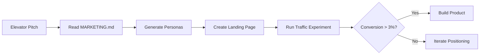
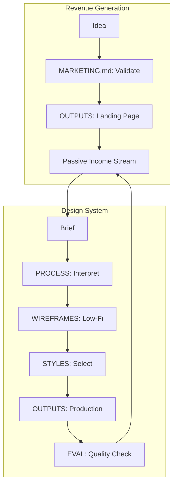

# Skills: Specialized Agent Systems

> Specialized skill systems for AI agents working on design, conversions, and product development.

This directory contains modular agent skills developed through iterative experimentation. Each skill is LLM-agnostic and designed for rapid, high-quality output generation.

---

## Overview

**Purpose**: Provide reusable skills for AI agents across different domains.

**Philosophy**: Outcome-focused, accessibility-first, conversion-optimized, and grounded in 2026 design standards.

---

## Available Skills

### 1. Conversion Engineer (`conversion-engineer/`)

**Purpose**: Skill system for optimizing digital products for revenue, conversions, and monetization.

**Three Income Streams:**

| Stream | Description | Revenue Model | Timeline |
|--------|-------------|---------------|----------|
| **AI Templates** | Prompt libraries, automation workflows, MCP servers | $27-197 per sale | 2-4 weeks |
| **Content Publishing** | Technical writing, newsletters, video courses | Subscriptions + sponsorships | 2-3 months |
| **Print on Demand** | Developer/designer merchandise, niche apparel | $5-15 margin per item | 2-6 weeks |

**Key Features:**
- Complete ideation-to-launch workflow
- Market research and niche identification frameworks
- Platform selection heuristics (Gumroad, Substack, Printful, etc.)
- Revenue tracking templates
- Conservative target: $800-2300/month Year 1

**Structure:**
```
passive-income-agents/
├── ai-templates/        # Prompt libraries, automation tools
├── content-publishing/  # Writing, newsletters, courses
└── print-on-demand/     # Merchandise design & fulfillment
```

**Documentation:** See subdirectory-specific guides in each income stream folder.

---

### 2. UX/UI Design System (`ux-ui-design-system/`)

**Purpose**: Comprehensive design methodology system covering discovery, wireframing, style selection, pattern libraries, evaluation, and multi-format output generation.

**Seven Core Subdirectories:**

| Directory | Purpose |
|-----------|---------|
| **CORE.md** | Design philosophy, decision frameworks, quality defaults |
| **MARKETING.md** | Lean validation, positioning strategies, 5-week sprint structure |
| **WIREFRAMES.md** | Text-based wireframe formats (ASCII, PlantUML Salt, Wireweave DSL) |
| **STYLES/** | Five design style systems (Minimal Tech, Consumer Playful, Corporate Enterprise, Editorial, Bold Expressive) |
| **PATTERNS/** | Component library (layout, interaction, responsive, accessibility) |
| **PROCESS/** | Brief interpretation, validation sprints, style discovery |
| **OUTPUTS/** | Format-specific guides (HTML/CSS, Next.js, p5.js, SVG, Textual TUI, Figma specs) |
| **EVAL/** | Quality rubrics (accessibility, conversion, performance) |

**Key Features:**
- **Output Spectrum**: ASCII wireframes → SVG mockups → p5.js prototypes → Next.js/Textual production code
- **Conversion-Focused**: CTA design heuristics, trust-building patterns, A/B test frameworks
- **Accessibility-First**: WCAG 2.2 AA baseline, cognitive accessibility standards
- **Grayscale-First Approach**: Structure validation before color application
- **2026 Design Standards**: Minimal UI, Bento grids, intentional friction, AI transparency

**Structure:**
```
ux-ui-design-system/
├── CORE.md                # Design philosophy & principles
├── MARKETING.md           # Validation & positioning
├── WIREFRAMES.md          # Text wireframe formats
├── STYLES/                # 5 style systems
│   ├── INDEX.md
│   ├── minimal-tech.md
│   ├── consumer-playful.md
│   ├── corporate-enterprise.md
│   ├── editorial.md
│   └── bold-expressive.md
├── PATTERNS/              # Component patterns
│   ├── INDEX.md
│   ├── layout.md
│   ├── components.md
│   ├── interaction.md
│   ├── responsive.md
│   └── accessibility.md
├── PROCESS/               # Workflows
│   ├── INDEX.md
│   ├── brief-interpretation.md
│   ├── style-discovery.md
│   └── validation-sprint.md
├── OUTPUTS/               # Format-specific guides
│   ├── INDEX.md
│   ├── html-css.md
│   ├── nextjs.md
│   ├── p5js.md
│   ├── svg-mockups.md
│   ├── textual-tui.md
│   ├── figma-spec.md
│   └── landing-pages.md
└── EVAL/                  # Quality assessment
    ├── INDEX.md
    ├── rubrics.md
    ├── accessibility-checklist.md
    └── conversion-benchmarks.md
```

**Documentation:** Start with `CORE.md` for philosophy, `PROCESS/brief-interpretation.md` for workflow entry point.

---

## Quick Navigation

### Get Started

| I want to... | Go here |
|--------------|---------|
| Generate passive income with AI templates | `passive-income-agents/ai-templates/` |
| Start a technical newsletter | `passive-income-agents/content-publishing/` |
| Design print-on-demand products | `passive-income-agents/print-on-demand/` |
| Understand design principles | `ux-ui-design-system/CORE.md` |
| Create rapid wireframes | `ux-ui-design-system/WIREFRAMES.md` |
| Select a visual style | `ux-ui-design-system/STYLES/INDEX.md` |
| Build a landing page | `ux-ui-design-system/OUTPUTS/landing-pages.md` |
| Validate a product idea | `ux-ui-design-system/MARKETING.md` |
| Access component patterns | `ux-ui-design-system/PATTERNS/INDEX.md` |

### Reference Files

| File | Purpose |
|------|---------|
| **CONSOLIDATION-GUIDE.md** | History of how this repo was organized from 8 experimental directories |
| **CORE.md** (root) | Duplicate of design system core principles (canonical version in `ux-ui-design-system/`) |
| **UI-UX-0 through UI-UX-7** | Original experimental directories (archived, see CONSOLIDATION-GUIDE.md) |

---

## Usage Examples

### Example 1: Validate a SaaS Idea



**Files to use:**
1. `ux-ui-design-system/MARKETING.md` - Persona generation & positioning
2. `ux-ui-design-system/PROCESS/brief-interpretation.md` - Extract core requirements
3. `ux-ui-design-system/OUTPUTS/landing-pages.md` - Build conversion-focused page
4. `ux-ui-design-system/EVAL/conversion-benchmarks.md` - Assess results

---

### Example 2: Design a Developer Tool TUI


**Files to use:**
1. `ux-ui-design-system/WIREFRAMES.md` - ASCII wireframe syntax
2. `ux-ui-design-system/STYLES/minimal-tech.md` - Developer-focused style
3. `ux-ui-design-system/OUTPUTS/textual-tui.md` - Python Textual implementation
4. `ux-ui-design-system/EVAL/accessibility-checklist.md` - Keyboard nav validation

---

### Example 3: Launch an AI Prompt Library


**Files to use:**
1. `passive-income-agents/ai-templates/` - Prompt library templates
2. `ux-ui-design-system/OUTPUTS/landing-pages.md` - Sales page design
3. `passive-income-agents/ai-templates/` - Revenue tracking templates

---

## Key Features & Benefits

### Design System Benefits

✅ **Multi-Format Output** - Same design principles generate ASCII wireframes, SVG mockups, p5.js prototypes, Next.js apps, Textual TUIs, or Figma specs
✅ **Conversion-Optimized** - Every pattern includes CTA placement, trust signals, and friction reduction strategies
✅ **Accessibility Baseline** - WCAG 2.2 AA compliance baked into every component and style
✅ **Rapid Iteration** - Text-based wireframes (ASCII, PlantUML Salt, Wireweave DSL) enable fast feedback loops
✅ **Grayscale-First** - Structure validation before color prevents "pretty but broken" designs
✅ **LLM-Native** - Designed for consumption by Claude, GPT-4, and other modern LLMs

### Passive Income Benefits

✅ **Systematic Approach** - No guesswork, structured workflows from ideation to revenue
✅ **Conservative Targets** - Year 1 projections: $800-2300/month across three streams
✅ **Skill Leverage** - Optimized for technical founders with software + creative skills
✅ **Platform Agnostic** - Works with Gumroad, Substack, Etsy, Redbubble, Printful, etc.
✅ **Low Risk** - Print-on-demand has zero inventory cost; digital products are one-time effort
✅ **Compounding Returns** - Products continue earning after initial creation

---

## System Philosophy

### Design System Core Principles

1. **Restraint is the default** - Start minimal, add only what earns its place
2. **Convention over innovation** - 90% familiar patterns, 10% novel (when justified)
3. **Accessibility is architecture** - Not an afterthought, baked in from start
4. **Design serves outcomes** - Every decision traces to user/business goal
5. **Grayscale before color** - Structure validation before aesthetic polish
6. **Trust through transparency** - No dark patterns, clear communication

### Revenue System Core Principles

1. **Leverage existing skills** - Don't learn new domains; monetize what you know
2. **Market validation first** - Build audience before building product
3. **Quality over quantity** - One well-marketed product beats ten buried ones
4. **Automate fulfillment** - Digital delivery, print-on-demand, no inventory
5. **Track relentlessly** - Revenue, conversion, traffic - optimize what you measure
6. **Iterate based on data** - Let metrics guide product development

---

## Integration & Workflow

Both systems are designed to work together:



**Example workflow:**
1. Use `passive-income-agents/` to identify a digital product opportunity
2. Use `ux-ui-design-system/MARKETING.md` to validate demand
3. Use `ux-ui-design-system/OUTPUTS/` to build the sales page
4. Use `passive-income-agents/` tracking templates to monitor revenue
5. Iterate based on conversion data

---

## File Organization

```
spike-ui-ux/
├── README.md                      # This file
├── CONSOLIDATION-GUIDE.md         # Repo history & consolidation notes
├── CORE.md                        # (Duplicate) Design principles
│
├── passive-income-agents/         # Revenue generation system
│   ├── ai-templates/
│   ├── content-publishing/
│   └── print-on-demand/
│
├── ux-ui-design-system/           # Design methodology system
│   ├── CORE.md
│   ├── MARKETING.md
│   ├── WIREFRAMES.md
│   ├── STYLES/
│   ├── PATTERNS/
│   ├── PROCESS/
│   ├── OUTPUTS/
│   └── EVAL/
│
└── UI-UX-[0-7]/                   # Archived experimental directories
    ├── INDEX.md                   # Per-directory summaries
    ├── LAYOUT.md                  # File organization
    └── SUMMARY.md                 # High-level overview
```

---

## Version & Maintenance

- **Design System Version**: 0.2.0 (2026-01-29)
- **Revenue System Version**: 0.1.0 (2026-01-27)
- **Last Updated**: 2026-02-02
- **Status**: Production-ready, actively maintained

---

## Contributing & Feedback

These systems were developed through iterative experimentation (8 spike directories consolidated). Feedback and contributions welcome:

- Design system improvements: Focus on `ux-ui-design-system/`
- Revenue strategy additions: Focus on `passive-income-agents/`
- New output formats: Add to `ux-ui-design-system/OUTPUTS/`
- New income streams: Add subdirectory to `passive-income-agents/`

---

## License

[Specify license here - MIT, Apache 2.0, etc.]

---

*Built for technical founders, designers, and LLM-powered agents who ship fast and ship well.*
