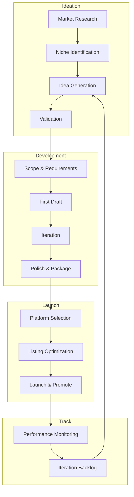

# Passive Income Generation Agent System

> Systematic ideation, development, and tracking for digital passive income streams. Optimized for technical founders with software engineering + creative skills.

---

## Overview

This system provides specialized agents for generating, tracking, and executing passive income streams across three complementary domains: AI templates, content publishing, and print-on-demand products. Each stream leverages your unique combination of technical depth, creative execution, and problem-solving ability to create defensible competitive advantages in underserved markets.

The workflow follows a systematic approach: market research → ideation → development → launch → tracking → iteration. All three income streams work synergistically: templates generate content topics, content drives template discovery and builds authority, and POD products strengthen community engagement and email list growth.

---

## System Overview



---

## Strategic Positioning

Your unique combination creates competitive moats:

| Skill | Application | Advantage |
|-------|-------------|-----------|
| Software engineering | Build APIs, SaaS, automation | Can code solutions, not just templates |
| Creative ability | AI-assisted design, brand positioning | Higher quality, faster iteration |
| Technical insight | Authoritative content, developer tools | Credibility + SEO authority |

### High-ROI Focus Areas

| Area | Why It Works for You | Timeline to First $ |
|------|---------------------|---------------------|
| AI for Creative Pros | Low competition, can code real tools | 2-4 weeks |
| Small Business Ops | Underserved, $97-197 price points | 2-4 weeks |
| Developer Education | Authority from experience | 2-3 months |
| Niche POD (devs/tech) | Clear audience, original designs | 2-6 weeks |

---

## Three Income Streams

| Stream | File | Revenue Model | Price Range | Volume Strategy |
|--------|------|---------------|-------------|-----------------|
| **AI Templates** | `ai-templates/` | $27-197 per sale | $97-$497 | High margin, low volume |
| **Content Publishing** | `content-publishing/` | Subscriptions + sponsorships | $5-$50/sub | Recurring, compounds |
| **Print on Demand** | `print-on-demand/` | $5-15 margin per item | $15-$40 | Volume play |

### Income Stream Synergies

```
┌─────────────────────────────────────────────────────────────────────┐
│                    PASSIVE INCOME PORTFOLIO                          │
├─────────────────────────────────────────────────────────────────────┤
│                                                                      │
│  ┌─────────────┐    ┌─────────────┐    ┌─────────────┐             │
│  │ AI TEMPLATES│    │  CONTENT    │    │    POD      │             │
│  │             │    │ PUBLISHING  │    │  PRODUCTS   │             │
│  │ $97-$497    │    │ $5-$50/sub  │    │ $15-$40     │             │
│  │ High margin │    │ Recurring   │    │ Per sale    │             │
│  │ Low volume  │    │ Compounds   │    │ Volume play │             │
│  └─────────────┘    └─────────────┘    └─────────────┘             │
│        │                  │                  │                      │
│        └──────────────────┼──────────────────┘                      │
│                           │                                         │
│                    ┌──────┴──────┐                                  │
│                    │  SYNERGIES  │                                  │
│                    └─────────────┘                                  │
│  - Templates → Content topics → POD audience                        │
│  - Content → Template promotion → Authority                         │
│  - POD → Community building → Email list                            │
│                                                                      │
└─────────────────────────────────────────────────────────────────────┘
```

---

## Competitive Advantages

Based on positioning analysis:

1. **Technical Depth** - Can build tools, not just templates
2. **Creative Execution** - AI-assisted design at scale
3. **Problem-Solving** - Understand developer pain points
4. **Systems Thinking** - Can automate and scale

---

## Platform Comparison

### Digital Products (AI Templates)

| Platform | Best For | Fees | Audience | Recommendation |
|----------|----------|------|----------|----------------|
| **Gumroad** | Quick launch, testing | 10% + processing | Built-in discovery | Start here |
| **Stan Store** | Creators, bundles | $29-99/mo | Your audience | Mid-tier |
| **Lemonsqueezy** | SaaS, subscriptions | 5% + processing | Developer-friendly | SaaS tier |
| **Etsy** | Templates, POD | 6.5% + fees | Massive search traffic | Volume play |
| **Own Site** | High volume | 3% (Stripe) | Direct traffic | Move here at $2K/mo |

**Strategy:** Start Gumroad → Move to own site at $2K/mo

### Content Monetization

| Platform | Best For | Revenue Share | Growth Path | Recommendation |
|----------|----------|---------------|-------------|----------------|
| **Substack** | Deep expertise | 10% of paid | Newsletter → Community | Primary monetization |
| **Medium** | Broad reach | Partner Program | Discovery + SEO | Secondary SEO |
| **Dev.to** | Developer cred | Sponsorships | Authority building | Primary SEO |
| **Hashnode** | Technical authority | Free | Portfolio building | Portfolio |
| **Patreon** | Community | 5-12% | Tiered membership | Advanced tier |

**Strategy:** Dev.to for SEO → Substack for monetization

### Print on Demand

| Platform | Base Cost | Best For | Recommendation |
|----------|-----------|----------|----------------|
| **Printful** | Higher | Quality, brand | Branded products |
| **Printify** | Lower | Margin, variety | High margin items |
| **Redbubble** | Marketplace | Discovery | Passive income |
| **TeePublic** | Marketplace | Passive | Set and forget |

**Strategy:** Redbubble for passive + Printify for branded

---

## Revenue Projections (Conservative)

### Year 1 Targets

| Stream | Month 3 | Month 6 | Month 12 | Effort/Week |
|--------|---------|---------|----------|-------------|
| AI Templates (5 products) | $200 | $1,500 | $5,000 | 4-6 hrs |
| Content (500 subscribers) | $0 | $500 | $2,500 | 3-4 hrs |
| POD (20 designs) | $100 | $400 | $1,000 | 2-3 hrs |
| **Combined** | **$300** | **$2,400** | **$8,500** | **9-13 hrs** |

### Scaling Path (Year 2+)

- **AI Templates:** Add SaaS tier ($29-99/mo subscriptions)
- **Content:** Paid community, courses, sponsorships
- **POD:** Expand winning designs, new niches

### Key Metrics to Track

| Stream | Primary Metric | Secondary Metrics |
|--------|----------------|-------------------|
| AI Templates | Revenue per template | Downloads, refund rate |
| Content | Paid subscribers | Free→Paid conversion, engagement |
| POD | Revenue per design | Upload velocity, bestsellers |

---

## Directory Structure

```
passive-income-agents/
├── INDEX.md                    # This file
├── ai-templates/
│   ├── AGENT.md               # AI template generation agent
│   ├── PROJECT-TRACKER.md     # Template for tracking projects
│   └── NICHE-RESEARCH.md      # Market analysis framework
├── content-publishing/
│   ├── AGENT.md               # Content idea generation agent
│   ├── PROJECT-TRACKER.md     # Article pipeline tracker
│   └── KEYWORD-RESEARCH.md    # SEO/trend research framework
└── print-on-demand/
    ├── AGENT.md               # POD product generation agent
    ├── PROJECT-TRACKER.md     # Product catalog tracker
    └── PROMPT-LIBRARY.md      # Image generation prompt patterns
```

### File Descriptions

#### ai-templates/
- **AGENT.md** - Ideation agent for AI templates, prompts, and digital products. Includes market research, validation frameworks, and product scoping workflows.
- **PROJECT-TRACKER.md** - Product backlog and metrics tracker. Monitors revenue per template, download counts, and refund rates.
- **NICHE-RESEARCH.md** - Market analysis framework for identifying underserved niches with high willingness to pay.

#### content-publishing/
- **AGENT.md** - Content idea generation agent for articles, tutorials, and newsletters. Includes keyword research and SEO optimization.
- **PROJECT-TRACKER.md** - Article pipeline tracker. Monitors publication schedule, subscriber growth, and engagement metrics.
- **KEYWORD-RESEARCH.md** - SEO and trend research framework for identifying high-traffic, low-competition topics.

#### print-on-demand/
- **AGENT.md** - POD product generation agent for designs, mockups, and listing optimization.
- **PROJECT-TRACKER.md** - Product catalog tracker. Monitors designs, sales, and top performers across platforms.
- **PROMPT-LIBRARY.md** - Image generation prompt patterns and style guides for consistent brand aesthetics.

---

## Agent Invocation Patterns

### Quick Ideation (5-10 minutes)

```
"Generate 5 AI template ideas for [niche]"
"Find trending dev topics for article ideas"
"Create POD concepts for [target audience]"
```

### Full Development (30-60 minutes)

```
"Develop AI template: [idea] - full scope and requirements"
"Write article abstract: [topic] with keyword research"
"Design POD product: [concept] with 5 prompt variations"
```

### Validation & Research (15-30 minutes)

```
"Validate template idea: [concept] - market size and competition"
"Keyword research for article: [topic]"
"Analyze top sellers in [POD niche]"
```

### Tracking Updates (5 minutes)

```
"Update tracker: launched [product] on [platform]"
"Log performance: [product] - [sales/views/revenue]"
"Review backlog and prioritize next items"
```

---

## Workflow Integration

### Weekly Cadence

```
Monday:    AI Templates - Research + ideation
Tuesday:   AI Templates - Drafting
Wednesday: Content - Keyword research + outline
Thursday:  Content - Writing + editing
Friday:    POD - Design generation batch
Weekend:   Review metrics, plan next week
```

### Monthly Review Template

```markdown
## Month [#] Review

### AI Templates
- Templates launched: [#]
- Revenue: $[X]
- Top performer: [Name]
- Learnings: [Notes]

### Content
- Articles published: [#]
- Subscribers: [#] (+[#])
- Paid conversion: [%]
- Top article: [Title]

### POD
- Designs uploaded: [#]
- Revenue: $[X]
- Top seller: [Name]
- Learnings: [Notes]

### Next Month Focus
- [ ] [Priority 1]
- [ ] [Priority 2]
- [ ] [Priority 3]
```

---

## Quick Start

### Week 1: Foundation
1. Set up accounts (Gumroad, Substack, Redbubble)
2. Read each agent file for detailed prompts and workflows
3. Initialize trackers with your existing ideas

### Week 2: First AI Template
1. Launch first AI template ($47-97 price point)
2. Optimize listing with keywords and preview images
3. Share on relevant communities (Reddit, HN, Twitter)

### Week 3: First Content Piece
1. Publish first article (Dev.to + cross-post Medium)
2. Include subtle template promotion in bio/footer
3. Engage with comments to build authority

### Week 4: First POD Batch
1. Upload first 10 POD designs (Redbubble)
2. Focus on niche with clear audience (devs/tech)
3. Test different design styles

### Month 2+: Iterate & Scale
1. Review metrics and prioritize what's working
2. Build content flywheel (articles drive template discovery)
3. POD for brand building (reinforces technical identity)
4. Double down on highest-ROI activities

---

## Key Success Factors

1. **Start with highest-ROI:** AI Templates (fastest to revenue)
2. **Build content flywheel:** Articles drive template discovery
3. **POD for brand building:** Reinforces technical identity
4. **Track religiously:** Use project trackers to monitor what works
5. **Iterate based on data:** Double down on winners, kill losers fast

---

*See individual agent files (`ai-templates/AGENT.md`, `content-publishing/AGENT.md`, `print-on-demand/AGENT.md`) for detailed prompts, workflows, and examples.*
