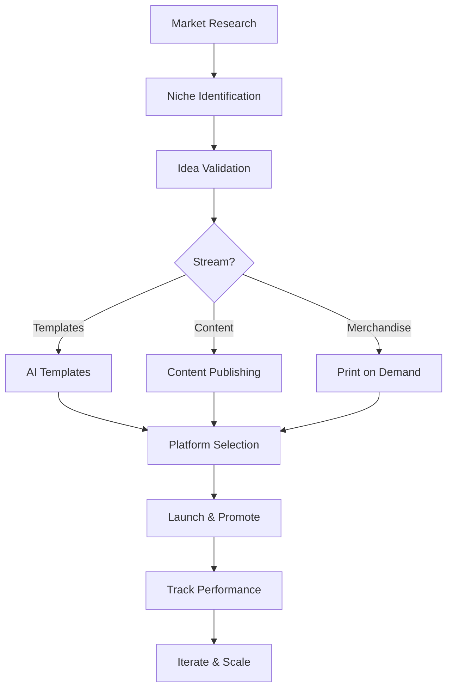

# Conversion Engineer Skill

**Specialized skill system for optimizing digital products for revenue, conversions, and monetization.**

> This is an umbrella skill containing three complementary income streams: AI Templates, Content Publishing, and Print on Demand. Each sub-skill operates independently but benefits from cross-promotion and audience building across the system.

---

## Overview

The Conversion Engineer skill transforms ideas into revenue-generating digital products through systematic workflows. It provides frameworks, templates, and agent prompts for building passive income streams optimized for technical founders with software engineering + creative skills.

**Key Philosophy:**
- Leverage existing technical skills to monetize expertise
- Build audience before building product
- Automate fulfillment (no inventory, no shipping complexity)
- Track ruthlessly and iterate based on metrics
- Create compounding returns (products earn after initial effort)

---

## Three Income Streams

### 1. AI Templates Sub-Skill
**`conversion-engineer/ai-templates/`**

Generate and monetize prompt libraries, automation workflows, and MCP servers.

- **Revenue Model:** $27-197 per sale (one-time or subscription)
- **Delivery:** Gumroad, Stan Store, Lemonsqueezy, or own site
- **Timeline:** 2-4 weeks from idea to launch
- **Effort:** 4-6 hours/week
- **Target Revenue (Y1):** $5,000/month

**Best for:** Prompt optimization, workflow automation, developer tools, creative pro workflows.

---

### 2. Content Publishing Sub-Skill
**`conversion-engineer/content-publishing/`**

Build authority and recurring revenue through technical writing, newsletters, and courses.

- **Revenue Model:** Subscriptions ($5-50/month) + sponsorships
- **Delivery:** Substack, Dev.to, Medium, Hashnode
- **Timeline:** 2-3 months to first paying subscribers
- **Effort:** 3-4 hours/week
- **Target Revenue (Y1):** $2,500/month

**Best for:** Developer education, technical authority building, SEO content, thought leadership.

---

### 3. Print on Demand Sub-Skill
**`conversion-engineer/print-on-demand/`**

Design and sell niche merchandise (apparel, accessories, home goods) through print fulfillment partners.

- **Revenue Model:** $5-15 margin per item
- **Delivery:** Redbubble, Printful, Printify, TeePublic
- **Timeline:** 2-6 weeks from design to first sales
- **Effort:** 2-3 hours/week
- **Target Revenue (Y1):** $1,000/month

**Best for:** Community building, brand reinforcement, passive income, merchandise for developer/designer audiences.

---

## System Architecture

```
conversion-engineer/
├── SKILL.md                    # This file
├── ai-templates/
│   ├── SKILL.md               # AI Templates sub-skill definition
│   ├── AGENT.md               # Ideation & development agent
│   ├── NICHE-RESEARCH.md      # Market analysis framework
│   └── PROJECT-TRACKER.md     # Metrics & backlog tracker
├── content-publishing/
│   ├── SKILL.md               # Content Publishing sub-skill definition
│   ├── AGENT.md               # Content ideation agent
│   ├── KEYWORD-RESEARCH.md    # SEO & trend research framework
│   └── PROJECT-TRACKER.md     # Publication pipeline tracker
└── print-on-demand/
    ├── SKILL.md               # Print on Demand sub-skill definition
    ├── AGENT.md               # Design generation agent
    ├── PROMPT-LIBRARY.md      # Image generation patterns
    └── PROJECT-TRACKER.md     # Product catalog tracker
```

---

## Workflow Overview



---

## Revenue Projections (Year 1 Conservative)

| Stream | Month 3 | Month 6 | Month 12 | Velocity |
|--------|---------|---------|----------|----------|
| AI Templates | $200 | $1,500 | $5,000 | 5 products |
| Content | $0 | $500 | $2,500 | 500 subscribers |
| POD | $100 | $400 | $1,000 | 20 designs |
| **Total** | **$300** | **$2,400** | **$8,500** | **9-13 hrs/week** |

**Key insight:** Focus on highest-ROI activities first (AI Templates), build content flywheel, use POD for brand/community.

---

## Quick Start

### Week 1: Foundation
1. Review all three sub-skill definitions (`ai-templates/SKILL.md`, `content-publishing/SKILL.md`, `print-on-demand/SKILL.md`)
2. Choose primary stream based on interests and skills
3. Set up required platforms (Gumroad, Substack, Redbubble as baselines)
4. Initialize project trackers for your chosen stream

### Weeks 2-4: First Product
1. Run market research in chosen stream (see `NICHE-RESEARCH.md` or `KEYWORD-RESEARCH.md`)
2. Validate idea using agent prompts (see `AGENT.md`)
3. Create and launch first product
4. Optimize listing with keywords and preview assets

### Month 2+: Build System
1. Launch second product in primary stream
2. Start secondary stream (usually content for authority + traffic)
3. Track metrics religiously
4. Iterate based on performance data
5. Add third stream if systems are stable

---

## Key Success Factors

1. **Start with highest-ROI first** - AI Templates has fastest path to revenue ($200 in month 1-2)
2. **Build content flywheel** - Articles drive template discovery and authority
3. **Use POD for brand building** - Reinforces technical identity with core audience
4. **Track everything** - Revenue, conversion, traffic, time spent (see PROJECT-TRACKER.md files)
5. **Iterate based on data** - Double down on winners, kill losers fast
6. **Cross-promote across streams** - Template users see content; content readers discover templates

---

## Integration Points

### With UX/UI Design System
Use the Design System skill to:
- Create conversion-optimized landing pages (`ux-ui-design-system/OUTPUTS/landing-pages.md`)
- Design professional product mockups (`ux-ui-design-system/OUTPUTS/svg-mockups.md`)
- Build authority through visual design quality
- Evaluate POD design quality (`ux-ui-design-system/EVAL/`)

**Example workflow:**
1. Identify AI template opportunity
2. Use UX Design System for sales page
3. Launch on platform
4. Track conversions using metrics in EVAL/conversion-benchmarks.md

---

## Sub-Skill Navigation

| Sub-Skill | Purpose | When to Use | Primary Files |
|-----------|---------|------------|----------------|
| **AI Templates** | Monetize expertise via digital products | You're technical + creative | `ai-templates/AGENT.md`, `NICHE-RESEARCH.md` |
| **Content Publishing** | Build authority + recurring revenue | You enjoy teaching/writing | `content-publishing/AGENT.md`, `KEYWORD-RESEARCH.md` |
| **Print on Demand** | Brand building + passive income | You want physical community artifacts | `print-on-demand/AGENT.md`, `PROMPT-LIBRARY.md` |

---

## Metrics to Track

All sub-skills track core metrics plus stream-specific ones:

**Universal:**
- Time spent (hours/week)
- Revenue generated ($/month)
- Products launched (#)
- Audience size (subscribers, followers, email list)

**AI Templates:**
- Revenue per template
- Downloads/refund rate
- Customer acquisition cost

**Content Publishing:**
- Paid subscriber conversion rate
- Free→Paid funnel
- Engagement (comments, shares, replies)

**Print on Demand:**
- Revenue per design
- Best sellers (top 20% revenue)
- Design upload velocity

---

## Platform Recommendations

**AI Templates (Quick Launch):**
- Primary: Gumroad ($10% fee, easiest onboarding)
- Growth: Own site at $2K/month revenue threshold

**Content Publishing (Authority):**
- Primary: Dev.to + Medium (discovery + SEO)
- Monetization: Substack (10% of paid subs)

**Print on Demand (Passive):**
- Marketplace: Redbubble (passive + discovery)
- Branded: Printify for higher margins on own store

---

## Next Steps

1. **Decide your primary stream** - Choose the one aligned with your strengths
2. **Read the sub-skill SKILL.md** - Go to `ai-templates/SKILL.md`, `content-publishing/SKILL.md`, or `print-on-demand/SKILL.md`
3. **Review the AGENT.md** - Each sub-skill has an agent for ideation and development
4. **Run market research** - Use NICHE-RESEARCH.md or KEYWORD-RESEARCH.md
5. **Initialize tracker** - Copy PROJECT-TRACKER.md template and start logging activities

---

## Version History

- **v0.1.0** (2026-02-02) - Initial Conversion Engineer umbrella skill definition with three income streams
- **Status:** Production-ready

---

*For detailed workflows, see the three sub-skill directories and their respective SKILL.md files.*
