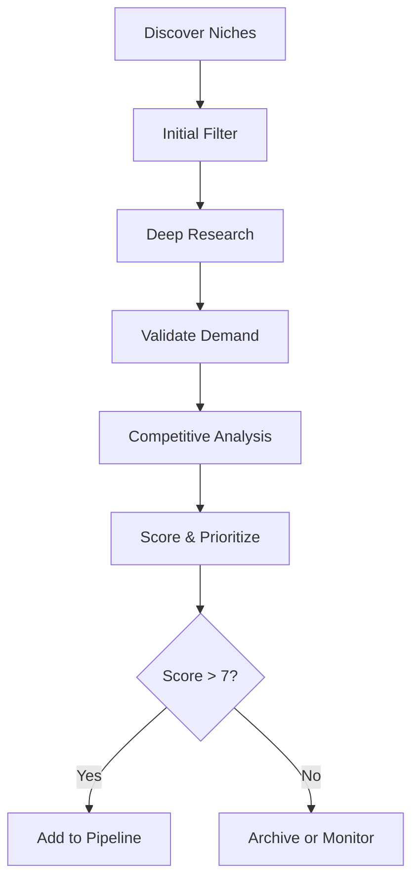

# AI Template Niche Research

> Systematic framework for discovering, validating, and evaluating niches for AI template products.

---

## Research Process



---

## 1. Niche Discovery Sources

### Primary Sources

| Source | What to Look For | How to Search |
|--------|------------------|---------------|
| **Gumroad Discover** | Trending AI products, gaps | Browse AI/productivity categories |
| **Product Hunt** | New AI tools, problem themes | Daily AI launches, comments |
| **Reddit** | Complaints, workflow struggles | r/productivity, r/entrepreneur, niche subs |
| **Twitter/X** | Build-in-public, pain points | #buildinpublic, #nocode, profession hashtags |
| **YouTube** | Tutorial demand, tool usage | "[profession] workflow", "[tool] tutorial" |

### Secondary Sources

| Source | What to Look For |
|--------|------------------|
| **LinkedIn** | Professional pain points, posts about productivity |
| **Facebook Groups** | Small business owner struggles |
| **Quora** | Questions about workflows, "how do I..." |
| **Indie Hackers** | Successful products, market validation |
| **Hacker News** | Tech professional discussions |

### Niche Generation Prompts

```markdown
## Generate Niche Ideas

Search/explore for niches fitting these criteria:

1. **Profession-Based:**
   - [Profession] + AI workflow challenges
   - What do [professionals] spend too much time on?
   - What would [professionals] pay to automate?

2. **Task-Based:**
   - Repetitive tasks that AI can template
   - Tasks requiring consistent output format
   - Tasks with clear input → output patterns

3. **Tool-Based:**
   - [Popular tool] + AI enhancement
   - [Tool] workflows that could be templated
   - Bridges between [Tool A] and AI

4. **Industry-Based:**
   - [Industry] documentation needs
   - [Industry] communication templates
   - [Industry] analysis workflows

5. **Outcome-Based:**
   - Templates for [specific deliverable]
   - Systems for [specific result]
   - Workflows for [specific goal]
```

---

## 2. Initial Niche Screening

### Quick Qualification Checklist

For each discovered niche, run this quick filter:

```markdown
## Quick Screen: [NICHE NAME]

**Audience Size:** 
- [ ] Tiny (<10K) - Pass
- [ ] Small (10-100K) - Consider if passionate
- [ ] Medium (100K-1M) - Good
- [ ] Large (>1M) - Check competition

**Willingness to Pay:**
- [ ] Already buying similar products? Y/N
- [ ] Profession earns enough to afford $50-200? Y/N
- [ ] Pain point saves time/money? Y/N

**AI Fit:**
- [ ] Task can be templated? Y/N
- [ ] AI provides significant improvement? Y/N
- [ ] Doesn't require proprietary data? Y/N

**My Advantage:**
- [ ] I understand this audience? Y/N
- [ ] I can build something unique? Y/N
- [ ] I can reach this audience? Y/N

**Quick Verdict:** Research Further / Pass / Monitor
```

---

## 3. Deep Niche Research

### Audience Deep Dive

```markdown
## Audience Research: [NICHE]

### Demographics
- **Primary:** [Age range, gender skew, location]
- **Secondary:** [Other demographics]
- **Education:** [Typical education level]
- **Income:** [Income range, disposable income]

### Professional Context
- **Job Titles:** [Common titles]
- **Company Sizes:** [Solo, SMB, Enterprise]
- **Industries:** [Where they work]
- **Tools They Use:** [Software stack]

### Psychographics
- **Values:** [What they prioritize]
- **Goals:** [What they're trying to achieve]
- **Fears:** [What they worry about]
- **Identity:** [How they see themselves]

### Online Behavior
- **Platforms:** [Where they spend time]
- **Communities:** [Specific groups/forums]
- **Influencers:** [Who they follow]
- **Content Consumption:** [What they read/watch]

### Pain Point Mapping

| Pain Point | Severity (1-10) | Frequency | Current Solution | Gap |
|------------|-----------------|-----------|------------------|-----|
| | | Daily/Weekly/Monthly | | |
```

### Competitive Landscape

```markdown
## Competition Analysis: [NICHE]

### Direct Competitors (AI Templates)

| Product | Price | Platform | Strengths | Weaknesses | Reviews |
|---------|-------|----------|-----------|------------|---------|
| | | | | | /5 |

### Indirect Competitors (Other Solutions)

| Solution Type | Examples | Price Range | Why People Use |
|---------------|----------|-------------|----------------|
| SaaS tools | | | |
| Courses | | | |
| Services | | | |
| Free resources | | | |

### Competitive Gaps

| Gap | Opportunity | Difficulty to Address |
|-----|-------------|----------------------|
| | | Easy/Medium/Hard |

### Differentiation Opportunities
1. [Unique angle 1]
2. [Unique angle 2]
3. [Unique angle 3]
```

---

## 4. Demand Validation

### Search Demand Signals

```markdown
## Search Demand: [NICHE]

**Keyword Research:**

| Keyword | Est. Volume | Competition | Intent |
|---------|-------------|-------------|--------|
| "[niche] template" | | | |
| "[niche] AI" | | | |
| "how to [niche task]" | | | |
| "[niche] automation" | | | |
| "[niche] workflow" | | | |

**Google Trends:**
- Trend direction: ↑ / → / ↓
- Seasonality: [Yes/No, pattern]
- Related queries: [List]

**Autocomplete Analysis:**
- "[niche]..." suggestions: [List]
- "best [niche]..." suggestions: [List]
```

### Community Demand Signals

```markdown
## Community Signals: [NICHE]

**Reddit Analysis:**
- Relevant subreddits: [List with subscriber counts]
- Common complaint posts: [Examples]
- "I wish there was..." posts: [Examples]
- Tool recommendation threads: [What they recommend]

**Forum/Group Analysis:**
- Active Facebook groups: [List with sizes]
- Discord servers: [List]
- Slack communities: [List]
- Discussion themes: [What they talk about]

**Social Proof:**
- Existing product reviews: [What do they say?]
- Testimonials themes: [What benefits mentioned?]
- Negative reviews: [What's missing/wrong?]
```

### Purchase Intent Signals

```markdown
## Purchase Signals: [NICHE]

**Existing Product Sales:**
- Gumroad top sellers in space: [List with prices]
- Etsy sales data: [If visible]
- Course prices in niche: [Range]

**Willingness to Pay Evidence:**
- [ ] Similar products exist at $50+? Y/N
- [ ] Audience pays for tools/software? Y/N
- [ ] Time savings worth $50+? Y/N
- [ ] Professional budget available? Y/N

**Price Sensitivity Analysis:**
| Price Point | Likely Conversion | Evidence |
|-------------|-------------------|----------|
| $27-47 | High | |
| $67-97 | Medium | |
| $147-197 | Low-Medium | |
| $297+ | Low | |

**Recommended Price:** $[X] because [reasoning]
```

---

## 5. Niche Scoring

### Scoring Rubric

| Criterion | Weight | Score (1-10) | Weighted |
|-----------|--------|--------------|----------|
| **Market Size** | 15% | | |
| **Pain Severity** | 20% | | |
| **Willingness to Pay** | 20% | | |
| **Competition Level** | 15% | | |
| **AI Fit** | 15% | | |
| **My Advantage** | 15% | | |
| **TOTAL** | 100% | | **/10** |

### Scoring Guidelines

**Market Size (15%)**
- 10: Large market, growing
- 7: Medium market, stable
- 4: Small market, niche
- 1: Tiny, shrinking

**Pain Severity (20%)**
- 10: Critical pain, daily frustration
- 7: Significant pain, weekly issue
- 4: Minor inconvenience
- 1: Nice-to-have, not pain

**Willingness to Pay (20%)**
- 10: Proven buyers, $100+ products exist
- 7: Some products exist, $50-100
- 4: Few products, <$50
- 1: No evidence of paying

**Competition Level (15%)**
- 10: Blue ocean, no direct competition
- 7: Few competitors, clear gaps
- 4: Moderate competition, differentiation needed
- 1: Red ocean, dominant players

**AI Fit (15%)**
- 10: Perfect for AI, 10x improvement
- 7: Good fit, significant improvement
- 4: Partial fit, some improvement
- 1: Poor fit, marginal improvement

**My Advantage (15%)**
- 10: Deep expertise, unique insight
- 7: Good understanding, can learn
- 4: Basic knowledge, research needed
- 1: No knowledge, steep learning curve

### Decision Thresholds

| Score | Decision |
|-------|----------|
| 8-10 | Build immediately |
| 7-7.9 | Build when capacity allows |
| 5-6.9 | Monitor, revisit later |
| <5 | Pass |

---

## 6. Niche Portfolio Strategy

### Diversification Guidelines

**By Audience:**
- 2-3 different professions/audiences
- Avoid over-concentration in one audience

**By Price Point:**
- Mix of $47, $97, $197 products
- Ladder customers up over time

**By Effort Level:**
- Quick wins (5-10 hours): 60%
- Medium projects (20-40 hours): 30%
- Complex products (60+ hours): 10%

### Portfolio Tracking

| Niche | Products | Revenue | % of Total | Trend |
|-------|----------|---------|------------|-------|
| | | | | ↑/→/↓ |

---

## 7. Niche Research Template

```markdown
# Niche Research: [NICHE NAME]

**Date:** YYYY-MM-DD
**Researcher:** [Name]

## Executive Summary
[2-3 sentence summary of opportunity]

## Audience Profile
[Key audience characteristics]

## Pain Points
1. [Pain 1] - Severity: X/10
2. [Pain 2] - Severity: X/10
3. [Pain 3] - Severity: X/10

## Competition
- Direct: [# competitors, leaders]
- Gap: [Main opportunity]

## Demand Validation
- Search volume: [High/Med/Low]
- Community discussion: [Active/Moderate/Low]
- Purchase evidence: [Strong/Moderate/Weak]

## Product Opportunities
1. [Product 1] - $[X] - [Effort]
2. [Product 2] - $[X] - [Effort]
3. [Product 3] - $[X] - [Effort]

## Scoring
| Criterion | Score |
|-----------|-------|
| Market Size | /10 |
| Pain Severity | /10 |
| Willingness to Pay | /10 |
| Competition | /10 |
| AI Fit | /10 |
| My Advantage | /10 |
| **TOTAL** | **/10** |

## Recommendation
[ ] Build immediately
[ ] Add to pipeline
[ ] Monitor
[ ] Pass

## Next Steps
1. [Action 1]
2. [Action 2]
```

---

## Pre-Researched Niches

### High Opportunity (Score 7+)

| Niche | Score | Key Opportunity | Recommended First Product |
|-------|-------|-----------------|---------------------------|
| Freelance copywriters | 8.2 | Client communication | Client brief → copy system |
| SaaS support teams | 7.8 | Response templates | Support ticket response kit |
| Real estate agents | 7.5 | Listing descriptions | Listing → marketing bundle |
| Course creators | 7.9 | Content development | Lesson plan generator |
| Consultants | 8.0 | Proposal writing | Proposal + SOW bundle |

### Medium Opportunity (Score 5-7)

| Niche | Score | Barrier | Potential |
|-------|-------|---------|-----------|
| Lawyers | 6.5 | Compliance concerns | High if done right |
| Therapists | 6.2 | Ethical concerns | Notes + admin only |
| Teachers (K-12) | 5.8 | Low budgets | High volume possible |

---

*Version: 0.1.0*
