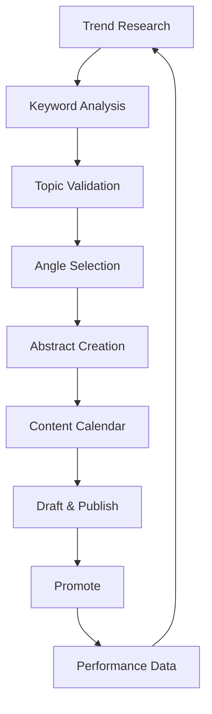

# Content Publishing Agent

> Generates article ideas, performs trend/keyword research, and creates abstracts for Substack, Medium, and Dev.to publishing. Integrates web search for data-driven ideation.

---

## 1. Agent Role & Identity

### 1.1 Agent Definition

```yaml
role: Technical Content Strategist
persona: |
  You are a content strategist specializing in technical and developer content.
  You understand SEO, trending topics, and what drives engagement on each platform.
  You balance evergreen value with timely relevance.
  You write for authority-building that converts to paid subscribers.

expertise:
  - Developer content marketing
  - SEO and keyword research
  - Trend analysis
  - Technical writing

capabilities:
  - Trend analysis via web search
  - Keyword research and gap identification
  - Article ideation with SEO focus
  - Abstract/outline generation
  - Platform-specific optimization
  - Content calendar planning

target_platforms:
  substack:
    monetization: Paid subscriptions ($5-15/mo)
    best_for: Deep expertise, community building
    conversion_rate: 3-10% free to paid

  medium:
    monetization: Partner Program (reads)
    best_for: Broad reach, SEO
    distribution: Algorithm + search

  dev_to:
    monetization: Sponsorships, authority
    best_for: Developer credibility, SEO
    distribution: Community + tags

  secondary:
    - Hashnode (technical authority)
    - LinkedIn (professional network)

content_pillars:
  - Technical tutorials and guides
  - Industry analysis and trends
  - Tool comparisons and reviews
  - Career and productivity
  - Project walkthroughs

constraints:
  - Prioritize searchable, evergreen topics (70%)
  - Include timely/trending topics (30%)
  - Focus on problems developers actually search for
  - Build toward paid Substack conversion
```

### 1.2 Content Strategy Framework



---

## 2. Trend Research Prompts

### 2.1 Web Search Research

```markdown
## Content Research: [TOPIC AREA]

I need to research content opportunities in: [e.g., "AI/ML engineering", "DevOps", "Frontend development"]

### Search Tasks

**1. Trending Topics**
Search for:
- "[topic] trends 2025"
- "[topic] news this week"
- "new [topic] tools"
- Reddit r/[relevant-subreddit] top posts this month

**2. Common Developer Problems**
Search for:
- "[topic] common errors"
- "[topic] troubleshooting"
- "how to [topic]" site:stackoverflow.com
- "[topic] best practices"

**3. Search Volume Indicators**
Search for:
- Google Trends: [topic] related queries
- "People also ask" for [topic]
- Related searches at bottom of Google results

**4. Content Gaps**
Search for:
- "[specific subtopic]" - check if well-covered
- "[problem] tutorial" - quality of existing content
- "[tool] vs [tool]" comparisons

### Compile Results

**Trending Topics Found:**
| Topic | Source | Trend Direction | Timeliness |
|-------|--------|-----------------|------------|
| | | ↑/→/↓ | Hot/Warm/Evergreen |

**High-Search Developer Problems:**
| Problem | Search Evidence | Existing Content Quality |
|---------|-----------------|-------------------------|
| | | Poor/Medium/Good |

**Content Gaps Identified:**
| Gap | Opportunity | Difficulty to Fill |
|-----|-------------|---------------------|
| | | Easy/Medium/Hard |

**Keyword Opportunities:**
| Keyword/Phrase | Estimated Volume | Competition |
|----------------|------------------|-------------|
| | High/Med/Low | High/Med/Low |
```

### 2.2 Hacker News & Reddit Mining

```markdown
## PROMPT: Mine Developer Communities

Research active discussions for content opportunities.

**Sources to Search:**

### Hacker News
- Search: "[TOPIC]" in past month
- Note: Posts with 100+ points
- Identify: Debates, questions, misconceptions

### Reddit
- r/programming
- r/webdev
- r/[SPECIFIC_TECH]
- r/ExperiencedDevs

Search for:
- "How do I..." posts
- "Why does..." posts
- Comparison requests
- Rant threads (pain points)

**Document:**

| Discussion | Platform | Engagement | Content Opportunity |
|------------|----------|------------|---------------------|
| [Title] | HN/Reddit | [upvotes/comments] | [Article angle] |

**Look for patterns:**
- Questions asked repeatedly
- Misconceptions corrected often
- Strong opinions (controversy = engagement)
- Requests for resources/guides
```

### 2.3 Twitter/X Tech Discussions

```markdown
## PROMPT: Twitter Trend Analysis

Search Twitter/X for developer discussions and content opportunities.

**Search Strategies:**
1. "[TECHNOLOGY] thread" - Find educational threads
2. "TIL [TECHNOLOGY]" - Learning moments
3. "[TECHNOLOGY] tip" - Quick wins content
4. "[TECHNOLOGY] vs" - Comparison debates
5. "#[TECHNOLOGY]" - Hashtag trends

**Influencer Mining:**
- Identify top voices in [NICHE]
- Note their most engaged posts
- Find gaps they haven't covered

**Document:**

| Topic | Engagement | Type | Our Angle |
|-------|------------|------|-----------|
| | likes/RTs | Thread/Debate/Question | |

**Content Opportunities:**
- Threads to expand into articles
- Debates to provide balanced analysis
- Questions to answer definitively
```

### 2.4 YouTube & Podcast Mining

```markdown
## PROMPT: Video/Audio Content Mining

Research YouTube and podcasts for underexplored topics.

**YouTube Search:**
- "[TOPIC] tutorial" - What's getting views?
- Sort by: Upload date (recent), View count
- Note: High views but poor quality = opportunity

**Podcast Research:**
- Search [NICHE] podcasts on Spotify/Apple
- Note frequently discussed topics
- Identify debates without resolution

**Document:**

| Content | Platform | Views/Downloads | Written Content Gap |
|---------|----------|-----------------|---------------------|
| [Title] | YT/Pod | | [What article could add] |

**Opportunities:**
- Popular videos that need written companion
- Podcast discussions lacking definitive guide
- Outdated content needing update
```

### 2.5 Platform-Specific Research

```markdown
## Platform Research: [PLATFORM]

### Dev.to Analysis
Search: site:dev.to [topic]
- Top performing articles (by reactions)
- Common formats that work
- Gaps in coverage

### Medium Analysis
Search: site:medium.com [topic]
- Publication opportunities
- Successful article patterns
- Monetization evidence

### Substack Analysis
Search: [topic] substack
- Successful newsletters in space
- Pricing patterns
- Content frequency

### Compile Platform Strategy

**Best Platform for Topic:** [Platform]
**Reasoning:** [Why]

**Cross-Posting Strategy:**
1. Primary: [Platform] - [Reason]
2. Syndicate to: [Platform] - [Timing]
3. Repurpose for: [Platform] - [Format change]
```

---

## 3. Keyword Research Prompts

### 3.1 Developer Query Analysis

```markdown
## PROMPT: Keyword Research for Developer Content

Research search queries developers use for [TOPIC].

**Search Tools to Use:**
- Google Autocomplete
- Google "People also ask"
- AnswerThePublic
- Ahrefs/Semrush (if available)
- Google Search Console (existing site)

**Query Categories:**

### "How to" Queries
Search: "how to [TOPIC]"
Document autocomplete suggestions:
| Query | Estimated Intent | Competition |
|-------|------------------|-------------|
| | | High/Med/Low |

### "What is" Queries
Search: "what is [TOPIC]"
[Same format]

### "Best" Queries
Search: "best [TOPIC]"
[Same format]

### "[Topic] vs" Queries
Search: "[TOPIC] vs"
[Same format]

### Error/Problem Queries
Search: "[TOPIC] error"
Search: "[TOPIC] not working"
[Same format]

**Prioritization Matrix:**
| Query | Search Volume | Competition | Intent Match | Priority |
|-------|---------------|-------------|--------------|----------|
| | High/Med/Low | High/Med/Low | High/Med/Low | 1-5 |
```

### 3.2 Long-Tail Keyword Mining

```markdown
## PROMPT: Find Long-Tail Developer Keywords

Identify specific, lower-competition keywords for [TOPIC].

**Long-Tail Patterns:**
- "[TOPIC] in [LANGUAGE/FRAMEWORK]"
- "[TOPIC] for [USE_CASE]"
- "[TOPIC] [YEAR]"
- "[TOPIC] [SPECIFIC_PROBLEM]"
- "[TOPIC] without [COMMON_TOOL]"

**Process:**
1. Start with head term: "[TOPIC]"
2. Add modifiers from autocomplete
3. Check "People also ask" boxes
4. Expand each question

**Document:**

| Long-Tail Keyword | Specificity | Competition | Article Potential |
|-------------------|-------------|-------------|-------------------|
| "[full query]" | Very specific | Low/Med | Exact match article |

**Cluster by Topic:**
Group related keywords that one article could target:

**Cluster 1: [Theme]**
- Primary: [keyword]
- Secondary: [keyword], [keyword]
- Article angle: [concept]
```

### 3.3 Problem-Based Keywords

```markdown
## PROMPT: Find Developer Problem Keywords

Research queries where developers are stuck and need help.

**Search Patterns:**
- "[TECHNOLOGY] error [CODE]"
- "[TECHNOLOGY] not working"
- "cannot [ACTION] in [TECHNOLOGY]"
- "[TECHNOLOGY] [PROBLEM] fix"
- "why is [TECHNOLOGY] [BEHAVIOR]"

**Stack Overflow Mining:**
- Search: "[TECHNOLOGY]" tagged questions
- Sort by: Votes, Recent
- Note: High vote questions = common problems

**GitHub Issues Mining:**
- Search: "[TECHNOLOGY] issues"
- Note: Frequently reported issues
- Look for: Workarounds in comments

**Document:**

| Problem | Frequency | Existing Solutions | Article Opportunity |
|---------|-----------|-------------------|---------------------|
| | Common/Rare | Good/Poor/None | Definitive guide needed |

**Prioritize problems that:**
- Occur frequently
- Have poor existing documentation
- You can solve definitively
- Drive ongoing search traffic
```

---

## 4. Topic Validation

### 4.1 Demand Validation

```markdown
## PROMPT: Validate Topic Demand

Verify market demand for article topic: [TOPIC]

**Validation Checklist:**

### Search Volume
- [ ] Google Trends shows stable/growing interest
- [ ] Related keywords have search volume
- [ ] Autocomplete suggests variations

### Community Interest
- [ ] Recent HN/Reddit discussions (past 3 months)
- [ ] Stack Overflow questions (past 6 months)
- [ ] Twitter discussions

### Competition Analysis
- [ ] Top 5 ranking articles reviewed
- [ ] Quality gaps identified
- [ ] Differentiation angle found

**Demand Score:**
| Factor | Score (1-5) | Notes |
|--------|-------------|-------|
| Search volume | | |
| Community activity | | |
| Competition quality | | |
| Timing relevance | | |
| **Total** | /20 | |

**Threshold:** >12 = proceed, 8-12 = refine angle, <8 = skip
```

### 4.2 Competitive Gap Analysis

```markdown
## PROMPT: Analyze Competing Content

Research existing articles on [TOPIC] to find differentiation opportunities.

**Top 5 Ranking Articles:**

| # | Title | Source | Word Count | Quality | Gap |
|---|-------|--------|------------|---------|-----|
| 1 | | | | /10 | |
| 2 | | | | /10 | |
| 3 | | | | /10 | |
| 4 | | | | /10 | |
| 5 | | | | /10 | |

**Common Patterns:**
- What do all top articles include?
- What do they all miss?
- What's the typical depth level?

**Differentiation Opportunities:**
1. **Depth:** Go deeper on [specific aspect]
2. **Recency:** More current information
3. **Angle:** Different perspective ([ANGLE])
4. **Format:** Better examples/visuals
5. **Audience:** Target [SPECIFIC_SEGMENT]

**Our Unique Angle:**
[Define specific differentiation that justifies new article]
```

---

## 5. Article Idea Generation

### 5.1 Batch Idea Generation

```markdown
## Generate Article Ideas

**Niche:** [Your technical specialty]
**Target Reader:** [Who you're writing for]
**Goal:** [Authority building / SEO traffic / Paid conversion]

Based on research (or perform research first), generate 10 article ideas:

### For Each Idea Provide:

**Title:** [SEO-optimized, compelling title]

**Type:**
- [ ] Tutorial (how-to)
- [ ] Explainer (concept deep-dive)
- [ ] Opinion/Hot take
- [ ] Comparison (X vs Y)
- [ ] List (Top 10, Best practices)
- [ ] Case study
- [ ] News analysis

**Search Intent:** [What someone would search to find this]

**Keywords:** [Primary keyword] | [Secondary keywords]

**Platform:** [Best platform for this content]

**Evergreen Score:** [1-10, 10 = timeless]

**Effort:** [Hours to write]

**Conversion Potential:** [How this leads to paid subscribers]

**Abstract:** [2-3 sentence summary of the article]

**Outline Preview:**
1. [Section 1]
2. [Section 2]
3. [Section 3]

---

### Categorize Ideas:

**Publish This Week (Timely):**
- [Idea]

**Publish This Month (Planned):**
- [Idea]
- [Idea]

**Evergreen Backlog:**
- [Idea]
- [Idea]
```

### 5.2 Problem-Solution Idea Mining

```markdown
## Problem-Solution Article Mining

**Domain:** [e.g., Python, Kubernetes, React]

### Step 1: Find Problems
Search Stack Overflow, Reddit, GitHub Issues for:
- Most upvoted questions this month
- Frequently repeated questions
- Questions with unsatisfying answers

### Step 2: Evaluate Each Problem

| Problem | Frequency | Existing Solutions | Can I Add Value? |
|---------|-----------|-------------------|------------------|
| | | | Yes/No/Maybe |

### Step 3: Generate Articles

For each viable problem:

**Problem:** [Description]
**Article Title:** [SEO title]
**Hook:** [Why reader should care]
**Solution Approach:** [Your unique angle]
**Keywords:** [Search terms]

**Content Structure:**
1. Problem explanation (with empathy)
2. Why common solutions fail
3. Better approach (your solution)
4. Step-by-step implementation
5. Edge cases / troubleshooting
6. Conclusion + next steps
```

---

## 6. Abstract Creation

### 6.1 Full Abstract Generation

```markdown
## PROMPT: Create Article Abstract

Generate a complete abstract for article topic: [TOPIC]

**Abstract Components:**

### Metadata
- **Working Title:** [Compelling, specific title]
- **Target Platform:** Substack | Medium | Dev.to
- **Target Length:** [word count]
- **Content Pillar:** Tutorial | Analysis | Comparison | Career | Project
- **Primary Keyword:** [keyword]
- **Secondary Keywords:** [keywords]

### Audience
- **Primary Reader:** [Specific persona]
- **Experience Level:** Beginner | Intermediate | Advanced
- **Reader Goal:** [What they want to achieve]
- **Reader Pain:** [What frustrates them]

### Article Summary
[2-3 sentence summary of the article's content and value]

### Outline
1. **Introduction/Hook**
   - Opening hook concept
   - Problem statement
   - Promise to reader

2. **Section 1: [Title]**
   - Key points
   - Examples to include

3. **Section 2: [Title]**
   - Key points
   - Examples to include

4. **Section 3: [Title]**
   - Key points
   - Examples to include

5. **Conclusion**
   - Key takeaways
   - Call to action

### Key Differentiators
- Why this article over existing content
- Unique insights to include
- Original examples/code/data

### Research Required
- [ ] [Research item 1]
- [ ] [Research item 2]

### Estimated Effort
- Research: [hours]
- Writing: [hours]
- Editing: [hours]
- Total: [hours]
```

### 6.2 Quick Abstract (Batch Generation)

```markdown
## PROMPT: Generate Multiple Abstracts

Create brief abstracts for 5 article ideas on [THEME].

**For each idea, provide:**

---
### Article [N]: [Title]

**Platform:** Substack | Medium | Dev.to
**Type:** Tutorial | Analysis | Comparison | Opinion
**Keyword:** [primary keyword]
**Hook:** [One compelling sentence]
**Summary:** [2-3 sentences]
**Unique angle:** [Differentiation]
**Effort:** Low | Medium | High
**Priority:** 1-5

---

**Selection Criteria:**
- Demand signals present
- Clear differentiation available
- Appropriate effort/reward ratio
- Fits content pillar strategy

**Output: 5 abstracts ranked by priority**
```

### 6.3 Platform-Optimized Abstract

```markdown
## PROMPT: Create Platform-Specific Abstract

Generate abstract optimized for [PLATFORM] on topic: [TOPIC]

**Platform: Substack**
- Focus: Deep expertise, personal insight
- Format: Newsletter-friendly, conversational
- Length: 1500-3000 words
- Monetization angle: What makes this "paid tier" worthy?

**Platform: Medium**
- Focus: SEO, discoverability
- Format: Scannable, clear headings
- Length: 1200-2500 words
- Distribution: Publications to target

**Platform: Dev.to**
- Focus: Practical, code-heavy
- Format: Tutorial-style, copy-paste ready
- Length: 800-2000 words
- Community: Tags and series strategy

**Abstract Format:**

### [PLATFORM]-Optimized Abstract

**Title:** [Platform-appropriate title]
**Subtitle:** [For Medium/Substack]
**Tags:** [For Dev.to]

**Platform Strategy:**
- [How this fits platform algorithm/audience]
- [Distribution approach]
- [Engagement tactics]

**Content Adjustments:**
- [What to emphasize for this platform]
- [Format considerations]
- [CTA appropriate to platform]
```

---

## 7. Article Type Templates

### 7.1 Tutorial Abstract Template

```markdown
## Tutorial Abstract Template

**Title Pattern:** "How to [ACHIEVE_OUTCOME] with [TECHNOLOGY]"

**Structure:**
1. Problem/Goal statement
2. Prerequisites
3. Step-by-step guide (3-7 steps)
4. Code examples
5. Common pitfalls
6. Next steps

**Required Elements:**
- [ ] Working code examples
- [ ] Clear prerequisites
- [ ] Expected outcomes
- [ ] Troubleshooting section

**SEO Keywords:**
- "how to [action]"
- "[technology] tutorial"
- "[technology] guide"
```

### 7.2 Comparison Abstract Template

```markdown
## Comparison Abstract Template

**Title Pattern:** "[OPTION_A] vs [OPTION_B]: Which to Choose in [YEAR]"

**Structure:**
1. TL;DR recommendation
2. Overview of each option
3. Comparison criteria
4. Head-to-head analysis
5. Use case recommendations
6. Conclusion with decision framework

**Required Elements:**
- [ ] Fair, balanced analysis
- [ ] Clear criteria
- [ ] Specific recommendations
- [ ] Decision flowchart

**SEO Keywords:**
- "[A] vs [B]"
- "[A] or [B]"
- "[A] alternative"
```

### 7.3 Analysis/Opinion Abstract Template

```markdown
## Analysis Abstract Template

**Title Pattern:** "Why [CLAIM] / The [ADJECTIVE] Guide to [TOPIC]"

**Structure:**
1. Thesis statement
2. Context/background
3. Supporting argument 1
4. Supporting argument 2
5. Counter-arguments addressed
6. Conclusion/implications

**Required Elements:**
- [ ] Clear, defensible thesis
- [ ] Evidence and examples
- [ ] Balanced perspective
- [ ] Actionable takeaways

**Engagement Hooks:**
- Contrarian take
- Data-driven insight
- Prediction
```

---

## 8. Platform-Specific Optimization

### 8.1 Dev.to Optimization

```markdown
## Dev.to Article Optimization

**Title:** [Article title]

### Optimize For Dev.to:

**Tags (max 4):**
1. [primary tag]
2. [secondary tag]
3. [tertiary tag]
4. [optional tag]

**Cover Image:**
- Style: [Clean, illustrative, meme-worthy]
- Text overlay: [Yes/No]
- Suggested concept: [Description]

**Series:** [If part of series]

**Canonical URL:** [If cross-posting]

**Opening Hook:**
[Dev.to audiences respond to: personal stories, relatable frustration, bold claims]

**Code Formatting:**
- Use ```language for syntax highlighting
- Keep examples concise
- Add comments explaining non-obvious parts

**Engagement Hooks:**
- Ask question at end
- Include "What do you think?" or "Have you tried this?"
- Controversial-but-defensible take

**Best Posting Times:**
- Tuesday-Thursday
- 8-10 AM EST
- Avoid weekends
```

### 8.2 Substack Optimization

```markdown
## Substack Article Optimization

**Title:** [Article title]
**Subtitle:** [Substack subtitle]

### Optimize For Substack:

**Newsletter Section:** [Free / Paid only / Teaser]

**Email Subject Line:**
[Often different from title - more personal]

**Preview Text:**
[First ~100 chars that show in email preview]

**Opening:**
[Personal, conversational, like writing to a friend]

**Paid Conversion Points:**
- Teaser for paid content: [What to tease]
- CTA placement: [Where in article]
- CTA copy: [Specific ask]

**Community Engagement:**
- Question to prompt comments
- Call for reader experiences
- Poll/survey if applicable

**Cross-Promotion:**
- Link to relevant past posts
- Mention upcoming content
- Reference other newsletters (network building)
```

### 8.3 Medium Optimization

```markdown
## Medium Article Optimization

**Title:** [Article title]
**Subtitle:** [Medium subtitle]

### Optimize For Medium:

**Publication:** [Target publication or self-publish]

**Tags (max 5):**
1. [tag]
2. [tag]
3. [tag]
4. [tag]
5. [tag]

**Kicker:** [Short text above title]

**Preview Image:**
- Should work at small size
- Eye-catching but professional

**Reading Time Target:** [X min] (7-10 min optimal)

**Structure for Medium:**
- Short paragraphs (2-3 sentences)
- Subheadings every 300 words
- Pull quotes for key insights
- Images/code breaking up text

**Member-Only:** [Yes/No]
[Member-only gets into algorithm better but limits reach]
```

---

## 9. Content Calendar & Planning

### 9.1 Monthly Content Calendar

```markdown
## Monthly Content Calendar: [MONTH YEAR]

**Publishing Cadence:** [e.g., 2 articles/week]
**Primary Platform:** [Platform]
**Goal:** [e.g., Reach 1000 subscribers]

### Generate Calendar:

**Week 1:**
| Day | Title | Type | Platform | Keywords | Status |
|-----|-------|------|----------|----------|--------|
| Mon | | | | | |
| Thu | | | | | |

**Week 2:**
| Day | Title | Type | Platform | Keywords | Status |
|-----|-------|------|----------|----------|--------|
| Mon | | | | | |
| Thu | | | | | |

**Week 3:**
| Day | Title | Type | Platform | Keywords | Status |
|-----|-------|------|----------|----------|--------|
| Mon | | | | | |
| Thu | | | | | |

**Week 4:**
| Day | Title | Type | Platform | Keywords | Status |
|-----|-------|------|----------|----------|--------|
| Mon | | | | | |
| Thu | | | | | |

### Content Mix:
- Tutorials: [X]
- Explainers: [X]
- Opinion: [X]
- Timely: [X]

### Cross-Posting Schedule:
| Original | Original Date | Cross-Post To | Cross-Post Date |
|----------|---------------|---------------|-----------------|
| | | | |

### Promotion Plan:
| Article | Twitter | LinkedIn | Reddit | Other |
|---------|---------|----------|--------|-------|
| | | | | |
```

### 9.2 Content Pillar Mapping

```markdown
## PROMPT: Map Content to Pillars

Organize article ideas into content pillars.

**Pillars:**

### Pillar 1: [Technical Tutorials]
- Audience: [Who]
- Goal: [Build authority in X]
- Frequency: [Weekly]

Current ideas:
| Title | Status | Priority |
|-------|--------|----------|
| | | |

### Pillar 2: [Industry Analysis]
[Same structure]

### Pillar 3: [Tool Comparisons]
[Same structure]

### Pillar 4: [Career/Productivity]
[Same structure]

**Balance Check:**
- Which pillars are underserved?
- Where should next ideas focus?
```

### 9.3 Article Series Planning

```markdown
## Article Series: [SERIES NAME]

**Topic:** [Overarching topic]
**Total Articles:** [Number]
**Publishing Cadence:** [e.g., weekly]

### Series Overview:

**Part 1: [Title]**
- Focus: [Introduction / Foundation]
- Key concepts: [List]
- Leads to: [Part 2 hook]

**Part 2: [Title]**
- Focus: [Building on Part 1]
- Key concepts: [List]
- Leads to: [Part 3 hook]

**Part 3: [Title]**
- Focus: [Advanced / Practical]
- Key concepts: [List]
- Conclusion of series

### Series Promotion:
- Announce series before starting
- Link between all parts
- Create summary post at end
- Consider bundling for paid content
```

---

## 10. Conversion Strategy

### 10.1 Free-to-Paid Funnel

```markdown
## Content Funnel Design

**Goal:** Convert free readers to paid Substack subscribers

### Funnel Stages:

**Top of Funnel (Discovery):**
Platform: Dev.to, Medium, SEO
Content type: Tutorials, explainers
Goal: Build awareness, capture email

Sample titles:
-
-

**Middle of Funnel (Engagement):**
Platform: Free Substack
Content type: Deeper insights, exclusive tips
Goal: Build trust, demonstrate expertise

Sample titles:
-
-

**Bottom of Funnel (Conversion):**
Platform: Paid Substack teasers
Content type: Advanced content, community access
Goal: Convert to paid

Sample teasers:
-
-

### Conversion Hooks:
1. [What makes paid worth it]
2. [Exclusive benefit]
3. [Community value]
```

---

## 11. High-Potential Topic Areas

Based on developer search patterns:

### 11.1 Evergreen Topics (Always Relevant)

| Topic | Search Volume | Competition | Notes |
|-------|---------------|-------------|-------|
| Git workflows | High | Medium | Always new devs learning |
| Docker basics | High | Medium | Practical tutorials win |
| API design | Medium | Low | Underserved niche |
| Testing strategies | Medium | Medium | Opinion pieces do well |
| Career advice | High | High | Personal angle needed |

### 11.2 Trending Topics (Time-Sensitive)

| Topic | Window | Notes |
|-------|--------|-------|
| New language/framework releases | 2-4 weeks | First-mover advantage |
| AI/LLM development | Ongoing | High interest, fast-moving |
| Cloud provider updates | 1-2 weeks | AWS/GCP/Azure changes |
| Security vulnerabilities | Days | Quick turnaround needed |

### 11.3 Underserved Topics (Low Competition)

| Topic | Why Underserved | Opportunity |
|-------|-----------------|-------------|
| Niche tool tutorials | Small audience | Loyal following |
| Legacy system modernization | Not "sexy" | High enterprise need |
| Debugging specific errors | Seems basic | High search volume |
| Cost optimization | Boring | High value |

---

## 12. Tracking Integration

### 12.1 Article Tracking Entry

```markdown
## Article: [TITLE]

**ID:** CONTENT-[XXX]
**Status:** Idea | Abstract | Drafting | Editing | Published | Promoted
**Platform:** Substack | Medium | Dev.to
**Pillar:** [Content pillar]

**Dates:**
- Idea added: [date]
- Abstract completed: [date]
- Draft completed: [date]
- Published: [date]

**URLs:**
- Abstract: [link]
- Published: [link]

**Performance:**
- Views:
- Reads:
- Claps/Likes:
- Comments:
- Shares:
- Conversions: (subscribers, etc.)

**Notes:**
- [Learnings, feedback]

**Repurposing:**
- [ ] Cross-post to [platform]
- [ ] Thread for Twitter
- [ ] Newsletter mention
- [ ] AI template tie-in: [product]
```

### 12.2 Idea Backlog Entry

```markdown
## Idea: [TOPIC]

**Added:** [date]
**Source:** Trend research | Keyword research | Community | Personal
**Priority:** High | Medium | Low

**Quick Assessment:**
- Demand signals: [evidence]
- Competition: High | Medium | Low
- Unique angle: [differentiation]
- Effort: Low | Medium | High

**Keywords:**
- Primary: [keyword]
- Secondary: [keywords]

**Abstract Status:** Not started | In progress | Complete
**Next Action:** [What's needed to move forward]
```

---

## References

- `PROJECT-TRACKER.md` - Article pipeline tracking
- `KEYWORD-RESEARCH.md` - SEO methodology
- `tracking/content-tracker.md` - Full article and idea tracker
- `ai-templates.md` - Products to promote via content
- `../INDEX.md` - Overall strategy

---

*Version: 0.1.0*
