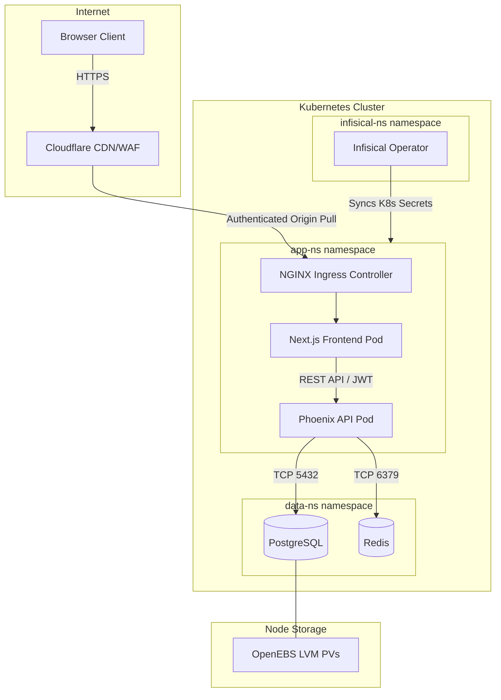

# Worked Example: Kubernetes Web Application Threat Model

**Date:** 2026-05-12
**Scope:** Full-stack web application deployed on Kubernetes — Next.js frontend, Phoenix API, PostgreSQL, Redis, Infisical secrets, OpenEBS storage, Cloudflare ingress
**Framework:** STRIDE
**Risk Appetite:** Balanced

## System Overview

Acme Dashboard is a multi-tenant SaaS analytics platform. Users authenticate via JWT, interact with a Next.js frontend served through Cloudflare, which proxies requests to a Phoenix API backend. The API reads and writes to PostgreSQL for persistent data and Redis for session caching. The entire stack runs on a self-hosted Kubernetes cluster managed with Helm charts. Secrets are managed by Infisical Operator syncing InfisicalSecret CRDs to Kubernetes Secrets. Storage uses OpenEBS LVM with pre-provisioned PersistentVolumes.

The system handles PII (user email, name, billing info) and business-sensitive analytics data. Regulatory scope includes GDPR (EU users) and SOC2 Type II (enterprise customers).

---

## Step 1: Decompose

### Architecture Diagram

### Components

| Component | Type | Trust Zone | Data Handled |
|-----------|------|------------|--------------|
| Cloudflare | CDN/WAF/TLS termination | External (trusted) | All HTTP traffic, TLS certificates |
| NGINX Ingress | Reverse proxy | Cluster perimeter | HTTP headers, routing, IP whitelists |
| Next.js Frontend | Web server (SSR) | Application zone | Session tokens, rendered HTML, API responses |
| Phoenix API | Application server | Application zone | JWT tokens, PII, analytics data, business logic |
| PostgreSQL | Database | Data zone | All persistent data including PII and credentials |
| Redis | Cache/session store | Data zone | Session data, cached queries, rate limit counters |
| Infisical Operator | Secrets sync | Secrets zone | Database credentials, API keys, JWT signing keys |
| OpenEBS LVM | Storage provisioner | Node-level | Database files, WAL logs |

### Data Flows

| From | To | Data | Protocol | Encrypted |
|------|-----|------|----------|-----------|
| User | Cloudflare | HTTP requests, credentials | HTTPS (TLS 1.3) | Yes |
| Cloudflare | Ingress | Proxied requests | HTTPS (origin pull) | Yes |
| Ingress | Frontend | HTTP requests | HTTP (cluster internal) | No |
| Frontend | API | REST calls with JWT | HTTP (cluster internal) | No |
| API | PostgreSQL | SQL queries with PII | TCP | No (cluster-internal) |
| API | Redis | Session data | TCP | No (cluster-internal) |
| Infisical | K8s API | Secret objects | HTTPS (mTLS) | Yes |

### Trust Boundaries

| Boundary | Between | Controls |
|----------|---------|----------|
| Internet to Cluster | Cloudflare <-> Ingress | Cloudflare WAF, IP whitelist, authenticated origin pull, TLS |
| Cluster Perimeter to App | Ingress <-> Pods | NGINX rate limiting, path-based routing |
| App to Data | API <-> PostgreSQL/Redis | Network policies, credential-based auth |
| Namespace Isolation | app-ns <-> data-ns | Kubernetes network policies, RBAC |
| Secrets Boundary | Infisical <-> Workloads | RBAC on Secret objects, Infisical access policies |

---

## Step 2: Enumerate Attack Surface

### Entry Points

1. **Cloudflare edge** — Public HTTPS endpoint; first point of contact
2. **NGINX Ingress** — Accepts connections from Cloudflare IPs only (whitelist)
3. **REST API endpoints** — 15 endpoints, 12 require JWT authentication
4. **PostgreSQL port 5432** — Accessible within data-ns, credential-protected
5. **Redis port 6379** — Accessible within data-ns, no authentication by default
6. **Kubernetes API server** — Cluster management plane
7. **Infisical webhook** — Secret sync trigger endpoint

### Assets Worth Protecting

- User PII (email, name, billing) — GDPR-regulated
- Analytics datasets — Business-critical IP
- JWT signing key — Compromise enables full account takeover
- Database credentials — Full data access
- Kubernetes service account tokens — Lateral movement risk

### Actor Types

- **External attacker** — Unauthenticated, targeting public endpoints
- **Authenticated malicious user** — Valid JWT, attempting privilege escalation or data exfiltration
- **Compromised container** — Attacker with shell in one pod, attempting lateral movement
- **Malicious insider** — Developer or operator with cluster access

---

## Step 3: Apply STRIDE

### Phoenix API (highest risk component)

| Category | Threat | L | I | Risk | Mitigation |
|----------|--------|---|---|------|------------|
| Spoofing | Forged JWT allows impersonation of any user | 3 | 5 | Critical | Validate JWT signature, enforce expiration, rotate signing keys via Infisical |
| Tampering | SQL injection modifies database records | 2 | 5 | High | Parameterized queries via Ecto, input validation on all endpoints |
| Repudiation | User denies performing destructive actions | 3 | 3 | Medium | Structured audit logging with user ID, timestamp, action, and resource |
| Info Disclosure | Verbose error responses leak stack traces or schema | 4 | 3 | High | Custom error handler in prod, strip internal details from 4xx/5xx responses |
| Denial of Service | Unbounded query results exhaust API memory | 3 | 4 | High | Enforce pagination limits, query timeouts, rate limiting per JWT subject |
| Elevation of Privilege | IDOR allows user A to access user B data | 3 | 5 | Critical | Ownership check on every data access, not just endpoint-level auth |

### PostgreSQL

| Category | Threat | L | I | Risk | Mitigation |
|----------|--------|---|---|------|------------|
| Spoofing | Stolen database credentials used from compromised pod | 3 | 5 | Critical | Network policy restricts access to API pods only, rotate credentials on schedule |
| Tampering | Direct SQL manipulation bypasses application logic | 2 | 5 | High | Restrict DB user permissions (no DDL, no SUPERUSER), audit log at DB level |
| Info Disclosure | Database backup exposed or unencrypted PV accessed | 2 | 5 | High | Encrypt backups, restrict PV access at node level, dm-crypt on LVM |
| Denial of Service | Resource-intensive query locks tables | 3 | 4 | High | Statement timeout, connection pooling limits, pg_stat_statements monitoring |

### NGINX Ingress

| Category | Threat | L | I | Risk | Mitigation |
|----------|--------|---|---|------|------------|
| Spoofing | Attacker bypasses Cloudflare, hits Ingress directly | 2 | 4 | Medium | IP whitelist restricted to Cloudflare ranges, authenticated origin pull TLS |
| Tampering | HTTP header injection via malformed requests | 2 | 3 | Medium | NGINX header sanitization, ModSecurity WAF rules |
| Denial of Service | Volumetric DDoS saturates cluster ingress | 3 | 4 | High | Cloudflare DDoS protection, ingress rate limiting, pod autoscaling |

### Redis

| Category | Threat | L | I | Risk | Mitigation |
|----------|--------|---|---|------|------------|
| Spoofing | Unauthenticated access from any pod in data-ns | 4 | 3 | High | Enable Redis AUTH, enforce requirepass via Infisical-managed secret |
| Info Disclosure | Session tokens readable by compromised neighbor pod | 3 | 4 | High | Network policy restricts Redis access to API pods only |
| Tampering | Attacker modifies cached session to escalate privileges | 2 | 4 | Medium | Sign session data before caching, validate signature on read |

---

## Step 4: Risk Register

| ID | Threat | Category | L | I | Risk | Status | Owner | Remediation | Target |
|----|--------|----------|---|---|------|--------|-------|-------------|--------|
| T-001 | IDOR allows cross-tenant data access | EoP | 3 | 5 | Critical | Open | API Team | Add ownership validation to all data-access functions | 2 weeks |
| T-002 | JWT signing key compromise enables account takeover | Spoofing | 3 | 5 | Critical | Open | Platform | Rotate JWT keys quarterly via Infisical, add key ID (kid) header | 30 days |
| T-003 | Stolen DB credentials from compromised pod | Spoofing | 3 | 5 | Critical | Open | Platform | Network policy restricting PG access + credential rotation schedule | 30 days |
| T-004 | Verbose API errors leak internal details | Info Disc | 4 | 3 | High | Open | API Team | Custom error handler stripping stack traces in production | 2 weeks |
| T-005 | Redis unauthenticated access | Spoofing | 4 | 3 | High | Open | Platform | Enable Redis AUTH with Infisical-managed password | 1 week |
| T-006 | Unbounded API queries cause resource exhaustion | DoS | 3 | 4 | High | Open | API Team | Enforce pagination limits and statement timeouts | 2 weeks |
| T-007 | No audit logging for destructive operations | Repudiation | 3 | 3 | Medium | Open | API Team | Implement structured audit log with user, action, resource, timestamp | 30 days |
| T-008 | Unencrypted intra-cluster traffic (Ingress to pods) | Info Disc | 2 | 4 | Medium | Open | Platform | Evaluate service mesh (Linkerd/Istio) for mTLS between pods | 90 days |
| T-009 | No network policies between namespaces | EoP | 3 | 4 | High | Open | Platform | Deploy default-deny NetworkPolicy in all namespaces | 2 weeks |
| T-010 | Unencrypted PostgreSQL PV at rest | Info Disc | 2 | 5 | High | Open | Platform | Enable dm-crypt on OpenEBS LVM volumes | 60 days |

---

## Step 5: Recommendations

### Critical (address immediately)

1. **T-001: Enforce ownership checks on all data access** — Add a `scope_to_tenant/2` plug to every Phoenix controller action that accesses tenant data. Every query must include `WHERE tenant_id = ^current_tenant_id`. [Effort: Medium]

2. **T-002: Implement JWT key rotation** — Store the JWT signing key in Infisical with a rotation schedule. Include a `kid` (Key ID) header in JWTs so the API can validate tokens signed by the previous key during rotation windows. [Effort: Medium]

3. **T-003: Restrict PostgreSQL network access** — Deploy a NetworkPolicy in data-ns allowing TCP/5432 ingress only from pods with label `app: phoenix-api` in app-ns. Rotate the database password via Infisical on a 90-day schedule. [Effort: Low]

### High (address within 30 days)

4. **T-005: Enable Redis authentication** — Set `requirepass` using an Infisical-managed secret. Update the API Redis client configuration to include the password. [Effort: Low]

5. **T-004: Sanitize error responses** — Implement a Phoenix error view that returns generic messages for 4xx/5xx in production. Log full stack traces server-side only. [Effort: Low]

6. **T-006: Enforce API query limits** — Add mandatory pagination (max 100 records per page), set PostgreSQL `statement_timeout` to 30 seconds, and implement per-user rate limiting (100 req/min). [Effort: Medium]

7. **T-009: Deploy default-deny network policies** — Create NetworkPolicy resources in every namespace with a default-deny ingress/egress rule, then explicitly allow required traffic flows. [Effort: Medium]

8. **T-010: Encrypt storage at rest** — Enable dm-crypt on the OpenEBS LVM volume group used for PostgreSQL PVs. This protects against physical disk theft and unauthorized node access. [Effort: High]

### Medium (address within 90 days)

9. **T-007: Implement audit logging** — Use a structured logging library to emit audit events for all create, update, and delete operations. Include user ID, action, resource type, resource ID, and timestamp. Forward to centralized log aggregation. [Effort: Medium]

10. **T-008: Evaluate service mesh for internal mTLS** — Assess Linkerd (lightweight) or Istio (full-featured) for encrypting pod-to-pod traffic. Start with the app-ns to data-ns boundary. [Effort: High]

---

## Appendix

### Assumptions and Limitations

- This model assumes Cloudflare is correctly configured and trusted as the TLS termination point
- Container image scanning is not evaluated (out of scope for this model; covered by supply chain review)
- Physical security of the underlying nodes is assumed adequate
- The threat model does not cover social engineering or phishing attacks against operators
- Multi-tenancy isolation is application-level only; no namespace-per-tenant separation is assumed

### Methodology Notes

- STRIDE applied at the component level for all components crossing trust boundaries
- Likelihood scored based on attacker capability required and availability of known tooling
- Impact scored based on data sensitivity (GDPR-regulated PII), business continuity, and blast radius
- Risk rating derived from the 5x5 matrix defined in the skill risk scoring section

### References

- STRIDE threat modeling: Microsoft SDL Threat Modeling Tool documentation
- OWASP Top 10 2021: https://owasp.org/Top10/
- CIS Kubernetes Benchmark v1.8
- NIST SP 800-190: Application Container Security Guide
