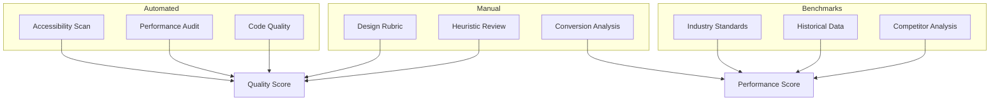

# Evaluation & Quality Assessment

> Objective criteria for measuring design quality. This directory provides rubrics, automated checks, and benchmarks to ensure consistent, measurable quality.

---

## Why Evaluation Matters

```
Subjective: "This looks good" → No accountability
Objective: "Score: 8.5/10 based on criteria X, Y, Z" → Actionable improvement
```

Evaluation enables:
- Consistent quality across projects
- Clear communication about standards
- Measurable improvement over time
- Objective feedback during reviews

---

## Evaluation Framework



---

## Files in This Directory

| File | Size | Purpose |
|------|------|---------|
| `rubrics.md` | 15KB | Scoring criteria for design quality assessment |
| `heuristics.md` | 16KB | Nielsen's 10 heuristics + evaluation process |
| `automated-checks.md` | 17KB | Axe, Lighthouse, linting configurations |
| `accessibility-audit.md` | 13KB | WCAG compliance testing procedures |
| `performance-budget.md` | 10KB | Performance targets and monitoring |
| `conversion-benchmarks.md` | 10KB | Industry standards for conversion metrics |

---

## Quick Reference: Which Evaluation?

| Question | Use This |
|----------|----------|
| "Is the design good?" | `rubrics.md` |
| "Is it accessible?" | `accessibility-audit.md` + `automated-checks.md` |
| "Is it fast enough?" | `performance-budget.md` |
| "Will it convert?" | `conversion-benchmarks.md` |
| "Is it usable?" | `heuristics.md` |
| "Does code meet standards?" | `automated-checks.md` |

---

## Evaluation Timing

| Phase | Evaluation | Tool |
|-------|------------|------|
| Wireframes | Heuristic review | `heuristics.md` |
| Visual Design | Design rubric | `rubrics.md` |
| Pre-Implementation | Full rubric + heuristics | Both |
| Implementation | Automated checks | `automated-checks.md` |
| Pre-Launch | Full audit | All tools |
| Post-Launch | Conversion analysis | `conversion-benchmarks.md` |

---

## Minimum Quality Thresholds

These are non-negotiable minimums for any production work:

| Metric | Minimum | Target |
|--------|---------|--------|
| Accessibility (Axe) | 0 critical/serious | 0 all violations |
| Lighthouse Performance | 75 | 90+ |
| Lighthouse Accessibility | 90 | 100 |
| Design Rubric Score | 7/10 | 8.5/10 |
| Heuristic Score | 70% | 85% |
| Core Web Vitals | Pass | All green |

---

## Integration with Process

### Quality Gates
- Gate 2 (Design Approval): Rubric score ≥7
- Gate 4 (Implementation): Automated checks pass
- Launch: All thresholds met

### Iteration
- Use rubric scores to prioritize feedback
- Track scores across iterations
- Document improvement over time

### Handoff
- Include evaluation results in handoff package
- Set clear acceptance criteria based on thresholds

---

*See also: `PROCESS/quality-gates.md` for gate criteria, `PATTERNS/accessibility.md` for a11y patterns*
