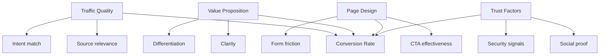

# Conversion Benchmarks

> Industry standards and targets for measuring landing page and marketing effectiveness. Use these to set realistic goals and evaluate performance.

---

## 1. Understanding Conversion Metrics

### 1.1 Key Definitions

| Metric | Definition | Formula |
|--------|------------|---------|
| **Conversion Rate (CVR)** | % of visitors who complete desired action | (Conversions / Visitors) × 100 |
| **Click-Through Rate (CTR)** | % of impressions that result in clicks | (Clicks / Impressions) × 100 |
| **Bounce Rate** | % of visitors who leave after one page | (Single-page sessions / Total sessions) × 100 |
| **Time on Page** | Average time spent on a page | Total time / Page views |
| **Cost Per Acquisition (CPA)** | Cost to acquire one conversion | Ad spend / Conversions |

### 1.2 What Influences Conversion



---

## 2. Landing Page Benchmarks

### 2.1 By Page Type

| Page Type | Poor | Below Avg | Average | Good | Excellent |
|-----------|------|-----------|---------|------|-----------|
| **Waitlist** | <5% | 5-10% | 10-15% | 15-25% | >25% |
| **Email Signup** | <1% | 1-2% | 2-4% | 4-8% | >8% |
| **Smoke Test** | <1% | 1-2% | 2-3% | 3-8% | >8% |
| **Pre-order** | <0.5% | 0.5-1% | 1-2% | 2-3% | >3% |
| **SaaS Trial** | <2% | 2-3% | 3-5% | 5-10% | >10% |
| **Lead Gen (B2B)** | <1% | 1-2% | 2-4% | 4-6% | >6% |
| **Lead Gen (B2C)** | <2% | 2-4% | 4-7% | 7-12% | >12% |

### 2.2 By Industry

| Industry | Average CVR | Top Quartile |
|----------|-------------|--------------|
| SaaS/Software | 3-5% | 8%+ |
| E-commerce | 2-3% | 5%+ |
| Financial Services | 2-4% | 6%+ |
| Education | 3-5% | 8%+ |
| Healthcare | 2-3% | 5%+ |
| Real Estate | 1-2% | 4%+ |
| Travel | 2-3% | 5%+ |
| B2B Services | 2-4% | 6%+ |

### 2.3 By Traffic Source

| Source | Typical CVR | Notes |
|--------|-------------|-------|
| Organic Search | 2-4% | High intent |
| Paid Search (Brand) | 4-8% | Very high intent |
| Paid Search (Non-brand) | 2-4% | Medium intent |
| Social Ads | 1-3% | Lower intent, higher volume |
| Email | 3-6% | Warm audience |
| Direct | 3-5% | Existing awareness |
| Referral | 2-4% | Varies by source |
| Display | 0.5-1.5% | Awareness, low intent |

---

## 3. Form Benchmarks

### 3.1 By Number of Fields

| Fields | CVR Impact | Benchmark Completion |
|--------|------------|---------------------|
| 1 (email only) | Baseline | 25-35% |
| 2-3 fields | -10 to -20% | 20-30% |
| 4-5 fields | -25 to -35% | 15-25% |
| 6-8 fields | -40 to -50% | 10-20% |
| 9+ fields | -60%+ | <10% |

### 3.2 Field Type Impact

| Field Type | Drop-off Impact | Notes |
|------------|-----------------|-------|
| Email | Low | Expected |
| Name | Low | Standard |
| Phone | Medium-High | -10 to -20% |
| Company | Medium | B2B acceptable |
| Job Title | Medium | B2B acceptable |
| Address | High | -15 to -25% |
| Credit Card | Very High | Requires strong trust |
| Custom/Open | Medium-High | Friction-heavy |

### 3.3 Form Optimization Benchmarks

| Optimization | Typical Lift |
|--------------|--------------|
| Reducing fields by 1 | +5 to +10% |
| Adding progress indicator | +5 to +15% |
| Inline validation | +10 to +20% |
| Better error messages | +5 to +10% |
| Mobile optimization | +10 to +25% |
| Social login option | +10 to +30% |

---

## 4. CTA Benchmarks

### 4.1 Button Placement

| Placement | CTR Benchmark | Best For |
|-----------|---------------|----------|
| Above fold (centered) | 3-5% | Primary CTA |
| Above fold (right) | 2-4% | Header CTA |
| After value prop | 2-4% | Supporting CTA |
| Sticky header | 1-3% | Persistent reminder |
| End of page | 1-2% | Secondary capture |
| Exit intent popup | 2-4% | Last chance |

### 4.2 Button Copy Impact

| Copy Type | Relative Performance |
|-----------|---------------------|
| Generic ("Submit") | Baseline (poor) |
| Action ("Get Started") | +20-30% |
| Benefit ("Get Free Trial") | +30-50% |
| Urgent ("Claim Your Spot") | +40-60% |
| Personalized ("Start My Trial") | +25-40% |

### 4.3 CTA Testing Results (Aggregated)

| Element | Test Winner Rate | Avg Lift |
|---------|------------------|----------|
| Button color (contrast) | 60% | +15% |
| Button size (larger) | 55% | +10% |
| Button copy (benefit) | 65% | +25% |
| CTA repetition | 55% | +12% |
| Urgency elements | 50% | +20% (when authentic) |

---

## 5. Page Performance Benchmarks

### 5.1 Core Web Vitals Targets

| Metric | Poor | Needs Improvement | Good |
|--------|------|-------------------|------|
| LCP (Largest Contentful Paint) | >4.0s | 2.5-4.0s | <2.5s |
| FID (First Input Delay) | >300ms | 100-300ms | <100ms |
| CLS (Cumulative Layout Shift) | >0.25 | 0.1-0.25 | <0.1 |

### 5.2 Speed Impact on Conversion

| Load Time | CVR Impact |
|-----------|------------|
| 0-2s | Baseline |
| 2-3s | -10 to -15% |
| 3-4s | -20 to -30% |
| 4-5s | -30 to -40% |
| 5-6s | -40 to -50% |
| >6s | -50%+ |

### 5.3 Mobile Performance

| Metric | Desktop Benchmark | Mobile Benchmark |
|--------|-------------------|------------------|
| LCP | <2.5s | <3.0s |
| Page Weight | <1.5MB | <1MB |
| Time to Interactive | <3.5s | <5s |
| DOM Elements | <1500 | <1000 |

---

## 6. Trust & Social Proof Benchmarks

### 6.1 Social Proof Impact

| Element | Typical CVR Lift |
|---------|------------------|
| Customer logos | +10-20% |
| Testimonials with photos | +15-30% |
| Video testimonials | +20-40% |
| Review ratings | +10-25% |
| User count ("10,000+ users") | +5-15% |
| Press mentions | +10-20% |
| Security badges | +5-15% |
| Money-back guarantee | +10-20% |

### 6.2 Trust Element Placement

| Placement | Effectiveness |
|-----------|---------------|
| Near CTA | Highest |
| Above fold | High |
| In form area | High |
| Footer | Low |

---

## 7. A/B Testing Benchmarks

### 7.1 Sample Size Requirements

| Baseline CVR | Minimum Detectable Effect | Sample Size per Variant |
|--------------|---------------------------|------------------------|
| 1% | 20% relative | ~80,000 |
| 3% | 20% relative | ~25,000 |
| 5% | 20% relative | ~15,000 |
| 10% | 20% relative | ~7,500 |
| 20% | 20% relative | ~3,500 |

### 7.2 Testing Duration

| Traffic/Day | Min Test Duration | Recommended |
|-------------|-------------------|-------------|
| <500 | 4+ weeks | Don't test |
| 500-1000 | 2-4 weeks | 3 weeks |
| 1000-5000 | 1-2 weeks | 2 weeks |
| 5000-10000 | 1 week | 2 weeks |
| >10000 | 3-7 days | 1-2 weeks |

**Rule:** Always run tests for at least 2 full business cycles (usually 2 weeks).

### 7.3 Win Rates by Test Type

| Test Type | Typical Win Rate | Avg Lift When Winning |
|-----------|------------------|----------------------|
| Headline copy | 40-50% | +10-25% |
| CTA copy | 35-45% | +5-20% |
| Hero image | 30-40% | +5-15% |
| Form length | 40-50% | +10-30% |
| Layout changes | 25-35% | +5-15% |
| Color changes | 20-30% | +3-10% |

---

## 8. Validation-Specific Benchmarks

### 8.1 Idea Validation Signals

| Signal | Weak | Moderate | Strong |
|--------|------|----------|--------|
| **Waitlist signups** | <100 | 100-500 | >500 |
| **Waitlist CVR** | <5% | 5-15% | >15% |
| **Email open rate** | <20% | 20-40% | >40% |
| **Survey response rate** | <5% | 5-15% | >15% |
| **Smoke test CVR** | <1% | 1-3% | >3% |
| **Pre-order CVR** | <0.5% | 0.5-2% | >2% |

### 8.2 Go/No-Go Thresholds

| Metric | Kill | Pivot | Build |
|--------|------|-------|-------|
| Waitlist CVR | <5% | 5-12% | >12% |
| Smoke Test CVR | <1% | 1-2.5% | >2.5% |
| Pre-order CVR | <0.3% | 0.3-1% | >1% |
| CPA vs LTV | >3x | 1-3x | <1x |
| Survey "Would buy" | <20% | 20-40% | >40% |

### 8.3 Channel Viability (Paid Acquisition)

| Channel | Unviable CPA | Marginal CPA | Viable CPA |
|---------|--------------|--------------|------------|
| Google Ads (brand) | >$50 | $20-50 | <$20 |
| Google Ads (non-brand) | >$100 | $40-100 | <$40 |
| Facebook/Meta | >$75 | $25-75 | <$25 |
| LinkedIn | >$150 | $75-150 | <$75 |
| Twitter/X | >$100 | $40-100 | <$40 |

*Note: CPAs are illustrative. Actual viability depends on your unit economics.*

---

## 9. Benchmarking Checklist

### 9.1 Pre-Launch Baseline

```markdown
## Pre-Launch Benchmark Checklist

**Page Performance**
- [ ] LCP: ___s (target: <2.5s)
- [ ] FID: ___ms (target: <100ms)
- [ ] CLS: ___ (target: <0.1)
- [ ] Page weight: ___KB (target: <1MB)

**Design Quality**
- [ ] Rubric score: ___/10 (target: >7)
- [ ] Heuristic score: ___/50 (target: >35)

**Accessibility**
- [ ] Axe violations: ___ (target: 0)
- [ ] Lighthouse a11y: ___% (target: >90%)

**Expected Metrics**
- [ ] Target CVR: ___%
- [ ] Target CPA: $___
- [ ] Traffic source: ___
```

### 9.2 Post-Launch Tracking

```markdown
## Week [#] Performance

**Traffic**
- Visitors: ___
- Source breakdown: ___

**Conversion**
- Signups: ___
- CVR: ___% (target: ___%)
- vs. Benchmark: ___

**Engagement**
- Bounce rate: ___%
- Avg time on page: ___
- Scroll depth: ___%

**Funnel**
- Form starts: ___
- Form completions: ___
- Drop-off rate: ___%

**Action Items**
- [ ] ___
```

---

## 10. Benchmark Sources

### 10.1 Industry Reports

- Unbounce Conversion Benchmark Report
- WordStream Industry Benchmarks
- HubSpot Marketing Statistics
- Databox Benchmark Groups
- Google Ads Benchmark Tool

### 10.2 Building Internal Benchmarks

Over time, build your own benchmarks:

1. **Track all campaigns** with consistent metrics
2. **Segment by type** (page type, audience, channel)
3. **Calculate percentiles** (p25, p50, p75)
4. **Update quarterly** with new data
5. **Share internally** for alignment

---

## References

- `rubrics.md` - Quality scoring
- `OUTPUTS/landing-pages.md` - Implementation guide
- `MARKETING.md` - Validation strategy
- `PROCESS/validation-sprint.md` - Testing workflow

---

*Version: 0.1.0*
*Last updated benchmarks: January 2025*
