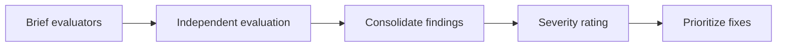

# Heuristic Evaluation

> Systematic usability evaluation based on established principles. Use heuristics to identify usability problems early, before user testing.

---

## 1. What is Heuristic Evaluation?

### 1.1 Definition

A heuristic evaluation is an inspection method where evaluators examine an interface against a set of recognized usability principles (heuristics). It's a fast, inexpensive way to find usability problems.

### 1.2 When to Use

| Phase | Use Case | Benefit |
|-------|----------|---------|
| Wireframes | Early structure validation | Catch IA issues before design |
| Mockups | Pre-implementation review | Find issues before coding |
| Prototype | Interactive evaluation | Assess flow and interaction |
| Live product | Quality audit | Identify improvement opportunities |

### 1.3 Process Overview



---

## 2. Nielsen's 10 Usability Heuristics

### H1: Visibility of System Status

> The design should always keep users informed about what is going on, through appropriate feedback within a reasonable amount of time.

**Evaluation Questions:**
- Does the system show current state clearly?
- Is there feedback for user actions?
- Are loading states indicated?
- Is progress shown for multi-step processes?
- Do users know where they are in the system?

**Positive Indicators:**
- Loading spinners/skeletons
- Progress bars for multi-step flows
- Active state on navigation
- Success/error messages
- "Saving..." indicators

**Violations:**
- Actions with no feedback
- Silent failures
- No loading indication
- Unclear current location
- Missing progress indicators

**Scoring:**
| Score | Description |
|-------|-------------|
| 5 | All actions have immediate, clear feedback |
| 4 | Most actions have feedback; minor gaps |
| 3 | Feedback present but inconsistent |
| 2 | Significant gaps in feedback |
| 1 | No feedback; users are confused |

---

### H2: Match Between System and Real World

> The design should speak the users' language. Use words, phrases, and concepts familiar to the user, rather than internal jargon.

**Evaluation Questions:**
- Is language familiar to users?
- Are concepts from real world used appropriately?
- Is information in natural, logical order?
- Do icons match real-world conventions?

**Positive Indicators:**
- User-friendly terminology
- Familiar metaphors (shopping cart, trash can)
- Logical information grouping
- Culturally appropriate imagery

**Violations:**
- Technical jargon
- Internal terminology exposed
- Unfamiliar icons
- Illogical organization
- Culturally inappropriate content

**Scoring:**
| Score | Description |
|-------|-------------|
| 5 | Language perfectly matches user expectations |
| 4 | Mostly user-friendly; minor jargon |
| 3 | Mix of user and technical language |
| 2 | Significant jargon; confusing |
| 1 | Completely technical; unusable |

---

### H3: User Control and Freedom

> Users often perform actions by mistake. They need a clearly marked "emergency exit" to leave the unwanted action without having to go through an extended process.

**Evaluation Questions:**
- Can users undo actions easily?
- Is there a clear way to cancel/go back?
- Can users exit processes without penalty?
- Is there confirmation for destructive actions?

**Positive Indicators:**
- Undo functionality
- Cancel buttons
- Back navigation
- Confirmation dialogs
- Clear exit paths

**Violations:**
- No undo option
- Trapped in flows
- No cancel buttons
- Immediate destructive actions
- No way to go back

**Scoring:**
| Score | Description |
|-------|-------------|
| 5 | Full undo/redo; easy escape from any state |
| 4 | Most actions reversible; clear exits |
| 3 | Some undo capability; basic navigation |
| 2 | Limited recovery options |
| 1 | Users feel trapped; no control |

---

### H4: Consistency and Standards

> Users should not have to wonder whether different words, situations, or actions mean the same thing. Follow platform and industry conventions.

**Evaluation Questions:**
- Are similar elements styled consistently?
- Do same actions behave the same way?
- Does it follow platform conventions?
- Is terminology consistent throughout?

**Positive Indicators:**
- Consistent button styles
- Uniform terminology
- Standard patterns (e.g., login flow)
- Predictable placement
- Consistent icon usage

**Violations:**
- Multiple styles for same element
- Inconsistent terminology
- Non-standard patterns
- Unpredictable placement
- Mixed icon styles

**Scoring:**
| Score | Description |
|-------|-------------|
| 5 | Perfectly consistent; follows all conventions |
| 4 | High consistency; minor variations |
| 3 | Generally consistent; some exceptions |
| 2 | Noticeable inconsistencies |
| 1 | Feels like multiple products; confusing |

---

### H5: Error Prevention

> Good error messages are important, but the best designs carefully prevent problems from occurring in the first place.

**Evaluation Questions:**
- Does the design prevent errors before they occur?
- Are constraints enforced (e.g., date pickers vs. free text)?
- Are potentially dangerous actions protected?
- Is there input validation and guidance?

**Positive Indicators:**
- Constrained inputs (dropdowns, date pickers)
- Real-time validation
- Confirmation for risky actions
- Helpful defaults
- Input formatting assistance

**Violations:**
- Free text where constraints are needed
- No validation until submission
- Easy to click destructive actions
- Poor defaults
- No input guidance

**Scoring:**
| Score | Description |
|-------|-------------|
| 5 | Errors nearly impossible through design |
| 4 | Most errors prevented; rare exceptions |
| 3 | Some prevention; validation present |
| 2 | Limited prevention; reactive approach |
| 1 | Error-prone; users make frequent mistakes |

---

### H6: Recognition Rather Than Recall

> Minimize the user's memory load by making elements, actions, and options visible. The user should not have to remember information from one part of the interface to another.

**Evaluation Questions:**
- Is needed information visible when required?
- Are options visible rather than hidden?
- Is context provided for decisions?
- Can users recognize rather than remember?

**Positive Indicators:**
- Visible options (not buried in menus)
- Contextual help
- Clear labels
- Recently used items shown
- Search with suggestions

**Violations:**
- Important features hidden
- Requiring memorization
- No context for actions
- Unlabeled icons
- No search/suggestions

**Scoring:**
| Score | Description |
|-------|-------------|
| 5 | All information visible when needed |
| 4 | Most information accessible; minor recall |
| 3 | Mix of visible and hidden |
| 2 | Significant reliance on memory |
| 1 | Users must memorize to use effectively |

---

### H7: Flexibility and Efficiency of Use

> Shortcuts — hidden from novice users — can speed up the interaction for the expert user so that the design can cater to both inexperienced and experienced users.

**Evaluation Questions:**
- Are there shortcuts for frequent actions?
- Can experts accelerate their workflow?
- Is the system adaptable to user preferences?
- Can users customize their experience?

**Positive Indicators:**
- Keyboard shortcuts
- Quick actions
- Customizable workflows
- Saved preferences
- Bulk actions

**Violations:**
- No shortcuts for common tasks
- One-size-fits-all approach
- No customization
- Repetitive actions required
- No power user features

**Scoring:**
| Score | Description |
|-------|-------------|
| 5 | Rich shortcuts; highly customizable |
| 4 | Good shortcuts; some customization |
| 3 | Basic shortcuts present |
| 2 | Limited efficiency features |
| 1 | No accommodation for expert users |

---

### H8: Aesthetic and Minimalist Design

> Interfaces should not contain information which is irrelevant or rarely needed. Every extra unit of information in an interface competes with the relevant units of information.

**Evaluation Questions:**
- Is only essential information shown?
- Is visual noise minimized?
- Is content prioritized effectively?
- Is there appropriate use of white space?

**Positive Indicators:**
- Clean, focused layouts
- Progressive disclosure
- Essential content prominent
- Good use of white space
- Clear visual hierarchy

**Violations:**
- Cluttered interfaces
- Irrelevant information displayed
- Competing elements
- No visual breathing room
- Everything seems equally important

**Scoring:**
| Score | Description |
|-------|-------------|
| 5 | Perfectly minimal; only essentials visible |
| 4 | Clean design; minor clutter |
| 3 | Generally clean; some unnecessary elements |
| 2 | Cluttered; hard to focus |
| 1 | Overwhelming; information overload |

---

### H9: Help Users Recognize, Diagnose, and Recover from Errors

> Error messages should be expressed in plain language (no error codes), precisely indicate the problem, and constructively suggest a solution.

**Evaluation Questions:**
- Are error messages clear and helpful?
- Do they explain what went wrong?
- Do they suggest how to fix it?
- Are they expressed in plain language?

**Positive Indicators:**
- Plain language errors
- Specific problem description
- Clear recovery steps
- Non-threatening tone
- Inline error placement

**Violations:**
- Technical error codes
- Vague messages ("An error occurred")
- No recovery guidance
- Blaming language
- Poorly placed errors

**Scoring:**
| Score | Description |
|-------|-------------|
| 5 | Excellent error handling; always helpful |
| 4 | Good messages; minor improvements possible |
| 3 | Basic error messages; sometimes helpful |
| 2 | Poor messages; rarely helpful |
| 1 | Cryptic or no error messages |

---

### H10: Help and Documentation

> It's best if the system can be used without documentation, but it may be necessary to provide help. Help should be easy to search, focused on the task, list concrete steps, and not be too large.

**Evaluation Questions:**
- Is help easily accessible?
- Is it task-focused?
- Can users search for answers?
- Is it contextual when needed?

**Positive Indicators:**
- Searchable help
- Contextual tooltips
- Task-oriented documentation
- FAQs for common issues
- Onboarding for new users

**Violations:**
- No help available
- Unhelpful documentation
- No search capability
- Generic, not task-focused
- Overwhelming documentation

**Scoring:**
| Score | Description |
|-------|-------------|
| 5 | Excellent, contextual help; rarely needed |
| 4 | Good help system; accessible |
| 3 | Basic help present; could be better |
| 2 | Minimal, unhelpful documentation |
| 1 | No help; users left on their own |

---

## 3. Evaluation Process

### 3.1 Preparation

1. **Define scope**: Which screens/flows to evaluate
2. **Brief evaluators**: Share heuristics and scoring criteria
3. **Provide access**: Prototype, staging site, or mockups
4. **Set timeline**: Typically 1-2 hours per evaluator

### 3.2 Evaluation Session

Each evaluator works independently:

1. **First pass**: Explore interface naturally (15-20 min)
2. **Second pass**: Systematic evaluation against each heuristic (30-45 min)
3. **Document findings**: Log each issue with heuristic and location

### 3.3 Issue Documentation Template

```markdown
## Issue: [Brief Description]

**Heuristic:** H[#]: [Name]
**Location:** [Screen/Component/Flow]
**Severity:** [0-4]

**Description:**
[Detailed description of the issue]

**Screenshot/Reference:**
[Image or link]

**Recommendation:**
[Suggested fix]
```

### 3.4 Severity Ratings

| Rating | Severity | Description | Action |
|--------|----------|-------------|--------|
| 0 | Not a problem | Disagree this is an issue | None |
| 1 | Cosmetic | Minor annoyance | Fix if time permits |
| 2 | Minor | Small usability issue | Low priority fix |
| 3 | Major | Significant usability issue | High priority fix |
| 4 | Catastrophic | Prevents task completion | Must fix before launch |

### 3.5 Consolidation

After independent evaluation:

1. **Merge findings**: Combine all evaluator reports
2. **Remove duplicates**: Same issue from multiple evaluators
3. **Reconcile severity**: Discuss disagreements
4. **Calculate scores**: Average heuristic scores
5. **Prioritize fixes**: Based on severity and impact

---

## 4. Evaluation Report Template

```markdown
# Heuristic Evaluation Report

**Product:** [Name]
**Version/Build:** [Version]
**Date:** [Date]
**Evaluators:** [Names]

## Executive Summary

**Overall Score:** [X/50]
**Severity Breakdown:**
- Catastrophic (4): [#]
- Major (3): [#]
- Minor (2): [#]
- Cosmetic (1): [#]

**Top Issues:**
1. [Issue 1 - Heuristic - Severity]
2. [Issue 2 - Heuristic - Severity]
3. [Issue 3 - Heuristic - Severity]

## Heuristic Scores

| Heuristic | Score | Issues |
|-----------|-------|--------|
| H1: Visibility of System Status | /5 | # |
| H2: Match with Real World | /5 | # |
| H3: User Control and Freedom | /5 | # |
| H4: Consistency and Standards | /5 | # |
| H5: Error Prevention | /5 | # |
| H6: Recognition vs Recall | /5 | # |
| H7: Flexibility and Efficiency | /5 | # |
| H8: Aesthetic and Minimalist | /5 | # |
| H9: Error Recovery | /5 | # |
| H10: Help and Documentation | /5 | # |
| **TOTAL** | **/50** | **#** |

## Detailed Findings

### Catastrophic Issues (Must Fix)
[List each issue]

### Major Issues (High Priority)
[List each issue]

### Minor Issues (Medium Priority)
[List each issue]

### Cosmetic Issues (Low Priority)
[List each issue]

## Recommendations

### Immediate (Pre-Launch)
1. [Fix 1]
2. [Fix 2]

### Short-Term (v1.1)
1. [Fix 3]
2. [Fix 4]

### Long-Term (Future)
1. [Fix 5]
```

---

## 5. Additional Heuristics

### 5.1 Mobile-Specific Heuristics

| Heuristic | Description |
|-----------|-------------|
| Touch target size | ≥44px for all interactive elements |
| Thumb reachability | Key actions in thumb zone |
| Portrait/landscape | Appropriate adaptation |
| Offline behavior | Graceful degradation |
| Input methods | Appropriate keyboards |

### 5.2 E-commerce Heuristics

| Heuristic | Description |
|-----------|-------------|
| Product findability | Easy to find products |
| Price transparency | Clear pricing, no surprises |
| Cart accessibility | Always visible/accessible |
| Checkout efficiency | Minimal steps to purchase |
| Trust and security | Security indicators present |

### 5.3 Form Design Heuristics

| Heuristic | Description |
|-----------|-------------|
| Minimal fields | Only ask what's necessary |
| Logical grouping | Related fields together |
| Smart defaults | Pre-fill when possible |
| Inline validation | Immediate feedback |
| Clear labels | No placeholder-only labels |

---

## 6. Evaluation Tips

### 6.1 Evaluator Best Practices

- **Be specific**: "Button is hard to see" → "Submit button lacks contrast against gray background (3.2:1 ratio)"
- **Reference heuristics**: Always tie issues to specific heuristics
- **Include location**: Specify exactly where the issue occurs
- **Suggest solutions**: Don't just identify problems
- **Stay objective**: Focus on usability, not personal preference

### 6.2 Common Pitfalls

| Pitfall | Problem | Better Approach |
|---------|---------|-----------------|
| Too vague | "Navigation is confusing" | Identify specific navigation issue |
| Opinion-based | "I don't like this color" | Is it a usability issue? |
| No heuristic | Issue without principle | Tie to specific heuristic |
| Missing severity | All issues seem equal | Rate each issue |
| No solution | Just problems | Include recommendations |

---

## References

- Nielsen, J. (1994). *10 Usability Heuristics for User Interface Design*
- `rubrics.md` - Quantitative scoring
- `PATTERNS/accessibility.md` - Accessibility-specific evaluation
- `PROCESS/iteration.md` - Acting on findings

---

*Version: 0.1.0*
