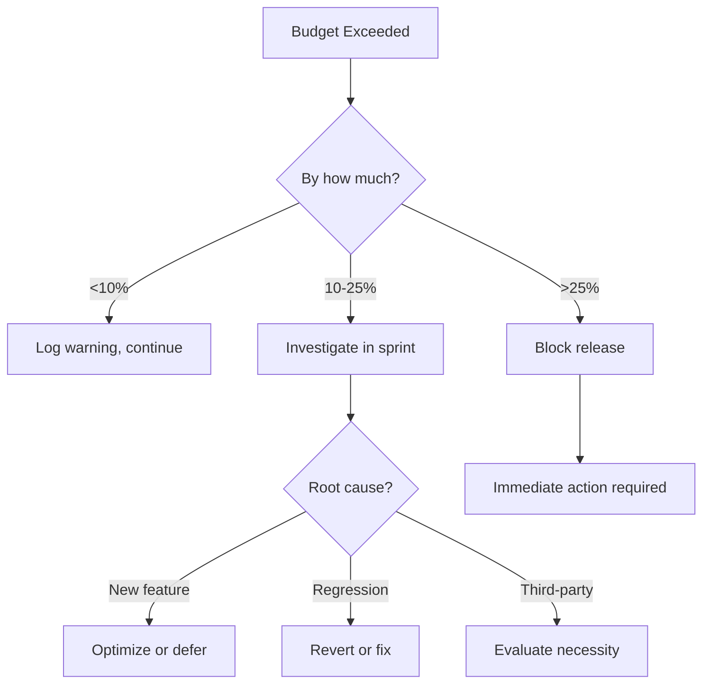

# Performance Budget

> Targets and constraints for web performance. A performance budget keeps the team accountable and prevents gradual degradation.

---

## 1. Why Performance Matters

### 1.1 Business Impact

| Metric | Impact |
|--------|--------|
| +100ms load time | -1% conversions (Amazon) |
| +500ms load time | -20% traffic (Google) |
| 1s → 3s load time | +32% bounce rate |
| 1s → 5s load time | +90% bounce rate |
| 1s → 10s load time | +123% bounce rate |

### 1.2 Core Web Vitals

Google uses these metrics for ranking:

| Metric | Good | Needs Improvement | Poor |
|--------|------|-------------------|------|
| **LCP** (Largest Contentful Paint) | ≤2.5s | ≤4.0s | >4.0s |
| **FID** (First Input Delay) | ≤100ms | ≤300ms | >300ms |
| **CLS** (Cumulative Layout Shift) | ≤0.1 | ≤0.25 | >0.25 |
| **INP** (Interaction to Next Paint) | ≤200ms | ≤500ms | >500ms |

---

## 2. Budget Targets

### 2.1 Timing Budgets

| Metric | Budget | Stretch Goal |
|--------|--------|--------------|
| Time to First Byte (TTFB) | ≤600ms | ≤200ms |
| First Contentful Paint (FCP) | ≤1.8s | ≤1.0s |
| Largest Contentful Paint (LCP) | ≤2.5s | ≤1.5s |
| Time to Interactive (TTI) | ≤3.8s | ≤2.5s |
| Total Blocking Time (TBT) | ≤300ms | ≤150ms |
| Cumulative Layout Shift (CLS) | ≤0.1 | ≤0.05 |

### 2.2 Size Budgets

| Resource | Budget | Notes |
|----------|--------|-------|
| **Total Page Weight** | ≤1MB | Initial load |
| HTML | ≤50KB | Compressed |
| CSS | ≤100KB | Compressed, all stylesheets |
| JavaScript | ≤300KB | Compressed, all scripts |
| Images | ≤500KB | Above the fold |
| Fonts | ≤100KB | All font files |
| Third-party | ≤200KB | Analytics, widgets, etc. |

### 2.3 Request Budgets

| Resource Type | Max Requests |
|---------------|--------------|
| Total | ≤50 |
| JavaScript files | ≤10 |
| CSS files | ≤5 |
| Images | ≤25 |
| Fonts | ≤4 |
| Third-party | ≤5 |

---

## 3. Budget by Page Type

### 3.1 Landing Page

**Priority:** Maximum speed for first impression

| Metric | Budget |
|--------|--------|
| Total weight | ≤500KB |
| LCP | ≤1.5s |
| TBT | ≤150ms |
| JavaScript | ≤100KB |

**Strategy:**
- Inline critical CSS
- Defer all non-essential JS
- Optimize hero image aggressively
- Lazy load below-fold content

### 3.2 Marketing Pages

**Priority:** Fast load, rich content

| Metric | Budget |
|--------|--------|
| Total weight | ≤800KB |
| LCP | ≤2.0s |
| TBT | ≤200ms |
| JavaScript | ≤200KB |

### 3.3 Application/Dashboard

**Priority:** Fast interactions, acceptable load

| Metric | Budget |
|--------|--------|
| Total weight | ≤1.5MB |
| LCP | ≤2.5s |
| TBT | ≤300ms |
| INP | ≤200ms |

**Strategy:**
- Code splitting by route
- Lazy load non-critical features
- Prefetch likely next routes
- Optimize data fetching

---

## 4. Enforcement

### 4.1 Build-Time Checks

**Webpack Bundle Analyzer:**
```javascript
// webpack.config.js
const { BundleAnalyzerPlugin } = require('webpack-bundle-analyzer');

module.exports = {
  plugins: [
    new BundleAnalyzerPlugin({
      analyzerMode: 'static',
      reportFilename: 'bundle-report.html',
    }),
  ],
};
```

**Size Limit:**
```json
// package.json
{
  "size-limit": [
    {
      "path": "dist/js/*.js",
      "limit": "300 KB"
    },
    {
      "path": "dist/css/*.css",
      "limit": "100 KB"
    }
  ]
}
```

```bash
# Run check
npx size-limit
```

### 4.2 CI Performance Budget

**Lighthouse CI:**
```javascript
// lighthouserc.js
module.exports = {
  ci: {
    assert: {
      assertions: {
        // Core Web Vitals
        'largest-contentful-paint': ['error', { maxNumericValue: 2500 }],
        'cumulative-layout-shift': ['error', { maxNumericValue: 0.1 }],
        'total-blocking-time': ['error', { maxNumericValue: 300 }],
        
        // Size budgets
        'total-byte-weight': ['error', { maxNumericValue: 1000000 }],
        'script-treemap-data': ['warn', { maxNumericValue: 300000 }],
        
        // Request budgets
        'network-requests': ['warn', { maxNumericValue: 50 }],
        
        // Scores
        'categories:performance': ['error', { minScore: 0.75 }],
      },
    },
  },
};
```

### 4.3 Real User Monitoring

**Web Vitals tracking:**
```javascript
import { onCLS, onFID, onLCP, onINP, onTTFB } from 'web-vitals';

function sendToAnalytics(metric) {
  const body = JSON.stringify({
    name: metric.name,
    value: metric.value,
    rating: metric.rating, // 'good', 'needs-improvement', 'poor'
    delta: metric.delta,
    id: metric.id,
  });
  
  // Use `navigator.sendBeacon()` if available
  if (navigator.sendBeacon) {
    navigator.sendBeacon('/analytics', body);
  } else {
    fetch('/analytics', { body, method: 'POST', keepalive: true });
  }
}

onCLS(sendToAnalytics);
onFID(sendToAnalytics);
onLCP(sendToAnalytics);
onINP(sendToAnalytics);
onTTFB(sendToAnalytics);
```

---

## 5. Optimization Strategies

### 5.1 Images

| Strategy | Impact | Implementation |
|----------|--------|----------------|
| Modern formats | -30-50% | WebP, AVIF |
| Responsive images | -20-40% | srcset, sizes |
| Lazy loading | -50% initial | loading="lazy" |
| Compression | -10-30% | Quality 80-85% |
| CDN | -50ms+ TTFB | Cloudflare, Fastly |

```html
<!-- Optimized image -->
<picture>
  <source 
    type="image/avif" 
    srcset="hero-400.avif 400w, hero-800.avif 800w, hero-1600.avif 1600w"
    sizes="(max-width: 768px) 100vw, 50vw"
  />
  <source 
    type="image/webp" 
    srcset="hero-400.webp 400w, hero-800.webp 800w, hero-1600.webp 1600w"
    sizes="(max-width: 768px) 100vw, 50vw"
  />
  
</picture>
```

### 5.2 JavaScript

| Strategy | Impact | Implementation |
|----------|--------|----------------|
| Code splitting | -40% initial | Dynamic imports |
| Tree shaking | -20-40% | ES modules |
| Minification | -30-50% | Terser |
| Compression | -60-80% | Gzip, Brotli |
| Defer loading | Faster FCP | defer attribute |

```javascript
// Dynamic import for code splitting
const Dashboard = lazy(() => import('./Dashboard'));

// Route-based splitting
const routes = {
  '/dashboard': () => import('./pages/Dashboard'),
  '/settings': () => import('./pages/Settings'),
};
```

### 5.3 CSS

| Strategy | Impact | Implementation |
|----------|--------|----------------|
| Critical CSS | -1s+ FCP | Extract, inline |
| Remove unused | -30-60% | PurgeCSS |
| Minification | -20-30% | cssnano |
| Compression | -60-80% | Gzip, Brotli |

```html
<!-- Inline critical CSS -->
<style>
  /* Critical styles for above-the-fold content */
  .hero { ... }
  .header { ... }
</style>

<!-- Defer non-critical CSS -->
<link rel="preload" href="styles.css" as="style" onload="this.onload=null;this.rel='stylesheet'">
<noscript><link rel="stylesheet" href="styles.css"></noscript>
```

### 5.4 Fonts

| Strategy | Impact | Implementation |
|----------|--------|----------------|
| Subset fonts | -50-80% | Only needed chars |
| WOFF2 format | -30% | Modern compression |
| font-display | No FOIT | swap or optional |
| Preload | -100ms+ | rel="preload" |

```html
<link rel="preload" href="font.woff2" as="font" type="font/woff2" crossorigin>

<style>
  @font-face {
    font-family: 'Inter';
    src: url('inter.woff2') format('woff2');
    font-display: swap;
    unicode-range: U+0000-00FF; /* Latin subset */
  }
</style>
```

---

## 6. Budget Tracking Template

```markdown
# Performance Budget Report

**Date:** [Date]
**URL:** [URL]
**Tool:** [Lighthouse/WebPageTest]

## Core Web Vitals

| Metric | Budget | Actual | Status |
|--------|--------|--------|--------|
| LCP | ≤2.5s | Xs | ✅/⚠️/❌ |
| FID/INP | ≤100ms/200ms | Xms | ✅/⚠️/❌ |
| CLS | ≤0.1 | X | ✅/⚠️/❌ |

## Size Budget

| Resource | Budget | Actual | Status |
|----------|--------|--------|--------|
| Total | ≤1MB | XKB | ✅/⚠️/❌ |
| JavaScript | ≤300KB | XKB | ✅/⚠️/❌ |
| CSS | ≤100KB | XKB | ✅/⚠️/❌ |
| Images | ≤500KB | XKB | ✅/⚠️/❌ |
| Fonts | ≤100KB | XKB | ✅/⚠️/❌ |

## Request Budget

| Type | Budget | Actual | Status |
|------|--------|--------|--------|
| Total | ≤50 | X | ✅/⚠️/❌ |
| Scripts | ≤10 | X | ✅/⚠️/❌ |

## Lighthouse Scores

| Category | Target | Actual |
|----------|--------|--------|
| Performance | ≥75 | X |
| Accessibility | ≥90 | X |
| Best Practices | ≥90 | X |
| SEO | ≥90 | X |

## Issues & Actions

| Issue | Impact | Action | Owner |
|-------|--------|--------|-------|
| [Issue] | [Impact] | [Action] | [Name] |

## Trend (Last 4 Weeks)

| Week | LCP | TBT | CLS | Total Size |
|------|-----|-----|-----|------------|
| W-4 | Xs | Xms | X | XKB |
| W-3 | Xs | Xms | X | XKB |
| W-2 | Xs | Xms | X | XKB |
| W-1 | Xs | Xms | X | XKB |
```

---

## 7. When Budget is Exceeded

### 7.1 Triage Process



### 7.2 Common Culprits

| Symptom | Likely Cause | Fix |
|---------|--------------|-----|
| JS bloat | Dependencies | Audit, tree-shake |
| Image bloat | Unoptimized | Compress, resize |
| Slow LCP | Large hero | Optimize, preload |
| High CLS | Dynamic content | Set dimensions |
| High TBT | Heavy JS | Code split, defer |

---

## References

- [Web Vitals](https://web.dev/vitals/)
- [Performance Budget Calculator](https://www.performancebudget.io/)
- `automated-checks.md` - Lighthouse CI setup
- `OUTPUTS/landing-pages.md` - Landing page optimization

---

*Version: 0.1.0*
