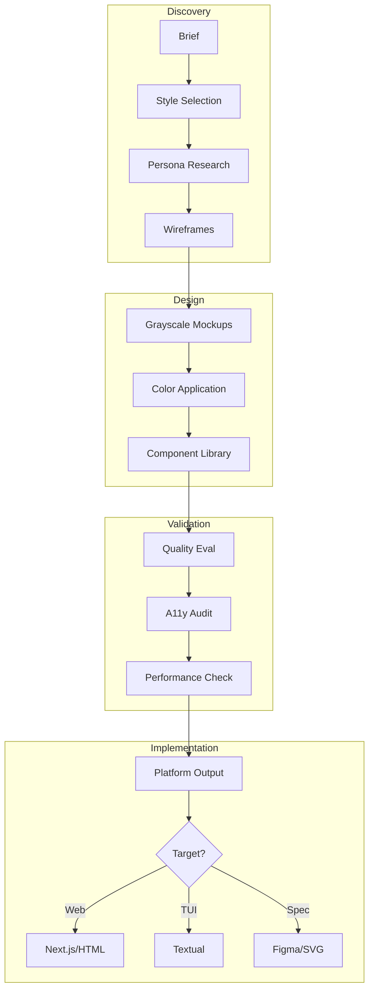
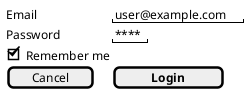

# UX/UI Design Agent System

> A comprehensive design methodology and tooling system for building conversion-focused, accessible, and beautiful interfaces. Optimized for AI-assisted design workflows.

---

## System Overview

This system transforms briefs into production-ready designs through a structured methodology:



---

## Core Components

### 1. Foundation Documents

#### CORE.md
**The design philosophy bible**

- First principles: outcomes over aesthetics, restraint as default, convention over innovation
- Decision framework for style, interaction, and quality choices
- Output spectrum: ASCII → PlantUML Salt → Wireweave → SVG → Production
- Wireframe format selection heuristics
- Quality defaults and when to break them
- 2026 design landscape trends

**When to read:** Start here. Every project begins with CORE principles.

#### MARKETING.md
**Market validation before you build**

- Lean validation specialist methodology
- Persona generation from elevator pitches
- Positioning strategy archetypes (Professional, Tech-Forward, Consumer, Guerrilla, Trust)
- Landing page architecture for validation
- Ad creative guidelines across platforms
- Image quality assessment rubrics
- Conversion measurement and signal interpretation

**When to read:** Pre-product validation, landing pages, ad campaigns, or pricing tests.

---

### 2. EVAL/ - Quality Assessment System

**7 files for objective quality measurement**

```
EVAL/
├── INDEX.md                    # Evaluation framework overview
├── rubrics.md                  # 15KB - Design quality scoring criteria
├── heuristics.md               # 16KB - Nielsen's 10 heuristics + process
├── automated-checks.md         # 17KB - Axe, Lighthouse, ESLint configs
├── accessibility-audit.md      # 13KB - WCAG 2.2 compliance procedures
├── performance-budget.md       # 10KB - Core Web Vitals targets
└── conversion-benchmarks.md    # 10KB - Industry conversion standards
```

**Purpose:** Move from subjective "looks good" to objective "scores 8.5/10 on criteria X, Y, Z"

**Minimum thresholds:**
- Accessibility: 0 critical violations (target: 0 all violations)
- Lighthouse Performance: 75 (target: 90+)
- Design Rubric: 7/10 (target: 8.5/10)
- Core Web Vitals: Pass all

**When to use:**
- Wireframes → Heuristic review
- Visual design → Design rubric
- Implementation → Automated checks
- Pre-launch → Full audit
- Post-launch → Conversion analysis

---

### 3. PROCESS/ - Design Workflows

**7 files documenting the design journey**

```
PROCESS/
├── INDEX.md                    # Process overview
├── brief-interpretation.md     # Extract core, identify unstated, flag tensions
├── design-sprint.md            # 5-day structure for rapid design
├── validation-sprint.md        # 5-week market validation structure
├── iteration.md                # Feedback loops and revision protocols
├── handoff.md                  # Developer handoff specifications
└── quality-gates.md            # Gate criteria for each phase
```

**Key workflows:**

| Workflow | Duration | Output |
|----------|----------|--------|
| Brief interpretation | 1-2 hours | Extracted requirements, style direction |
| Design sprint | 5 days | Validated prototype |
| Validation sprint | 5 weeks | Market signal data |
| Iteration cycle | Variable | Improved design version |
| Quality gate | 30 min | Pass/fail assessment |

**When to use:**
- New project → Start with `brief-interpretation.md`
- Fast validation → `design-sprint.md`
- Pre-product testing → `validation-sprint.md`
- Feedback received → `iteration.md`
- Ready to code → `handoff.md`

---

### 4. OUTPUTS/ - Implementation Formats

**8 format-specific implementation guides**

```
OUTPUTS/
├── INDEX.md                    # Output format selection
├── nextjs.md                   # Next.js web apps (production)
├── html-css.md                 # Static HTML/CSS sites
├── landing-pages.md            # Conversion-focused landing pages
├── svg-mockups.md              # Scalable mockups (grayscale + hi-fi)
├── p5js.md                     # Interactive prototypes
├── textual-tui.md              # Terminal user interfaces
└── figma-spec.md               # Design handoff specifications
```

**Selection heuristics:**

| Need | Format | Why |
|------|--------|-----|
| Production web app | Next.js | Full interactivity, modern stack |
| Marketing site | Landing Pages | Conversion-optimized templates |
| Visual direction | SVG Mockups | Scalable, version-controlled |
| Interaction testing | p5.js | Validate motion and behavior |
| CLI tool | Textual TUI | Developer-focused terminal UI |
| External handoff | Figma Spec | Polish for stakeholder review |
| Static/simple | HTML/CSS | No build complexity |

**Output quality checklist:**
- Semantic HTML for all web outputs
- WCAG 2.2 AA compliance minimum
- Responsive by default (mobile-first)
- Performance budget adherence
- Inline comments for feedback protocol

---

### 5. PATTERNS/ - Component Library

**6 pattern files covering all UI needs**

```
PATTERNS/
├── INDEX.md                    # Pattern selection framework
├── layout.md                   # ~600 lines - Grids, bento, sidebar, asymmetric
├── components.md               # ~700 lines - Buttons, forms, cards, navigation
├── interaction.md              # ~500 lines - Micro-interactions, transitions
├── responsive.md               # ~500 lines - Fluid typography, container queries
└── accessibility.md            # ~600 lines - Visual, keyboard, screen reader
```

**Pattern categories:**

**Layout Patterns:**
- Bento Grid (mixed media, dashboards)
- Single Column (long-form reading)
- Sidebar + Main (apps, docs)
- Section Stack (landing pages)

**Component Patterns:**
- Buttons (Primary, Secondary, Ghost, Danger)
- Forms (Inputs, Selects, Toggles)
- Cards (Basic, Media, Interactive)
- Navigation (Header, Sidebar, Tabs)
- Modals (Dialog, Drawer, Sheet)
- Feedback (Toasts, Alerts, Progress)
- Data (Tables, Lists, Empty States)

**Interaction Patterns:**
- Micro-interactions (50-100ms)
- Hover states (100-150ms)
- Transitions (150-300ms)
- Loading states (variable)

**When to use:**
- Building component → Reference `components.md`
- Structuring page → Reference `layout.md`
- Adding motion → Reference `interaction.md`
- Ensuring accessibility → Reference `accessibility.md`
- Adapting to mobile → Reference `responsive.md`

---

### 6. STYLES/ - Design System Catalog

**5 complete style specifications**

```
STYLES/
├── INDEX.md                    # Style selection framework
├── minimal-tech.md             # Barely-there UI, VC aesthetic
├── corporate-enterprise.md     # Trust-forward, institutional
├── consumer-playful.md         # Friendly, approachable, lifestyle
├── editorial.md                # Typography-first, magazine
└── bold-expressive.md          # Anti-design, brutalist, experimental
```

**Quick style selector:**

| If you need... | Choose | Signals |
|----------------|--------|---------|
| **Sophistication & focus** | Minimal Tech | Intelligence, trust, calm |
| **Reliability & security** | Corporate Enterprise | Expertise, stability, scale |
| **Fun & approachability** | Consumer Playful | Warmth, personality, accessibility |
| **Authority & depth** | Editorial | Craftsmanship, premium, content focus |
| **Innovation & disruption** | Bold Expressive | Creativity, confidence, risk-taking |

**Industry defaults:**

| Industry | Default Style | Why |
|----------|---------------|-----|
| SaaS/Tech | Minimal Tech | Signals competence |
| Finance/Healthcare | Corporate Enterprise | Trust is paramount |
| E-commerce (lifestyle) | Consumer Playful | Emotional drivers |
| Media/Publishing | Editorial | Content is product |
| Agency/Creative | Bold Expressive | Demonstrates capability |

**Each style file contains:**
- Color palette specifications (primary, secondary, accent, semantic)
- Typography scale and font recommendations
- Spacing and grid systems
- Component styling guidelines
- Interaction patterns
- Do's and don'ts with examples
- Reference sites

---

## Design System Specifications

### 1. Minimal Tech (Barely-There UI)

**Best for:** AI/ML products, developer tools, B2B SaaS, fintech, VC-funded startups

**Characteristics:**
- Single typeface (geometric sans-serif)
- 2-3 color maximum (often monochrome + one accent)
- Generous whitespace as structural element
- Subtle or no borders
- Data visualization as decoration

**Avoid when:** Non-technical audience, need warmth, playful/entertainment focus

**Example palette:** Monochrome grays + single accent (often warm: orange, amber)

---

### 2. Corporate Enterprise (Trust-Forward)

**Best for:** Financial services, healthcare, legal, government, B2B enterprise

**Characteristics:**
- Conservative typography (serif headings common)
- Blue-dominant palettes
- Clear hierarchy and navigation
- Dense but organized information
- Trust badges prominent

**Avoid when:** Young/casual audience, want to disrupt norms, consumer-focused

**Example palette:** Blue primary + gray neutrals + green success/red error

---

### 3. Consumer Playful (Friendly)

**Best for:** Consumer apps, e-commerce lifestyle, social platforms, food/beverage, entertainment

**Characteristics:**
- Rounded shapes and corners
- Vibrant, warm color palettes
- Playful illustrations or photography
- Bento grid layouts
- Micro-animations on interaction

**Avoid when:** Sensitive data, expect professionalism, high-stakes decisions

**Example palette:** Warm primaries (orange, pink) + vibrant secondaries

---

### 4. Editorial (Typography-First)

**Best for:** Publications, long-form content, portfolios, luxury brands, cultural institutions

**Characteristics:**
- Typography as primary design element
- Serif fonts common but not required
- Strong vertical rhythm
- Generous line heights and margins
- Minimal UI chrome

**Avoid when:** Functional/transactional content, quick actions needed, high information density

**Example palette:** Black + 1-2 accent colors + photo-driven

---

### 5. Bold Expressive (Anti-Design)

**Best for:** Creative agencies, fashion/art, music/entertainment, portfolios, attention-seeking launches

**Characteristics:**
- Rule-breaking layouts
- High contrast, unexpected color combinations
- Oversized typography
- Intentional "imperfection"
- Experimental interactions

**Avoid when:** Usability is critical, conservative audience, conversion is primary goal

**Example palette:** High-contrast combinations, unexpected pairings

---

## Wireframe Formats

Three primary text-based wireframe formats for rapid iteration:

### ASCII Wireframes (Fastest - 30-60 tokens)
**Use for:** Quick brainstorming, zero tooling, LLM context windows

```
┌─────────────────────────────────────────┐
│  Logo                      [Get Started]│
├─────────────────────────────────────────┤
│     Stop Wasting Time on [Pain]         │
│     [Email        ] [Join Waitlist]     │
├─────────────────────────────────────────┤
│  ┌──────┐  ┌──────┐  ┌──────┐          │
│  │Benefit│  │Benefit│  │Benefit│        │
└─────────────────────────────────────────┘
```

### PlantUML Salt (Structured)
**Use for:** Form-heavy UIs, documentation embedding, version control



### Wireweave DSL (Rendered Previews)
**Use for:** Stakeholder previews, higher fidelity, HTML rendering

```wireweave
page "Dashboard" width=1200 {
  header p=4 {
    row justify=between align=center {
      text "ProductName" bold
      button "Get Started" variant=primary
    }
  }
}
```

**Format selection:**

| Scenario | Format | Rationale |
|----------|--------|-----------|
| Quick iteration | ASCII | Zero tooling, instant |
| Form validation | PlantUML Salt | Good form primitives |
| Stakeholder preview | Wireweave | Renders to HTML |
| User/data flows | Mermaid | Not for layouts |

---

## Directory Navigation

```
ux-ui-design-system/
├── INDEX.md                    # This file
├── CORE.md                     # Design philosophy and principles (725 lines)
├── MARKETING.md                # Market validation specialist (1025 lines)
├── WIREFRAMES.md               # Text-based wireframe format reference
│
├── EVAL/                       # Quality assessment system (7 files)
│   ├── INDEX.md
│   ├── rubrics.md              # Scoring criteria
│   ├── heuristics.md           # Nielsen's 10 heuristics
│   ├── automated-checks.md     # Axe, Lighthouse configs
│   ├── accessibility-audit.md  # WCAG compliance
│   ├── performance-budget.md   # Core Web Vitals
│   └── conversion-benchmarks.md # Industry standards
│
├── PROCESS/                    # Design workflows (7 files)
│   ├── INDEX.md
│   ├── brief-interpretation.md
│   ├── design-sprint.md
│   ├── validation-sprint.md
│   ├── iteration.md
│   ├── handoff.md
│   └── quality-gates.md
│
├── OUTPUTS/                    # Implementation formats (8 files)
│   ├── INDEX.md
│   ├── nextjs.md
│   ├── html-css.md
│   ├── landing-pages.md
│   ├── svg-mockups.md
│   ├── p5js.md
│   ├── textual-tui.md
│   └── figma-spec.md
│
├── PATTERNS/                   # Component library (6 files)
│   ├── INDEX.md
│   ├── layout.md               # Grids, bento, sidebar
│   ├── components.md           # Buttons, forms, cards
│   ├── interaction.md          # Micro-interactions, transitions
│   ├── responsive.md           # Fluid, container queries
│   └── accessibility.md        # WCAG patterns
│
└── STYLES/                     # Design systems (6 files)
    ├── INDEX.md                # Style selection framework
    ├── minimal-tech.md         # Barely-there UI
    ├── corporate-enterprise.md # Trust-forward
    ├── consumer-playful.md     # Friendly, approachable
    ├── editorial.md            # Typography-first
    └── bold-expressive.md      # Anti-design, brutalist
```

---

## Quick Start Workflows

### 1. New Design Project

```
1. Read CORE.md (understand first principles)
2. Run brief interpretation (PROCESS/brief-interpretation.md)
3. Select style (STYLES/INDEX.md → specific style file)
4. Create wireframes (ASCII → PlantUML Salt → Wireweave)
5. Apply patterns (PATTERNS/ for components)
6. Run quality eval (EVAL/rubrics.md + automated-checks.md)
7. Generate output (OUTPUTS/ for target platform)
```

### 2. Market Validation (Pre-Product)

```
1. Read MARKETING.md
2. Extract pitch → personas → positioning
3. Create landing page (OUTPUTS/landing-pages.md)
4. Generate ad variants (MARKETING.md sections 8-9)
5. Set up tracking (MARKETING.md section 10)
6. Run traffic → measure signal
7. Decision: Build, Pivot, or Kill
```

### 3. Accessibility Audit

```
1. Read EVAL/accessibility-audit.md
2. Run automated checks (EVAL/automated-checks.md)
3. Manual keyboard testing
4. Screen reader testing
5. Review patterns (PATTERNS/accessibility.md)
6. Document violations and fixes
7. Re-test until 0 critical violations
```

### 4. Component Design

```
1. Identify need → Reference PATTERNS/INDEX.md
2. Find pattern category (layout/component/interaction)
3. Review pattern specifications
4. Apply selected style (STYLES/)
5. Check accessibility (PATTERNS/accessibility.md)
6. Check responsive (PATTERNS/responsive.md)
7. Document in component library
```

---

## Workflow Selection Matrix

| Goal | Primary Files | Supporting Files |
|------|---------------|------------------|
| **New web app design** | CORE.md → STYLES/INDEX.md → PATTERNS/ | EVAL/rubrics.md, OUTPUTS/nextjs.md |
| **Landing page validation** | MARKETING.md → OUTPUTS/landing-pages.md | EVAL/conversion-benchmarks.md |
| **Accessibility improvement** | EVAL/accessibility-audit.md → PATTERNS/accessibility.md | EVAL/automated-checks.md |
| **Component library** | PATTERNS/ → Selected style file | EVAL/rubrics.md |
| **Performance optimization** | EVAL/performance-budget.md | OUTPUTS/ (target platform) |
| **Design system creation** | CORE.md → STYLES/ → PATTERNS/ | PROCESS/handoff.md |
| **Conversion optimization** | MARKETING.md → EVAL/conversion-benchmarks.md | OUTPUTS/landing-pages.md |

---

## Quality Standards

### Non-Negotiable Minimums

**Accessibility:**
- WCAG 2.2 AA compliance
- 0 critical/serious Axe violations
- Keyboard navigable
- Screen reader compatible
- Color contrast: 4.5:1 body, 3:1 UI

**Performance:**
- Lighthouse Performance: 75+ (target 90+)
- LCP < 2.5s
- FID < 100ms
- CLS < 0.1

**Design Quality:**
- Rubric score: 7/10 (target 8.5/10)
- Heuristic score: 70% (target 85%)
- Core Web Vitals: Pass

**Conversion (where applicable):**
- Landing page conversion: >2% (target >5%)
- Ad CTR: >1% display, >3% search
- Cost per signup: <$50 B2B, <$5 consumer

---

## Integration with NPL Framework

This design system is structured for NPL prompt chains:

```
@design.brief → @design.style-discover → @design.wireframe →
@design.mockup → @design.review → @design.implement
```

Each stage produces artifacts consumable by the next:
- Brief → Requirements JSON
- Style discovery → Style specification
- Wireframes → Text-based layouts
- Mockups → SVG/HTML assets
- Review → Evaluation scores + feedback
- Implement → Production code

---

## Feedback Protocol

All outputs support inline comment embedding:

**SVG:**
```svg
<!-- FEEDBACK: [reviewer] [date] - Comment text here -->
<!-- TODO: [designer] - Response or action item -->
```

**HTML/CSS:**
```html
<!-- FEEDBACK: [reviewer] [date] - Comment text here -->
/* FEEDBACK: [reviewer] [date] - Comment text here */
```

**React/Next.js:**
```jsx
{/* FEEDBACK: [reviewer] [date] - Comment text here */}
// TODO: [designer] - Response or action item
```

**Revision naming:**
```
filename-v1.svg      # Initial
filename-v2.svg      # After first feedback round
filename-v2.1.svg    # Minor tweaks within round
filename-v3.svg      # After second feedback round
```

---

## References & Related Documents

**Within this system:**
- Start with `CORE.md` for philosophy
- Use `MARKETING.md` for pre-product validation
- Reference `STYLES/INDEX.md` for style selection
- Check `EVAL/` for quality assessment
- Follow `PROCESS/` for methodology
- Apply `PATTERNS/` for components
- Generate from `OUTPUTS/` for implementation

**External references:**
- WCAG 2.2 Guidelines
- Nielsen Norman Group (NN/g) Heuristics
- Core Web Vitals Documentation
- Platform-specific guidelines (iOS HIG, Material Design, etc.)

---

## Version History

- **v0.2.0** (2026-01-29) - Complete system with all components
- **v0.1.0** (2026-01-20) - Initial CORE.md and MARKETING.md

---

*This is a living system. Patterns, styles, and processes evolve based on project learnings and industry changes.*
