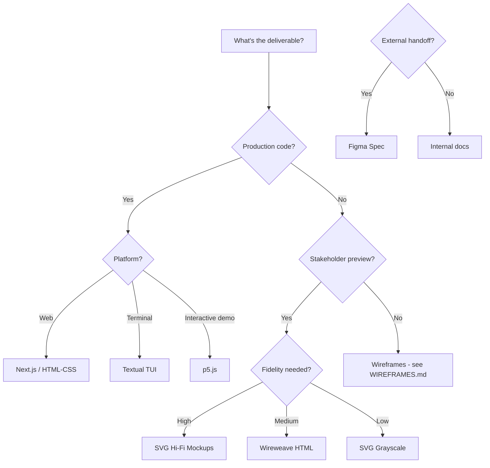

# Output Formats Guide

> This directory contains implementation guides for each output format. Select based on deliverable requirements and project phase.

---

## Format Selection Matrix



## Quick Reference

| Output | File | Best For | Tooling |
|--------|------|----------|---------|
| **Next.js** | `nextjs.md` | Production web apps, landing pages | Node.js, npm |
| **HTML/CSS** | `html-css.md` | Static sites, email, no-framework needs | None |
| **p5.js** | `p5js.md` | Interactive prototypes, animation demos | Browser |
| **Textual TUI** | `textual-tui.md` | Terminal applications, CLI tools | Python |
| **SVG Mockups** | `svg-mockups.md` | Visual mockups, presentations | None |
| **Figma Spec** | `figma-spec.md` | Developer handoff, external teams | Markdown |
| **Landing Pages** | `landing-pages.md` | Validation, marketing, conversion | Next.js or HTML |

## Output Selection by Project Phase

| Phase | Primary Output | Supporting Outputs |
|-------|---------------|-------------------|
| Discovery | Wireframes (ASCII/Salt) | Mermaid flows |
| Validation | Landing page (Next.js) | p5.js prototypes |
| Design System | Figma spec + SVG | Token files |
| Production Web | Next.js | HTML/CSS fallbacks |
| Production TUI | Textual | ASCII mockups |
| Handoff | Figma spec | Component docs |

## Common Workflows

### Web Product Validation
```
Brief → ASCII wireframe → Landing page (Next.js) → Deploy → Measure
```

### Design System Creation
```
Style guide → SVG mockups → Figma spec → Token export → Implementation
```

### Interactive Demo
```
Concept → p5.js prototype → User testing → Iterate → Production decision
```

### CLI Tool Design
```
Brief → ASCII wireframe → Textual TUI → Testing → Release
```

---

## Files in This Directory

| File | Size | Description |
|------|------|-------------|
| `nextjs.md` | 28KB | Next.js App Router patterns, components, forms |
| `html-css.md` | 17KB | Vanilla HTML/CSS, design tokens, utilities |
| `p5js.md` | 20KB | Interactive prototyping, animations, gestures |
| `textual-tui.md` | 20KB | Python TUI, components, forms, themes |
| `svg-mockups.md` | 18KB | SVG mockup templates, annotation system |
| `figma-spec.md` | 23KB | Design handoff documentation, export specs |
| `landing-pages.md` | 28KB | Conversion-focused patterns, A/B testing, analytics |

---

*See also: `WIREFRAMES.md` for text-based wireframe formats*
