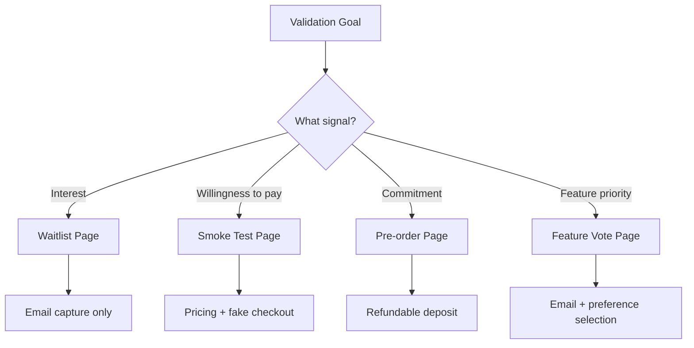

# Landing Page Implementation Guide

> Conversion-focused patterns for validation landing pages. Optimized for email capture, waitlist signups, and pre-launch testing.

---

## 1. Landing Page Types

### 1.1 Selection Guide



### 1.2 Conversion Benchmarks

| Page Type | Good CVR | Great CVR | Data Captured |
|-----------|----------|-----------|---------------|
| Waitlist | 15-25% | 30%+ | Email |
| Smoke Test | 3-8% | 10%+ | Email + pricing click |
| Pre-order | 1-3% | 5%+ | Email + payment intent |
| Feature Vote | 10-20% | 25%+ | Email + preferences |

---

## 2. Waitlist Landing Page

### 2.1 Structure

```
┌─────────────────────────────────────────────────────┐
│  Logo                                    [Login →]  │
├─────────────────────────────────────────────────────┤
│                                                     │
│         [Problem-Focused Headline]                  │
│                                                     │
│         Subheadline with solution hint              │
│                                                     │
│     ┌──────────────────┐  ┌──────────────┐         │
│     │ Enter your email │  │ Join Waitlist│         │
│     └──────────────────┘  └──────────────┘         │
│                                                     │
│         "1,234 people already signed up"            │
│                                                     │
├─────────────────────────────────────────────────────┤
│                                                     │
│   ┌──────────┐  ┌──────────┐  ┌──────────┐        │
│   │ Benefit  │  │ Benefit  │  │ Benefit  │        │
│   │   One    │  │   Two    │  │  Three   │        │
│   └──────────┘  └──────────┘  └──────────┘        │
│                                                     │
├─────────────────────────────────────────────────────┤
│                                                     │
│   "How it works" - 3 simple steps                   │
│                                                     │
│   1. [Step] → 2. [Step] → 3. [Outcome]             │
│                                                     │
├─────────────────────────────────────────────────────┤
│                                                     │
│   "Don't just take our word for it"                │
│                                                     │
│   ┌─────────────────────────────────────┐          │
│   │ "Testimonial quote here..."          │          │
│   │         - Name, Role                 │          │
│   └─────────────────────────────────────┘          │
│                                                     │
├─────────────────────────────────────────────────────┤
│                                                     │
│         [Get Early Access]                          │
│                                                     │
│   "Free forever for founding members"               │
│                                                     │
├─────────────────────────────────────────────────────┤
│  © 2026 Company  |  Privacy  |  Terms              │
└─────────────────────────────────────────────────────┘
```

### 2.2 Implementation

```tsx
// app/(marketing)/page.tsx
import { Hero } from '@/components/sections/hero'
import { Benefits } from '@/components/sections/benefits'
import { HowItWorks } from '@/components/sections/how-it-works'
import { Testimonials } from '@/components/sections/testimonials'
import { FinalCTA } from '@/components/sections/final-cta'

export default function LandingPage() {
  return (
    <>
      <Hero
        headline="Stop Wasting Hours on [Pain Point]"
        subheadline="[Product] automates [task] so you can focus on what matters"
        ctaText="Join the Waitlist"
        showEmailCapture
        socialProof="Join 1,234 others already on the list"
      />
      
      <Benefits
        features={[
          {
            icon: <ClockIcon />,
            title: "Save 10+ hours/week",
            description: "Automate repetitive tasks that drain your time"
          },
          {
            icon: <ChartIcon />,
            title: "Boost output by 3x",
            description: "Do more with less effort using AI assistance"
          },
          {
            icon: <ShieldIcon />,
            title: "Enterprise-grade security",
            description: "Your data stays yours with end-to-end encryption"
          },
        ]}
      />
      
      <HowItWorks
        steps={[
          { title: "Connect", description: "Link your existing tools in 2 clicks" },
          { title: "Configure", description: "Set your preferences once" },
          { title: "Relax", description: "Watch the magic happen automatically" },
        ]}
      />
      
      <Testimonials
        testimonials={[
          {
            quote: "This changed how our team works. We shipped 2x faster last quarter.",
            author: "Sarah Chen",
            role: "Engineering Lead",
            company: "TechCorp"
          }
        ]}
      />
      
      <FinalCTA
        headline="Ready to reclaim your time?"
        ctaText="Get Early Access"
        incentive="Founding members get lifetime access to Pro features"
      />
    </>
  )
}
```

---

## 3. Smoke Test Page (Fake Door)

### 3.1 Purpose

Test willingness to pay without building the product. Users click "Buy" → see "Coming Soon" → capture email.

### 3.2 Structure

```
┌─────────────────────────────────────────────────────┐
│  Logo                             [Login] [Sign up] │
├─────────────────────────────────────────────────────┤
│                                                     │
│         [Product Name]                              │
│         Tagline that promises value                 │
│                                                     │
│         ┌──────────────────────────────┐           │
│         │     [Product Screenshot]      │           │
│         │        or Demo GIF            │           │
│         └──────────────────────────────┘           │
│                                                     │
├─────────────────────────────────────────────────────┤
│                                                     │
│   ┌─────────────────────────────────────────────┐  │
│   │                PRICING                       │  │
│   ├─────────────┬─────────────┬─────────────────┤  │
│   │   Starter   │    Pro ★    │   Enterprise    │  │
│   │   $9/mo     │   $29/mo    │   Contact us    │  │
│   │             │             │                 │  │
│   │ • Feature 1 │ • All Start │ • All Pro       │  │
│   │ • Feature 2 │ • Feature 3 │ • Dedicated     │  │
│   │ • Feature 3 │ • Feature 4 │ • Custom        │  │
│   │             │ • Feature 5 │                 │  │
│   │ [Get Start] │ [Get Pro ★] │ [Contact Sales] │  │
│   └─────────────┴─────────────┴─────────────────┘  │
│                                                     │
├─────────────────────────────────────────────────────┤
│  [Features section]                                 │
│  [Testimonials section]                             │
│  [FAQ section]                                      │
├─────────────────────────────────────────────────────┤
│  © 2026 Company  |  Privacy  |  Terms              │
└─────────────────────────────────────────────────────┘
```

### 3.3 Fake Checkout Flow

```tsx
// components/pricing/pricing-card.tsx
'use client'

import { useState } from 'react'
import { Button } from '@/components/ui/button'
import { ComingSoonModal } from './coming-soon-modal'

interface PricingCardProps {
  name: string
  price: string
  features: string[]
  highlighted?: boolean
}

export function PricingCard({ name, price, features, highlighted }: PricingCardProps) {
  const [showModal, setShowModal] = useState(false)
  
  const handleClick = () => {
    // Track the click with tier info
    trackEvent('pricing_click', { tier: name, price })
    setShowModal(true)
  }
  
  return (
    <>
      <div className={cn(
        'rounded-lg border p-6',
        highlighted && 'border-primary shadow-lg ring-1 ring-primary'
      )}>
        <h3 className="text-lg font-semibold">{name}</h3>
        <p className="mt-2">
          <span className="text-3xl font-bold">{price}</span>
          <span className="text-muted-foreground">/month</span>
        </p>
        
        <ul className="mt-6 space-y-3">
          {features.map((feature, i) => (
            <li key={i} className="flex items-center gap-2">
              <CheckIcon className="h-4 w-4 text-primary" />
              <span className="text-sm">{feature}</span>
            </li>
          ))}
        </ul>
        
        <Button
          onClick={handleClick}
          variant={highlighted ? 'primary' : 'secondary'}
          className="mt-8 w-full"
        >
          Get {name}
        </Button>
      </div>
      
      <ComingSoonModal
        open={showModal}
        onClose={() => setShowModal(false)}
        tier={name}
        price={price}
      />
    </>
  )
}
```

```tsx
// components/pricing/coming-soon-modal.tsx
'use client'

import { Dialog } from '@/components/ui/dialog'
import { WaitlistForm } from '@/components/forms/waitlist-form'

interface ComingSoonModalProps {
  open: boolean
  onClose: () => void
  tier: string
  price: string
}

export function ComingSoonModal({ open, onClose, tier, price }: ComingSoonModalProps) {
  return (
    <Dialog open={open} onOpenChange={onClose}>
      <div className="p-6 text-center">
        <div className="mx-auto mb-4 flex h-12 w-12 items-center justify-center rounded-full bg-primary/10">
          <RocketIcon className="h-6 w-6 text-primary" />
        </div>
        
        <h2 className="text-xl font-semibold">We're launching soon!</h2>
        <p className="mt-2 text-muted-foreground">
          {tier} at {price}/mo is coming in early 2026.
          Join the waitlist to lock in this price forever.
        </p>
        
        <div className="mt-6">
          <WaitlistForm 
            metadata={{ selectedTier: tier, intendedPrice: price }}
          />
        </div>
        
        <p className="mt-4 text-xs text-muted-foreground">
          No spam. Unsubscribe anytime.
        </p>
      </div>
    </Dialog>
  )
}
```

---

## 4. Pre-order Page

### 4.1 Purpose

Capture payment commitment (refundable) to validate willingness to pay.

### 4.2 Key Elements

```tsx
// components/sections/pre-order-hero.tsx
export function PreOrderHero() {
  return (
    <section className="py-24">
      <div className="container mx-auto px-4">
        <div className="grid lg:grid-cols-2 gap-12 items-center">
          <div>
            <span className="inline-block rounded-full bg-primary/10 px-4 py-1 text-sm font-medium text-primary">
              Pre-order Now • Ships Q2 2026
            </span>
            
            <h1 className="mt-6 text-4xl font-bold tracking-tight sm:text-5xl">
              [Product Name]
            </h1>
            
            <p className="mt-4 text-lg text-muted-foreground">
              [Value proposition]
            </p>
            
            <div className="mt-8 flex items-baseline gap-4">
              <span className="text-4xl font-bold">$199</span>
              <span className="text-lg text-muted-foreground line-through">$299</span>
              <span className="rounded-full bg-success/10 px-3 py-1 text-sm font-medium text-success">
                Save 33%
              </span>
            </div>
            
            <Button size="lg" className="mt-8">
              Pre-order Now
            </Button>
            
            <div className="mt-6 flex items-center gap-6 text-sm text-muted-foreground">
              <div className="flex items-center gap-2">
                <ShieldIcon className="h-4 w-4" />
                <span>Full refund if we don't ship</span>
              </div>
              <div className="flex items-center gap-2">
                <UsersIcon className="h-4 w-4" />
                <span>347 pre-orders</span>
              </div>
            </div>
          </div>
          
          <div className="relative aspect-square">
            <Image
              src="/product-hero.png"
              alt="Product preview"
              fill
              className="object-contain"
              priority
            />
          </div>
        </div>
      </div>
    </section>
  )
}
```

---

## 5. Conversion Optimization Patterns

### 5.1 Above-Fold Checklist

- [ ] Headline visible within 1 second of load
- [ ] Value proposition clear in headline
- [ ] Primary CTA visible without scrolling
- [ ] Social proof visible (count, logos, or testimonial snippet)
- [ ] No distracting navigation
- [ ] Fast LCP (< 2.5s)

### 5.2 CTA Button Patterns

```tsx
// components/ui/cta-button.tsx
interface CTAButtonProps {
  children: React.ReactNode
  subtext?: string
  onClick?: () => void
}

export function CTAButton({ children, subtext, onClick }: CTAButtonProps) {
  return (
    <div className="flex flex-col items-center">
      <Button
        size="lg"
        onClick={onClick}
        className="min-w-[200px] text-base"
      >
        {children}
      </Button>
      {subtext && (
        <p className="mt-2 text-xs text-muted-foreground">{subtext}</p>
      )}
    </div>
  )
}

// Usage
<CTAButton subtext="No credit card required">
  Start My Free Trial
</CTAButton>
```

### 5.3 Social Proof Counter

```tsx
// components/social-proof-counter.tsx
'use client'

import { useEffect, useState } from 'react'

interface SocialProofCounterProps {
  count: number
  label: string
}

export function SocialProofCounter({ count, label }: SocialProofCounterProps) {
  const [displayCount, setDisplayCount] = useState(0)
  
  useEffect(() => {
    // Animate count on mount
    const duration = 1500
    const steps = 30
    const increment = count / steps
    let current = 0
    
    const timer = setInterval(() => {
      current += increment
      if (current >= count) {
        setDisplayCount(count)
        clearInterval(timer)
      } else {
        setDisplayCount(Math.floor(current))
      }
    }, duration / steps)
    
    return () => clearInterval(timer)
  }, [count])
  
  return (
    <p className="text-sm text-muted-foreground">
      <span className="font-semibold text-foreground">
        {displayCount.toLocaleString()}
      </span>{' '}
      {label}
    </p>
  )
}

// Usage
<SocialProofCounter count={1234} label="people already signed up" />
```

### 5.4 Urgency Elements

```tsx
// components/urgency-banner.tsx
export function UrgencyBanner() {
  return (
    <div className="bg-accent text-accent-foreground py-2 text-center text-sm">
      <span className="font-medium">🚀 Early bird pricing ends in 3 days</span>
      {' — '}
      <span>Lock in 50% off forever</span>
    </div>
  )
}

// components/limited-spots.tsx
export function LimitedSpots({ remaining, total }: { remaining: number; total: number }) {
  const percentage = (remaining / total) * 100
  
  return (
    <div className="rounded-lg border border-warning/50 bg-warning/10 p-4">
      <div className="flex items-center justify-between text-sm">
        <span className="font-medium">Founding member spots</span>
        <span className="text-warning">{remaining} of {total} remaining</span>
      </div>
      <div className="mt-2 h-2 rounded-full bg-muted">
        <div
          className="h-full rounded-full bg-warning transition-all"
          style={{ width: `${100 - percentage}%` }}
        />
      </div>
    </div>
  )
}
```

---

## 6. Form Patterns

### 6.1 Email-Only Form

```tsx
// components/forms/email-capture.tsx
'use client'

import { useFormState, useFormStatus } from 'react-dom'
import { Button } from '@/components/ui/button'
import { Input } from '@/components/ui/input'
import { subscribeToWaitlist } from '@/app/actions'

function SubmitButton({ text = 'Join Waitlist' }: { text?: string }) {
  const { pending } = useFormStatus()
  
  return (
    <Button type="submit" disabled={pending} className="whitespace-nowrap">
      {pending ? 'Joining...' : text}
    </Button>
  )
}

export function EmailCapture({ 
  buttonText = 'Join Waitlist',
  placeholder = 'Enter your email',
  layout = 'inline' // 'inline' | 'stacked'
}: {
  buttonText?: string
  placeholder?: string
  layout?: 'inline' | 'stacked'
}) {
  const [state, formAction] = useFormState(subscribeToWaitlist, {
    success: false,
    message: '',
  })

  if (state.success) {
    return (
      <div className="rounded-lg bg-success/10 p-4 text-center">
        <p className="font-medium text-success">You're on the list! 🎉</p>
        <p className="text-sm text-muted-foreground">Check your inbox for confirmation.</p>
      </div>
    )
  }

  return (
    <form action={formAction}>
      <div className={cn(
        'flex gap-3',
        layout === 'stacked' ? 'flex-col' : 'flex-col sm:flex-row'
      )}>
        <Input
          name="email"
          type="email"
          placeholder={placeholder}
          required
          className="flex-1"
          aria-label="Email address"
        />
        <SubmitButton text={buttonText} />
      </div>
      {state.message && !state.success && (
        <p className="mt-2 text-sm text-error">{state.message}</p>
      )}
    </form>
  )
}
```

### 6.2 Multi-Field Form (B2B)

```tsx
// components/forms/lead-capture.tsx
'use client'

import { useFormState, useFormStatus } from 'react-dom'
import { Button } from '@/components/ui/button'
import { Input } from '@/components/ui/input'
import { Select } from '@/components/ui/select'
import { submitLead } from '@/app/actions'

export function LeadCaptureForm() {
  const [state, formAction] = useFormState(submitLead, {
    success: false,
    errors: {},
  })

  if (state.success) {
    return (
      <div className="rounded-lg bg-success/10 p-6 text-center">
        <h3 className="font-semibold text-success">Thanks for your interest!</h3>
        <p className="mt-2 text-sm text-muted-foreground">
          We'll reach out within 24 hours.
        </p>
      </div>
    )
  }

  return (
    <form action={formAction} className="space-y-4">
      <div className="grid gap-4 sm:grid-cols-2">
        <Input
          name="firstName"
          label="First name"
          required
          error={state.errors?.firstName}
        />
        <Input
          name="lastName"
          label="Last name"
          required
          error={state.errors?.lastName}
        />
      </div>
      
      <Input
        name="email"
        type="email"
        label="Work email"
        required
        error={state.errors?.email}
      />
      
      <Input
        name="company"
        label="Company"
        required
        error={state.errors?.company}
      />
      
      <Select
        name="companySize"
        label="Company size"
        options={[
          { value: '1-10', label: '1-10 employees' },
          { value: '11-50', label: '11-50 employees' },
          { value: '51-200', label: '51-200 employees' },
          { value: '201-1000', label: '201-1000 employees' },
          { value: '1000+', label: '1000+ employees' },
        ]}
        error={state.errors?.companySize}
      />
      
      <Button type="submit" className="w-full">
        Request Demo
      </Button>
      
      <p className="text-xs text-center text-muted-foreground">
        By submitting, you agree to our{' '}
        <a href="/privacy" className="underline">Privacy Policy</a>
      </p>
    </form>
  )
}
```

---

## 7. Analytics & Tracking

### 7.1 Event Tracking Setup

```tsx
// lib/analytics.ts
type EventName =
  | 'page_view'
  | 'cta_click'
  | 'form_start'
  | 'form_submit'
  | 'form_error'
  | 'pricing_click'
  | 'scroll_depth'

interface EventProperties {
  [key: string]: string | number | boolean
}

export function trackEvent(name: EventName, properties?: EventProperties) {
  // Google Analytics 4
  if (typeof window !== 'undefined' && window.gtag) {
    window.gtag('event', name, properties)
  }
  
  // Plausible
  if (typeof window !== 'undefined' && window.plausible) {
    window.plausible(name, { props: properties })
  }
  
  // PostHog
  if (typeof window !== 'undefined' && window.posthog) {
    window.posthog.capture(name, properties)
  }
  
  // Console in development
  if (process.env.NODE_ENV === 'development') {
    console.log('[Analytics]', name, properties)
  }
}
```

### 7.2 Tracking Implementation

```tsx
// Track CTA clicks
<Button onClick={() => trackEvent('cta_click', { location: 'hero', text: 'Join Waitlist' })}>
  Join Waitlist
</Button>

// Track form submissions
async function submitForm(data: FormData) {
  trackEvent('form_submit', { form: 'waitlist' })
  // ... submit logic
}

// Track pricing tier clicks
<PricingCard
  onClick={() => trackEvent('pricing_click', { tier: 'pro', price: 29 })}
/>

// Track scroll depth (in layout)
useEffect(() => {
  const handleScroll = () => {
    const scrollPercent = Math.round(
      (window.scrollY / (document.body.scrollHeight - window.innerHeight)) * 100
    )
    
    if (scrollPercent >= 25 && !tracked25) {
      trackEvent('scroll_depth', { depth: 25 })
      tracked25 = true
    }
    // ... 50, 75, 100
  }
  
  window.addEventListener('scroll', handleScroll)
  return () => window.removeEventListener('scroll', handleScroll)
}, [])
```

### 7.3 UTM Parameter Capture

```tsx
// lib/utm.ts
export function captureUTMParams() {
  if (typeof window === 'undefined') return {}
  
  const params = new URLSearchParams(window.location.search)
  const utm: Record<string, string> = {}
  
  const utmParams = ['utm_source', 'utm_medium', 'utm_campaign', 'utm_term', 'utm_content']
  
  utmParams.forEach(param => {
    const value = params.get(param)
    if (value) {
      utm[param] = value
      // Store in localStorage for attribution
      localStorage.setItem(param, value)
    }
  })
  
  return utm
}

// Include in form submission
const formData = {
  email: email,
  ...captureUTMParams(),
}
```

---

## 8. A/B Testing Setup

### 8.1 Simple Variant Testing

```tsx
// lib/ab-test.ts
export function getVariant(testName: string, variants: string[]): string {
  // Check for existing assignment
  const stored = localStorage.getItem(`ab_${testName}`)
  if (stored && variants.includes(stored)) {
    return stored
  }
  
  // Assign randomly
  const variant = variants[Math.floor(Math.random() * variants.length)]
  localStorage.setItem(`ab_${testName}`, variant)
  
  // Track assignment
  trackEvent('ab_assignment', { test: testName, variant })
  
  return variant
}

// Usage in component
export function Hero() {
  const [variant, setVariant] = useState<string>()
  
  useEffect(() => {
    setVariant(getVariant('hero_headline', ['control', 'variant_a', 'variant_b']))
  }, [])
  
  const headlines = {
    control: 'Stop Wasting Time on Manual Tasks',
    variant_a: 'Automate Your Workflow in Minutes',
    variant_b: 'Save 10 Hours Every Week',
  }
  
  return (
    <h1>{headlines[variant as keyof typeof headlines] || headlines.control}</h1>
  )
}
```

---

## 9. Performance Optimization

### 9.1 Critical Path

```tsx
// app/(marketing)/page.tsx
import dynamic from 'next/dynamic'

// Critical - load immediately
import { Hero } from '@/components/sections/hero'
import { SocialProof } from '@/components/sections/social-proof'

// Non-critical - lazy load
const Benefits = dynamic(() => import('@/components/sections/benefits'))
const HowItWorks = dynamic(() => import('@/components/sections/how-it-works'))
const Testimonials = dynamic(() => import('@/components/sections/testimonials'))
const FAQ = dynamic(() => import('@/components/sections/faq'))
const FinalCTA = dynamic(() => import('@/components/sections/final-cta'))

export default function LandingPage() {
  return (
    <>
      {/* Critical path - above fold */}
      <Hero />
      <SocialProof />
      
      {/* Lazy loaded - below fold */}
      <Benefits />
      <HowItWorks />
      <Testimonials />
      <FAQ />
      <FinalCTA />
    </>
  )
}
```

### 9.2 Image Optimization

```tsx
// Hero image - prioritize
<Image
  src="/hero.png"
  alt="Product preview"
  width={600}
  height={400}
  priority
  quality={90}
/>

// Below-fold images - lazy load (default)
<Image
  src="/feature.png"
  alt="Feature illustration"
  width={400}
  height={300}
  loading="lazy"
  quality={80}
/>
```

---

## 10. Checklist Before Launch

### Technical
- [ ] All CTAs tracked with analytics
- [ ] Forms validated client and server side
- [ ] Error states handled gracefully
- [ ] Mobile responsive (test on real devices)
- [ ] LCP < 2.5s on 3G
- [ ] No CLS (layout shifts)

### Conversion
- [ ] Headline clearly states value proposition
- [ ] CTA visible above fold
- [ ] Social proof present
- [ ] Form has minimal fields
- [ ] Privacy policy linked
- [ ] Trust signals present

### Legal
- [ ] Privacy policy page exists
- [ ] Terms of service page exists
- [ ] Cookie consent (if required)
- [ ] Unsubscribe mechanism for emails

---

## References

- `nextjs.md` - Full Next.js implementation guide
- `MARKETING.md` - Strategy and copy patterns
- `PATTERNS/components.md` - Component patterns
- `CORE.md` - Design principles

---

*Version: 0.1.0*
