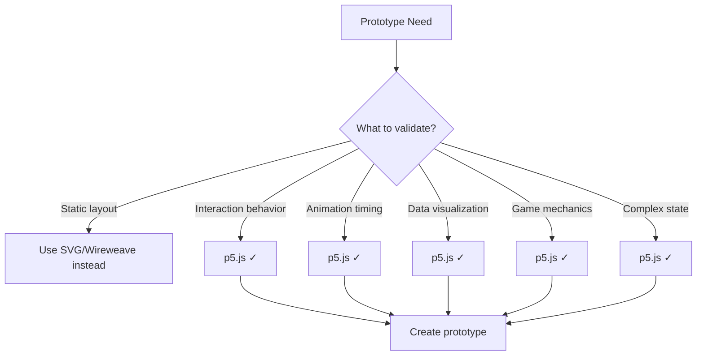

# p5.js Interactive Prototyping Guide

> Rapid interactive prototyping with p5.js for validating interactions, animations, and user flows before production implementation.

---

## 1. When to Use p5.js Prototypes

### 1.1 Decision Matrix



### 1.2 Best Use Cases

| Use Case | Why p5.js |
|----------|-----------|
| Animation timing exploration | Frame-by-frame control |
| Gesture/drag interactions | Direct canvas manipulation |
| Data visualization prototypes | Drawing primitives + real data |
| Onboarding flow testing | State machine + transitions |
| Mobile interaction patterns | Touch events + gestures |
| Game-like interfaces | Collision, physics, particles |

---

## 2. Setup

### 2.1 Quick Start (Browser)

```html
<!DOCTYPE html>
<html lang="en">
<head>
  <meta charset="UTF-8">
  <meta name="viewport" content="width=device-width, initial-scale=1.0">
  <title>Prototype: [Name]</title>
  <script src="https://cdnjs.cloudflare.com/ajax/libs/p5.js/1.9.0/p5.min.js"></script>
  <style>
    body {
      margin: 0;
      display: flex;
      justify-content: center;
      align-items: center;
      min-height: 100vh;
      background: #f5f5f5;
    }
    canvas {
      box-shadow: 0 4px 20px rgba(0,0,0,0.1);
    }
  </style>
</head>
<body>
  <script src="sketch.js"></script>
</body>
</html>
```

### 2.2 Starter Template

```javascript
// sketch.js

// Configuration
const CONFIG = {
  width: 375,  // iPhone width
  height: 812, // iPhone height
  bg: '#FFFFFF',
  primary: '#3B82F6',
  secondary: '#64748B',
  text: '#1E293B',
  border: '#E2E8F0',
}

// State
let state = {
  screen: 'home',
  loading: false,
  data: [],
}

function setup() {
  createCanvas(CONFIG.width, CONFIG.height)
  textFont('system-ui')
}

function draw() {
  background(CONFIG.bg)
  
  // Route to current screen
  switch (state.screen) {
    case 'home':
      drawHomeScreen()
      break
    case 'detail':
      drawDetailScreen()
      break
    default:
      drawHomeScreen()
  }
}

function mousePressed() {
  // Handle interactions
}

function drawHomeScreen() {
  // Draw UI elements
}

function drawDetailScreen() {
  // Draw UI elements
}
```

---

## 3. UI Component Library

### 3.1 Basic Components

```javascript
// components.js

// Button
function drawButton(x, y, w, h, label, variant = 'primary') {
  push()
  
  const isHovered = mouseX > x && mouseX < x + w && mouseY > y && mouseY < y + h
  
  // Background
  if (variant === 'primary') {
    fill(isHovered ? '#2563EB' : CONFIG.primary)
  } else {
    fill(isHovered ? '#F1F5F9' : '#FFFFFF')
    stroke(CONFIG.border)
    strokeWeight(1)
  }
  
  rect(x, y, w, h, 8)
  
  // Label
  fill(variant === 'primary' ? '#FFFFFF' : CONFIG.text)
  noStroke()
  textAlign(CENTER, CENTER)
  textSize(14)
  text(label, x + w/2, y + h/2)
  
  pop()
  
  return { x, y, w, h, isHovered }
}

// Input field
function drawInput(x, y, w, h, placeholder, value = '') {
  push()
  
  const isFocused = state.focusedInput === placeholder
  
  // Background
  fill('#FFFFFF')
  stroke(isFocused ? CONFIG.primary : CONFIG.border)
  strokeWeight(isFocused ? 2 : 1)
  rect(x, y, w, h, 6)
  
  // Text
  noStroke()
  textAlign(LEFT, CENTER)
  textSize(14)
  
  if (value) {
    fill(CONFIG.text)
    text(value, x + 12, y + h/2)
  } else {
    fill(CONFIG.secondary)
    text(placeholder, x + 12, y + h/2)
  }
  
  pop()
  
  return { x, y, w, h }
}

// Card
function drawCard(x, y, w, h, content) {
  push()
  
  // Shadow
  noStroke()
  fill(0, 0, 0, 10)
  rect(x + 2, y + 2, w, h, 12)
  
  // Card
  fill('#FFFFFF')
  rect(x, y, w, h, 12)
  
  // Content callback
  if (content) content(x, y, w, h)
  
  pop()
}

// Avatar
function drawAvatar(x, y, size, initials) {
  push()
  
  fill(CONFIG.primary)
  ellipse(x, y, size)
  
  fill('#FFFFFF')
  textAlign(CENTER, CENTER)
  textSize(size * 0.4)
  text(initials, x, y)
  
  pop()
}

// Icon (simple shapes)
function drawIcon(x, y, size, type) {
  push()
  stroke(CONFIG.secondary)
  strokeWeight(2)
  noFill()
  
  switch (type) {
    case 'arrow-right':
      line(x, y, x + size, y)
      line(x + size - 4, y - 4, x + size, y)
      line(x + size - 4, y + 4, x + size, y)
      break
    case 'check':
      line(x, y, x + size * 0.4, y + size * 0.4)
      line(x + size * 0.4, y + size * 0.4, x + size, y - size * 0.3)
      break
    case 'close':
      line(x, y, x + size, y + size)
      line(x + size, y, x, y + size)
      break
    case 'menu':
      line(x, y, x + size, y)
      line(x, y + size/2, x + size, y + size/2)
      line(x, y + size, x + size, y + size)
      break
  }
  
  pop()
}

// Progress bar
function drawProgress(x, y, w, h, progress) {
  push()
  
  // Background
  fill(CONFIG.border)
  noStroke()
  rect(x, y, w, h, h/2)
  
  // Fill
  fill(CONFIG.primary)
  rect(x, y, w * progress, h, h/2)
  
  pop()
}

// Toggle switch
function drawToggle(x, y, isOn) {
  push()
  
  const w = 50, h = 28
  
  // Track
  fill(isOn ? CONFIG.primary : CONFIG.border)
  noStroke()
  rect(x, y, w, h, h/2)
  
  // Thumb
  fill('#FFFFFF')
  const thumbX = isOn ? x + w - h/2 - 4 : x + h/2 - 4
  ellipse(thumbX + 4, y + h/2, h - 8)
  
  pop()
  
  return { x, y, w, h }
}
```

### 3.2 Layout Helpers

```javascript
// layout.js

// Header
function drawHeader(title, showBack = false) {
  push()
  
  // Background
  fill('#FFFFFF')
  noStroke()
  rect(0, 0, width, 60)
  
  // Bottom border
  stroke(CONFIG.border)
  strokeWeight(1)
  line(0, 60, width, 60)
  
  // Back button
  if (showBack) {
    drawIcon(16, 30, 12, 'arrow-left')
  }
  
  // Title
  fill(CONFIG.text)
  noStroke()
  textAlign(CENTER, CENTER)
  textSize(17)
  textStyle(BOLD)
  text(title, width/2, 30)
  
  pop()
}

// Navigation bar (bottom)
function drawNavBar(items, activeIndex) {
  push()
  
  const y = height - 80
  const itemWidth = width / items.length
  
  // Background
  fill('#FFFFFF')
  noStroke()
  rect(0, y, width, 80)
  
  // Top border
  stroke(CONFIG.border)
  line(0, y, width, y)
  
  // Items
  items.forEach((item, i) => {
    const x = i * itemWidth + itemWidth/2
    const isActive = i === activeIndex
    
    // Icon placeholder
    fill(isActive ? CONFIG.primary : CONFIG.secondary)
    noStroke()
    ellipse(x, y + 25, 24)
    
    // Label
    textAlign(CENTER, TOP)
    textSize(10)
    fill(isActive ? CONFIG.primary : CONFIG.secondary)
    text(item.label, x, y + 42)
  })
  
  pop()
}

// List item
function drawListItem(x, y, w, h, title, subtitle, showArrow = true) {
  push()
  
  // Background
  fill('#FFFFFF')
  noStroke()
  rect(x, y, w, h)
  
  // Bottom border
  stroke(CONFIG.border)
  line(x + 16, y + h, x + w - 16, y + h)
  
  // Text
  noStroke()
  textAlign(LEFT, TOP)
  
  fill(CONFIG.text)
  textSize(16)
  text(title, x + 16, y + 12)
  
  if (subtitle) {
    fill(CONFIG.secondary)
    textSize(14)
    text(subtitle, x + 16, y + 34)
  }
  
  // Arrow
  if (showArrow) {
    drawIcon(x + w - 28, y + h/2, 8, 'arrow-right')
  }
  
  pop()
  
  return { x, y, w, h }
}
```

---

## 4. Interaction Patterns

### 4.1 Click/Tap Handling

```javascript
// State for click targets
let clickTargets = []

function draw() {
  clickTargets = [] // Reset each frame
  
  // Draw UI and register click targets
  const btn1 = drawButton(20, 100, 150, 44, 'Primary CTA')
  clickTargets.push({ ...btn1, action: 'primary-cta' })
  
  const btn2 = drawButton(20, 160, 150, 44, 'Secondary', 'secondary')
  clickTargets.push({ ...btn2, action: 'secondary-cta' })
}

function mousePressed() {
  for (const target of clickTargets) {
    if (
      mouseX > target.x && 
      mouseX < target.x + target.w &&
      mouseY > target.y && 
      mouseY < target.y + target.h
    ) {
      handleAction(target.action)
      break
    }
  }
}

function handleAction(action) {
  console.log('Action:', action)
  
  switch (action) {
    case 'primary-cta':
      state.screen = 'detail'
      break
    case 'secondary-cta':
      // Do something else
      break
    case 'back':
      state.screen = 'home'
      break
  }
}
```

### 4.2 Drag Interactions

```javascript
let isDragging = false
let dragOffset = { x: 0, y: 0 }
let dragTarget = null

function mousePressed() {
  // Check if pressing on draggable element
  if (mouseX > state.cardX && mouseX < state.cardX + 300 &&
      mouseY > state.cardY && mouseY < state.cardY + 200) {
    isDragging = true
    dragOffset.x = mouseX - state.cardX
    dragOffset.y = mouseY - state.cardY
  }
}

function mouseDragged() {
  if (isDragging) {
    state.cardX = mouseX - dragOffset.x
    state.cardY = mouseY - dragOffset.y
  }
}

function mouseReleased() {
  if (isDragging) {
    isDragging = false
    // Snap to position or trigger action
    snapToGrid()
  }
}

function snapToGrid() {
  const gridSize = 20
  state.cardX = Math.round(state.cardX / gridSize) * gridSize
  state.cardY = Math.round(state.cardY / gridSize) * gridSize
}
```

### 4.3 Swipe Gestures

```javascript
let touchStart = { x: 0, y: 0, time: 0 }
let touchEnd = { x: 0, y: 0, time: 0 }

function mousePressed() {
  touchStart.x = mouseX
  touchStart.y = mouseY
  touchStart.time = millis()
}

function mouseReleased() {
  touchEnd.x = mouseX
  touchEnd.y = mouseY
  touchEnd.time = millis()
  
  detectSwipe()
}

function detectSwipe() {
  const dx = touchEnd.x - touchStart.x
  const dy = touchEnd.y - touchStart.y
  const dt = touchEnd.time - touchStart.time
  
  const minDistance = 50
  const maxTime = 300
  
  if (dt < maxTime) {
    if (Math.abs(dx) > Math.abs(dy) && Math.abs(dx) > minDistance) {
      // Horizontal swipe
      if (dx > 0) {
        handleSwipe('right')
      } else {
        handleSwipe('left')
      }
    } else if (Math.abs(dy) > minDistance) {
      // Vertical swipe
      if (dy > 0) {
        handleSwipe('down')
      } else {
        handleSwipe('up')
      }
    }
  }
}

function handleSwipe(direction) {
  console.log('Swipe:', direction)
  
  switch (direction) {
    case 'left':
      nextCard()
      break
    case 'right':
      previousCard()
      break
  }
}
```

---

## 5. Animation Patterns

### 5.1 Easing Functions

```javascript
// easing.js

const Easing = {
  linear: t => t,
  
  easeInQuad: t => t * t,
  easeOutQuad: t => t * (2 - t),
  easeInOutQuad: t => t < 0.5 ? 2 * t * t : -1 + (4 - 2 * t) * t,
  
  easeInCubic: t => t * t * t,
  easeOutCubic: t => (--t) * t * t + 1,
  easeInOutCubic: t => t < 0.5 ? 4 * t * t * t : (t - 1) * (2 * t - 2) * (2 * t - 2) + 1,
  
  easeOutBack: t => {
    const c1 = 1.70158
    const c3 = c1 + 1
    return 1 + c3 * Math.pow(t - 1, 3) + c1 * Math.pow(t - 1, 2)
  },
  
  easeOutElastic: t => {
    const c4 = (2 * Math.PI) / 3
    return t === 0 ? 0 : t === 1 ? 1 : 
      Math.pow(2, -10 * t) * Math.sin((t * 10 - 0.75) * c4) + 1
  }
}
```

### 5.2 Animation System

```javascript
// animation.js

class Animation {
  constructor(from, to, duration, easing = Easing.easeOutCubic) {
    this.from = from
    this.to = to
    this.duration = duration
    this.easing = easing
    this.startTime = millis()
    this.complete = false
  }
  
  value() {
    const elapsed = millis() - this.startTime
    const progress = Math.min(elapsed / this.duration, 1)
    const easedProgress = this.easing(progress)
    
    if (progress >= 1) {
      this.complete = true
    }
    
    return this.from + (this.to - this.from) * easedProgress
  }
}

// Usage
let slideAnim = null

function showSlide() {
  slideAnim = new Animation(-width, 0, 400, Easing.easeOutCubic)
}

function draw() {
  if (slideAnim && !slideAnim.complete) {
    const x = slideAnim.value()
    drawPanel(x, 0)
  }
}
```

### 5.3 Page Transitions

```javascript
// transitions.js

let transition = {
  active: false,
  from: null,
  to: null,
  progress: 0,
  startTime: 0,
  duration: 300,
}

function navigateTo(screen) {
  transition.active = true
  transition.from = state.screen
  transition.to = screen
  transition.startTime = millis()
  transition.progress = 0
}

function draw() {
  if (transition.active) {
    // Calculate progress
    const elapsed = millis() - transition.startTime
    transition.progress = Math.min(elapsed / transition.duration, 1)
    const eased = Easing.easeOutCubic(transition.progress)
    
    // Draw outgoing screen (sliding out)
    push()
    translate(-width * eased, 0)
    drawScreen(transition.from)
    pop()
    
    // Draw incoming screen (sliding in)
    push()
    translate(width * (1 - eased), 0)
    drawScreen(transition.to)
    pop()
    
    // Complete transition
    if (transition.progress >= 1) {
      transition.active = false
      state.screen = transition.to
    }
  } else {
    drawScreen(state.screen)
  }
}
```

---

## 6. Example: Onboarding Flow

```javascript
// onboarding-prototype.js

const CONFIG = {
  width: 375,
  height: 812,
  primary: '#3B82F6',
  text: '#1E293B',
  secondary: '#64748B',
  bg: '#FFFFFF',
}

const slides = [
  {
    title: 'Welcome to Product',
    description: 'The easiest way to accomplish your goals',
    illustration: 'wave', // placeholder
  },
  {
    title: 'Stay Organized',
    description: 'Keep everything in one place',
    illustration: 'folder',
  },
  {
    title: 'Work Together',
    description: 'Collaborate with your team in real-time',
    illustration: 'people',
  },
]

let state = {
  currentSlide: 0,
  slideOffset: 0,
}

let slideAnim = null

function setup() {
  createCanvas(CONFIG.width, CONFIG.height)
  textFont('system-ui')
}

function draw() {
  background(CONFIG.bg)
  
  // Animate slide if transitioning
  if (slideAnim && !slideAnim.complete) {
    state.slideOffset = slideAnim.value()
  }
  
  // Draw slides
  slides.forEach((slide, i) => {
    const x = (i - state.currentSlide) * width + state.slideOffset
    if (x > -width && x < width * 2) {
      drawSlide(x, slide, i)
    }
  })
  
  // Draw pagination dots
  drawPagination()
  
  // Draw CTA button
  drawCTA()
}

function drawSlide(x, slide, index) {
  push()
  translate(x, 0)
  
  // Illustration placeholder
  fill(CONFIG.primary + '20')
  noStroke()
  ellipse(width/2, 280, 200, 200)
  
  fill(CONFIG.primary)
  textAlign(CENTER, CENTER)
  textSize(48)
  text('🎨', width/2, 280)
  
  // Title
  fill(CONFIG.text)
  textAlign(CENTER, TOP)
  textSize(28)
  textStyle(BOLD)
  text(slide.title, width/2, 450)
  
  // Description
  fill(CONFIG.secondary)
  textSize(16)
  textStyle(NORMAL)
  textWrap(WORD)
  text(slide.description, 40, 500, width - 80)
  
  pop()
}

function drawPagination() {
  const dotSize = 8
  const dotSpacing = 16
  const totalWidth = slides.length * dotSize + (slides.length - 1) * dotSpacing
  const startX = (width - totalWidth) / 2
  
  slides.forEach((_, i) => {
    const isActive = i === state.currentSlide
    fill(isActive ? CONFIG.primary : CONFIG.primary + '40')
    noStroke()
    ellipse(startX + i * (dotSize + dotSpacing) + dotSize/2, 620, dotSize)
  })
}

function drawCTA() {
  const isLastSlide = state.currentSlide === slides.length - 1
  const label = isLastSlide ? 'Get Started' : 'Next'
  
  // Button
  fill(CONFIG.primary)
  noStroke()
  rect(24, height - 120, width - 48, 52, 12)
  
  // Label
  fill('#FFFFFF')
  textAlign(CENTER, CENTER)
  textSize(16)
  textStyle(BOLD)
  text(label, width/2, height - 94)
  
  // Skip text (if not last)
  if (!isLastSlide) {
    fill(CONFIG.secondary)
    textSize(14)
    textStyle(NORMAL)
    text('Skip', width/2, height - 50)
  }
}

function mousePressed() {
  // Check CTA button
  if (mouseY > height - 120 && mouseY < height - 68) {
    if (state.currentSlide < slides.length - 1) {
      goToSlide(state.currentSlide + 1)
    } else {
      // Complete onboarding
      console.log('Onboarding complete!')
    }
  }
  
  // Check skip text
  if (mouseY > height - 65 && mouseY < height - 35) {
    state.currentSlide = slides.length - 1
  }
}

function goToSlide(index) {
  const direction = index > state.currentSlide ? -1 : 1
  slideAnim = new Animation(0, direction * width, 300, Easing.easeOutCubic)
  
  setTimeout(() => {
    state.currentSlide = index
    state.slideOffset = 0
  }, 300)
}

// Swipe support
let touchStartX = 0

function mousePressed() {
  touchStartX = mouseX
}

function mouseReleased() {
  const dx = mouseX - touchStartX
  
  if (Math.abs(dx) > 50) {
    if (dx < 0 && state.currentSlide < slides.length - 1) {
      goToSlide(state.currentSlide + 1)
    } else if (dx > 0 && state.currentSlide > 0) {
      goToSlide(state.currentSlide - 1)
    }
  }
}
```

---

## 7. Testing & Export

### 7.1 Recording Interactions

```javascript
// Record user interactions for analysis
let interactions = []

function mousePressed() {
  interactions.push({
    type: 'press',
    x: mouseX,
    y: mouseY,
    screen: state.screen,
    time: millis(),
  })
  
  // Normal handling...
}

function exportInteractions() {
  const data = JSON.stringify(interactions, null, 2)
  saveJSON(interactions, 'interactions.json')
}

// Add export button
function keyPressed() {
  if (key === 'e') {
    exportInteractions()
  }
}
```

### 7.2 Screenshot Export

```javascript
function keyPressed() {
  if (key === 's') {
    saveCanvas(`prototype-${state.screen}-${Date.now()}`, 'png')
  }
}
```

### 7.3 GIF Recording

```javascript
// Use CCapture.js for GIF/video recording
// Add to HTML: <script src="https://unpkg.com/ccapture.js"></script>

let capturer = null
let isRecording = false

function startRecording() {
  capturer = new CCapture({
    format: 'gif',
    workersPath: 'js/',
    framerate: 30,
    verbose: true,
  })
  capturer.start()
  isRecording = true
}

function stopRecording() {
  capturer.stop()
  capturer.save()
  isRecording = false
}

function draw() {
  // ... normal draw
  
  if (isRecording) {
    capturer.capture(canvas)
  }
}

function keyPressed() {
  if (key === 'r') {
    if (isRecording) {
      stopRecording()
    } else {
      startRecording()
    }
  }
}
```

---

## 8. Integration with Design System

### 8.1 Importing Design Tokens

```javascript
// Load tokens from JSON (exported from design system)
let tokens = {}

function preload() {
  tokens = loadJSON('design-tokens.json')
}

function setup() {
  // Use tokens
  CONFIG.primary = tokens.colors.primary
  CONFIG.text = tokens.colors.text
  CONFIG.spacing = tokens.spacing
  // etc.
}
```

### 8.2 Generating Production Code

After validating interactions, document the patterns for production:

```javascript
// Export interaction specs
function exportSpecs() {
  const specs = {
    screens: Object.keys(screens),
    transitions: {
      type: 'slide',
      duration: 300,
      easing: 'ease-out-cubic',
    },
    gestures: ['swipe-left', 'swipe-right', 'tap'],
    animations: [
      { name: 'slide-in', duration: 300, easing: 'ease-out-cubic' },
      { name: 'fade-in', duration: 200, easing: 'ease-out' },
    ],
  }
  
  saveJSON(specs, 'interaction-specs.json')
}
```

---

## References

- `CORE.md` - Design principles
- `PATTERNS/interaction.md` - Interaction patterns
- `WIREFRAMES.md` - Text-based wireframes (for static layouts)
- `nextjs.md` - Production implementation

---

*Version: 0.1.0*
