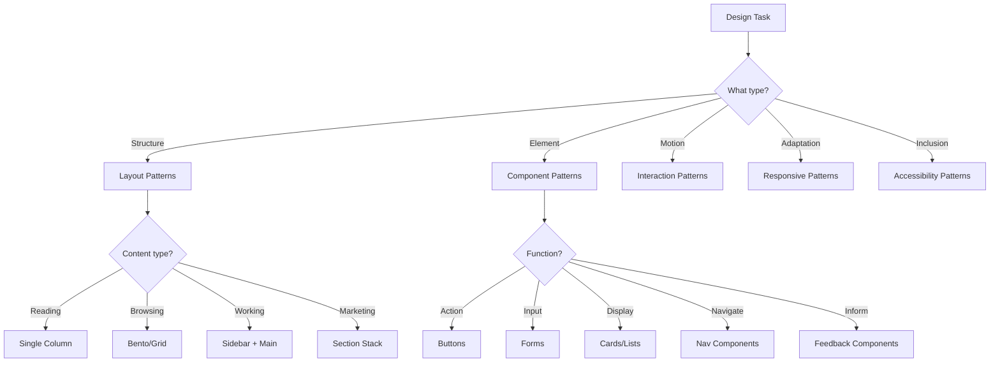

# Pattern Library Index

> A comprehensive library of reusable UI patterns. Patterns are the building blocks that combine into complete interfaces.

---

## Pattern Categories

### 1. Layout Patterns
**File:** `layout.md`

Foundational structures for organizing content:

| Pattern | Use When |
|---------|----------|
| Bento Grid | Mixed media, feature showcases, dashboards |
| Single Column | Long-form reading, focused tasks |
| Sidebar + Main | Apps, documentation, settings |
| Asymmetric | Editorial, portfolios, creative |
| Section Stack | Landing pages, marketing |
| Scroll Snap | Fullscreen sections, presentations |

### 2. Component Patterns
**File:** `components.md`

Reusable UI elements:

| Component | Variants |
|-----------|----------|
| Buttons | Primary, Secondary, Ghost, Danger, Icon |
| Forms | Inputs, Selects, Checkboxes, Toggles |
| Cards | Basic, Media, Horizontal, Interactive |
| Navigation | Header, Sidebar, Tab Bar, Breadcrumbs |
| Modals | Dialog, Drawer, Sheet, Popover |
| Feedback | Toasts, Alerts, Progress, Skeleton |
| Data | Tables, Lists, Empty States |

### 3. Interaction Patterns
**File:** `interaction.md`

Motion and feedback:

| Pattern | Duration |
|---------|----------|
| Micro-interactions | 50-100ms |
| Hover states | 100-150ms |
| Transitions | 150-300ms |
| Page transitions | 300-500ms |
| Loading states | Variable |
| Scroll animations | On-scroll |

### 4. Responsive Patterns
**File:** `responsive.md`

Adapting to screen sizes:

| Pattern | Approach |
|---------|----------|
| Fluid Typography | `clamp()` based scaling |
| Container Queries | Component-level responsiveness |
| Mobile Navigation | Bottom tabs, hamburger, drawer |
| Responsive Tables | Card layout on mobile |
| Touch Optimization | 44px+ targets, hover alternatives |

### 5. Accessibility Patterns
**File:** `accessibility.md`

Inclusive design:

| Category | Key Requirements |
|----------|------------------|
| Visual | Contrast, focus indicators, color independence |
| Keyboard | Tab order, focus management, shortcuts |
| Screen Reader | Semantic HTML, ARIA, live regions |
| Cognitive | Clear language, reduced load, respect attention |
| Motion | Reduced motion support, pause controls |

---

## Pattern Selection Framework



---

## Pattern Composition

Patterns combine to create interfaces:

```
Page Template = Layout + Components + Interactions

Example: Dashboard
├── Layout: Sidebar + Main (layout.md)
├── Components:
│   ├── Sidebar nav (components.md)
│   ├── Header with search (components.md)
│   ├── Stat cards (components.md)
│   └── Data table (components.md)
├── Interactions:
│   ├── Hover states (interaction.md)
│   ├── Loading skeletons (interaction.md)
│   └── Toast notifications (interaction.md)
├── Responsive:
│   ├── Collapsible sidebar (responsive.md)
│   └── Stacked cards on mobile (responsive.md)
└── Accessibility:
    ├── Skip links (accessibility.md)
    ├── ARIA landmarks (accessibility.md)
    └── Keyboard navigation (accessibility.md)
```

---

## Pattern Quality Checklist

Before using any pattern, verify:

- [ ] **Purpose** - Does this pattern solve the problem?
- [ ] **Context** - Is it appropriate for the style/brand?
- [ ] **States** - Are all states defined?
- [ ] **Responsive** - Does it work at all breakpoints?
- [ ] **Accessible** - Does it meet WCAG AA?
- [ ] **Performant** - Is it efficient to render?
- [ ] **Maintainable** - Is the code clean and documented?

---

## Pattern Customization

Patterns are starting points, not constraints. Customize:

| Layer | Can Customize | Constraints |
|-------|---------------|-------------|
| Colors | Yes | Maintain contrast ratios |
| Spacing | Yes (±20%) | Keep proportional |
| Typography | Yes | Maintain hierarchy |
| Border radius | Yes | Stay consistent |
| Animations | Yes | Respect reduced-motion |
| ARIA | Carefully | Follow spec |

---

## Files in this Directory

| File | Description | Lines |
|------|-------------|-------|
| `INDEX.md` | This index | — |
| `layout.md` | Grid systems, page structures | ~600 |
| `components.md` | UI components catalog | ~700 |
| `interaction.md` | Motion and animation | ~500 |
| `responsive.md` | Adaptive strategies | ~500 |
| `accessibility.md` | Inclusive design | ~600 |

---

*Version: 0.1.0*
*Last updated: 2026-01-29*
