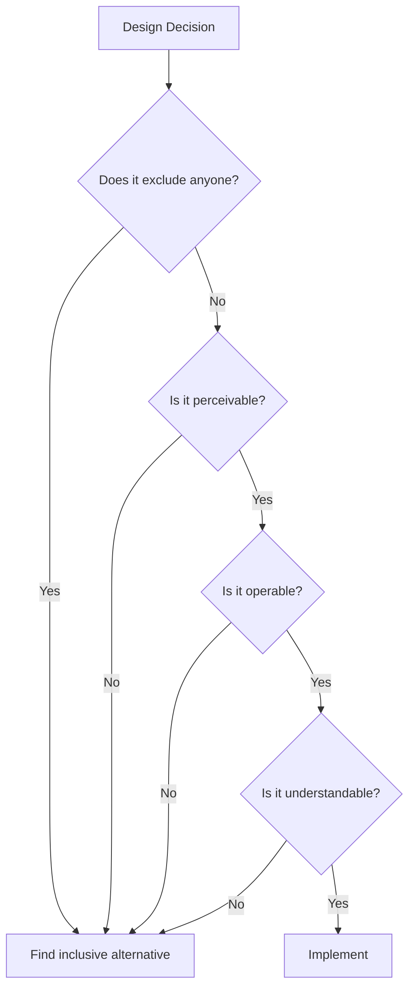

# Accessibility Patterns

> Accessibility is architecture, not afterthought. This document covers WCAG 2.2 compliance, cognitive accessibility, and inclusive design patterns that make interfaces usable by everyone.

---

## 1. Accessibility Principles

### 1.1 WCAG Foundation (POUR)

| Principle | Meaning | Examples |
|-----------|---------|----------|
| **Perceivable** | Users can perceive content | Alt text, captions, contrast |
| **Operable** | Users can interact | Keyboard nav, touch targets |
| **Understandable** | Users can comprehend | Clear labels, error recovery |
| **Robust** | Works with assistive tech | Valid HTML, ARIA |

### 1.2 Compliance Levels

| Level | Description | Target |
|-------|-------------|--------|
| A | Minimum | Legal baseline |
| AA | Standard | **Default target** |
| AAA | Enhanced | Specialized needs |

**Default:** All designs should meet WCAG 2.2 AA unless explicitly scoped otherwise.

### 1.3 The Accessibility Mindset



---

## 2. Visual Accessibility

### 2.1 Color Contrast

**WCAG 2.2 Requirements:**

| Text Type | Minimum Ratio (AA) | Enhanced (AAA) |
|-----------|-------------------|----------------|
| Normal text (<24px) | 4.5:1 | 7:1 |
| Large text (≥24px or 19px bold) | 3:1 | 4.5:1 |
| UI components & graphics | 3:1 | — |

**Testing contrast:**
```css
/* Example: checking contrast */
:root {
  --text-primary: #171717;   /* On white: 15.3:1 ✓ */
  --text-secondary: #525252; /* On white: 7.5:1 ✓ */
  --text-tertiary: #737373;  /* On white: 4.7:1 ✓ */
  --text-muted: #A3A3A3;     /* On white: 2.6:1 ✗ Fails! */
}
```

### 2.2 Color Independence

Never rely on color alone to convey information:

```css
/* Bad: color only */
.status-success { color: green; }
.status-error { color: red; }

/* Good: color + icon + text */
.status-success {
  color: var(--success);
}
.status-success::before {
  content: '✓ ';
}

.status-error {
  color: var(--error);
}
.status-error::before {
  content: '✗ ';
}
```

**Pattern for form errors:**
```html
<!-- Color + icon + text + aria -->
<div class="form-field error">
  <label for="email">Email</label>
  <input 
    type="email" 
    id="email" 
    aria-invalid="true"
    aria-describedby="email-error"
  />
  <span id="email-error" class="error-message">
    <svg aria-hidden="true"><!-- Error icon --></svg>
    Please enter a valid email address
  </span>
</div>
```

### 2.3 Focus Indicators

Focus must be visible for keyboard users:

```css
/* Never do this */
*:focus { outline: none; } /* ✗ */

/* Do this: custom focus that's visible */
*:focus-visible {
  outline: 2px solid var(--primary);
  outline-offset: 2px;
}

/* Style-specific focus */
.btn:focus-visible {
  outline: 2px solid var(--primary);
  outline-offset: 2px;
  box-shadow: 0 0 0 4px rgba(var(--primary-rgb), 0.2);
}

/* Dark mode adjustment */
@media (prefers-color-scheme: dark) {
  *:focus-visible {
    outline-color: var(--primary-light);
  }
}
```

### 2.4 Text Sizing

```css
/* Use relative units */
html {
  font-size: 100%; /* Respects user browser settings */
}

body {
  font-size: 1rem; /* 16px default */
  line-height: 1.5;
}

/* Allow 200% zoom without breaking layout */
@media (min-width: 320px) {
  .container {
    max-width: 100%;
    overflow-x: hidden;
  }
}

/* Don't disable zoom */
/* Bad: <meta name="viewport" content="maximum-scale=1"> */
/* Good: <meta name="viewport" content="width=device-width, initial-scale=1"> */
```

---

## 3. Keyboard Accessibility

### 3.1 Tab Order

```html
<!-- Natural tab order follows DOM -->
<header><!-- Tab 1: Logo link --></header>
<nav><!-- Tab 2-5: Nav links --></nav>
<main>
  <!-- Tab 6+: Main content -->
</main>

<!-- Skip link for keyboard users -->
<a href="#main-content" class="skip-link">
  Skip to main content
</a>

<style>
.skip-link {
  position: absolute;
  top: -40px;
  left: 0;
  padding: 8px 16px;
  background: var(--primary);
  color: white;
  z-index: 1000;
}

.skip-link:focus {
  top: 0;
}
</style>
```

### 3.2 Focus Management

```javascript
// Move focus to modal when opened
function openModal() {
  modal.showModal();
  modal.querySelector('[autofocus]')?.focus();
}

// Return focus when closed
function closeModal() {
  modal.close();
  triggerElement.focus();
}

// Trap focus in modal
modal.addEventListener('keydown', (e) => {
  if (e.key === 'Tab') {
    const focusable = modal.querySelectorAll(
      'button, [href], input, select, textarea, [tabindex]:not([tabindex="-1"])'
    );
    const first = focusable[0];
    const last = focusable[focusable.length - 1];
    
    if (e.shiftKey && document.activeElement === first) {
      e.preventDefault();
      last.focus();
    } else if (!e.shiftKey && document.activeElement === last) {
      e.preventDefault();
      first.focus();
    }
  }
});
```

### 3.3 Keyboard Patterns

| Component | Required Keys |
|-----------|---------------|
| Button | Enter, Space |
| Link | Enter |
| Checkbox | Space |
| Radio | Arrow keys (within group) |
| Tab panel | Arrow keys, Tab |
| Menu | Arrow keys, Enter, Escape |
| Modal | Escape to close, Tab trap |
| Carousel | Arrow keys, Tab to controls |
| Dropdown | Arrow keys, Enter, Escape |

### 3.4 Custom Interactive Elements

```html
<!-- Custom button must have: -->
<div 
  role="button"
  tabindex="0"
  onclick="handleClick()"
  onkeydown="handleKeydown(event)"
  aria-pressed="false"
>
  Custom Button
</div>

<script>
function handleKeydown(event) {
  if (event.key === 'Enter' || event.key === ' ') {
    event.preventDefault();
    handleClick();
  }
}
</script>

<!-- Better: just use a button -->
<button onclick="handleClick()">
  Better Button
</button>
```

---

## 4. Screen Reader Support

### 4.1 Semantic HTML

```html
<!-- Use semantic elements -->
<header><!-- Site header --></header>
<nav><!-- Navigation --></nav>
<main><!-- Main content --></main>
<article><!-- Self-contained content --></article>
<section><!-- Themed grouping --></section>
<aside><!-- Sidebar/related --></aside>
<footer><!-- Footer --></footer>

<!-- Headings create outline -->
<h1>Page Title</h1>
  <h2>Section</h2>
    <h3>Subsection</h3>
  <h2>Another Section</h2>

<!-- Don't skip levels (h1 → h3) -->
```

### 4.2 ARIA Labels

```html
<!-- Accessible name for icons -->
<button aria-label="Close dialog">
  <svg aria-hidden="true"><!-- X icon --></svg>
</button>

<!-- Describe what input expects -->
<input 
  type="text"
  aria-label="Search products"
/>

<!-- Or use visible label -->
<label for="search">Search</label>
<input type="text" id="search" />

<!-- Describe complex regions -->
<nav aria-label="Main navigation">
  <!-- Primary nav -->
</nav>
<nav aria-label="Footer navigation">
  <!-- Footer nav -->
</nav>

<!-- Live regions for updates -->
<div 
  role="status" 
  aria-live="polite"
  aria-atomic="true"
>
  <!-- Content updated dynamically -->
</div>

<!-- Assertive for errors -->
<div 
  role="alert"
  aria-live="assertive"
>
  <!-- Error messages -->
</div>
```

### 4.3 Common ARIA Patterns

**Tabs:**
```html
<div role="tablist" aria-label="Settings">
  <button 
    role="tab" 
    id="tab-1"
    aria-selected="true"
    aria-controls="panel-1"
  >
    General
  </button>
  <button 
    role="tab"
    id="tab-2"
    aria-selected="false"
    aria-controls="panel-2"
    tabindex="-1"
  >
    Security
  </button>
</div>

<div 
  role="tabpanel"
  id="panel-1"
  aria-labelledby="tab-1"
>
  <!-- General content -->
</div>

<div 
  role="tabpanel"
  id="panel-2"
  aria-labelledby="tab-2"
  hidden
>
  <!-- Security content -->
</div>
```

**Accordion:**
```html
<div class="accordion">
  <h3>
    <button 
      aria-expanded="true"
      aria-controls="section-1"
    >
      Section Title
    </button>
  </h3>
  <div id="section-1">
    <!-- Content -->
  </div>
</div>
```

**Menu:**
```html
<button 
  aria-haspopup="true"
  aria-expanded="false"
  aria-controls="menu-1"
>
  Options
</button>

<ul 
  role="menu"
  id="menu-1"
  hidden
>
  <li role="menuitem">Edit</li>
  <li role="menuitem">Delete</li>
</ul>
```

### 4.4 Images and Media

```html
<!-- Informative image -->


<!-- Decorative image -->


<!-- Complex image with long description -->
<figure>
  
  <figcaption id="infographic-desc">
    Detailed description of the infographic...
  </figcaption>
</figure>

<!-- Video with captions -->
<video controls>
  <source src="video.mp4" type="video/mp4">
  <track 
    kind="captions" 
    src="captions.vtt" 
    srclang="en"
    label="English"
    default
  >
</video>
```

---

## 5. Cognitive Accessibility

Beyond WCAG: designing for neurodivergent users (ADHD, autism, dyslexia).

### 5.1 Reduce Cognitive Load

```css
/* Clear visual hierarchy */
.content {
  /* One thing at a time */
  max-width: 65ch;
}

/* Consistent spacing reduces processing */
.section + .section {
  margin-top: var(--space-xl);
}

/* Group related items */
.form-group {
  padding: 24px;
  border: 1px solid var(--border);
  border-radius: 8px;
}
```

**Information Architecture:**
- One primary action per screen
- Progressive disclosure (show more on demand)
- Consistent navigation location
- Breadcrumbs for orientation

### 5.2 Respect Attention

```css
/* Avoid attention-grabbing animations */
.notification {
  /* Don't: continuous pulsing */
  /* animation: pulse 1s infinite; */
  
  /* Do: single attention-grab */
  animation: slideIn 0.3s ease;
}

/* Disable auto-play */
video {
  /* Never autoplay with sound */
}

/* Reduce motion for those who need it */
@media (prefers-reduced-motion: reduce) {
  * {
    animation-duration: 0.01ms !important;
    transition-duration: 0.01ms !important;
  }
}
```

**No hijacking:**
- No auto-playing videos with sound
- No aggressive popups
- No scroll-jacking
- No cursor changes that confuse
- Limited notifications per session

### 5.3 Support Memory

```html
<!-- Persistent state -->
<form>
  <!-- Don't clear form on error -->
  <input type="email" value="user@example" />
  <span class="error">Invalid format</span>
  
  <!-- Show what was entered -->
</form>

<!-- Progress indication -->
<div class="stepper">
  <span class="step completed">1. Account</span>
  <span class="step current">2. Profile</span>
  <span class="step">3. Confirm</span>
</div>

<!-- Contextual help -->
<label>
  Password
  <button 
    type="button"
    aria-label="Password requirements"
    aria-describedby="password-help"
  >
    ?
  </button>
</label>
<div id="password-help" role="tooltip" hidden>
  At least 8 characters, one number...
</div>
```

### 5.4 Clear Language

| Avoid | Use Instead |
|-------|-------------|
| "Invalid input" | "Please enter a valid email" |
| "Error 403" | "You don't have access to this" |
| "Submit" | "Save Changes" |
| "Click here" | "View pricing details" |
| Jargon | Plain language |
| Double negatives | Positive phrasing |

### 5.5 Dyslexia Support

```css
/* Font choices */
body {
  font-family: 'OpenDyslexic', Arial, sans-serif;
  /* Or use clear sans-serif */
  font-family: -apple-system, BlinkMacSystemFont, 'Inter', sans-serif;
}

/* Spacing for readability */
p {
  line-height: 1.7;
  letter-spacing: 0.01em;
  word-spacing: 0.05em;
}

/* Avoid justified text */
p {
  text-align: left; /* Not justify */
}

/* Adequate contrast but not extreme */
body {
  color: #333; /* Not pure black */
  background: #fafafa; /* Not pure white */
}
```

---

## 6. Motion & Animation

### 6.1 Reduced Motion

```css
/* Default animations */
.modal {
  animation: fadeIn 0.2s ease;
}

/* Reduced motion: instant or subtle */
@media (prefers-reduced-motion: reduce) {
  .modal {
    animation: none;
  }
  
  /* Or use safe animation */
  .modal {
    animation: fadeIn 0.1s ease;
  }
}

/* Check preference in JS */
const prefersReducedMotion = window.matchMedia(
  '(prefers-reduced-motion: reduce)'
).matches;
```

### 6.2 Safe vs Unsafe Animations

| Safe | Unsafe |
|------|--------|
| Fade in/out | Large movements |
| Subtle scale | Spinning/rotating |
| Color transitions | Parallax scrolling |
| Opacity changes | Flashing content |
| Position micro-shifts | Zoom effects |

### 6.3 Pause Controls

```html
<!-- Provide pause for motion -->
<div class="animation-container">
  <div class="animated-content">...</div>
  <button 
    class="pause-btn"
    aria-pressed="false"
    onclick="toggleAnimation()"
  >
    Pause animation
  </button>
</div>
```

---

## 7. Forms Accessibility

### 7.1 Labels

```html
<!-- Explicit label (preferred) -->
<label for="email">Email address</label>
<input type="email" id="email" name="email" />

<!-- Implicit label -->
<label>
  Email address
  <input type="email" name="email" />
</label>

<!-- Required fields -->
<label for="name">
  Name <span aria-hidden="true">*</span>
  <span class="sr-only">(required)</span>
</label>
<input type="text" id="name" required aria-required="true" />
```

### 7.2 Error Handling

```html
<form novalidate>
  <div class="form-field" data-invalid>
    <label for="email">Email</label>
    <input 
      type="email" 
      id="email"
      aria-invalid="true"
      aria-describedby="email-error email-hint"
    />
    <span id="email-hint" class="hint">
      We'll never share your email
    </span>
    <span id="email-error" class="error" role="alert">
      Please enter a valid email address
    </span>
  </div>
</form>

<style>
.error {
  color: var(--error);
  display: none;
}

[data-invalid] .error {
  display: block;
}
</style>
```

### 7.3 Form Patterns

**Inline validation timing:**
- Validate on blur (not every keystroke)
- Show success only after previous error
- Don't validate empty required fields until submit

**Error summary:**
```html
<div role="alert" class="error-summary">
  <h2>There are 2 problems with your submission</h2>
  <ul>
    <li><a href="#email">Email is required</a></li>
    <li><a href="#password">Password must be 8+ characters</a></li>
  </ul>
</div>
```

---

## 8. Testing Accessibility

### 8.1 Automated Testing

```javascript
// Example: axe-core integration
import { axe, toHaveNoViolations } from 'jest-axe';

expect.extend(toHaveNoViolations);

test('page should have no accessibility violations', async () => {
  const { container } = render(<MyComponent />);
  const results = await axe(container);
  expect(results).toHaveNoViolations();
});
```

**Tools:**
- axe DevTools (browser extension)
- Lighthouse (Chrome DevTools)
- WAVE (web accessibility evaluation)
- Pa11y (command line)

### 8.2 Manual Testing

**Keyboard testing:**
- [ ] Tab through entire page
- [ ] All interactive elements focusable
- [ ] Focus order logical
- [ ] Focus visible at all times
- [ ] Escape closes modals/dropdowns
- [ ] Enter/Space activate buttons

**Screen reader testing:**
- [ ] Page title announced
- [ ] Headings create outline
- [ ] Images have appropriate alt
- [ ] Forms have labels
- [ ] Errors announced
- [ ] Dynamic content announced

### 8.3 Testing Checklist

| Category | Check | Tool |
|----------|-------|------|
| Contrast | 4.5:1 text, 3:1 UI | Contrast checker |
| Keyboard | Full navigation | Manual |
| Screen reader | Content accessible | NVDA/VoiceOver |
| Zoom | Works at 200% | Browser zoom |
| Color | Not color-alone | Manual review |
| Motion | Reduced motion works | System setting |
| Touch | 44px targets | Device testing |
| Language | Clear, simple | Manual review |

---

## 9. Accessibility Checklist

Before shipping any design:

### Must Have (Level A + AA)
- [ ] Text contrast ≥4.5:1 (normal) / 3:1 (large)
- [ ] UI component contrast ≥3:1
- [ ] Keyboard navigable
- [ ] Focus visible
- [ ] No keyboard traps
- [ ] Images have alt text
- [ ] Form inputs have labels
- [ ] Errors are clear
- [ ] Page has title
- [ ] Language declared
- [ ] No auto-playing audio
- [ ] Touch targets ≥44px

### Should Have (Enhanced)
- [ ] Skip links
- [ ] Heading hierarchy
- [ ] ARIA landmarks
- [ ] Reduced motion support
- [ ] Error suggestions
- [ ] Consistent navigation
- [ ] Multiple ways to find content

### Cognitive Accessibility
- [ ] Clear language
- [ ] Consistent layout
- [ ] Progress indicators
- [ ] Undo capabilities
- [ ] Limited distractions
- [ ] Grouped related content

---

## 10. Resources

**Guidelines:**
- [WCAG 2.2](https://www.w3.org/WAI/WCAG22/quickref/)
- [ARIA Authoring Practices](https://www.w3.org/WAI/ARIA/apg/)
- [Inclusive Components](https://inclusive-components.design/)

**Testing:**
- [axe DevTools](https://www.deque.com/axe/)
- [WAVE](https://wave.webaim.org/)
- [Colour Contrast Analyser](https://www.tpgi.com/color-contrast-checker/)

**Learning:**
- [WebAIM](https://webaim.org/)
- [A11y Project](https://www.a11yproject.com/)
- [Deque University](https://dequeuniversity.com/)

---

*Version: 0.1.0*
*Last updated: 2026-01-29*
