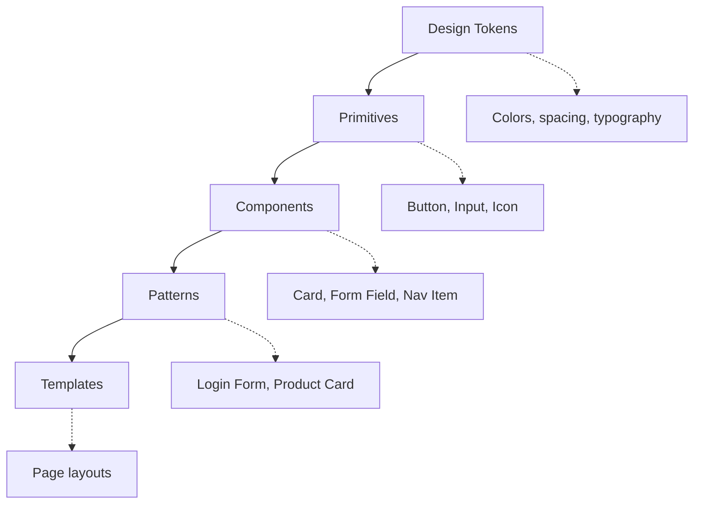

# Component Patterns

> Reusable UI component patterns including buttons, forms, cards, navigation, modals, and data display. Each pattern includes anatomy, states, and implementation guidance.

---

## 1. Component Principles

### 1.1 Component Hierarchy



### 1.2 State Coverage

Every interactive component must define these states:

| State | Description | Required |
|-------|-------------|----------|
| Default | Normal appearance | ✓ |
| Hover | Mouse over (desktop) | ✓ |
| Focus | Keyboard focus | ✓ |
| Active/Pressed | During click/tap | ✓ |
| Disabled | Non-interactive | ✓ |
| Loading | Async operation | When applicable |
| Error | Validation failed | When applicable |
| Success | Action completed | When applicable |

---

## 2. Buttons

### 2.1 Button Anatomy

```
┌─────────────────────────────────────┐
│  [Icon]  Label Text  [Icon]         │
│    ↑         ↑          ↑           │
│  Leading   Content   Trailing       │
│   Icon     (required)   Icon        │
└─────────────────────────────────────┘
     └──────────────────────────┘
              Padding
```

### 2.2 Button Hierarchy

| Level | Name | Use Case | Visual Treatment |
|-------|------|----------|------------------|
| 1 | Primary | Main action per screen | Filled, accent color |
| 2 | Secondary | Alternative action | Outlined or muted fill |
| 3 | Tertiary | Low-emphasis action | Text only, or ghost |
| 4 | Destructive | Delete, remove, cancel | Red/danger color |

### 2.3 Button Sizes

| Size | Height | Padding | Font Size | Use Case |
|------|--------|---------|-----------|----------|
| Small | 32px | 8px 12px | 14px | Dense UI, tables |
| Medium | 40px | 12px 16px | 14px | Default |
| Large | 48px | 16px 24px | 16px | Primary CTAs, mobile |

### 2.4 Button States CSS

```css
.btn {
  display: inline-flex;
  align-items: center;
  justify-content: center;
  gap: 8px;
  border-radius: 6px;
  font-weight: 500;
  transition: all 0.15s ease;
  cursor: pointer;
}

/* Primary */
.btn-primary {
  background: var(--color-primary);
  color: white;
  border: none;
}

.btn-primary:hover {
  background: var(--color-primary-dark);
}

.btn-primary:focus-visible {
  outline: 2px solid var(--color-primary);
  outline-offset: 2px;
}

.btn-primary:active {
  transform: scale(0.98);
}

.btn-primary:disabled {
  background: var(--color-disabled);
  color: var(--color-disabled-text);
  cursor: not-allowed;
}

/* Loading state */
.btn-loading {
  position: relative;
  color: transparent;
  pointer-events: none;
}

.btn-loading::after {
  content: "";
  position: absolute;
  width: 16px;
  height: 16px;
  border: 2px solid white;
  border-top-color: transparent;
  border-radius: 50%;
  animation: spin 0.6s linear infinite;
}
```

### 2.5 Button Best Practices

**Do:**
- Use verb-first labels ("Save changes", "Add to cart")
- Limit to one primary button per section
- Maintain minimum touch target of 44×44px
- Show loading state for async actions

**Don't:**
- Use vague labels ("Submit", "Click here")
- Disable without explanation
- Stack more than 2-3 buttons together
- Use all-caps (harder to read)

---

## 3. Form Inputs

### 3.1 Input Anatomy

```
┌─────────────────────────────────────────┐
│  Label *                                │  ← Label (with required indicator)
│  ┌─────────────────────────────────┐    │
│  │ [Icon] Placeholder text         │    │  ← Input field
│  └─────────────────────────────────┘    │
│  Helper text or error message           │  ← Helper/Error text
└─────────────────────────────────────────┘
```

### 3.2 Input Types

| Type | When to Use | Considerations |
|------|-------------|----------------|
| Text | Short free-form input | Max length, validation pattern |
| Email | Email addresses | Browser validation, autocomplete |
| Password | Sensitive input | Show/hide toggle, strength indicator |
| Number | Numeric values | Min/max, step, mobile keyboard |
| Textarea | Long-form text | Auto-resize, character count |
| Select | Choose from options | Native vs custom, searchable for 10+ |
| Checkbox | Boolean or multi-select | Clear labels, group related |
| Radio | Single choice from few | Use for 2-5 options |
| Toggle | On/off immediate effect | Don't use for forms, use checkbox |

### 3.3 Input States CSS

```css
.input {
  width: 100%;
  padding: 12px 16px;
  border: 1px solid var(--color-border);
  border-radius: 6px;
  font-size: 16px; /* Prevents zoom on iOS */
  transition: border-color 0.15s, box-shadow 0.15s;
}

.input:hover {
  border-color: var(--color-border-hover);
}

.input:focus {
  border-color: var(--color-primary);
  box-shadow: 0 0 0 3px rgba(var(--color-primary-rgb), 0.1);
  outline: none;
}

.input:disabled {
  background: var(--color-disabled-bg);
  color: var(--color-disabled-text);
  cursor: not-allowed;
}

/* Error state */
.input-error {
  border-color: var(--color-error);
}

.input-error:focus {
  box-shadow: 0 0 0 3px rgba(var(--color-error-rgb), 0.1);
}

.error-message {
  color: var(--color-error);
  font-size: 14px;
  margin-top: 4px;
}

/* Label */
.label {
  display: block;
  font-weight: 500;
  font-size: 14px;
  margin-bottom: 6px;
}

.label-required::after {
  content: " *";
  color: var(--color-error);
}
```

### 3.4 Form Layout Patterns

**Single Column (recommended for most cases):**
```
┌─────────────────────────────────────┐
│  First Name                         │
│  ┌─────────────────────────────────┐│
│  │                                 ││
│  └─────────────────────────────────┘│
│  Last Name                          │
│  ┌─────────────────────────────────┐│
│  │                                 ││
│  └─────────────────────────────────┘│
│  Email                              │
│  ┌─────────────────────────────────┐│
│  │                                 ││
│  └─────────────────────────────────┘│
└─────────────────────────────────────┘
```

**Two Column (for related short fields):**
```
┌───────────────────────────────────────────┐
│  First Name          Last Name            │
│  ┌───────────────┐   ┌───────────────┐   │
│  │               │   │               │   │
│  └───────────────┘   └───────────────┘   │
│  City                State    Zip        │
│  ┌───────────────┐   ┌─────┐ ┌───────┐  │
│  │               │   │     │ │       │  │
│  └───────────────┘   └─────┘ └───────┘  │
└───────────────────────────────────────────┘
```

### 3.5 Validation Patterns

**When to validate:**
- On blur (after user leaves field) - recommended for most
- On submit (all at once) - good for short forms
- On change (as user types) - only for real-time feedback like password strength

**Error message guidelines:**
- Be specific: "Email must include @" not "Invalid email"
- Be helpful: "Password needs 8+ characters" not "Password too short"
- Position directly below the field
- Use red color + icon for clarity

---

## 4. Cards

### 4.1 Card Anatomy

```
┌─────────────────────────────────────────────┐
│  ┌─────────────────────────────────────┐   │
│  │                                     │   │
│  │           Media (optional)          │   │
│  │                                     │   │
│  └─────────────────────────────────────┘   │
│                                             │
│  Eyebrow / Category                         │
│  Card Title                                 │
│  Card description text that provides        │
│  additional context about the content.      │
│                                             │
│  ┌─────────────┐    Meta info | Action     │
│  │   Button    │                           │
│  └─────────────┘                           │
└─────────────────────────────────────────────┘
```

### 4.2 Card Variants

| Variant | Use Case | Characteristics |
|---------|----------|-----------------|
| Content card | Blog posts, articles | Image, title, excerpt |
| Product card | E-commerce | Image, price, add to cart |
| Profile card | Users, team | Avatar, name, role |
| Stat card | Dashboards | Number, label, trend |
| Action card | Feature selection | Icon, title, description, CTA |

### 4.3 Card CSS

```css
.card {
  background: var(--color-surface);
  border-radius: 12px;
  overflow: hidden;
  transition: transform 0.2s, box-shadow 0.2s;
}

/* Bordered variant */
.card-bordered {
  border: 1px solid var(--color-border);
}

/* Elevated variant */
.card-elevated {
  box-shadow: 0 1px 3px rgba(0,0,0,0.1), 
              0 1px 2px rgba(0,0,0,0.06);
}

/* Interactive card */
.card-interactive {
  cursor: pointer;
}

.card-interactive:hover {
  transform: translateY(-2px);
  box-shadow: 0 4px 12px rgba(0,0,0,0.15);
}

/* Card sections */
.card-media {
  aspect-ratio: 16/9;
  object-fit: cover;
}

.card-body {
  padding: 20px;
}

.card-footer {
  padding: 16px 20px;
  border-top: 1px solid var(--color-border);
}
```

### 4.4 Card Interaction

| If card is... | Behavior |
|---------------|----------|
| Entirely clickable | Wrap in `<a>` or `<button>`, hover effect on whole card |
| Has one CTA | Only button is clickable |
| Has multiple actions | Each action separate, card not clickable |

**Accessibility for clickable cards:**
```html
<article class="card card-interactive">
  
  <div class="card-body">
    <h3>
      <a href="/article" class="card-link">
        <!-- This link stretches to cover card -->
        Article Title
      </a>
    </h3>
    <p>Description...</p>
  </div>
</article>
```

```css
.card-link::after {
  content: "";
  position: absolute;
  inset: 0;
}

.card-interactive {
  position: relative;
}
```

---

## 5. Navigation

### 5.1 Navigation Types

| Type | Use Case | Location |
|------|----------|----------|
| Top nav | Primary site navigation | Header, horizontal |
| Side nav | App/dashboard navigation | Left sidebar, vertical |
| Bottom nav | Mobile primary navigation | Fixed bottom |
| Breadcrumb | Location within hierarchy | Below header |
| Tab nav | Content sections | Within content area |
| Pagination | Multi-page content | Below content |

### 5.2 Top Navigation

```
┌─────────────────────────────────────────────────────────────────────┐
│  [Logo]      Home    Products    Pricing    About    [Search] [CTA]│
└─────────────────────────────────────────────────────────────────────┘
```

```css
.top-nav {
  display: flex;
  align-items: center;
  justify-content: space-between;
  height: 64px;
  padding: 0 24px;
  border-bottom: 1px solid var(--color-border);
}

.nav-links {
  display: flex;
  gap: 32px;
}

.nav-link {
  color: var(--color-text-secondary);
  text-decoration: none;
  font-weight: 500;
  padding: 8px 0;
  border-bottom: 2px solid transparent;
}

.nav-link:hover,
.nav-link.active {
  color: var(--color-text-primary);
}

.nav-link.active {
  border-bottom-color: var(--color-primary);
}
```

### 5.3 Mobile Navigation Patterns

**Hamburger Menu:**
- Icon reveals off-canvas or fullscreen menu
- Use for complex navigation

**Bottom Tab Bar:**
- 3-5 primary destinations
- Icons + labels
- Fixed at bottom

```css
.bottom-nav {
  position: fixed;
  bottom: 0;
  left: 0;
  right: 0;
  height: 64px;
  background: white;
  display: flex;
  justify-content: space-around;
  align-items: center;
  border-top: 1px solid var(--color-border);
  padding-bottom: env(safe-area-inset-bottom); /* iOS */
}

.bottom-nav-item {
  display: flex;
  flex-direction: column;
  align-items: center;
  gap: 4px;
  color: var(--color-text-secondary);
  font-size: 12px;
}

.bottom-nav-item.active {
  color: var(--color-primary);
}
```

### 5.4 Breadcrumbs

```
Home  /  Products  /  Category  /  Current Page
```

```css
.breadcrumb {
  display: flex;
  align-items: center;
  gap: 8px;
  font-size: 14px;
}

.breadcrumb-item {
  color: var(--color-text-secondary);
}

.breadcrumb-item:hover {
  color: var(--color-text-primary);
}

.breadcrumb-separator {
  color: var(--color-text-tertiary);
}

.breadcrumb-current {
  color: var(--color-text-primary);
  font-weight: 500;
}
```

---

## 6. Modals & Dialogs

### 6.1 Modal Anatomy

```
┌─────────────────────────────────────────────────────────────────────┐
│ ░░░░░░░░░░░░░░░░░░░░░░░░░░░░░░░░░░░░░░░░░░░░░░░░░░░░░░░░░░░░░░░░░░ │
│ ░░░░░░░░░░░░░░░░░░░░░░░░░░░░░░░░░░░░░░░░░░░░░░░░░░░░░░░░░░░░░░░░░░ │
│ ░░░░░░░░░░░░░ ┌─────────────────────────────────┐ ░░░░░░░░░░░░░░░░ │
│ ░░░░░░░░░░░░░ │  Header                     [X] │ ░░░░░░░░░░░░░░░░ │
│ ░░░░░░░░░░░░░ ├─────────────────────────────────┤ ░░░░░░░░░░░░░░░░ │
│ ░░░░░░░░░░░░░ │                                 │ ░░░░░░░░░░░░░░░░ │
│ ░░░░░░░░░░░░░ │         Modal Content           │ ░░░░░░░░░░░░░░░░ │
│ ░░░░░░░░░░░░░ │                                 │ ░░░░░░░░░░░░░░░░ │
│ ░░░░░░░░░░░░░ ├─────────────────────────────────┤ ░░░░░░░░░░░░░░░░ │
│ ░░░░░░░░░░░░░ │        [Cancel]  [Confirm]      │ ░░░░░░░░░░░░░░░░ │
│ ░░░░░░░░░░░░░ └─────────────────────────────────┘ ░░░░░░░░░░░░░░░░ │
│ ░░░░░░░░░░░░░░░░░░░░░░░░░░░░░░░░░░░░░░░░░░░░░░░░░░░░░░░░░░░░░░░░░░ │
└─────────────────────────────────────────────────────────────────────┘
              ↑ Backdrop (click to dismiss optional)
```

### 6.2 Modal Types

| Type | Purpose | Dismissal |
|------|---------|-----------|
| Alert | Inform user | Acknowledge button |
| Confirm | Get confirmation | Confirm or cancel |
| Form | Collect input | Submit or cancel |
| Full-screen | Complex task | Explicit close |

### 6.3 Modal Sizes

| Size | Width | Use Case |
|------|-------|----------|
| Small | 400px | Confirmation, alerts |
| Medium | 560px | Forms, content |
| Large | 720px | Complex content |
| Full | 100% - margins | Mobile, complex tasks |

### 6.4 Modal Accessibility

```html
<div 
  role="dialog" 
  aria-modal="true"
  aria-labelledby="modal-title"
  aria-describedby="modal-desc"
>
  <h2 id="modal-title">Modal Title</h2>
  <p id="modal-desc">Description of modal purpose.</p>
  <!-- Focus trap: Tab cycles within modal -->
  <!-- Escape key closes modal -->
  <!-- Return focus to trigger on close -->
</div>
```

**Modal requirements:**
- Focus trap (tab stays within modal)
- Escape key closes
- Return focus to trigger element on close
- Prevent body scroll when open
- Announce to screen readers

---

## 7. Data Display

### 7.1 Tables

```css
.table {
  width: 100%;
  border-collapse: collapse;
}

.table th {
  text-align: left;
  font-weight: 600;
  font-size: 12px;
  text-transform: uppercase;
  letter-spacing: 0.05em;
  color: var(--color-text-secondary);
  padding: 12px 16px;
  border-bottom: 2px solid var(--color-border);
}

.table td {
  padding: 16px;
  border-bottom: 1px solid var(--color-border);
  vertical-align: middle;
}

.table tr:hover {
  background: var(--color-surface-hover);
}

/* Sortable column */
.table th.sortable {
  cursor: pointer;
}

.table th.sortable:hover {
  color: var(--color-text-primary);
}
```

### 7.2 Responsive Tables

**Option A: Horizontal scroll**
```css
.table-container {
  overflow-x: auto;
}
```

**Option B: Card layout on mobile**
```css
@media (max-width: 640px) {
  .table thead {
    display: none;
  }
  
  .table tr {
    display: block;
    margin-bottom: 16px;
    border: 1px solid var(--color-border);
    border-radius: 8px;
  }
  
  .table td {
    display: flex;
    justify-content: space-between;
    border: none;
  }
  
  .table td::before {
    content: attr(data-label);
    font-weight: 600;
  }
}
```

### 7.3 Lists

**Simple list:**
```css
.list {
  list-style: none;
  padding: 0;
}

.list-item {
  padding: 12px 16px;
  border-bottom: 1px solid var(--color-border);
}

.list-item:last-child {
  border-bottom: none;
}
```

**Interactive list:**
```css
.list-item-interactive {
  cursor: pointer;
  transition: background 0.15s;
}

.list-item-interactive:hover {
  background: var(--color-surface-hover);
}
```

### 7.4 Empty States

```
┌─────────────────────────────────────────────┐
│                                             │
│              [Illustration]                 │
│                                             │
│            No items found                   │
│                                             │
│    You haven't created any items yet.       │
│    Get started by adding your first one.    │
│                                             │
│            [+ Add Item]                     │
│                                             │
└─────────────────────────────────────────────┘
```

**Empty state requirements:**
- Explain the state
- Provide next action
- Don't blame the user
- Consider illustration for personality

---

## 8. Feedback Components

### 8.1 Alerts / Banners

| Type | Color | Use Case |
|------|-------|----------|
| Info | Blue | Neutral information |
| Success | Green | Action completed |
| Warning | Yellow/Amber | Caution needed |
| Error | Red | Something went wrong |

```css
.alert {
  display: flex;
  align-items: flex-start;
  gap: 12px;
  padding: 16px;
  border-radius: 8px;
}

.alert-info {
  background: var(--color-info-bg);
  color: var(--color-info-text);
}

.alert-success {
  background: var(--color-success-bg);
  color: var(--color-success-text);
}

.alert-warning {
  background: var(--color-warning-bg);
  color: var(--color-warning-text);
}

.alert-error {
  background: var(--color-error-bg);
  color: var(--color-error-text);
}
```

### 8.2 Toast Notifications

```css
.toast-container {
  position: fixed;
  bottom: 24px;
  right: 24px;
  display: flex;
  flex-direction: column;
  gap: 8px;
  z-index: 1000;
}

.toast {
  background: var(--color-surface);
  border-radius: 8px;
  padding: 16px;
  box-shadow: 0 4px 12px rgba(0,0,0,0.15);
  display: flex;
  align-items: center;
  gap: 12px;
  animation: slideIn 0.3s ease;
}

@keyframes slideIn {
  from {
    transform: translateX(100%);
    opacity: 0;
  }
  to {
    transform: translateX(0);
    opacity: 1;
  }
}
```

**Toast guidelines:**
- Auto-dismiss after 4-5 seconds
- Provide manual dismiss
- Don't stack more than 3
- Position: bottom-right (desktop), top (mobile)

### 8.3 Progress Indicators

**Linear progress:**
```css
.progress-bar {
  height: 4px;
  background: var(--color-border);
  border-radius: 2px;
  overflow: hidden;
}

.progress-fill {
  height: 100%;
  background: var(--color-primary);
  transition: width 0.3s ease;
}
```

**Circular/Spinner:**
```css
.spinner {
  width: 24px;
  height: 24px;
  border: 2px solid var(--color-border);
  border-top-color: var(--color-primary);
  border-radius: 50%;
  animation: spin 0.8s linear infinite;
}

@keyframes spin {
  to {
    transform: rotate(360deg);
  }
}
```

---

## 9. Component Checklist

Before shipping a component:

- [ ] All states defined (default, hover, focus, active, disabled)
- [ ] Keyboard accessible
- [ ] Screen reader friendly
- [ ] Touch targets ≥44px
- [ ] Responsive behavior defined
- [ ] Loading state if async
- [ ] Error state if applicable
- [ ] Focus visible indicator
- [ ] Follows spacing scale
- [ ] Uses design tokens

---

*Version: 0.1.0*
*Last updated: 2026-01-29*
