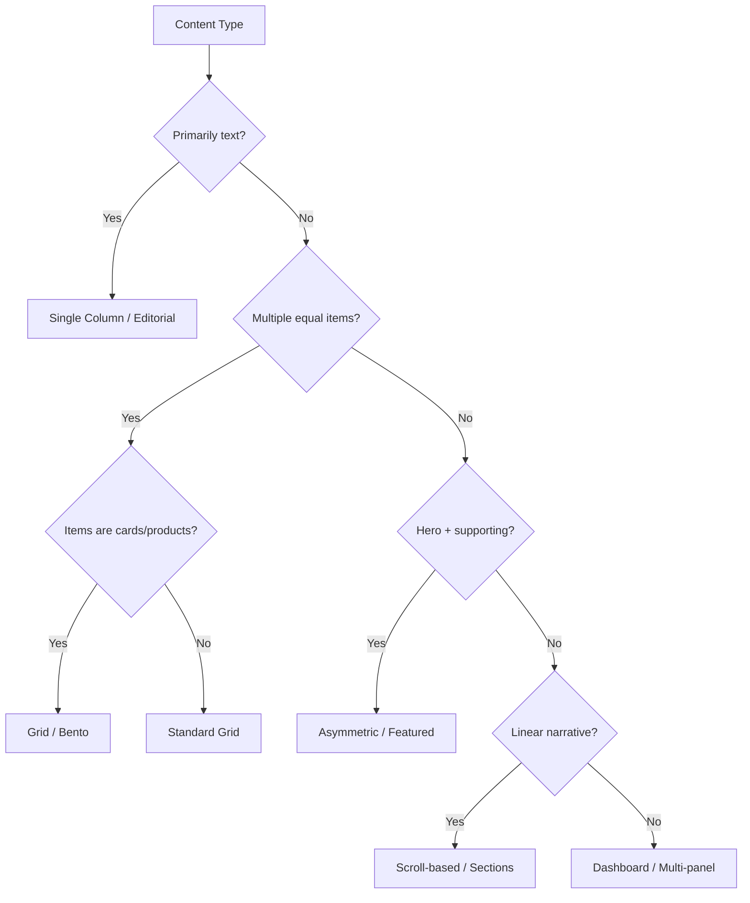

# Layout Patterns

> Structural patterns for organizing content. Covers grids, bento layouts, asymmetric compositions, scroll-based designs, and responsive strategies.

---

## 1. Layout Fundamentals

### 1.1 The Role of Layout

Layout is not decoration—it's information architecture made visible. Good layout:

- Creates visual hierarchy
- Guides the eye through content
- Groups related information
- Establishes rhythm and pacing
- Adapts gracefully across viewports

### 1.2 Layout Selection Framework



---

## 2. Grid Systems

### 2.1 Standard Column Grid

The foundation for most layouts:

```
┌─────────────────────────────────────────────────────────────────┐
│  M  │ 1 │ G │ 2 │ G │ 3 │ G │ 4 │ G │ 5 │ G │ 6 │ ... │12│  M  │
└─────────────────────────────────────────────────────────────────┘
      └─────────────────── Content Area ───────────────────┘
  
M = Margin
G = Gutter
1-12 = Columns
```

**Responsive column counts:**

| Breakpoint | Width | Columns | Gutter | Margin |
|------------|-------|---------|--------|--------|
| Mobile | < 640px | 4 | 16px | 16px |
| Tablet | 640-1024px | 8 | 20px | 32px |
| Desktop | 1024-1440px | 12 | 24px | 48px |
| Wide | > 1440px | 12 | 32px | auto (centered) |

**CSS Implementation:**

```css
.grid {
  display: grid;
  grid-template-columns: repeat(12, 1fr);
  gap: 24px;
  max-width: 1440px;
  margin: 0 auto;
  padding: 0 48px;
}

@media (max-width: 1024px) {
  .grid {
    grid-template-columns: repeat(8, 1fr);
    gap: 20px;
    padding: 0 32px;
  }
}

@media (max-width: 640px) {
  .grid {
    grid-template-columns: repeat(4, 1fr);
    gap: 16px;
    padding: 0 16px;
  }
}
```

### 2.2 Common Column Spans

| Content Type | Desktop Span | Tablet Span | Mobile Span |
|--------------|--------------|-------------|-------------|
| Full width | 12 | 8 | 4 |
| Article body | 6-8 (centered) | 6-8 | 4 |
| Two columns | 6 each | 4 each | 4 (stack) |
| Three columns | 4 each | 4, 4, 8 or stack | 4 (stack) |
| Sidebar + main | 3 + 9 | 8 (hide sidebar) | 4 (hide sidebar) |

---

## 3. Bento Grid

The dominant 2026 pattern for displaying multiple related items with visual interest.

### 3.1 Anatomy

```
┌─────────────────────────────────────────────────────────────────┐
│                                                                 │
│   ┌───────────────────────┐   ┌───────────┐   ┌───────────┐    │
│   │                       │   │           │   │           │    │
│   │      FEATURED         │   │   ITEM    │   │   ITEM    │    │
│   │       2 x 2           │   │   1 x 1   │   │   1 x 1   │    │
│   │                       │   │           │   │           │    │
│   │                       │   ├───────────┤   ├───────────┤    │
│   │                       │   │           │   │           │    │
│   ├───────────────────────┤   │   ITEM    │   │   ITEM    │    │
│   │           │           │   │   1 x 2   │   │   1 x 1   │    │
│   │   ITEM    │   ITEM    │   │           │   │           │    │
│   │   1 x 1   │   1 x 1   │   │           │   ├───────────┤    │
│   │           │           │   │           │   │   ITEM    │    │
│   └───────────┴───────────┘   └───────────┘   └───────────┘    │
│                                                                 │
└─────────────────────────────────────────────────────────────────┘
```

### 3.2 Cell Sizes

| Size | Grid Span | Aspect Ratio | Use For |
|------|-----------|--------------|---------|
| 1×1 | 1 col, 1 row | 1:1 | Standard items |
| 2×1 | 2 col, 1 row | 2:1 | Wide feature |
| 1×2 | 1 col, 2 row | 1:2 | Tall feature |
| 2×2 | 2 col, 2 row | 1:1 | Hero/primary |
| 3×1 | 3 col, 1 row | 3:1 | Banner |
| 3×2 | 3 col, 2 row | 3:2 | Large feature |

### 3.3 CSS Implementation

```css
.bento {
  display: grid;
  grid-template-columns: repeat(4, 1fr);
  grid-auto-rows: minmax(200px, auto);
  gap: 16px;
}

.bento-item {
  background: var(--surface);
  border-radius: 16px;
  overflow: hidden;
}

/* Size variants */
.bento-1x1 { grid-column: span 1; grid-row: span 1; }
.bento-2x1 { grid-column: span 2; grid-row: span 1; }
.bento-1x2 { grid-column: span 1; grid-row: span 2; }
.bento-2x2 { grid-column: span 2; grid-row: span 2; }

/* Responsive */
@media (max-width: 768px) {
  .bento {
    grid-template-columns: repeat(2, 1fr);
  }
  .bento-2x1,
  .bento-2x2 {
    grid-column: span 2;
  }
}

@media (max-width: 480px) {
  .bento {
    grid-template-columns: 1fr;
  }
  .bento-1x1,
  .bento-2x1,
  .bento-1x2,
  .bento-2x2 {
    grid-column: span 1;
    grid-row: span 1;
  }
}
```

### 3.4 Bento Content Guidelines

| Cell Size | Content Recommendations |
|-----------|------------------------|
| 1×1 | Icon + label, stat, small image |
| 2×1 | Short text + icon, wide image, feature highlight |
| 1×2 | Vertical list, tall image, stacked stats |
| 2×2 | Hero image, video, primary CTA, key message |

### 3.5 Bento vs. Carousel

**Why bento replaces carousels:**

| Carousel Problems | Bento Solutions |
|-------------------|-----------------|
| Only 1% of users click slides | All items visible simultaneously |
| 89% of clicks go to first slide | Hierarchy through size, not position |
| Requires interaction to see content | Passive scanning works |
| Auto-advance frustrates users | Static, user-controlled |
| Poor mobile UX | Responsive by nature |

---

## 4. Asymmetric Layouts

### 4.1 When to Use Asymmetry

- Hero sections with featured content
- Portfolio/case study presentations
- Editorial layouts with pull elements
- Landing pages with visual interest
- Any layout needing visual tension

### 4.2 Asymmetric Patterns

**Pattern A: Large Left / Small Right**
```
┌──────────────────────────────────────────────────────────────┐
│                                                              │
│   ┌────────────────────────────────┐   ┌────────────────┐   │
│   │                                │   │                │   │
│   │                                │   │    SIDEBAR     │   │
│   │         MAIN CONTENT           │   │    or INFO     │   │
│   │            (8 col)             │   │    (4 col)     │   │
│   │                                │   │                │   │
│   │                                │   └────────────────┘   │
│   │                                │   ┌────────────────┐   │
│   │                                │   │   SECONDARY    │   │
│   └────────────────────────────────┘   └────────────────┘   │
│                                                              │
└──────────────────────────────────────────────────────────────┘
```

**Pattern B: Offset Grid**
```
┌──────────────────────────────────────────────────────────────┐
│                                                              │
│        ┌─────────────────────────────────────────┐          │
│        │           HEADLINE                       │          │
│        └─────────────────────────────────────────┘          │
│                                                              │
│   ┌──────────────────┐                                      │
│   │                  │    ┌──────────────────────────────┐  │
│   │      IMAGE       │    │                              │  │
│   │                  │    │          TEXT BLOCK          │  │
│   │                  │    │                              │  │
│   └──────────────────┘    └──────────────────────────────┘  │
│                                                              │
│                           ┌──────────────────┐              │
│                           │      IMAGE       │              │
│                           └──────────────────┘              │
│                                                              │
└──────────────────────────────────────────────────────────────┘
```

**Pattern C: Overlapping Elements**
```
┌──────────────────────────────────────────────────────────────┐
│                                                              │
│              ┌─────────────────────────────────┐            │
│              │                                 │            │
│              │          BACKGROUND             │            │
│              │            IMAGE                │            │
│        ┌─────┼───────────────────┐            │            │
│        │     │   OVERLAPPING     │            │            │
│        │     │    TEXT BOX       │────────────┘            │
│        │     │                   │                          │
│        └─────┴───────────────────┘                          │
│                                                              │
└──────────────────────────────────────────────────────────────┘
```

### 4.3 CSS for Overlap

```css
.overlap-container {
  display: grid;
  grid-template-columns: repeat(12, 1fr);
  grid-template-rows: auto auto;
}

.background-image {
  grid-column: 4 / 13;
  grid-row: 1 / 2;
}

.text-box {
  grid-column: 1 / 8;
  grid-row: 1 / 3;
  align-self: end;
  background: white;
  padding: 48px;
  margin-top: 200px; /* Creates overlap */
  z-index: 1;
}
```

---

## 5. Scroll-Based Layouts

### 5.1 Section-Based Scrolling

Full-viewport sections that stack vertically:

```css
.section {
  min-height: 100vh;
  display: flex;
  align-items: center;
  padding: 80px 48px;
}

/* Optional: snap scrolling */
.snap-container {
  scroll-snap-type: y mandatory;
  overflow-y: scroll;
  height: 100vh;
}

.snap-section {
  scroll-snap-align: start;
  height: 100vh;
}
```

### 5.2 Scroll-Triggered Animations

```css
/* Element starts hidden */
.reveal {
  opacity: 0;
  transform: translateY(30px);
  transition: opacity 0.6s ease, transform 0.6s ease;
}

/* Revealed when in viewport */
.reveal.visible {
  opacity: 1;
  transform: translateY(0);
}
```

```javascript
// Intersection Observer for reveal
const observer = new IntersectionObserver((entries) => {
  entries.forEach(entry => {
    if (entry.isIntersecting) {
      entry.target.classList.add('visible');
    }
  });
}, { threshold: 0.1 });

document.querySelectorAll('.reveal').forEach(el => observer.observe(el));
```

### 5.3 Parallax Guidelines

**When to use:**
- Hero images
- Section backgrounds
- Decorative elements

**Considerations:**
- Performance impact on mobile
- Respect `prefers-reduced-motion`
- One or two parallax elements per page maximum
- Test on low-end devices

### 5.4 Horizontal Scroll Sections

For galleries or timelines:

```css
.horizontal-scroll {
  display: flex;
  overflow-x: auto;
  scroll-snap-type: x mandatory;
  gap: 24px;
  padding: 24px;
}

.horizontal-scroll-item {
  flex: 0 0 auto;
  width: 300px;
  scroll-snap-align: center;
}

/* Hide scrollbar but keep functionality */
.horizontal-scroll {
  scrollbar-width: none;
  -ms-overflow-style: none;
}
.horizontal-scroll::-webkit-scrollbar {
  display: none;
}
```

**The "Peek" Pattern** - indicate more content:
```css
.horizontal-scroll-item {
  flex: 0 0 calc(100% - 48px); /* Shows edge of next item */
}
```

---

## 6. Dashboard Layouts

### 6.1 Multi-Panel Structure

```
┌────────────────────────────────────────────────────────────────────┐
│  HEADER / TOP BAR                                            64px │
├──────────┬─────────────────────────────────────────────────────────┤
│          │                                                         │
│          │  ┌──────────┐  ┌──────────┐  ┌──────────┐  ┌──────────┐│
│          │  │  METRIC  │  │  METRIC  │  │  METRIC  │  │  METRIC  ││
│  SIDEBAR │  └──────────┘  └──────────┘  └──────────┘  └──────────┘│
│          │                                                         │
│  240px   │  ┌────────────────────────────┐  ┌────────────────────┐│
│          │  │                            │  │                    ││
│          │  │      PRIMARY CHART         │  │    SECONDARY       ││
│          │  │                            │  │                    ││
│          │  └────────────────────────────┘  └────────────────────┘│
│          │                                                         │
│          │  ┌──────────────────────────────────────────────────────┤
│          │  │                    DATA TABLE                        │
└──────────┴──────────────────────────────────────────────────────────┘
```

### 6.2 Responsive Dashboard Behavior

| Element | Desktop | Tablet | Mobile |
|---------|---------|--------|--------|
| Sidebar | Fixed visible (240px) | Collapsible overlay | Bottom nav or hamburger |
| Metrics row | 4 across | 2×2 grid | 2×2 or stack |
| Charts | Side by side | Stack | Stack |
| Data table | Full | Horizontal scroll | Card view |

---

## 7. Single Column / Editorial

### 7.1 Optimal Reading Layout

```css
.article {
  max-width: 65ch; /* Optimal line length */
  margin: 0 auto;
  padding: 48px 24px;
}

.article p {
  font-size: 18px;
  line-height: 1.75;
  margin-bottom: 1.5em;
}

/* Wide elements break out */
.article .wide {
  max-width: none;
  width: 100vw;
  margin-left: calc(-50vw + 50%);
}

/* Medium breakout */
.article .medium {
  max-width: 900px;
  margin-left: auto;
  margin-right: auto;
}
```

---

## 8. Container Queries (2026 Standard)

Components that respond to their container, not viewport:

```css
.card-container {
  container-type: inline-size;
}

.card {
  display: flex;
  flex-direction: column;
}

@container (min-width: 400px) {
  .card {
    flex-direction: row;
  }
}

@container (min-width: 600px) {
  .card {
    /* Wider treatment */
  }
}
```

---

## 9. Layout Anti-Patterns

| Anti-Pattern | Problem | Solution |
|--------------|---------|----------|
| Auto-advancing carousel | Frustrates users, low engagement | Bento grid |
| Fixed sidebar on mobile | Wastes screen space | Off-canvas or bottom nav |
| Horizontal scroll without indication | Users don't discover content | Peek pattern |
| Snap scroll everywhere | Prevents natural scrolling | Use sparingly |
| Extreme asymmetry on mobile | Broken layouts | Simplify to single column |

---

## 10. Implementation Checklist

- [ ] Grid aligns to defined column system
- [ ] Gutters consistent across breakpoints
- [ ] Content maintains readable line length
- [ ] Bento cells have intentional size hierarchy
- [ ] Horizontal scroll has peek/indication
- [ ] Layout stacks gracefully on mobile
- [ ] Spacing follows defined scale
- [ ] Scroll animations respect reduced-motion
- [ ] Container queries used where appropriate

---

*Version: 0.1.0*
*Last updated: 2026-01-29*
