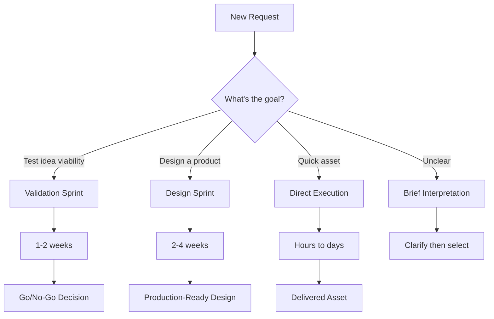

# Process & Workflow Guide

> This directory defines the methodologies, workflows, and protocols for design and validation work. These processes ensure consistent quality and efficient collaboration.

---

## Process Selection

## Quick Reference

| Process | File | Duration | Output |
|---------|------|----------|--------|
| **Brief Interpretation** | `brief-interpretation.md` | 1-2 hours | Clear requirements |
| **Validation Sprint** | `validation-sprint.md` | 1-2 weeks | Market signal + decision |
| **Design Sprint** | `design-sprint.md` | 2-4 weeks | Production-ready design |
| **Iteration Protocol** | `iteration.md` | Per cycle | Refined deliverable |
| **Quality Gates** | `quality-gates.md` | Per phase | Approval to proceed |
| **Handoff Protocol** | `handoff.md` | 1-2 days | Developer-ready package |

---

## Process Overview

### 1. Brief Interpretation

**When:** Every project starts here (unless requirements are crystal clear).

**Purpose:** Extract true requirements, identify constraints, surface assumptions.

**Output:** Structured brief document with:
- Clear objectives
- Success metrics
- Constraints and requirements
- Open questions resolved

### 2. Validation Sprint

**When:** Testing a new idea before building.

**Purpose:** Determine if there's market demand with minimal investment.

**Phases:**
1. Strategy (2-3 days): Personas, positioning, channels
2. Assets (2-3 days): Landing page, ads, copy
3. Testing (5-7 days): Run traffic, measure conversions
4. Decision (1 day): Build, pivot, or kill

**Output:** Go/no-go recommendation with data.

### 3. Design Sprint

**When:** Building a product or feature that's been validated.

**Purpose:** Create production-ready design with full documentation.

**Phases:**
1. Discovery (3-5 days): Research, wireframes, direction
2. Design (5-7 days): Mockups, components, iterations
3. Specification (2-3 days): Documentation, handoff prep
4. Handoff (1-2 days): Developer collaboration

**Output:** Complete design system + implementation specs.

### 4. Iteration Protocol

**When:** During any design phase requiring feedback.

**Purpose:** Efficient feedback incorporation without scope creep.

**Cycle:**
1. Present work
2. Collect structured feedback
3. Triage and prioritize
4. Implement changes
5. Verify resolution

### 5. Quality Gates

**When:** Before transitioning between phases.

**Purpose:** Ensure work meets standards before proceeding.

**Gates:**
- Brief → Design: Requirements complete
- Wireframe → Mockup: Structure approved
- Mockup → Implementation: Design approved
- Implementation → Launch: QA passed

---

## Files in This Directory

| File | Size | Description |
|------|------|-------------|
| `brief-interpretation.md` | 11KB | Extracting and clarifying requirements |
| `validation-sprint.md` | 15KB | Rapid idea testing workflow |
| `design-sprint.md` | 17KB | Full design process workflow |
| `iteration.md` | 13KB | Feedback and revision protocols |
| `quality-gates.md` | 15KB | Phase transition checkpoints |
| `handoff.md` | 18KB | Design-to-development handoff protocols |

---

## Integration Points

### With MARKETING.md
- Validation sprint uses marketing specialist capabilities
- Persona development feeds into design decisions
- Conversion metrics inform iteration priorities

### With CORE.md
- All processes respect core design principles
- Quality gates enforce quality defaults
- Decision framework applies throughout

### With OUTPUTS/
- Each process produces specific output formats
- Handoff protocols reference output specs
- Implementation follows output guides

---

*See also: `CORE.md` for design principles, `MARKETING.md` for validation strategy*
