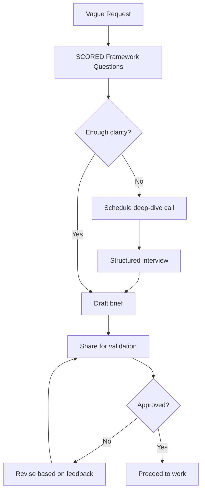
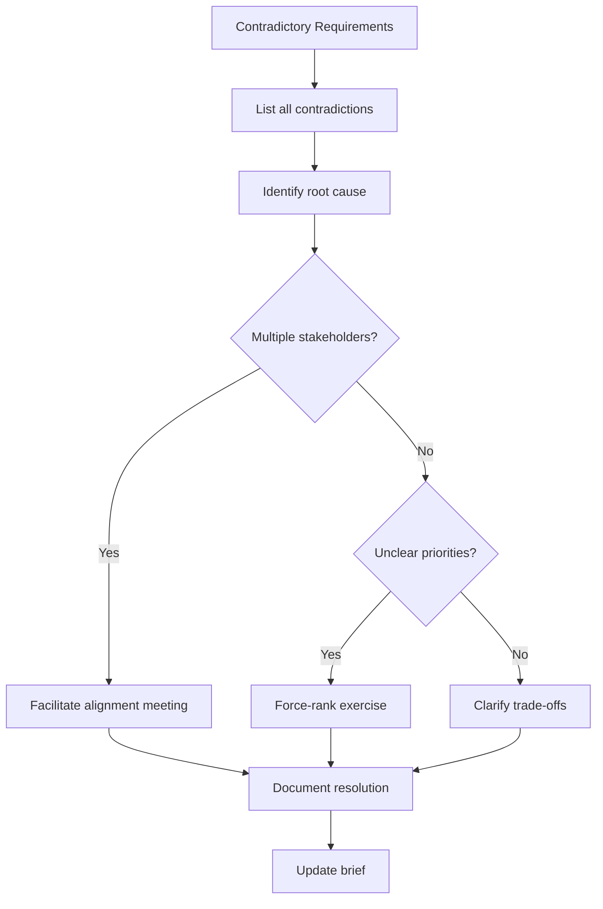
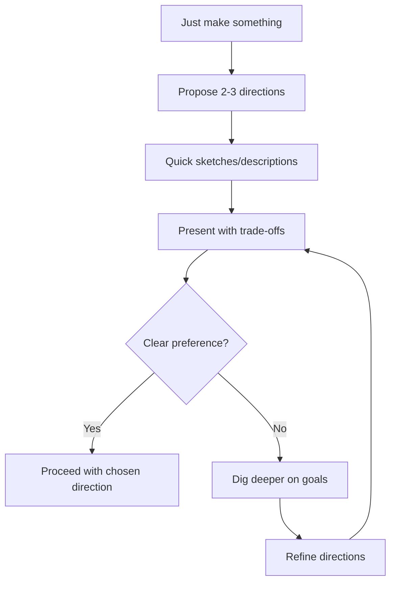

# Brief Interpretation

> Every project begins with understanding what's actually being asked. This document provides frameworks for extracting clear requirements from vague, incomplete, or contradictory briefs.

---

## 1. The Interpretation Mindset

### 1.1 Core Principle

**The stated request is rarely the actual need.**

Users often describe solutions ("I need a landing page") when they mean outcomes ("I need to validate this idea"). Your job is to surface the underlying goal and determine the right approach.

### 1.2 Interpretation vs. Assumption

```
INTERPRETATION (good):
"You mentioned needing a dashboard. What decisions will users make based on this data?"

ASSUMPTION (bad):
"I'll build a dashboard with charts for all the metrics I think are important."
```

Always verify interpretations. Never fill gaps with assumptions.

---

## 2. The SCORED Framework

Use SCORED to extract complete requirements:

### **S**ituation
What's the current state?

```markdown
- What exists today?
- What's working? What's not?
- What triggered this request?
- What happens if we do nothing?
```

### **C**onstraints
What limits the solution space?

```markdown
- Budget (time, money, resources)
- Technical (platform, integrations, legacy systems)
- Brand (existing guidelines, tone, positioning)
- Legal (compliance, privacy, accessibility)
- Timeline (hard deadlines, dependencies)
```

### **O**utcome
What does success look like?

```markdown
- Primary goal (the one thing that matters most)
- Secondary goals (nice to have)
- How will we measure success?
- What does "done" look like?
```

### **R**ecipient
Who is this for?

```markdown
- Primary user/audience
- Secondary users
- Stakeholders/approvers
- Anti-personas (who is this NOT for)
```

### **E**xisting Work
What's already been done?

```markdown
- Previous attempts or versions
- Research or data available
- Competitive analysis
- Reference materials or inspiration
```

### **D**ecisions Needed
What must be resolved?

```markdown
- Open questions requiring answers
- Trade-offs requiring prioritization
- Approvals needed before proceeding
- Dependencies on other work
```

---

## 3. Question Bank

### 3.1 Goal Clarification

| If they say... | Ask... |
|----------------|--------|
| "I need a website" | "What should visitors do when they get there?" |
| "Make it look better" | "What specifically isn't working about the current design?" |
| "I want it to be modern" | "Can you show me 2-3 examples of 'modern' that resonate with you?" |
| "It needs to pop" | "What emotion should users feel? What action should they take?" |
| "Just make something" | "What would make you say 'this is exactly right' vs 'this missed the mark'?" |

### 3.2 Audience Clarification

| If they say... | Ask... |
|----------------|--------|
| "Everyone" | "If you could only reach one type of person, who would have the highest value?" |
| "Our customers" | "Describe your best customer. What do they care about? Where do they spend time?" |
| "Businesses" | "What size? What industry? Who's the actual decision-maker?" |
| "Young people" | "What age range specifically? What defines them beyond age?" |

### 3.3 Constraint Clarification

| If they say... | Ask... |
|----------------|--------|
| "ASAP" | "Is there a specific date this is tied to? What happens if it slips?" |
| "Low budget" | "What's the actual number? What would you cut to stay within it?" |
| "Keep it simple" | "Simple in what way? Fewer features? Cleaner design? Faster to build?" |
| "We're flexible" | "What's the one thing you're NOT flexible on?" |

### 3.4 Success Clarification

| If they say... | Ask... |
|----------------|--------|
| "More conversions" | "What's converting now? What's the target? Over what timeframe?" |
| "Better engagement" | "How do you measure engagement today? What would 'better' look like in numbers?" |
| "Professional look" | "What does 'unprofessional' look like to you? What should visitors think about the company?" |
| "We'll know it when we see it" | "Let's look at 5 examples together. Tell me what works and what doesn't about each." |

---

## 4. Brief Document Template

After interpretation, produce this structured brief:

```markdown
# Project Brief: [Project Name]

## Overview
**One-sentence summary:** [What we're doing and why]
**Request type:** [Validation / Design / Asset / Other]
**Timeline:** [Start date] → [End date]
**Stakeholder:** [Primary decision-maker]

---

## Goals

### Primary Objective
[The ONE thing this must accomplish]

### Success Metrics
| Metric | Current | Target | Measurement |
|--------|---------|--------|-------------|
| [Metric 1] | [Baseline] | [Goal] | [How measured] |
| [Metric 2] | [Baseline] | [Goal] | [How measured] |

### Out of Scope
- [Explicitly excluded item 1]
- [Explicitly excluded item 2]

---

## Audience

### Primary User
**Who:** [Description]
**Goal:** [What they want to accomplish]
**Context:** [When/where/why they engage]

### Secondary Users
- [User type 2]: [Brief description]
- [User type 3]: [Brief description]

---

## Constraints

### Technical
- [Platform/technology requirements]
- [Integration requirements]
- [Performance requirements]

### Brand
- [Existing guidelines to follow]
- [Tone/voice requirements]
- [Visual requirements]

### Timeline
- [Key milestones]
- [Hard deadlines]
- [Dependencies]

### Budget
- [Resource constraints]
- [Tool/platform constraints]

---

## Existing Materials

### Available Now
- [Asset 1]: [Description/link]
- [Asset 2]: [Description/link]

### References
- [Reference 1]: [What to take from it]
- [Reference 2]: [What to take from it]

### Anti-References
- [Example 1]: [What to avoid and why]

---

## Open Questions

### Blocking (must resolve before starting)
1. [Question 1]
2. [Question 2]

### Non-blocking (can resolve during work)
1. [Question 1]
2. [Question 2]

---

## Approvals

| Phase | Approver | Timeline |
|-------|----------|----------|
| Brief | [Name] | [Date] |
| Wireframes | [Name] | [Date] |
| Final Design | [Name] | [Date] |

---

## Next Steps

1. [Immediate action 1]
2. [Immediate action 2]
3. [Immediate action 3]
```

---

## 5. Red Flags

### 5.1 Scope Red Flags

| Red Flag | Risk | Response |
|----------|------|----------|
| "Can you also..." | Scope creep | "Let's add that to phase 2 and keep phase 1 focused" |
| "It's simple" | Underestimated complexity | "Walk me through the user flow step by step" |
| "Like [competitor] but better" | Unclear differentiation | "What specifically makes theirs insufficient?" |
| "We need everything" | No prioritization | "If you could only have 3 features, which 3?" |

### 5.2 Timeline Red Flags

| Red Flag | Risk | Response |
|----------|------|----------|
| "By Friday" (Monday request) | Unrealistic timeline | "Here's what's achievable by Friday. Full scope needs [X]" |
| "No deadline" | Endless iteration | "Let's set a target date to create focus" |
| "When it's perfect" | Never ships | "Let's define 'good enough' for v1" |

### 5.3 Stakeholder Red Flags

| Red Flag | Risk | Response |
|----------|------|----------|
| "Run it by the team" | Design by committee | "Who has final decision authority?" |
| "I'll know it when I see it" | Undefined success | "Let's align on criteria before I start" |
| "Make two versions" | Avoiding decisions | "What would help you decide between directions?" |
| Multiple conflicting opinions | No clear owner | "Can we identify one person to resolve conflicts?" |

---

## 6. Interpretation Workflows

### 6.1 Vague Brief Workflow



### 6.2 Contradictory Brief Workflow



### 6.3 "Just Do Something" Workflow



---

## 7. Validation Techniques

### 7.1 Playback Technique

After gathering information, play it back:

```
"Let me make sure I understand:

You're trying to [goal] for [audience].
The main constraint is [constraint].
Success looks like [metric].
The key open question is [question].

Is that right? What am I missing?"
```

### 7.2 Extreme Questions

Push to extremes to find true priorities:

```
"If you could only accomplish ONE thing, what would it be?"
"What would make this a total failure even if everything else worked?"
"If we had unlimited budget, what would you add? Why don't those matter with limited budget?"
"What would you cut first if we ran out of time?"
```

### 7.3 Negative Space Definition

Define what it's NOT:

```
"Who is this explicitly NOT for?"
"What problems are we NOT trying to solve?"
"What would be going too far?"
"What existing solutions have you rejected and why?"
```

---

## 8. Documentation Standards

### 8.1 Brief Naming

```
[project-name]-brief-v[version].md

Examples:
acme-landing-brief-v1.md
dashboard-redesign-brief-v2.md
q1-validation-brief-v1.md
```

### 8.2 Version Control

- v1: Initial draft
- v1.1, v1.2: Minor clarifications
- v2: Significant scope change
- Always note what changed between versions

### 8.3 Approval Tracking

```markdown
## Approval History

| Version | Date | Approved By | Notes |
|---------|------|-------------|-------|
| v1 | 2026-01-15 | @stakeholder | Initial approval |
| v2 | 2026-01-20 | @stakeholder | Added mobile scope |
```

---

## References

- `CORE.md` - Design principles that inform requirements
- `quality-gates.md` - Brief approval criteria
- `validation-sprint.md` - Process for validation projects
- `design-sprint.md` - Process for design projects

---

*Version: 0.1.0*
