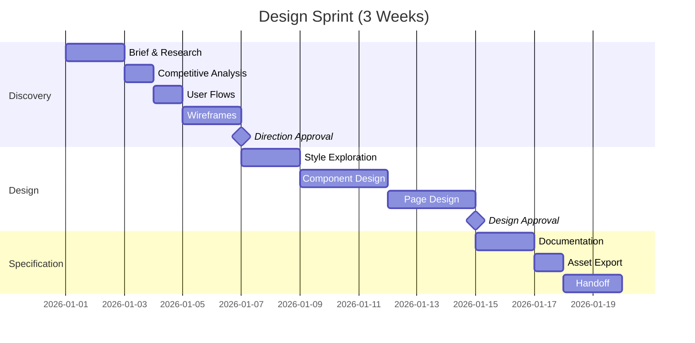

# Design Sprint

> A 2-4 week process for creating production-ready designs. Use after validation confirms market demand, or for established products needing design work.

---

## 1. Overview

### 1.1 When to Use

Use a design sprint when:
- Building a validated product
- Redesigning existing product/feature
- Creating a design system
- Designing a new feature for existing product
- Preparing for development handoff

### 1.2 Sprint Structure



### 1.3 Inputs Required

Before starting:
- [ ] Approved brief (see `brief-interpretation.md`)
- [ ] User research or personas (from validation or existing)
- [ ] Technical constraints documented
- [ ] Brand guidelines (if existing)
- [ ] Stakeholder availability for reviews

### 1.4 Outputs Delivered

Sprint produces:
- User flows and site map
- Wireframes (all key screens)
- Visual design (all screens, all states)
- Component library
- Design specifications
- Asset exports
- Implementation-ready documentation

---

## 2. Phase 1: Discovery (Days 1-6)

### 2.1 Days 1-2: Brief & Research

**Objective:** Deep understanding of users, goals, and constraints.

**Activities:**

1. **Brief deep-dive**
   
   Review and expand on brief:
   - Clarify any ambiguities
   - Document assumptions
   - Identify risks
   - Map stakeholder needs

2. **User research synthesis**
   
   If research exists:
   ```markdown
   ## User Research Summary
   
   **Primary insights:**
   1. [Key finding]
   2. [Key finding]
   3. [Key finding]
   
   **User needs (prioritized):**
   1. [Must have]
   2. [Should have]
   3. [Nice to have]
   
   **Pain points:**
   - [Pain 1]: [Impact level]
   - [Pain 2]: [Impact level]
   
   **Quotes:**
   > "[Verbatim user quote]" - [User type]
   ```
   
   If no research exists, create hypothesis personas from:
   - Validation sprint data
   - Stakeholder interviews
   - Competitive user reviews
   - Industry benchmarks

3. **Technical constraints audit**
   
   ```markdown
   ## Technical Constraints
   
   **Platform:**
   - Target devices: [List]
   - Browser support: [List]
   - Minimum viewport: [Size]
   
   **Integrations:**
   - [System 1]: [Constraints]
   - [System 2]: [Constraints]
   
   **Performance:**
   - Load time target: [X]s
   - Bundle size limit: [X]KB
   
   **Accessibility:**
   - WCAG level: [AA/AAA]
   - Screen reader support: [Required/Nice to have]
   
   **Content:**
   - CMS limitations: [List]
   - Dynamic content: [Requirements]
   ```

**Deliverable:** Research synthesis document, constraints checklist.

### 2.2 Day 3: Competitive Analysis

**Objective:** Understand landscape and identify opportunities.

**Activities:**

1. **Direct competitor audit**
   
   For 3-5 direct competitors:
   ```markdown
   ## Competitor: [Name]
   
   **Positioning:** [How they position]
   **Target audience:** [Who they serve]
   
   **Strengths:**
   - [Strength 1]
   - [Strength 2]
   
   **Weaknesses:**
   - [Weakness 1]
   - [Weakness 2]
   
   **Design observations:**
   - Visual style: [Description]
   - UX patterns: [What they do well/poorly]
   - Differentiators: [Unique approaches]
   
   **Screenshots:** [Attached]
   ```

2. **Indirect/aspirational analysis**
   
   For 2-3 products outside the category that inspire:
   ```markdown
   ## Inspiration: [Name]
   
   **Why included:** [Reason]
   **What to borrow:** [Specific elements]
   **What to avoid:** [Specific elements]
   ```

3. **Pattern inventory**
   
   Catalog common patterns across competitors:
   - Navigation approaches
   - Information architecture
   - Key user flows
   - Conversion patterns
   - Mobile adaptations

**Deliverable:** Competitive analysis document with screenshots.

### 2.3 Day 4: User Flows

**Objective:** Map all key user journeys.

**Activities:**

1. **Identify key flows**
   
   Prioritize flows by:
   - Business impact (conversion, retention)
   - User frequency (how often used)
   - Complexity (simple vs. complex)

2. **Create flow diagrams**
   
   Using Mermaid:
   ```mermaid
   flowchart TD
       A[Landing Page] --> B{Logged in?}
       B -->|No| C[Sign Up Flow]
       B -->|Yes| D[Dashboard]
       C --> E[Email Verification]
       E --> F[Onboarding]
       F --> D
       D --> G[Feature A]
       D --> H[Feature B]
       D --> I[Settings]
   ```

3. **Document flow requirements**
   
   For each flow:
   ```markdown
   ## Flow: [Name]
   
   **Trigger:** [What starts this flow]
   **Goal:** [What user accomplishes]
   **Steps:** [Numbered list]
   **Success state:** [End condition]
   **Error states:** [What can go wrong]
   **Edge cases:** [Special scenarios]
   ```

**Deliverable:** User flow diagrams, flow requirements document.

### 2.4 Days 5-6: Wireframes

**Objective:** Define structure and layout for all screens.

**Activities:**

1. **Screen inventory**
   
   List all screens needed:
   ```markdown
   ## Screen Inventory
   
   | Screen | Priority | Complexity | Flow |
   |--------|----------|------------|------|
   | Landing | P1 | Medium | Acquisition |
   | Sign Up | P1 | Low | Acquisition |
   | Dashboard | P1 | High | Core |
   | Settings | P2 | Medium | Core |
   ```

2. **Wireframe creation**
   
   Using format from `WIREFRAMES.md`:
   - Start with ASCII for rapid exploration
   - Graduate to PlantUML Salt or Wireweave for detail
   - Create mobile and desktop variants

3. **Annotation**
   
   Each wireframe includes:
   - Component identification
   - Interaction notes
   - Content requirements
   - Priority levels
   - Open questions

**Deliverable:** Complete wireframe set, annotated.

### 2.5 Direction Approval Gate

**Before proceeding to Design phase:**

- [ ] Wireframes cover all key screens
- [ ] User flows validated against wireframes
- [ ] Mobile and desktop considered
- [ ] Stakeholder review complete
- [ ] Feedback incorporated
- [ ] Direction approved to proceed

---

## 3. Phase 2: Design (Days 7-14)

### 3.1 Days 7-8: Style Exploration

**Objective:** Establish visual direction.

**Activities:**

1. **Style selection**
   
   Using `STYLES/INDEX.md`, determine:
   - Which style archetype fits
   - What modifications needed
   - How to apply brand guidelines

2. **Mood board creation**
   
   Collect:
   - Color palette options (2-3)
   - Typography options (2-3)
   - Imagery style references
   - UI inspiration screenshots
   - Texture/pattern ideas

3. **Style tile creation**
   
   Create 2-3 style tiles showing:
   ```markdown
   ## Style Tile: [Name]
   
   **Concept:** [One sentence description]
   
   **Colors:**
   - Primary: [Hex] - [Usage]
   - Secondary: [Hex] - [Usage]
   - Accent: [Hex] - [Usage]
   - Neutrals: [Range]
   
   **Typography:**
   - Headings: [Font, weights]
   - Body: [Font, weights]
   - Scale: [Approach]
   
   **Visual elements:**
   - Borders: [Style]
   - Shadows: [Style]
   - Radii: [Values]
   - Spacing: [System]
   
   **Imagery:**
   - Photography style: [Description]
   - Illustration style: [Description]
   - Icons: [Style]
   
   **Sample component:** [Button, card, or form showing style applied]
   ```

4. **Style presentation**
   
   Present options with:
   - Rationale for each direction
   - Pros and cons
   - Alignment with brand/audience
   - Recommendation

**Deliverable:** 2-3 style tiles, style recommendation.

### 3.2 Days 9-11: Component Design

**Objective:** Build complete component library.

**Activities:**

1. **Component inventory**
   
   From wireframes, list all components:
   ```markdown
   ## Component Inventory
   
   **Primitives:**
   - [ ] Button (variants: primary, secondary, ghost, destructive)
   - [ ] Input (variants: text, email, password, textarea)
   - [ ] Select
   - [ ] Checkbox
   - [ ] Radio
   - [ ] Toggle
   
   **Composites:**
   - [ ] Card (variants: default, elevated, interactive)
   - [ ] Modal
   - [ ] Dropdown menu
   - [ ] Navigation
   - [ ] Footer
   
   **Patterns:**
   - [ ] Form layout
   - [ ] Data table
   - [ ] Empty state
   - [ ] Loading state
   - [ ] Error state
   ```

2. **Component design**
   
   For each component:
   - All visual variants
   - All states (default, hover, focus, active, disabled)
   - All sizes (if applicable)
   - Responsive behavior
   - Accessibility considerations

3. **Component documentation**
   
   Using format from `OUTPUTS/figma-spec.md`:
   ```markdown
   ## Component: [Name]
   
   **Variants:** [List]
   **Sizes:** [List]
   **States:** [List]
   
   **Anatomy:**
   [Visual breakdown]
   
   **Spacing:**
   [Measurements]
   
   **Usage guidelines:**
   - Do: [Guidelines]
   - Don't: [Anti-patterns]
   
   **Accessibility:**
   - [Requirements]
   ```

**Deliverable:** Complete component library with documentation.

### 3.3 Days 12-14: Page Design

**Objective:** Apply components to create final page designs.

**Activities:**

1. **Priority ordering**
   
   Design pages in order of:
   - Business importance
   - User frequency
   - Dependency (some pages inform others)

2. **Page design**
   
   For each page:
   - Desktop layout (1440px reference)
   - Tablet layout (768px)
   - Mobile layout (375px)
   - All states (empty, loading, populated, error)
   - Key interactions annotated

3. **Design review cycles**
   
   For each page:
   - Internal review (self-critique)
   - Peer review (if available)
   - Stakeholder review
   - Revision based on feedback

4. **Prototype connections**
   
   If interactive prototype needed:
   - Link screens for key flows
   - Add basic transitions
   - Test flow logic

**Deliverable:** Complete page designs, all breakpoints, all states.

### 3.4 Design Approval Gate

**Before proceeding to Specification phase:**

- [ ] All screens designed
- [ ] All breakpoints covered
- [ ] All states designed
- [ ] Components documented
- [ ] Stakeholder review complete
- [ ] Final design approved

---

## 4. Phase 3: Specification (Days 15-19)

### 4.1 Days 15-16: Documentation

**Objective:** Create comprehensive implementation documentation.

**Activities:**

1. **Design token export**
   
   Export as CSS variables and/or JSON:
   ```css
   :root {
     /* Colors */
     --color-primary: #3B82F6;
     /* ... */
     
     /* Typography */
     --font-sans: 'Inter', system-ui;
     /* ... */
     
     /* Spacing */
     --space-1: 0.25rem;
     /* ... */
   }
   ```

2. **Component specifications**
   
   Using format from `OUTPUTS/figma-spec.md`:
   - Measurements
   - States
   - Interactions
   - Responsive behavior

3. **Page specifications**
   
   For each page:
   - Layout grid
   - Component placement
   - Spacing details
   - Responsive rules
   - Content requirements

4. **Interaction specifications**
   
   Document:
   - Transitions and timing
   - Hover states
   - Loading behaviors
   - Error handling
   - Animation details

**Deliverable:** Complete specification document.

### 4.2 Day 17: Asset Export

**Objective:** Prepare all assets for development.

**Activities:**

1. **Icon export**
   
   - SVG format
   - Consistent sizing
   - Optimized paths
   - Named systematically

2. **Image export**
   
   - Multiple resolutions (1x, 2x, 3x)
   - Multiple formats (WebP + fallback)
   - Optimized file sizes
   - Named systematically

3. **Font preparation**
   
   - Web font files (WOFF2)
   - Subset if needed
   - License documentation

4. **Asset organization**
   
   ```
   assets/
   ├── icons/
   │   ├── icon-arrow-right.svg
   │   ├── icon-check.svg
   │   └── ...
   ├── images/
   │   ├── hero-desktop.webp
   │   ├── hero-mobile.webp
   │   └── ...
   ├── fonts/
   │   ├── inter-regular.woff2
   │   ├── inter-bold.woff2
   │   └── ...
   └── manifest.json
   ```

**Deliverable:** Organized asset package.

### 4.3 Days 18-19: Handoff

**Objective:** Transfer design to development team.

**Activities:**

1. **Handoff meeting**
   
   Agenda:
   - Walk through design decisions
   - Explain component system
   - Discuss technical considerations
   - Answer questions
   - Establish communication channel

2. **Documentation delivery**
   
   Provide:
   - Design files (Figma/Sketch access or export)
   - Specification documents
   - Asset package
   - Token files
   - This process documentation

3. **Support protocol**
   
   Establish:
   - Question channel (Slack, Discord, etc.)
   - Response time expectations
   - Review milestone schedule
   - Feedback loop process

4. **Implementation support**
   
   During development:
   - Respond to questions promptly
   - Review implementations
   - Approve or request changes
   - Document deviations

**Deliverable:** Complete handoff package, support protocol established.

---

## 5. Review Protocols

### 5.1 Design Critique Format

For internal design reviews:

```markdown
## Design Critique: [Screen/Component]

**Presenter:** [Name]
**Date:** [Date]
**Stage:** [Wireframe / Visual / Final]

### Context
[Brief context for reviewers]

### Specific feedback requested
1. [Question 1]
2. [Question 2]

### Feedback received

**[Reviewer 1]:**
- [Feedback point]
- [Feedback point]

**[Reviewer 2]:**
- [Feedback point]

### Action items
- [ ] [Action 1]
- [ ] [Action 2]

### Decisions made
- [Decision 1]
- [Decision 2]
```

### 5.2 Stakeholder Review Format

For stakeholder presentations:

```markdown
## Design Review: [Project Name]

**Date:** [Date]
**Attendees:** [List]
**Stage:** [Discovery / Design / Final]

### Agenda
1. Context recap (2 min)
2. Design walkthrough (15 min)
3. Discussion (10 min)
4. Next steps (3 min)

### Key decisions needed
1. [Decision 1]
2. [Decision 2]

### Feedback summary
[Captured during meeting]

### Outcomes
- Approved: [Yes/No/With changes]
- Changes requested: [List]
- Next review: [Date]
```

### 5.3 Async Review Format

For asynchronous feedback:

```markdown
## Async Review Request

**Project:** [Name]
**Reviewer:** [Name]
**Due date:** [Date]

### What to review
[Link to designs]

### Context
[Brief context]

### Specific questions
1. [Question 1]
2. [Question 2]

### How to provide feedback
[Comment directly in Figma / Reply to this doc / etc.]

---

## Feedback

[Space for reviewer feedback]

### Overall assessment
- [ ] Approved
- [ ] Approved with minor changes
- [ ] Needs revision

### Comments
[Detailed feedback]
```

---

## 6. Deliverable Checklists

### 6.1 Discovery Phase Deliverables

- [ ] Research synthesis document
- [ ] Technical constraints document
- [ ] Competitive analysis
- [ ] User flow diagrams
- [ ] Screen inventory
- [ ] Wireframes (all screens)
- [ ] Wireframe annotations
- [ ] Direction approval

### 6.2 Design Phase Deliverables

- [ ] Style tiles (2-3 options)
- [ ] Approved style direction
- [ ] Component inventory
- [ ] Component designs (all variants, states)
- [ ] Component documentation
- [ ] Page designs (all screens)
- [ ] Responsive designs (all breakpoints)
- [ ] State designs (empty, loading, error)
- [ ] Interactive prototype (if needed)
- [ ] Design approval

### 6.3 Specification Phase Deliverables

- [ ] Design tokens (CSS/JSON)
- [ ] Component specifications
- [ ] Page specifications
- [ ] Interaction specifications
- [ ] Icon exports (SVG)
- [ ] Image exports (optimized)
- [ ] Font files
- [ ] Asset manifest
- [ ] Handoff documentation
- [ ] Support protocol

---

## 7. Timeline Variations

### 7.1 Compressed Sprint (2 Weeks)

For simpler projects or tight timelines:

```
Week 1: Discovery + Design Start
- Days 1-2: Brief, research, competitive
- Days 3-4: Flows, wireframes
- Day 5: Style exploration, approval

Week 2: Design + Handoff
- Days 1-3: Components + pages
- Day 4: Documentation
- Day 5: Handoff
```

**Trade-offs:**
- Fewer iteration cycles
- Less exploration
- Requires clear brief upfront
- Stakeholders must be highly available

### 7.2 Extended Sprint (4 Weeks)

For complex projects or design systems:

```
Week 1: Discovery
- Deep research
- Comprehensive competitive analysis
- Multiple wireframe iterations

Week 2: Design Foundation
- Extended style exploration
- Complete component library
- Thorough documentation

Week 3: Page Design
- All pages, all states
- Multiple review cycles
- Interactive prototype

Week 4: Specification + Handoff
- Detailed specifications
- Developer collaboration
- Implementation support start
```

**Benefits:**
- More thorough exploration
- Better documentation
- Smoother handoff
- Fewer implementation issues

---

## References

- `CORE.md` - Design principles
- `brief-interpretation.md` - Getting clear requirements
- `iteration.md` - Feedback and revision protocols
- `quality-gates.md` - Phase transition criteria
- `OUTPUTS/figma-spec.md` - Specification format

---

*Version: 0.1.0*
