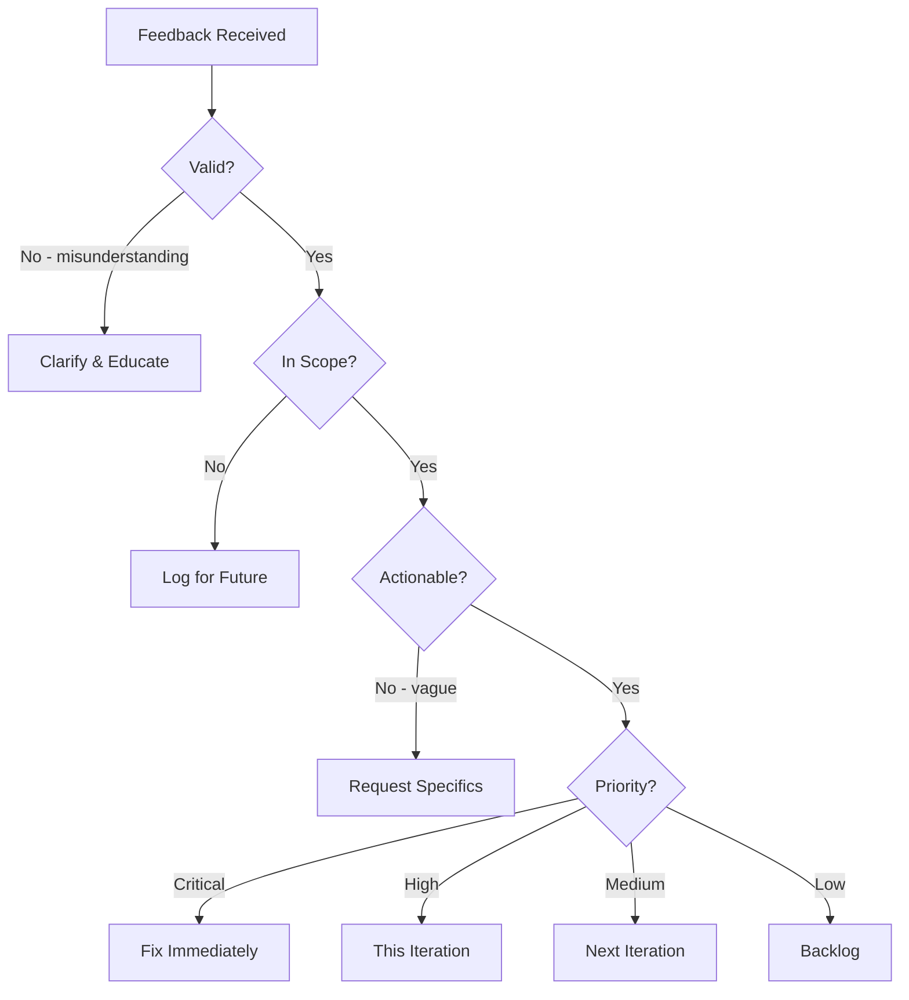
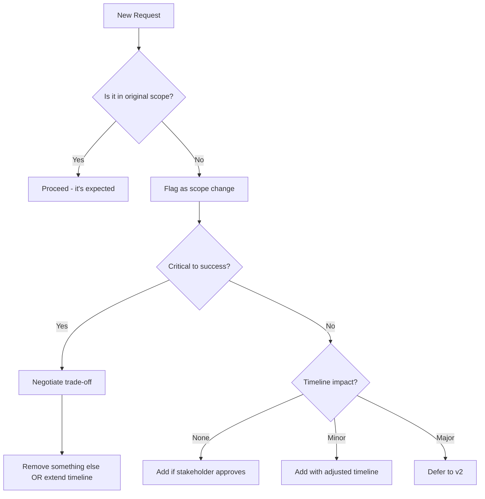

# Iteration & Feedback Protocol

> How to handle feedback, manage revisions, and iterate efficiently without scope creep or endless cycles.

---

## 1. Iteration Philosophy

### 1.1 Core Principles

1. **Feedback is data, not criticism** - Treat all feedback as information to process
2. **Not all feedback is equal** - Prioritize by source, impact, and alignment with goals
3. **Iteration has limits** - Set boundaries to prevent infinite loops
4. **Document everything** - Decisions, rationales, and changes must be recorded

### 1.2 The Iteration Paradox

```
More iteration → Better design (to a point)
More iteration → Diminishing returns (after that point)
More iteration → Negative returns (scope creep, fatigue, delays)
```

**Goal:** Find the sweet spot where iteration improves quality without degrading project health.

---

## 2. Feedback Collection

### 2.1 Structured Feedback Request

Never ask "What do you think?" Instead, guide feedback with specific questions:

**For Wireframes:**
```markdown
## Feedback Request: [Screen Name] Wireframe

Please review and provide feedback on:

1. **Information hierarchy** - Is the most important content prominent?
2. **User flow** - Does the layout guide users toward the goal?
3. **Completeness** - Is anything missing that users would expect?
4. **Simplicity** - Is there anything that could be removed?

### Not seeking feedback on:
- Visual style (that comes later)
- Exact copy (placeholder text)
- Colors or fonts
```

**For Visual Design:**
```markdown
## Feedback Request: [Screen Name] Visual Design

Please review and provide feedback on:

1. **Brand alignment** - Does this feel like [brand]?
2. **Visual hierarchy** - Do your eyes go where they should?
3. **Readability** - Is text easy to read?
4. **Consistency** - Does it feel cohesive?

### Reference points:
- Approved wireframe: [link]
- Style guide: [link]
- Competitor examples: [links]
```

**For Final Review:**
```markdown
## Final Review: [Project Name]

This is the approval review. Please confirm:

1. [ ] Meets all requirements from brief
2. [ ] Addresses all previous feedback
3. [ ] Ready for development handoff

### Changes since last review:
- [Change 1]
- [Change 2]

### Known limitations:
- [Limitation 1] - Will address in v2
```

### 2.2 Feedback Channels

| Channel | Best For | Response Time |
|---------|----------|---------------|
| **In-document comments** | Specific, contextual feedback | 24-48 hours |
| **Async message** (Slack/email) | Quick questions, clarifications | Same day |
| **Live session** | Complex discussions, alignment | Scheduled |
| **Review meeting** | Phase gates, major decisions | Scheduled |

### 2.3 Feedback Template

Ask reviewers to use this structure:

```markdown
## Feedback from [Name] - [Date]

### Priority: High / Medium / Low

### Type: Bug / Enhancement / Question / Concern

### Description:
[What the feedback is about]

### Specific location:
[Screen, section, or component]

### Suggestion (optional):
[Proposed solution if any]

### Context:
[Why this matters to them]
```

---

## 3. Feedback Processing

### 3.1 Triage Framework

Categorize every piece of feedback:



### 3.2 Priority Matrix

| Impact | Effort: Low | Effort: Medium | Effort: High |
|--------|-------------|----------------|--------------|
| **High** | Do Now | Do Now | Plan Carefully |
| **Medium** | Do Now | This Iteration | Next Iteration |
| **Low** | Quick Win | Backlog | Backlog |

### 3.3 Feedback Categories

| Category | Definition | Example | Action |
|----------|------------|---------|--------|
| **Bug** | Something is broken or incorrect | "The button goes to wrong page" | Fix immediately |
| **Usability** | Works but confusing | "Users won't understand this icon" | Prioritize |
| **Enhancement** | Could be better | "Would be nice to have X" | Evaluate scope |
| **Preference** | Subjective opinion | "I prefer blue to green" | Discuss with stakeholder |
| **Out of Scope** | Beyond current project | "Can we also add Y?" | Log for future |

### 3.4 Conflict Resolution

When feedback contradicts:

**Same stakeholder, different times:**
- Use most recent unless earlier was explicit requirement
- Ask for clarification if unclear

**Different stakeholders:**
1. Identify decision maker
2. Present both perspectives objectively
3. Make recommendation based on user/business goals
4. Document final decision with rationale

**Feedback vs. requirements:**
- Requirements win unless stakeholder explicitly changes them
- Document any requirement changes

---

## 4. Iteration Cycles

### 4.1 Standard Iteration Cycle

```
┌─────────────────────────────────────────────────────────┐
│                    ITERATION CYCLE                       │
├─────────────────────────────────────────────────────────┤
│                                                          │
│  1. PRESENT (30 min)                                    │
│     └── Show work, explain decisions                    │
│                                                          │
│  2. COLLECT (24-48 hours)                               │
│     └── Gather all feedback via standard template       │
│                                                          │
│  3. TRIAGE (1-2 hours)                                  │
│     └── Categorize, prioritize, assign                  │
│                                                          │
│  4. IMPLEMENT (varies)                                  │
│     └── Make agreed changes                             │
│                                                          │
│  5. VERIFY (30 min)                                     │
│     └── Confirm resolution with feedback givers         │
│                                                          │
└─────────────────────────────────────────────────────────┘
```

### 4.2 Iteration Limits

Set clear boundaries to prevent endless cycles:

| Phase | Max Iterations | After Limit |
|-------|----------------|-------------|
| Wireframes | 3 | Must approve or descope |
| Visual direction | 2 | Must select direction |
| Component design | 2 | Lock for implementation |
| Page design | 3 | Lock for handoff |
| Final polish | 2 | Ship as-is |

**After max iterations:**
1. Document remaining concerns
2. Make decision (approve/reject)
3. Log unresolved items for v2
4. Move forward

### 4.3 Iteration Documentation

Track every iteration:

```markdown
## Iteration Log: [Project Name]

### Iteration 1 - [Date]

**Presented:** [Brief description]

**Feedback received:**
| # | Feedback | Source | Priority | Status |
|---|----------|--------|----------|--------|
| 1 | [Feedback] | [Name] | High | Resolved |
| 2 | [Feedback] | [Name] | Medium | Deferred |

**Changes made:**
- [Change 1]
- [Change 2]

**Decisions:**
- [Decision 1] - Rationale: [why]

**Deferred to next iteration:**
- [Item 1]

---

### Iteration 2 - [Date]
...
```

---

## 5. Scope Management

### 5.1 Scope Change Protocol

When new requirements emerge mid-project:



### 5.2 Scope Change Request Template

```markdown
## Scope Change Request

**Requested by:** [Name]
**Date:** [Date]
**Related to:** [Project/Phase]

### Request
[Description of new scope]

### Justification
[Why this is needed]

### Impact Assessment

**Without change:**
- Timeline: On track
- Budget: On track
- Quality: As planned

**With change:**
- Timeline: +[X] days
- Budget: +[Y] (if applicable)
- Quality: [Impact]

### Options

1. **Add scope, extend timeline**
   - Delivery: [new date]

2. **Add scope, remove [X]**
   - Trade-off: [what gets cut]

3. **Defer to v2**
   - Delivery: As planned
   - Future: Add in next phase

### Recommendation
[Designer's recommendation with rationale]

### Decision
- [ ] Approved: Option [#]
- [ ] Rejected
- [ ] Needs discussion

**Decided by:** [Name]
**Date:** [Date]
```

### 5.3 Saying No Gracefully

When scope creep threatens the project:

**Don't say:**
> "We can't do that."

**Do say:**
> "We can definitely do that. Here are the options:
> 1. Add it now and push the deadline by [X] days
> 2. Add it now and remove [Y] from scope
> 3. Ship as planned and add it in the next phase
> 
> What works best for you?"

---

## 6. Communication Templates

### 6.1 Feedback Acknowledgment

```markdown
Hi [Name],

Thanks for the feedback on [Project/Screen]. I've reviewed everything and here's my understanding:

**Will address in this iteration:**
- [Item 1] - [Brief response]
- [Item 2] - [Brief response]

**Needs clarification:**
- [Item 3] - Can you elaborate on [specific question]?

**Deferred to future:**
- [Item 4] - This is a great idea but outside current scope. I've logged it for v2.

I'll have updated designs by [date]. Let me know if I've misunderstood anything.

[Name]
```

### 6.2 Iteration Complete

```markdown
Hi [Name],

Iteration [#] is complete. Here's what changed:

**Changes made:**
- [Change 1] - Per your feedback about [topic]
- [Change 2] - Per your feedback about [topic]

**Not changed (with rationale):**
- [Item] - [Reason, e.g., "conflicts with requirement X" or "deferred to v2"]

**Updated files:**
- [Link to updated design]

**Next steps:**
- [ ] Your review by [date]
- [ ] [Next phase] begins [date]

Let me know if you have questions.

[Name]
```

### 6.3 Escalation

When stuck in iteration loops:

```markdown
Hi [Decision Maker],

We've reached an impasse on [Project] and need your input to move forward.

**The issue:**
[Brief description of the conflicting feedback/requirements]

**Perspectives:**
- [Stakeholder A] prefers [X] because [reason]
- [Stakeholder B] prefers [Y] because [reason]

**My recommendation:**
[Option] because [rationale tied to project goals]

**Impact of delay:**
- Timeline: [impact]
- Dependencies: [impact]

Can we schedule 15 minutes to resolve this? We need a decision by [date] to stay on track.

[Name]
```

---

## 7. Anti-Patterns to Avoid

### 7.1 Feedback Collection

| Anti-Pattern | Problem | Better Approach |
|--------------|---------|-----------------|
| "What do you think?" | Vague feedback | Specific questions |
| Collecting verbally only | No record | Written feedback |
| No deadline | Feedback trickles forever | Clear deadline |
| Too many reviewers | Conflicting opinions | Limit to decision makers |

### 7.2 Feedback Processing

| Anti-Pattern | Problem | Better Approach |
|--------------|---------|-----------------|
| Implementing everything | Scope creep | Triage and prioritize |
| Ignoring feedback | Stakeholder frustration | Acknowledge all, explain decisions |
| No documentation | Repeat discussions | Log everything |
| Designer as decision maker | Overstepping role | Present options, let stakeholder decide |

### 7.3 Iteration Management

| Anti-Pattern | Problem | Better Approach |
|--------------|---------|-----------------|
| Unlimited iterations | Never ships | Set iteration limits |
| No iteration | Poor quality | Plan for feedback |
| Changing direction each cycle | No progress | Align on direction first |
| Perfectionism | Diminishing returns | Ship, then improve |

---

## 8. Iteration Metrics

Track these to improve over time:

| Metric | Target | Warning Sign |
|--------|--------|--------------|
| Iterations per phase | 2-3 | >4 indicates alignment issues |
| Time per iteration | 2-3 days | >1 week indicates bottleneck |
| Feedback response rate | >80% | <50% indicates disengagement |
| Scope changes | 0-2 | >3 indicates unclear requirements |
| Reverted decisions | 0-1 | >2 indicates poor alignment |

---

## References

- `brief-interpretation.md` - Getting requirements right upfront
- `quality-gates.md` - Phase transition checkpoints
- `design-sprint.md` - Overall sprint structure
- `handoff.md` - Final delivery protocols

---

*Version: 0.1.0*
