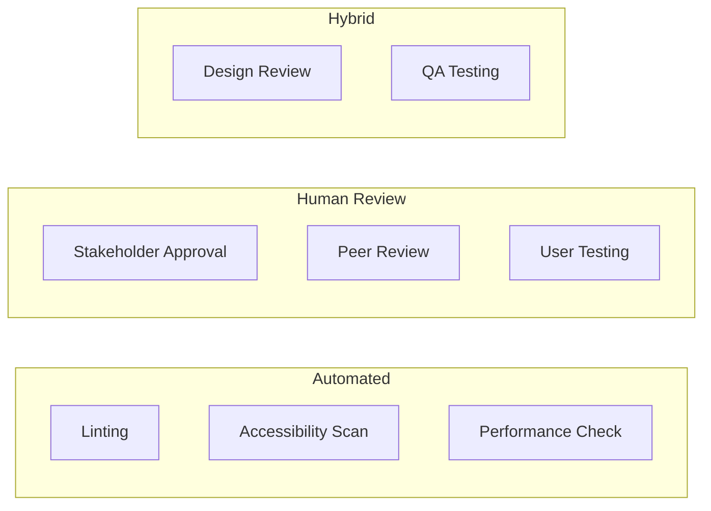
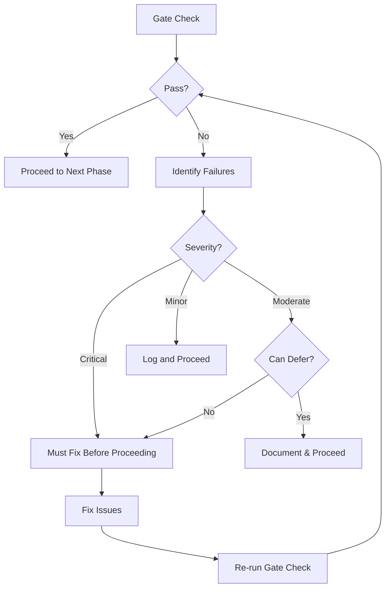

# Quality Gates

> Checkpoints that ensure work meets standards before progressing. Quality gates prevent costly rework by catching issues early.

---

## 1. Gate Philosophy

### 1.1 Core Principles

1. **Gates are not optional** - Every transition requires explicit passage
2. **Gates have criteria** - Pass/fail is objective, not subjective
3. **Gates have owners** - Someone is accountable for approval
4. **Gates are documented** - Decisions are recorded with rationale

### 1.2 Gate Types



---

## 2. Gate Definitions

### 2.1 Gate 0: Brief Approval

**When:** Before any design work begins

**Purpose:** Ensure requirements are clear and complete

**Criteria:**

| Item | Required | Validator |
|------|----------|-----------|
| Problem statement defined | ✓ | Designer |
| Success metrics identified | ✓ | Stakeholder |
| Target users specified | ✓ | Designer |
| Constraints documented | ✓ | Designer |
| Scope boundaries clear | ✓ | Stakeholder |
| Timeline agreed | ✓ | All |
| Resources allocated | ✓ | Stakeholder |

**Checklist:**
```markdown
## Gate 0: Brief Approval

**Project:** [Name]
**Date:** [Date]

### Requirements Complete
- [ ] Problem statement is specific and measurable
- [ ] Primary user persona defined
- [ ] Success metrics are quantifiable
- [ ] Scope includes "in" and "out" items
- [ ] Constraints are documented (tech, brand, legal, timeline)
- [ ] Open questions are resolved

### Stakeholder Sign-off
- [ ] Decision maker identified: [Name]
- [ ] Approval received: [Date]

### Proceed to: Discovery Phase

**Approved by:** _________________ **Date:** _________
```

---

### 2.2 Gate 1: Direction Approval

**When:** After wireframes, before visual design

**Purpose:** Ensure structural approach is correct before adding polish

**Criteria:**

| Item | Required | Validator |
|------|----------|-----------|
| All screens wireframed | ✓ | Designer |
| User flows complete | ✓ | Designer |
| Information hierarchy validated | ✓ | Stakeholder |
| Technical feasibility confirmed | ✓ | Developer (if available) |
| Responsive approach defined | ✓ | Designer |

**Checklist:**
```markdown
## Gate 1: Direction Approval

**Project:** [Name]
**Date:** [Date]

### Wireframes Complete
- [ ] All required screens are wireframed
- [ ] Wireframes address all user flows
- [ ] Information hierarchy is clear
- [ ] Primary CTAs are prominent
- [ ] Edge cases identified (empty, error, loading)

### Structural Validation
- [ ] Layout is responsive (approach documented)
- [ ] Navigation is intuitive
- [ ] No critical user paths missing
- [ ] Technical team confirms feasibility (if applicable)

### Feedback Incorporated
- [ ] All high-priority feedback addressed
- [ ] Decisions documented for deferred items

### Proceed to: Visual Design Phase

**Approved by:** _________________ **Date:** _________
```

---

### 2.3 Gate 2: Design Approval

**When:** After visual design, before specification/handoff

**Purpose:** Ensure design is complete and ready for implementation

**Criteria:**

| Item | Required | Validator |
|------|----------|-----------|
| All mockups complete | ✓ | Designer |
| Responsive variations done | ✓ | Designer |
| Component states documented | ✓ | Designer |
| Accessibility review passed | ✓ | Automated + Designer |
| Brand alignment confirmed | ✓ | Stakeholder |
| Style guide complete | ✓ | Designer |

**Checklist:**
```markdown
## Gate 2: Design Approval

**Project:** [Name]
**Date:** [Date]

### Mockups Complete
- [ ] Desktop mockups for all screens (1440px)
- [ ] Mobile mockups for all screens (375px)
- [ ] Tablet mockups if significantly different (768px)
- [ ] All component states designed (hover, focus, active, disabled)
- [ ] Empty states designed
- [ ] Loading states designed
- [ ] Error states designed

### Quality Checks
- [ ] Color contrast passes WCAG AA (4.5:1)
- [ ] Touch targets ≥44px
- [ ] Text is readable (16px+ body, 14px+ minimum)
- [ ] Interactive elements have visible focus states
- [ ] No text over busy images without overlay

### Documentation Ready
- [ ] Color palette documented
- [ ] Typography scale documented
- [ ] Spacing system documented
- [ ] Components have specifications

### Stakeholder Review
- [ ] Design presented to stakeholder
- [ ] Feedback incorporated
- [ ] Final approval received

### Proceed to: Specification & Handoff

**Approved by:** _________________ **Date:** _________
```

---

### 2.4 Gate 3: Handoff Approval

**When:** After specification, before development begins

**Purpose:** Ensure developers have everything needed to build

**Criteria:**

| Item | Required | Validator |
|------|----------|-----------|
| All specifications written | ✓ | Designer |
| Assets exported | ✓ | Designer |
| Design tokens provided | ✓ | Designer |
| Developer questions answered | ✓ | Designer |
| Implementation approach agreed | ✓ | Developer |

**Checklist:**
```markdown
## Gate 3: Handoff Approval

**Project:** [Name]
**Date:** [Date]

### Specifications Complete
- [ ] All components have written specs
- [ ] Spacing and layout rules documented
- [ ] Interaction behaviors documented
- [ ] Animation/transition specs provided
- [ ] Accessibility requirements noted

### Assets Delivered
- [ ] Icons exported (SVG)
- [ ] Images optimized and exported
- [ ] Favicon package created
- [ ] Design tokens exported (JSON/CSS)
- [ ] Fonts specified (with fallbacks)

### Developer Alignment
- [ ] Handoff meeting completed
- [ ] Developer questions answered
- [ ] Edge cases discussed
- [ ] Implementation approach agreed
- [ ] Communication channel established

### Proceed to: Development

**Approved by:** _________________ **Date:** _________
```

---

### 2.5 Gate 4: Implementation Review

**When:** After development, before launch

**Purpose:** Ensure implementation matches design

**Criteria:**

| Item | Required | Validator |
|------|----------|-----------|
| Visual accuracy | ✓ | Designer |
| Responsive behavior | ✓ | Designer + QA |
| Accessibility compliance | ✓ | Automated + Manual |
| Performance targets met | ✓ | Automated |
| Cross-browser testing | ✓ | QA |

**Checklist:**
```markdown
## Gate 4: Implementation Review

**Project:** [Name]
**Date:** [Date]

### Visual Accuracy
- [ ] Colors match design (within 5% variance)
- [ ] Typography matches spec
- [ ] Spacing matches design system
- [ ] Components render correctly
- [ ] Images display properly

### Responsive Testing
- [ ] Desktop (1440px, 1920px)
- [ ] Tablet (768px, 1024px)
- [ ] Mobile (375px, 414px)
- [ ] No horizontal scroll at any size
- [ ] Touch interactions work on mobile

### Accessibility
- [ ] Axe/WAVE scan passes (0 critical errors)
- [ ] Keyboard navigation works
- [ ] Screen reader tested
- [ ] Focus order logical
- [ ] Color contrast verified

### Performance
- [ ] LCP < 2.5s
- [ ] FID < 100ms
- [ ] CLS < 0.1
- [ ] Total page weight < 1MB (initial)

### Browser Testing
- [ ] Chrome (latest)
- [ ] Firefox (latest)
- [ ] Safari (latest)
- [ ] Edge (latest)
- [ ] Mobile Safari
- [ ] Chrome Android

### Known Issues
| Issue | Severity | Plan |
|-------|----------|------|
| [Issue 1] | Low | Fix in v1.1 |

### Proceed to: Launch

**Approved by:** _________________ **Date:** _________
```

---

## 3. Automated Checks

### 3.1 Accessibility (Axe-Core)

Run on all pages before Gate 4:

```bash
# Using axe-cli
npx axe https://staging.example.com --tags wcag2a,wcag2aa

# Expected output
0 violations found
```

**Severity Thresholds:**
- Critical: 0 allowed
- Serious: 0 allowed
- Moderate: ≤3 allowed (with documented plan)
- Minor: ≤10 allowed

### 3.2 Performance (Lighthouse)

Run on key pages before Gate 4:

```bash
# Using Lighthouse CLI
lighthouse https://staging.example.com --output=json --output-path=./report.json
```

**Score Thresholds:**
| Category | Minimum | Target |
|----------|---------|--------|
| Performance | 75 | 90+ |
| Accessibility | 90 | 100 |
| Best Practices | 90 | 100 |
| SEO | 90 | 100 |

### 3.3 Visual Regression

Use tools like Percy, Chromatic, or BackstopJS:

```javascript
// Example: BackstopJS config
{
  "scenarios": [
    {
      "label": "Homepage - Desktop",
      "url": "https://staging.example.com",
      "viewports": [{"width": 1440, "height": 900}]
    },
    {
      "label": "Homepage - Mobile",
      "url": "https://staging.example.com",
      "viewports": [{"width": 375, "height": 812}]
    }
  ]
}
```

**Threshold:** <5% pixel difference from approved baseline

### 3.4 Design Token Validation

Ensure implementation uses correct tokens:

```javascript
// Example: stylelint config for design tokens
{
  "rules": {
    "color-no-hex": true, // Force use of CSS variables
    "declaration-property-value-allowed-list": {
      "font-size": ["/^var\\(--text-/"],
      "spacing": ["/^var\\(--space-/"]
    }
  }
}
```

---

## 4. Review Protocols

### 4.1 Design Review Session

**Format:** 45-60 minute meeting

**Attendees:**
- Designer (presenter)
- Stakeholder (approver)
- Developer (optional, recommended)

**Agenda:**
1. **Context** (5 min) - Recap goals and constraints
2. **Walkthrough** (20 min) - Present designs with rationale
3. **Discussion** (20 min) - Questions and feedback
4. **Decision** (10 min) - Approve / Request changes

**Output:**
- Gate checklist completed
- Decision recorded
- Action items assigned (if changes needed)

### 4.2 Async Review Process

When synchronous review isn't possible:

```markdown
## Async Design Review Request

**Deadline for feedback:** [Date/Time]

### Materials
- [Link to design file]
- [Link to prototype]
- [Link to spec document]

### Review Focus
Please evaluate:
1. [Specific aspect 1]
2. [Specific aspect 2]
3. [Specific aspect 3]

### Feedback Format
Use comments in [design tool] or reply to this message with:
- **Approve** - Ready to proceed
- **Approve with minor changes** - List changes, can proceed
- **Needs revision** - List blockers, need another review

### Decision Threshold
- If all reviewers approve by deadline: Proceed
- If any reviewer requests revision: Schedule sync discussion
```

### 4.3 Peer Review (Design Critique)

**Purpose:** Improve quality through designer-to-designer feedback

**Format:** 30 minute session

**Rules:**
1. Presenter explains context and goals
2. Reviewers ask clarifying questions
3. Reviewers give structured feedback
4. No defending - just listen and note
5. Presenter summarizes takeaways

**Feedback Structure:**
- "I like..." (what's working)
- "I wish..." (what could improve)
- "What if..." (alternative approaches)

---

## 5. Gate Failure Protocol

### 5.1 When a Gate Fails



### 5.2 Failure Documentation

```markdown
## Gate Failure Report

**Gate:** [Gate name]
**Date:** [Date]
**Project:** [Project name]

### Failed Criteria
| Criterion | Expected | Actual | Severity |
|-----------|----------|--------|----------|
| [Criterion 1] | [Expected] | [Actual] | Critical |
| [Criterion 2] | [Expected] | [Actual] | Moderate |

### Root Cause
[Why did this fail?]

### Resolution Plan
| Issue | Owner | Target Date |
|-------|-------|-------------|
| [Issue 1] | [Name] | [Date] |
| [Issue 2] | [Name] | [Date] |

### Re-check Scheduled
**Date:** [Date]
**Reviewer:** [Name]
```

### 5.3 Exception Process

Sometimes gates must be bypassed. This requires:

1. **Documented justification** - Why bypass is necessary
2. **Risk assessment** - What could go wrong
3. **Mitigation plan** - How risks will be managed
4. **Stakeholder approval** - Decision maker signs off
5. **Remediation timeline** - When issues will be fixed

```markdown
## Gate Exception Request

**Gate:** [Gate name]
**Requested by:** [Name]
**Date:** [Date]

### Criteria to Bypass
[Which criteria are not met]

### Justification
[Why we need to proceed despite failure]

### Risk Assessment
| Risk | Likelihood | Impact | Mitigation |
|------|------------|--------|------------|
| [Risk 1] | Medium | High | [Mitigation] |

### Remediation Plan
- [ ] [Action 1] by [Date]
- [ ] [Action 2] by [Date]

### Approval
- [ ] Approved with conditions
- [ ] Rejected

**Approved by:** _________________ **Date:** _________
**Conditions:** [Any conditions for approval]
```

---

## 6. Quality Metrics

### 6.1 Track Over Time

| Metric | Definition | Target |
|--------|------------|--------|
| First-pass rate | % of gates passed on first attempt | >70% |
| Rework cycles | Avg iterations to pass gate | <2 |
| Gate cycle time | Avg time from submission to pass | <2 days |
| Exception rate | % of gates bypassed | <10% |
| Post-launch issues | Issues found after Gate 4 | <3 critical |

### 6.2 Quality Trends

Track these over multiple projects to identify systemic issues:

- Which gates fail most often? → Process improvement target
- Which criteria fail most? → Training opportunity
- Who requests most exceptions? → Resource or skill gap
- Which projects have most rework? → Brief quality issue

---

## 7. Gate Ownership

### 7.1 RACI by Gate

| Gate | Designer | Stakeholder | Developer | QA |
|------|----------|-------------|-----------|-----|
| G0: Brief | R | A | C | - |
| G1: Direction | R | A | C | - |
| G2: Design | R | A | C | - |
| G3: Handoff | R | I | A | C |
| G4: Implementation | C | I | R | A |

**R** = Responsible (does the work)
**A** = Accountable (makes the decision)
**C** = Consulted (provides input)
**I** = Informed (kept updated)

---

## References

- `CORE.md` - Quality defaults to enforce
- `iteration.md` - How to handle gate failures
- `design-sprint.md` - Where gates fit in the process
- `handoff.md` - Gate 3 details

---

*Version: 0.1.0*
